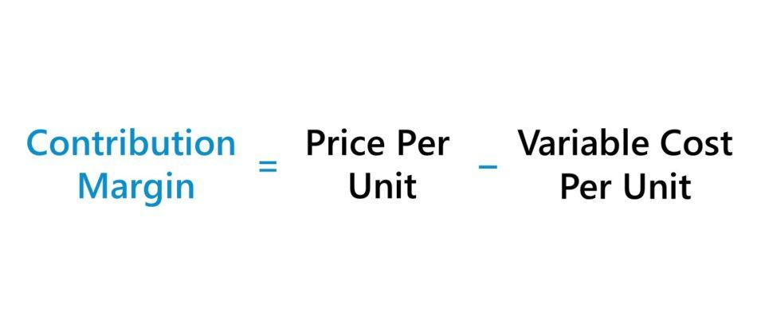

## Table of Contents

## What is contribution margin?

Contribution margin is the difference between the sales revenue and the variable costs of producing the goods or services sold. It shows how much money is left after covering the variable costs, which can be used to pay for fixed costs and generate profit. For example, if a company sells a product for $100 and the variable costs to make it are $60, the contribution margin is $40.

This concept is important for businesses because it helps them understand how much each product contributes to covering fixed costs and making a profit. By knowing the contribution margin, a company can make better decisions about pricing, cost control, and which products to focus on. If a product has a high contribution margin, it means it's more profitable and can help the business more easily cover its fixed costs.

## Why is contribution margin important for businesses?

Contribution margin is important for businesses because it helps them see how much money they make from each product after paying for the costs that change with how much they produce. This is called variable costs. When a business knows this, they can figure out if they are making enough money to cover the costs that stay the same no matter how much they produce, like rent or salaries. These are called fixed costs. If the contribution margin is high, it means the product is helping the business a lot to pay for these fixed costs and make a profit.

Understanding the contribution margin also helps businesses make smart choices about what to sell and how to price their products. If a product has a low contribution margin, the business might decide to raise the price or find ways to lower the variable costs. On the other hand, if a product has a high contribution margin, the business might decide to focus more on selling that product because it's more profitable. This way, the business can use its resources in the best way possible to make more money.

## How do you calculate the contribution margin?

To calculate the contribution margin, you need to know two things: the sales revenue and the variable costs. Sales revenue is the total money you get from selling your products or services. Variable costs are the costs that change depending on how much you produce, like the cost of materials or labor. To find the contribution margin, you subtract the variable costs from the sales revenue. For example, if you sell a product for $100 and it costs $60 to make, the contribution margin is $100 - $60 = $40.

The contribution margin can be shown in two ways: as a total amount or as a percentage. The total amount is what we just calculated. To find the contribution margin percentage, you divide the contribution margin by the sales revenue and then multiply by 100 to get a percentage. Using the same example, the contribution margin percentage would be ($40 / $100) * 100 = 40%. This percentage tells you what part of each dollar of sales is left after paying for variable costs, which can be used to cover fixed costs and make a profit.

## What is the difference between contribution margin and gross margin?

Contribution margin and gross margin are both important numbers that help businesses understand how much money they are making, but they look at different costs. Contribution margin is the money left after you subtract the costs that change with how much you produce, like the cost of materials or labor. These are called variable costs. So, if you sell a product for $100 and it costs $60 to make, the contribution margin is $40. This number helps a business see how much each product helps to pay for the costs that stay the same, like rent or salaries, which are called fixed costs.

Gross margin, on the other hand, looks at a broader set of costs. It is the money left after you subtract the cost of goods sold (COGS) from the sales revenue. COGS includes not just the variable costs but also some fixed costs that are directly tied to making the product, like factory rent or machinery depreciation. So, if the COGS for the same product is $70, the gross margin would be $100 - $70 = $30. Gross margin gives a business a bigger picture of profitability but doesn't show how much each product contributes to covering the fixed costs that aren't included in COGS.

## Can you explain the concept of contribution margin ratio?

The contribution margin ratio is a way to see how much of each dollar of sales is left after paying for the costs that change with how much you produce. These costs are called variable costs. To find the contribution margin ratio, you take the contribution margin and divide it by the sales revenue, then multiply by 100 to get a percentage. For example, if you sell a product for $100 and it costs $60 to make, the contribution margin is $40. The contribution margin ratio would be ($40 / $100) * 100 = 40%. This means that for every dollar you make from sales, 40 cents are left to help pay for the costs that stay the same, like rent or salaries.

Understanding the contribution margin ratio is important because it helps businesses see how profitable their products are. If the ratio is high, it means a larger part of each dollar of sales is available to cover fixed costs and make a profit. If the ratio is low, it might mean the business needs to find ways to lower the variable costs or raise the price of the product. By knowing this ratio, a business can make better decisions about what to sell and how to manage their costs to make more money.

## How does contribution margin help in pricing decisions?

Contribution margin helps businesses make good choices about how to price their products. When a business knows the contribution margin, it can see how much money is left after paying for the costs that change with how much they produce, like materials or labor. If the contribution margin is low, the business might need to raise the price of the product to make more money after covering those costs. On the other hand, if the contribution margin is high, the business might be able to lower the price a bit to sell more products and still make a good profit.

This information is important because it helps the business decide if they are charging the right amount for their products. If the contribution margin is too low, the business might not be making enough money to cover the costs that stay the same, like rent or salaries. By looking at the contribution margin, a business can figure out the best price to charge so they can cover all their costs and make a profit. This way, they can keep the business running well and make smart decisions about pricing.

## What role does contribution margin play in break-even analysis?

Contribution margin is really important for figuring out the break-even point of a business. The break-even point is when a business makes just enough money to cover all its costs, but not make a profit yet. To find this point, you need to know the contribution margin because it tells you how much money from each product is left after paying for the costs that change with how much you produce, like materials or labor. If you add up all the contribution margins from all the products you sell, you can see how much money you have to cover the costs that stay the same, like rent or salaries.

Once you know the total contribution margin, you can divide it into the fixed costs to find out how many products you need to sell to break even. For example, if your fixed costs are $10,000 and the contribution margin per product is $40, you need to sell 250 products to break even ($10,000 / $40 = 250). This helps a business plan how much they need to sell to start making a profit. By understanding the contribution margin, a business can make better decisions about how many products to sell and what prices to set to reach their break-even point and beyond.

## How can contribution margin be used to assess product profitability?

Contribution margin is a key tool for figuring out how profitable a product is. It tells you how much money is left from selling a product after you pay for the costs that change with how much you make, like materials or labor. If the contribution margin is high, it means the product is making a lot of money after covering those costs. This is good because it means the product can help pay for the costs that stay the same, like rent or salaries, and still make a profit. If the contribution margin is low, it might mean the product isn't making enough money to cover all the costs and make a profit.

By looking at the contribution margin, a business can see which products are doing well and which ones might need changes. If a product has a low contribution margin, the business might decide to raise the price or find ways to lower the costs that change with how much they produce. On the other hand, if a product has a high contribution margin, the business might want to focus on selling more of that product because it's more profitable. This way, the business can use the contribution margin to make smart decisions about which products to keep, change, or stop selling to make more money.

## What are common mistakes to avoid when calculating contribution margin?

When figuring out the contribution margin, one common mistake is mixing up variable costs with fixed costs. Variable costs are the ones that change with how much you make, like the cost of materials or labor. Fixed costs are the ones that stay the same, like rent or salaries. If you include fixed costs in your calculation, you'll end up with a number that's not the real contribution margin. This can make it hard to understand how much money each product is making after covering the costs that change with production.

Another mistake is not looking at all the variable costs. Sometimes, businesses forget about smaller costs like shipping or packaging that also change with how much they produce. If you don't include all these costs, your contribution margin will be too high, and you might think a product is more profitable than it really is. It's important to make sure you include all the costs that change with production to get an accurate picture of your contribution margin.

## How does contribution margin vary across different industries?

Contribution margin can be very different across different industries because each industry has its own costs and ways of making money. For example, in the tech industry, the variable costs might be low because once a software is made, it doesn't cost much to make more copies. This means the contribution margin can be high, and a lot of the money from sales can go towards paying for fixed costs and making a profit. On the other hand, in the restaurant industry, the variable costs like food and labor can be high, so the contribution margin might be lower. This means less money from each sale is left to cover fixed costs like rent.

In the manufacturing industry, the contribution margin can vary a lot depending on what is being made. Making cars, for example, has high variable costs because of the materials and labor needed, so the contribution margin might be lower. But making something simple like a t-shirt might have lower variable costs, leading to a higher contribution margin. Each industry has to look at its own costs and prices to figure out what their contribution margin is and how it affects their business.

## Can contribution margin analysis influence strategic business decisions?

Contribution margin analysis can really help a business make smart choices about what to do next. It shows how much money is left from each product after paying for the costs that change with how much you make, like materials or labor. If a business knows this, they can decide which products to focus on selling more of because those products help pay for the costs that stay the same, like rent or salaries. For example, if a product has a high contribution margin, the business might want to sell more of it to make more money. But if a product has a low contribution margin, the business might need to find ways to lower the costs or raise the price to make it more profitable.

This analysis also helps with other big decisions, like whether to start making a new product or stop selling an old one. If a new product idea has a high contribution margin, it might be a good idea to go ahead with it because it could help the business make more money. On the other hand, if an old product isn't making enough money after covering the variable costs, the business might decide to stop selling it. By understanding the contribution margin, a business can plan better and make choices that will help them grow and be more successful.

## What advanced techniques can be used to optimize contribution margin in complex business models?

In complex business models, one advanced technique to optimize contribution margin is to use activity-based costing (ABC). This method looks at all the different activities that go into making a product and figures out how much each activity costs. By understanding these costs better, a business can find ways to make those activities cheaper or more efficient. For example, if a business finds out that a certain part of making the product is really expensive, they might be able to change how they do that part to lower the costs. This can make the contribution margin higher because more money is left after paying for the costs that change with how much you produce.

Another technique is to use data analytics and machine learning to predict and manage variable costs. By looking at a lot of data, these tools can help a business see patterns and make better guesses about what their costs will be in the future. This can help the business plan better and find ways to lower those costs. For example, if the data shows that the cost of materials goes up at certain times of the year, the business might decide to buy those materials when they are cheaper. This can help keep the variable costs down and make the contribution margin higher. By using these advanced techniques, a business can make smarter decisions and improve their contribution margin even in complex situations.

## What is Contribution Margin?

Contribution margin is a crucial accounting metric that provides insights into how much revenue a business can use to cover its fixed costs and eventually generate profit. Essentially, it measures the portion of sales revenue that exceeds total variable costs. Understanding and calculating this margin is instrumental for businesses in pricing, forecasting, and financial analysis. 

The contribution margin can be expressed in both absolute terms and as a ratio. In absolute terms, it is calculated using the formula:

$$
\text{Contribution Margin} = \text{Total Sales Revenue} - \text{Total Variable Costs}
$$

This calculation highlights the amount available to cover fixed costs after all variable costs associated with producing goods or services are paid. Variable costs include expenses such as materials, labor, and overhead that fluctuate with production [volume](/wiki/volume-trading-strategy). In contrast, fixed costs remain constant regardless of production levels, such as rent and salaries.

Understanding the contribution margin is critical for several reasons:

1. **Profit Planning**: By analyzing the contribution margin, businesses can determine how much of their revenue is dedicated to generating profits. This understanding aids in setting financial goals and crafting strategic plans to achieve them.

2. **Cost Control**: Businesses can use the contribution margin to monitor and control variable costs. If the margin is lower than expected, it may indicate inefficiencies or areas where costs can be reduced.

3. **Break-even Analysis**: Contribution margin assists in calculating the break-even point, which is the level of sales at which total revenues equal total costs, resulting in zero profit. This analysis helps businesses understand the minimum sales required to avoid losses.

4. **Pricing Strategies**: By knowing the contribution margin, businesses can make informed decisions about pricing. A higher contribution margin allows for more flexibility in pricing decisions, discounts, and promotions while maintaining profitability.

As businesses strive to optimize their financial performance, understanding contribution margin is a vital part of cost management and strategic planning. It not only informs crucial business decisions but also ensures that companies have a clear view of their financial health and sustainability.

## What is the formula and how is the calculation done?

The contribution margin formula is a fundamental aspect of cost accounting, defined as:

$$
\text{Contribution Margin} = \text{Total Sales Revenue} - \text{Total Variable Costs}
$$

This metric is essential for determining how much revenue contributes to fixed costs and profit after covering variable costs.

### Application in Real-World Scenarios

In practical terms, businesses use the contribution margin to evaluate the profitability of products or services. Suppose a company sells a product for $150 with variable costs amounting to $90. The contribution margin per unit is:

$$
\text{Contribution Margin per Unit} = 150 - 90 = 60
$$

This means each unit sold contributes $60 to fixed costs and profits. By analyzing this metric, companies can make informed decisions about product lines, pricing, and production levels.

### Contribution Margin Ratio

The efficiency of a company's cost management is often gauged by the contribution margin ratio, calculated as:

$$
\text{Contribution Margin Ratio} = \frac{\text{Contribution Margin}}{\text{Total Sales Revenue}}
$$

Using the earlier example, if the company sells 1,000 units, the contribution margin is $60,000 and total sales revenue is $150,000, leading to a contribution margin ratio of:

$$
\text{Contribution Margin Ratio} = \frac{60,000}{150,000} = 0.4 \, \text{or} \, 40\%
$$

A 40% contribution margin ratio indicates that 40% of each sales dollar contributes to covering fixed costs and profit. A high ratio is generally desirable as it implies better efficiency in cost management.

In summary, understanding and calculating the contribution margin and its ratio is crucial for businesses aiming to optimize their financial performance. These metrics provide insights into pricing strategies, cost management, and overall profitability, enabling companies to make strategic decisions that improve their financial health.

## What is an Example of Contribution Margin in Trading?

In trading, understanding and calculating the contribution margin is pivotal for identifying the profitability of different strategies. A practical example can illustrate this concept effectively.

Consider a trading strategy that involves buying and selling stocks. Let's assume the strategy generates $50,000 in total sales revenue from trading activities over a specific period. The variable costs associated with this strategy include transaction fees, data feeds, and other trading-related expenses, amounting to $10,000. The contribution margin is calculated as follows:

$$
\text{Contribution Margin} = \text{Total Sales Revenue} - \text{Total Variable Costs}
$$

Substituting the given values:

$$
\text{Contribution Margin} = \$50,000 - \$10,000 = \$40,000
$$

This indicates that $40,000 from the trading operations contribute to covering fixed costs and generating profit.

Changes in market conditions, such as increased [volatility](/wiki/volatility-trading-strategies) or [liquidity](/wiki/liquidity-risk-premium) issues, can significantly impact the contribution margin. For instance, higher volatility may lead to increased transaction costs or the need for more frequent trades to capitalize on price movements, thereby raising variable costs and reducing the contribution margin.

Given these fluctuations, adopting adaptive strategies becomes crucial. Market conditions are dynamic, and a static trading strategy may not maintain profitability over time. Adaptive strategies that can adjust trade frequencies, leverage, and asset allocations based on market analysis can help optimize the contribution margin. 

For instance, [machine learning](/wiki/machine-learning) algorithms can be used to predict market conditions and adapt trading parameters accordingly. A Python implementation can be created that adjusts the trading strategy based on predictive models, optimizing for transaction costs and expected returns. Here's a simple pseudo-code example illustrating how one might adjust a trading strategy based on a hypothesis of declining market volatility:

```python
def adjust_strategy(market_data):
    # Predict market volatility
    predicted_volatility = predict_volatility(market_data)

    # Define thresholds
    volatility_threshold = 0.05

    # Adjust trading parameters based on predicted volatility
    if predicted_volatility < volatility_threshold:
        trade_frequency = "low"
    else:
        trade_frequency = "high"

    return trade_frequency

# Example usage with historical market data
market_data = load_historical_data()
trading_decision = adjust_strategy(market_data)
```

By implementing such adaptive strategies, traders can maintain or improve their contribution margins, even in changing market conditions. This highlights the importance of continuous monitoring and adjustments to trading algorithms to account for cost variations and maximize profitability.

## References & Further Reading

[1]: Profitability Analysis and Evaluation for Algorithmic Trading Strategies (2020), Journal of Trading. Provides insights into using accounting metrics in trading strategies.

[2]: ["Cost Accounting: A Managerial Emphasis"](https://www.amazon.com/Cost-Accounting-Managerial-Charles-Horngren/dp/0131495380) by Charles T. Horngren, Srikant M. Datar, and Madhav V. Rajan. Offers an in-depth understanding of cost accounting concepts, including contribution margin.

[3]: ["Algorithmic Trading: Winning Strategies and Their Rationale"](https://www.wiley.com/en-us/Algorithmic+Trading%3A+Winning+Strategies+and+Their+Rationale-p-9781118460146) by Ernest P. Chan. Discusses algorithmic trading strategies and profitability.

[4]: ["Financial Trading and Investing"](https://www.investopedia.com/ask/answers/12/difference-investing-trading.asp) by John R. Teall. Covers aspects of trading, including financial metrics for assessing trading strategies.

[5]: ["The Essentials of Cost Accounting for Health Care Organizations"](https://books.google.com/books/about/Essentials_of_Cost_Accounting_for_Health.html?id=QbPDO1HkxwIC) by Steven A. Finkler and David M. Ward. investigates into cost accounting practices applicable to various sectors.