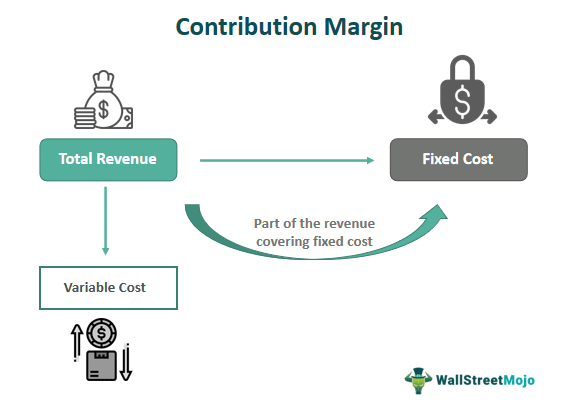

In today's fast-paced financial markets, understanding profitability through various accounting metrics is crucial for informed decision-making and strategic planning. Among these metrics, contribution margin stands out as a vital tool in cost accounting, providing insights into how revenues contribute to covering fixed costs and generating profits. In essence, the contribution margin illuminates the relationship between sales, variable costs, and profitability, making it indispensable for both traditional and modern financial strategies.

This article explores the significant role of contribution margin in cost accounting and extends its application to the realm of algorithmic trading. Algorithmic trading, which relies heavily on computer programs to execute trades based on pre-defined criteria, can benefit immensely from an understanding of contribution margin. By analyzing how these concepts can be utilized in algorithmic trading, market participants can enhance their profitability analysis and refine trading strategies.



The integration of contribution margin analysis into algorithmic trading represents a convergence of accounting principles with cutting-edge financial technology. This approach aids in identifying profitable trading strategies by considering the impact of variable costs, such as transaction fees, which can significantly affect trading outcomes. Ultimately, this article seeks to demonstrate how a solid grasp of contribution margin can empower traders and businesses to make data-driven decisions, optimize resource allocation, and achieve sustainable profitability in dynamic market environments.

## Table of Contents

## What is Contribution Margin?

Contribution margin is a crucial accounting metric that provides insights into how much revenue a business can use to cover its fixed costs and eventually generate profit. Essentially, it measures the portion of sales revenue that exceeds total variable costs. Understanding and calculating this margin is instrumental for businesses in pricing, forecasting, and financial analysis. 

The contribution margin can be expressed in both absolute terms and as a ratio. In absolute terms, it is calculated using the formula:

$$
\text{Contribution Margin} = \text{Total Sales Revenue} - \text{Total Variable Costs}
$$

This calculation highlights the amount available to cover fixed costs after all variable costs associated with producing goods or services are paid. Variable costs include expenses such as materials, labor, and overhead that fluctuate with production [volume](/wiki/volume-trading-strategy). In contrast, fixed costs remain constant regardless of production levels, such as rent and salaries.

Understanding the contribution margin is critical for several reasons:

1. **Profit Planning**: By analyzing the contribution margin, businesses can determine how much of their revenue is dedicated to generating profits. This understanding aids in setting financial goals and crafting strategic plans to achieve them.

2. **Cost Control**: Businesses can use the contribution margin to monitor and control variable costs. If the margin is lower than expected, it may indicate inefficiencies or areas where costs can be reduced.

3. **Break-even Analysis**: Contribution margin assists in calculating the break-even point, which is the level of sales at which total revenues equal total costs, resulting in zero profit. This analysis helps businesses understand the minimum sales required to avoid losses.

4. **Pricing Strategies**: By knowing the contribution margin, businesses can make informed decisions about pricing. A higher contribution margin allows for more flexibility in pricing decisions, discounts, and promotions while maintaining profitability.

As businesses strive to optimize their financial performance, understanding contribution margin is a vital part of cost management and strategic planning. It not only informs crucial business decisions but also ensures that companies have a clear view of their financial health and sustainability.

## Formula and Calculation

The contribution margin formula is a fundamental aspect of cost accounting, defined as:

$$
\text{Contribution Margin} = \text{Total Sales Revenue} - \text{Total Variable Costs}
$$

This metric is essential for determining how much revenue contributes to fixed costs and profit after covering variable costs.

### Application in Real-World Scenarios

In practical terms, businesses use the contribution margin to evaluate the profitability of products or services. Suppose a company sells a product for $150 with variable costs amounting to $90. The contribution margin per unit is:

$$
\text{Contribution Margin per Unit} = 150 - 90 = 60
$$

This means each unit sold contributes $60 to fixed costs and profits. By analyzing this metric, companies can make informed decisions about product lines, pricing, and production levels.

### Contribution Margin Ratio

The efficiency of a company's cost management is often gauged by the contribution margin ratio, calculated as:

$$
\text{Contribution Margin Ratio} = \frac{\text{Contribution Margin}}{\text{Total Sales Revenue}}
$$

Using the earlier example, if the company sells 1,000 units, the contribution margin is $60,000 and total sales revenue is $150,000, leading to a contribution margin ratio of:

$$
\text{Contribution Margin Ratio} = \frac{60,000}{150,000} = 0.4 \, \text{or} \, 40\%
$$

A 40% contribution margin ratio indicates that 40% of each sales dollar contributes to covering fixed costs and profit. A high ratio is generally desirable as it implies better efficiency in cost management.

In summary, understanding and calculating the contribution margin and its ratio is crucial for businesses aiming to optimize their financial performance. These metrics provide insights into pricing strategies, cost management, and overall profitability, enabling companies to make strategic decisions that improve their financial health.

## Contribution Margin in Cost Accounting

Contribution margin plays a crucial role in cost accounting, particularly in break-even analysis and decision-making. It serves as a pivotal figure that helps businesses determine how much of their sales revenue can be attributed to covering fixed costs and generating profit. To understand its application, it is essential to differentiate between fixed and variable costs. Fixed costs remain unchanged irrespective of the level of production or trading activity, whereas variable costs fluctuate in direct proportion to the volume of goods produced or trades executed.

In break-even analysis, contribution margin is used to ascertain the break-even point—the juncture at which total revenues equal total costs, resulting in no net loss or gain. The break-even point can be calculated by dividing total fixed costs by the contribution margin per unit. This formula aids businesses in identifying the minimum amount of sales required to avoid losses, providing a foundational metric for financial forecasting and risk assessment.

Contribution margin also informs pricing strategies by allowing businesses to analyze how changes in sales volume or costs affect profitability. By understanding the relationship between sales, costs, and profits, businesses can set prices that not only cover costs but also enhance competitiveness. For instance, if a company aims to increase its contribution margin, it may either reduce variable costs or increase product prices, thereby improving its profitability.

Moreover, contribution margin is instrumental in managing variable costs. By comparing the contribution margins of different products, businesses can determine which products are more profitable and should be prioritized in production. This analysis is vital for cost management, enabling firms to allocate resources more efficiently and minimize unnecessary expenses.

In both manufacturing and trading environments, understanding the distinction between fixed and variable costs is integral. Manufacturers, for example, benefit from identifying high variable costs in their production processes, allowing them to seek efficiencies that improve their contribution margins. Similarly, in trading, distinguishing between fixed transaction costs and variable costs based on trading volume helps traders minimize expenses and enhance their net profitability.

In summary, contribution margin is an essential tool in cost accounting that supports break-even analysis, influences pricing strategy, and aids in variable cost management. Its application spans various business operations, underscoring its importance in strategic financial planning and decision-making.

## Contribution Margin and Algorithmic Trading

In [algorithmic trading](/wiki/algorithmic-trading), applying contribution margin concepts involves evaluating how variable costs affect overall trading profitability. Contribution margin, defined as the difference between sales revenue and variable costs, can provide insights into the efficiency of trading strategies. This metric helps identify the portion of revenues that contributes to covering fixed costs and ultimately generating profit, even in trading environments.

In the context of algorithmic trading, variable costs include transaction fees, slippage, and other costs that fluctuate with trading volumes and activities. These costs can significantly erode profits if not carefully managed. For instance, high-frequency trading strategies may incur substantial transaction fees that reduce the contribution margin, making it vital to assess whether the frequency of trades justifies these costs.

Evaluating the contribution margin of various trading algorithms can assist in pinpointing the most efficient strategies. By calculating this metric, traders can identify strategies that effectively convert revenues into profits after accounting for variable costs. For example, compare two algorithms:

Algorithm A:
- Total Sales Revenue: $100,000
- Total Variable Costs: $30,000
- Contribution Margin: $100,000 - $30,000 = $70,000

Algorithm B:
- Total Sales Revenue: $100,000
- Total Variable Costs: $45,000
- Contribution Margin: $100,000 - $45,000 = $55,000

Algorithm A, with a higher contribution margin, may be preferable because it retains more revenue after deducting variable costs. The contribution margin ratio, calculated as (Contribution Margin / Total Sales Revenue), provides a percentage measure of efficiency: 

- Algorithm A Contribution Margin Ratio: ($70,000 / $100,000) = 70%
- Algorithm B Contribution Margin Ratio: ($55,000 / $100,000) = 55%

This percentage helps traders understand what portion of every dollar earned contributes to fixed costs and profit.

To further analyze and enhance profitability, traders can use programming languages like Python to automate these calculations and optimize trading strategies. For instance, in Python, one could calculate the contribution margin as follows:

```python
def calculate_contribution_margin(revenue, variable_costs):
    return revenue - variable_costs

def calculate_contribution_margin_ratio(contribution_margin, revenue):
    return contribution_margin / revenue

# Example data
revenue_A = 100000
variable_costs_A = 30000

revenue_B = 100000
variable_costs_B = 45000

# Contribution Margin Calculation
contribution_margin_A = calculate_contribution_margin(revenue_A, variable_costs_A)
contribution_margin_B = calculate_contribution_margin(revenue_B, variable_costs_B)

# Contribution Margin Ratio
contribution_margin_ratio_A = calculate_contribution_margin_ratio(contribution_margin_A, revenue_A)
contribution_margin_ratio_B = calculate_contribution_margin_ratio(contribution_margin_B, revenue_B)

print("Algorithm A Contribution Margin Ratio:", contribution_margin_ratio_A)
print("Algorithm B Contribution Margin Ratio:", contribution_margin_ratio_B)
```

This type of analysis allows the development of adaptive strategies that are capable of adjusting to changes in market conditions and variable costs, thereby maximizing the profitability of algorithmic trading efforts.

## Example of Contribution Margin in Trading

In trading, understanding and calculating the contribution margin is pivotal for identifying the profitability of different strategies. A practical example can illustrate this concept effectively.

Consider a trading strategy that involves buying and selling stocks. Let's assume the strategy generates $50,000 in total sales revenue from trading activities over a specific period. The variable costs associated with this strategy include transaction fees, data feeds, and other trading-related expenses, amounting to $10,000. The contribution margin is calculated as follows:

$$
\text{Contribution Margin} = \text{Total Sales Revenue} - \text{Total Variable Costs}
$$

Substituting the given values:

$$
\text{Contribution Margin} = \$50,000 - \$10,000 = \$40,000
$$

This indicates that $40,000 from the trading operations contribute to covering fixed costs and generating profit.

Changes in market conditions, such as increased [volatility](/wiki/volatility-trading-strategies) or [liquidity](/wiki/liquidity-risk-premium) issues, can significantly impact the contribution margin. For instance, higher volatility may lead to increased transaction costs or the need for more frequent trades to capitalize on price movements, thereby raising variable costs and reducing the contribution margin.

Given these fluctuations, adopting adaptive strategies becomes crucial. Market conditions are dynamic, and a static trading strategy may not maintain profitability over time. Adaptive strategies that can adjust trade frequencies, leverage, and asset allocations based on market analysis can help optimize the contribution margin. 

For instance, [machine learning](/wiki/machine-learning) algorithms can be used to predict market conditions and adapt trading parameters accordingly. A Python implementation can be created that adjusts the trading strategy based on predictive models, optimizing for transaction costs and expected returns. Here's a simple pseudo-code example illustrating how one might adjust a trading strategy based on a hypothesis of declining market volatility:

```python
def adjust_strategy(market_data):
    # Predict market volatility
    predicted_volatility = predict_volatility(market_data)

    # Define thresholds
    volatility_threshold = 0.05

    # Adjust trading parameters based on predicted volatility
    if predicted_volatility < volatility_threshold:
        trade_frequency = "low"
    else:
        trade_frequency = "high"

    return trade_frequency

# Example usage with historical market data
market_data = load_historical_data()
trading_decision = adjust_strategy(market_data)
```

By implementing such adaptive strategies, traders can maintain or improve their contribution margins, even in changing market conditions. This highlights the importance of continuous monitoring and adjustments to trading algorithms to account for cost variations and maximize profitability.

## Strategies for Improving Contribution Margin

Improving contribution margin is fundamental to increasing overall profitability and ensuring long-term sustainability for businesses. Here are several strategies for enhancing contribution margins through cost reduction and efficient resource allocation:

### Cost Reduction

1. **Streamlining Operations**:
   - Eliminating inefficiencies in production and operational processes can significantly lower variable costs. For example, adopting lean manufacturing techniques, such as the Toyota Production System, focuses on minimizing waste and maximizing productivity, thus reducing costs associated with materials, labor, and energy consumption.

2. **Negotiating Supplier Contracts**:
   - Renegotiating contracts with suppliers to secure better prices or terms can decrease the cost of raw materials or services. Volume discounts and long-term agreements often provide room for negotiation, thereby lowering the total variable cost.

3. **Outsourcing**:
   - Outsourcing non-core activities to countries or companies with lower labor costs can lead to substantial savings. Many industries have successfully outsourced customer service centers, manufacturing processes, or IT services as a strategic move to enhance contribution margins.

### Efficient Resource Allocation

1. **Just-In-Time Inventory Management**:
   - Implementing just-in-time (JIT) inventory systems helps businesses minimize holding costs, reduce waste, and improve liquidity. By synchronizing production schedules with demand patterns, companies can avoid excess inventory expenses, thus enhancing the contribution margin.

2. **Optimizing Labor**:
   - Employing workforce optimization strategies, such as flexible scheduling, job sharing, and utilizing part-time employees during peak periods, can help manage labor costs effectively. Reducing overtime and employing cross-training techniques ensure that labor is used efficiently, reducing the variable cost component of the contribution margin.

### Technology and Automation

1. **Automated Trading Systems**:
   - Incorporating technology such as algorithmic trading systems in financial markets can reduce transaction fees and execution costs. These automated systems operate at high speeds to capitalize on market opportunities, often outperforming manual trading due to their precision and lower operational costs.

2. **Adoption of AI and Machine Learning**:
   - In both industrial and trading environments, artificial intelligence and machine learning can enhance decision-making processes, optimize resource allocation, and predict demand curves more accurately. This results in a refined cost structure where variable expenses are minimized.

3. **Implementing Robotics and IoT**:
   - In manufacturing, robotics and IoT (Internet of Things) devices boost productivity and decrease error rates, lowering the cost per unit. Automated systems enhance quality control and reduce downtime, leading to a favorable impact on the contribution margin.

### Examples from Various Industries

- **Retail**: Large retail chains have improved their contribution margins by implementing data analytics to optimize stock levels, personalize marketing campaigns, and reduce logistics costs.

- **Manufacturing**: Automotive companies like Tesla utilize automation and innovative manufacturing techniques to decrease production costs, thus boosting their contribution margins.

- **Finance**: Banks and financial institutions have effectively increased their contribution margins by incorporating chatbots for customer service, which reduces the need for a large customer service workforce.

In summary, businesses can substantially improve their contribution margins by addressing both cost reduction and efficient resource allocation. Utilizing technology and automation plays a critical role in minimizing variable costs, while strategic changes in operational practices can lead to a more optimal use of resources.

## Conclusion

Contribution margin plays a pivotal role in profitability analysis and decision-making by providing insights into the capacity of a business to generate profit beyond the variable costs associated with production or service delivery. This metric is instrumental in distinguishing fixed from variable costs, assisting businesses in maintaining control over their financial operations. By understanding how much revenue can cover fixed costs and contribute to profits, businesses can make informed decisions about pricing, cost management, and product offerings.

Continuous monitoring and adjustment of strategies are essential to maintaining profitability. Market conditions, resource costs, and consumer preferences can vary, impacting the contribution margin. Businesses and traders can use detailed analyses of financial metrics, like contribution margin, to refine their strategies and adapt to changes. For algorithmic trading, this means adjusting algorithms to not only respond to market signals but also consider the cost implications, including transaction fees and other variable costs, to ensure the sustainability of profitability.

Integrating contribution margin analysis into trading and business strategies is highly beneficial. For traders, particularly those utilizing algorithmic strategies, incorporating contribution margin calculations can lead to more accurate assessments of strategy effectiveness. As markets evolve and become more competitive, the ability to assess which strategies yield higher contribution margins can distinguish successful traders and businesses. The continuous assessment and adjustment of policies, guided by contribution margin insights, ensure that organizations remain financially healthy and competitive.

## References & Further Reading

[1]: Profitability Analysis and Evaluation for Algorithmic Trading Strategies (2020), Journal of Trading. Provides insights into using accounting metrics in trading strategies.

[2]: ["Cost Accounting: A Managerial Emphasis"](https://www.amazon.com/Cost-Accounting-Managerial-Charles-Horngren/dp/0131495380) by Charles T. Horngren, Srikant M. Datar, and Madhav V. Rajan. Offers an in-depth understanding of cost accounting concepts, including contribution margin.

[3]: ["Algorithmic Trading: Winning Strategies and Their Rationale"](https://www.wiley.com/en-us/Algorithmic+Trading%3A+Winning+Strategies+and+Their+Rationale-p-9781118460146) by Ernest P. Chan. Discusses algorithmic trading strategies and profitability.

[4]: ["Financial Trading and Investing"](https://www.investopedia.com/ask/answers/12/difference-investing-trading.asp) by John R. Teall. Covers aspects of trading, including financial metrics for assessing trading strategies.

[5]: ["The Essentials of Cost Accounting for Health Care Organizations"](https://books.google.com/books/about/Essentials_of_Cost_Accounting_for_Health.html?id=QbPDO1HkxwIC) by Steven A. Finkler and David M. Ward. investigates into cost accounting practices applicable to various sectors.