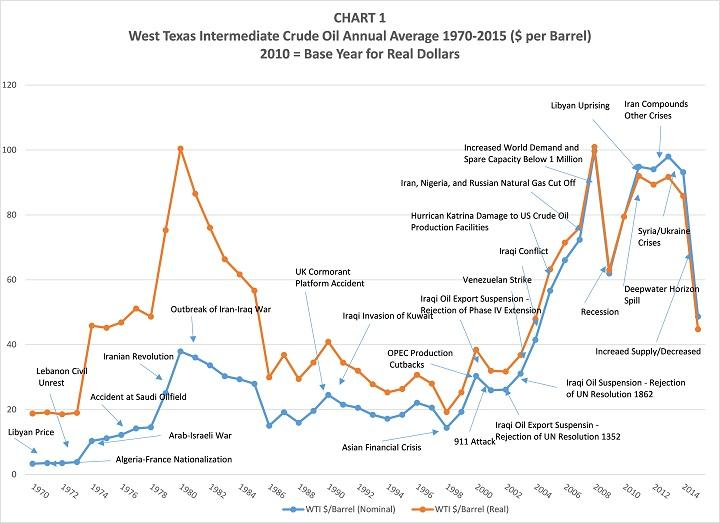

## Table of Contents

## What is oil and gas drilling?

Oil and gas drilling is the process of digging deep into the earth to find and extract oil and natural gas. These resources are trapped in rocks far below the surface. To reach them, workers use a drilling rig, which is like a big machine that can drill through the earth. The rig has a long drill bit that spins and cuts through the rock. Once the drill reaches the oil or gas, it can be pumped up to the surface.

Drilling for oil and gas is important because these resources are used for many things, like fueling cars and heating homes. However, it can also be risky and expensive. There is always a chance that the drilling might not find any oil or gas, which means a lot of money and effort could be wasted. Also, drilling can harm the environment if not done carefully. That's why it's important to follow strict rules and use safe methods when drilling for oil and gas.

## How does oil and gas drilling contribute to the global economy?

Oil and gas drilling plays a big role in the global economy. It helps countries make money by finding and selling oil and gas. These resources are used all over the world for things like driving cars, heating homes, and making plastics. When countries find oil and gas, they can sell it to other countries, which brings in a lot of money. This money can be used to build roads, schools, and hospitals, making life better for people.

Drilling for oil and gas also creates jobs. Many people work at drilling sites, in offices, and in factories that use oil and gas. This means more people can earn money and spend it on things they need, like food and clothes. When people have jobs and money, it helps the economy grow. However, oil and gas prices can go up and down, which can make the economy unstable at times. Even with these challenges, oil and gas drilling remains a key part of the global economy.

## What are the major oil and gas producing countries?

The biggest oil and gas producing countries are the United States, Saudi Arabia, and Russia. The United States produces a lot of oil and gas because it has many drilling sites and uses new technology to find more. Saudi Arabia has huge oil fields and is part of a group called OPEC that helps control oil prices. Russia also has a lot of oil and gas, and it sells a lot of it to Europe and other places.

Other important countries for oil and gas are Iran, Canada, and China. Iran has big oil and gas reserves but faces some challenges because of politics. Canada has a lot of oil in a type of sand called oil sands, and it's working on better ways to get the oil out. China uses a lot of oil and gas and also produces some of its own, but it still needs to buy more from other countries.

These countries play a big role in the global oil and gas market. They help meet the world's need for energy and can affect oil and gas prices around the world.

## How does the oil and gas industry affect employment globally?

The oil and gas industry creates a lot of jobs around the world. People work at drilling sites, on oil rigs, and in factories that make things from oil and gas. There are also jobs in offices, like engineers and managers who plan and run the operations. When these jobs are available, more people can earn money and spend it on things they need, like food and clothes. This helps the economy grow because when people have jobs, they can support themselves and their families.

However, the number of jobs in the oil and gas industry can change a lot. When oil and gas prices are high, companies drill more and hire more people. But when prices go down, companies might have to cut back and let people go. This can make it hard for workers because their jobs might not be stable. Even with these ups and downs, the oil and gas industry still provides many jobs and is important for employment around the world.

## What are the economic benefits of oil and gas exports for producing countries?

Oil and gas exports bring a lot of money to countries that produce them. When these countries sell oil and gas to other countries, they earn money that can be used to build roads, schools, and hospitals. This helps make life better for people living in those countries. The money from exports can also be used to pay for things the country needs, like food and medicine, which can be hard to get otherwise.

Having oil and gas to export can also make a country's economy stronger. When other countries need oil and gas, they will pay a lot for it. This gives the exporting country more power in the global market. The money from exports can help the country grow its economy by creating jobs and helping businesses start and grow. Even though oil and gas prices can go up and down, the money from exports is still very important for many countries.

## How do fluctuations in oil and gas prices impact the global economy?

Fluctuations in oil and gas prices can have a big impact on the global economy. When prices go up, it costs more for people and businesses to use oil and gas. This can make things like gas for cars and heating homes more expensive. When things cost more, people might not have as much money to spend on other things, which can slow down the economy. Also, when oil and gas prices are high, countries that need to import them have to spend more money, which can make their economies weaker.

On the other hand, when oil and gas prices go down, it can be good for some parts of the economy. It costs less for people and businesses to use oil and gas, so they might have more money to spend on other things. This can help the economy grow. However, countries that export oil and gas might not make as much money when prices are low. This can hurt their economies because they have less money to spend on things like building roads and schools. So, the global economy can be affected a lot by changes in oil and gas prices.

## What role do oil and gas play in the energy sector and how does this influence economic stability?

Oil and gas are very important in the energy sector. They are used to make electricity, fuel cars, and heat homes. Many countries rely on oil and gas to keep their energy systems running smoothly. When there is a lot of oil and gas, and it's not too expensive, it helps the energy sector work well. This is good for the economy because businesses can use energy to make things and people can use it to live their lives.

However, the prices of oil and gas can change a lot. When prices go up, it can make energy more expensive. This can slow down the economy because businesses have to spend more money on energy, and people might not have as much money to spend on other things. When prices go down, it can help the economy by making energy cheaper, but it can also hurt countries that sell oil and gas because they make less money. So, the stability of the economy can be affected by how much oil and gas costs and how much is available.

## How have technological advancements in drilling techniques affected the economic outcomes of oil and gas extraction?

Technological advancements in drilling techniques have made it easier and cheaper to find and get oil and gas out of the ground. New methods like hydraulic fracturing, or "fracking," and horizontal drilling let companies reach oil and gas that was hard to get before. These technologies have helped countries like the United States produce a lot more oil and gas. This means they don't have to buy as much from other countries, which saves money and helps their economy grow. Also, these new technologies create jobs for people who work in the oil and gas industry, which is good for the economy.

However, these new drilling technologies can also make the oil and gas market less stable. When it's easier to find oil and gas, more companies start drilling, which can make too much oil and gas available. When there is too much, the prices can go down a lot. This can hurt countries that rely on selling oil and gas because they make less money. So, while new drilling technologies can bring a lot of benefits, they can also cause problems in the global economy by making oil and gas prices go up and down a lot.

## What are the indirect economic contributions of the oil and gas industry, such as infrastructure development?

The oil and gas industry helps build and improve infrastructure in many ways. When companies find oil and gas, they need to build roads, pipelines, and ports to move it around. This new infrastructure can be used by everyone, not just the oil and gas industry. For example, new roads built for oil trucks can also be used by regular cars and buses. This makes it easier for people to get around and can help businesses grow because they can move their goods more easily. Also, the money from oil and gas can be used to build schools, hospitals, and other important buildings that make life better for people.

The industry also helps with technology and research. When companies work on new ways to find and get oil and gas, they often create new technologies that can be used in other industries too. For example, the technology used in drilling can help with building tunnels or mining other resources. This can lead to new jobs and businesses in these other areas. The money spent on research and development in the oil and gas industry can also help universities and other research groups find new ways to solve problems, which can lead to more economic growth in the long run.

## How do environmental regulations and sustainability efforts impact the economic viability of oil and gas drilling?

Environmental regulations and sustainability efforts can make oil and gas drilling more expensive. These rules are made to protect the environment, like stopping oil spills and reducing air pollution. To follow these rules, oil and gas companies have to spend more money on things like better equipment and new ways to clean up after drilling. This can make it harder for them to make a profit because they have to spend more money just to drill. Sometimes, these costs can make it not worth it to drill in certain places, especially if the oil and gas there is hard to get or not worth a lot of money.

On the other hand, these regulations and efforts can also help the oil and gas industry in the long run. By following the rules and trying to be more sustainable, companies can avoid big problems like oil spills that can cost a lot of money to fix. Also, if they use new, cleaner technologies, they might be able to keep drilling for longer because they won't run out of places to drill as quickly. This can help keep the industry strong and stable, which is good for the economy. So, while environmental rules can make things harder in the short term, they can also help the oil and gas industry stay around for a longer time.

## What are the economic challenges faced by countries transitioning away from oil and gas dependency?

Countries that depend a lot on oil and gas face big challenges when they try to move away from them. One big problem is that they lose a lot of money. Oil and gas bring in a lot of cash for these countries, and when they stop using them as much, they don't have that money anymore. This can make it hard to pay for things like schools and hospitals. Also, many people work in the oil and gas industry, so when it gets smaller, a lot of people can lose their jobs. This can make the economy weaker because people don't have money to spend on things they need.

Another challenge is that it takes a lot of time and money to switch to other kinds of energy, like wind or solar power. These new energy sources need new technology and infrastructure, like wind turbines and solar panels, which can be expensive to build. Countries have to find new ways to make money and create jobs while they are making these changes. It can be hard to keep the economy stable during this time because everything is changing. But if countries can do it right, they can have a stronger and more sustainable economy in the future.

## How do geopolitical factors influence the economic aspects of oil and gas drilling on a global scale?

Geopolitical factors can really change how oil and gas drilling works around the world. Countries that have a lot of oil and gas can use it to make friends or cause problems with other countries. For example, if a country sells oil to another country, they might become allies. But if one country decides to stop selling oil to another, it can cause big problems. This is called an embargo, and it can make oil prices go up and hurt the economy of the country that can't get oil. Also, when countries fight over who owns oil and gas fields, it can make it hard to drill and get the oil and gas out.

These geopolitical issues can also affect how much oil and gas costs. When countries that are part of groups like OPEC work together, they can decide to produce less oil to make prices go up. This can help them make more money, but it can hurt countries that need to buy oil because they have to pay more. On the other hand, if countries start fighting or if there are problems in places where a lot of oil comes from, like the Middle East, it can make oil prices go up because people worry about not getting enough oil. All these things show how politics can change the economics of oil and gas drilling and affect the whole world.

## References & Further Reading

Bergstra, J., Bardenet, R., Bengio, Y., & Kégl, B. (2011). "Algorithms for Hyper-Parameter Optimization." Advances in Neural Information Processing Systems 24. This paper discusses methodologies for optimizing hyper-parameters in [machine learning](/wiki/machine-learning) algorithms, which can enhance the performance and efficiency of trading systems, including those applied within the oil and gas sectors.

Jansen, S. "Machine Learning for Algorithmic Trading." This book provides a comprehensive guide on leveraging machine learning techniques for developing robust [algorithmic trading](/wiki/algorithmic-trading) strategies. It covers important concepts such as automated trading, data analysis, and predictive modeling, all of which are pertinent to executing effective trades in energy markets.

U.S. Energy Information Administration. The EIA is a reliable source for comprehensive energy [statistics](/wiki/bayesian-statistics) and analysis. Their data and reports provide valuable insights into production, consumption, and market trends crucial for informed trading and investment decisions in the oil and gas industry.

For further understanding, explore additional primary sources that discuss advancements in algorithmic trading and their implications on global energy markets. These resources include industry reports, regulatory publications, and technological assessments that provide a broader context for the current and future state of trading in oil and gas.

