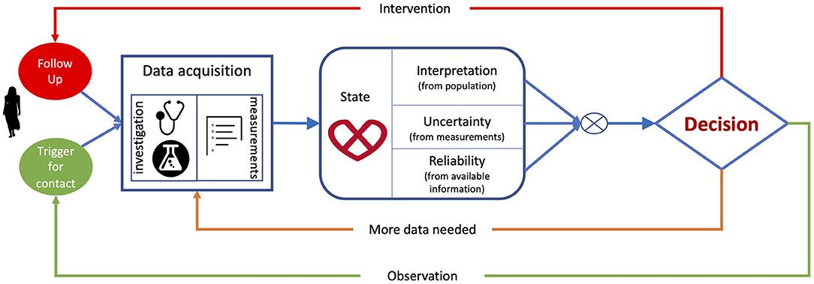

## Table of Contents

## What are Control and Decision Systems in the context of Machine Learning?

Control and Decision Systems in Machine Learning are about making smart choices and managing how things work. Imagine you have a robot that needs to move around without bumping into things. Control systems help the robot adjust its speed and direction, while decision systems help it decide where to go next. In machine learning, these systems use data to learn the best ways to control and decide. They use algorithms to predict what will happen next and then choose the best action based on those predictions.

For example, in a self-driving car, the control system might adjust the steering and brakes to keep the car on the road safely. The decision system would use machine learning to figure out when to change lanes or stop at a red light. These systems work together to make the car drive smoothly and safely. They learn from past experiences, like how a human driver would, but they can do it much faster and more accurately because they use data and math to make decisions.

In technical terms, control systems often use feedback loops to monitor and adjust the system's behavior. Decision systems might use algorithms like reinforcement learning, where the system learns by trial and error. For instance, the system might use a formula like $$ Q(s,a) = Q(s,a) + \alpha [r + \gamma \max_{a'} Q(s',a') - Q(s,a)] $$ to update its knowledge based on rewards and penalties. This helps the system get better over time at making the right choices.

## How do Control and Decision Systems differ from traditional machine learning models?

Control and Decision Systems in [machine learning](/wiki/machine-learning) are different from traditional machine learning models because they focus more on making real-time decisions and managing ongoing processes. Traditional machine learning models, like those used for classification or regression, usually take in data, process it, and then give a prediction or a decision based on that data. For example, a traditional model might predict whether an email is spam or not. These models are great for tasks where you need a one-time decision based on a set of inputs. However, they don't handle ongoing adjustments and real-time decision-making as well as Control and Decision Systems do.

Control and Decision Systems, on the other hand, are designed to continuously monitor and adjust based on feedback. They use algorithms that can adapt and learn from the environment in real time. For instance, a control system in a self-driving car not only predicts whether to turn left or right but also continuously adjusts the steering based on the road conditions. These systems often use [reinforcement learning](/wiki/reinforcement-learning), where they learn from the outcomes of their actions. For example, they might use a formula like $$ Q(s,a) = Q(s,a) + \alpha [r + \gamma \max_{a'} Q(s',a') - Q(s,a)] $$ to update their decision-making process based on rewards and penalties. This makes them better suited for tasks that require ongoing management and decision-making.

## What is the role of Proportional-Integral-Derivative (PID) controllers in Control Systems?

PID controllers are a type of control system used to make adjustments in real time. They are very common in engineering and help keep things like temperature, speed, or position stable. Imagine you're trying to keep a room at a certain temperature. A PID controller would watch the room's temperature and make small changes to the heater to keep it just right. It does this by using three parts: Proportional (P), Integral (I), and Derivative (D). The P part reacts quickly to big changes, the I part fixes any long-term errors, and the D part predicts future changes to smooth things out.

The way a PID controller works can be shown with a simple formula: $$ u(t) = K_p e(t) + K_i \int_{0}^{t} e(\tau) d\tau + K_d \frac{de(t)}{dt} $$. Here, $u(t)$ is the control signal, $e(t)$ is the error (the difference between where you want to be and where you are), and $K_p$, $K_i$, and $K_d$ are the gains for each part of the controller. By adjusting these gains, you can make the controller react more or less to changes. This makes PID controllers very flexible and useful in many different situations, from keeping a car's speed steady to controlling the temperature in a chemical reactor.

## How can Genetic Algorithms (GA) be used to optimize PID controllers?

Genetic Algorithms (GA) can be used to optimize PID controllers by mimicking the process of natural selection. Imagine you have a bunch of different PID controllers, each with its own set of gains (Kp, Ki, Kd). The GA starts by creating a population of these controllers, each with randomly chosen gains. It then tests each controller to see how well it performs in controlling the system. The best-performing controllers are selected to "breed" and create new controllers, combining their gains in a way that hopefully produces even better results. Over many generations, this process can lead to finding the best set of gains for the PID controller, making it work more efficiently.

The GA uses a fitness function to measure how well each PID controller is doing. This function could be something like how quickly the controller can reach the desired state or how little it overshoots. For example, the fitness might be calculated as $$ \text{Fitness} = \frac{1}{\text{Settling Time} + \text{Overshoot}} $$. The GA then uses this fitness to decide which controllers should be kept and which should be discarded. By repeating this process over many generations, the GA can find the optimal gains for the PID controller, making it better at keeping the system stable and responsive.

## What are Neural Network-based PID (NN-PID) controllers and how do they improve upon traditional PID controllers?

Neural Network-based PID (NN-PID) controllers combine the strengths of traditional PID controllers with the learning abilities of neural networks. In a traditional PID controller, you have to manually set the gains (Kp, Ki, Kd) to make it work well. But with an NN-PID controller, the [neural network](/wiki/neural-network) can learn and adjust these gains automatically. This makes the controller smarter because it can adapt to changes in the system it's controlling, like changes in temperature or speed. The neural network uses data from the system to learn how to set the gains to get the best performance.

NN-PID controllers can handle more complex and changing systems better than traditional PID controllers. For example, if you're controlling a robot that moves in different environments, a traditional PID controller might struggle because it can't easily adjust to new conditions. But an NN-PID controller can learn from its experiences and adjust the gains like $$ u(t) = K_p e(t) + K_i \int_{0}^{t} e(\tau) d\tau + K_d \frac{de(t)}{dt} $$ on the fly. This makes it more flexible and able to handle unexpected changes, making the system more stable and responsive overall.

## Can you explain the concept of feedback loops in Control and Decision Systems?

Feedback loops are an important part of Control and Decision Systems. They work by taking information from what the system is doing and using it to make adjustments. Imagine you're driving a car and you want to keep a steady speed. The speedometer tells you how fast you're going, and you use that information to press or release the gas pedal. In Control and Decision Systems, this process is done automatically. A sensor measures the current state of the system, like the speed of a car or the temperature in a room, and sends that information back to the controller. The controller then decides what to do next to keep the system on track.

In machine learning, feedback loops help systems learn and improve over time. For example, in a self-driving car, the system might use a formula like $$ Q(s,a) = Q(s,a) + \alpha [r + \gamma \max_{a'} Q(s',a') - Q(s,a)] $$ to update its knowledge based on rewards and penalties. This means the car can learn from its mistakes and successes, adjusting its actions to drive better. The feedback loop keeps going, with the system constantly using new data to make better decisions. This makes Control and Decision Systems very powerful because they can adapt and get better at what they do.

## What are some common applications of Control and Decision Systems in industry?

Control and Decision Systems are used in many industries to make things work better and safer. In manufacturing, these systems help control machines like robots on assembly lines. They make sure the robots move smoothly and accurately, putting parts together just right. For example, a robot might use a control system to adjust its speed and position, while a decision system helps it choose the next part to pick up. These systems use feedback loops to keep everything running smoothly, like $$ u(t) = K_p e(t) + K_i \int_{0}^{t} e(\tau) d\tau + K_d \frac{de(t)}{dt} $$ for a PID controller, which helps the robot stay on track.

In the energy sector, Control and Decision Systems help manage power plants. They control things like the temperature and pressure in a nuclear reactor or the flow of electricity in a grid. These systems use data to make smart decisions, like when to turn on more generators or how to balance the load across the grid. For instance, a decision system might use reinforcement learning, like $$ Q(s,a) = Q(s,a) + \alpha [r + \gamma \max_{a'} Q(s',a') - Q(s,a)] $$, to learn the best way to manage the power supply. This makes the power plant safer and more efficient.

In transportation, Control and Decision Systems are crucial for things like self-driving cars and traffic management. A self-driving car uses these systems to control its speed, steering, and brakes, while also deciding where to go next. The car might use a neural network to adjust its PID controller gains, making it better at handling different road conditions. Traffic management systems use these systems to control traffic lights and manage traffic flow, making roads safer and reducing congestion. These applications show how Control and Decision Systems can improve many different parts of our lives.

## How do you evaluate the performance of a Control and Decision System?

To evaluate the performance of a Control and Decision System, you look at how well it does its job. For example, if it's controlling a robot, you might check how accurately and smoothly the robot moves. You could use measures like the time it takes for the system to reach its goal, how much it overshoots, and how steady it stays once it gets there. These are called performance metrics. In a simple PID controller, you might use a formula like $$ u(t) = K_p e(t) + K_i \int_{0}^{t} e(\tau) d\tau + K_d \frac{de(t)}{dt} $$ to see how the controller reacts to changes. If the system can keep things stable and respond quickly without going too far, it's doing well.

Another way to evaluate these systems is by using simulations. You can create a computer model of the system and test it in different situations to see how it performs. This is especially useful for complex systems like self-driving cars or power plants. In these simulations, you might use algorithms like reinforcement learning to see how the system learns and improves over time. For instance, a decision system might use a formula like $$ Q(s,a) = Q(s,a) + \alpha [r + \gamma \max_{a'} Q(s',a') - Q(s,a)] $$ to update its knowledge based on rewards and penalties. By running these tests, you can find out if the system can handle real-world challenges and make good decisions on its own.

## What challenges are faced when implementing Control and Decision Systems in real-world scenarios?

Implementing Control and Decision Systems in real-world scenarios can be tricky because the world is full of surprises. These systems need to handle all sorts of unexpected changes, like sudden weather shifts or equipment failures. For example, a self-driving car's control system must react quickly to a pedestrian suddenly stepping into the road. The decision system needs to figure out the best way to avoid the pedestrian without causing an accident. If the system can't adapt well to these changes, it might not work as well as we need it to. This is why testing and simulations are so important, to make sure the system can handle real-life situations.

Another challenge is making sure the system is safe and reliable. In industries like energy or transportation, mistakes can be dangerous. For instance, in a power plant, the control system needs to keep everything running smoothly to avoid accidents. The decision system must learn from past experiences to make good choices. Using formulas like $$ Q(s,a) = Q(s,a) + \alpha [r + \gamma \max_{a'} Q(s',a') - Q(s,a)] $$ helps the system learn, but it takes time and careful testing to make sure it's safe. Also, these systems often need a lot of data to work well, and getting that data can be hard. If the system doesn't have enough good data, it might make wrong decisions. So, finding ways to get and use data effectively is a big challenge.

## How can advanced machine learning techniques like reinforcement learning enhance Control and Decision Systems?

Advanced machine learning techniques like reinforcement learning can make Control and Decision Systems smarter and better at their jobs. Imagine a robot that needs to learn how to move around without bumping into things. With reinforcement learning, the robot can try different ways of moving, get feedback on what works and what doesn't, and then learn to do better over time. The system uses a formula like $$ Q(s,a) = Q(s,a) + \alpha [r + \gamma \max_{a'} Q(s',a') - Q(s,a)] $$ to update its knowledge based on rewards and penalties. This means the robot can get better at moving around by itself, without someone telling it exactly what to do.

This kind of learning is really helpful in situations where things can change a lot, like in a self-driving car. The car needs to make quick decisions based on what's happening around it, like other cars, people, or changing weather. Reinforcement learning helps the car's control system adjust its speed and direction smoothly, while the decision system learns the best actions to take in different situations. This makes the car safer and more reliable because it can handle unexpected changes better.

## What are the latest research trends in Control and Decision Systems using Machine Learning?

The latest research trends in Control and Decision Systems using Machine Learning are focusing on making systems more adaptive and able to handle complex, real-world situations. One big trend is using deep reinforcement learning, which combines deep neural networks with reinforcement learning to solve problems that traditional methods can't. For example, researchers are working on systems that can learn to control robots or drones in environments that change a lot. They use formulas like $$ Q(s,a) = Q(s,a) + \alpha [r + \gamma \max_{a'} Q(s',a') - Q(s,a)] $$ to help the system learn from its actions and improve over time. This makes the systems better at dealing with unexpected events, like sudden changes in a factory or on a road.

Another trend is the use of transfer learning, where a system can use what it learned in one situation to help it in another. This is helpful because it means the system doesn't have to start from scratch every time it faces a new problem. For instance, a self-driving car could use what it learned on city streets to help it drive on highways. Researchers are also looking into multi-agent systems, where different parts of a system work together and learn from each other. This can make things like traffic management or energy distribution more efficient and responsive. These trends show how machine learning is making Control and Decision Systems smarter and more useful in our everyday lives.

## How do you foresee the evolution of Control and Decision Systems in the next decade?

In the next decade, Control and Decision Systems will become even smarter and more helpful thanks to machine learning. They will be able to handle more complex tasks and adapt to changes in the world around them much better. For example, self-driving cars will get better at dealing with unexpected situations, like sudden weather changes or road hazards. They will use techniques like deep reinforcement learning to learn from their experiences and make better decisions. A formula like $$ Q(s,a) = Q(s,a) + \alpha [r + \gamma \max_{a'} Q(s',a') - Q(s,a)] $$ will help these systems learn from their actions and improve over time, making them safer and more reliable.

Another big change will be in how these systems work together. Multi-agent systems, where different parts of a system learn from each other, will become more common. This will make things like traffic management or energy distribution more efficient. For example, traffic lights could work together to reduce congestion and make roads safer. Transfer learning will also play a big role, allowing systems to use what they learned in one situation to help them in another. This means a system could use its experience from one factory to help it work better in another. These advancements will make Control and Decision Systems more useful and important in our everyday lives.