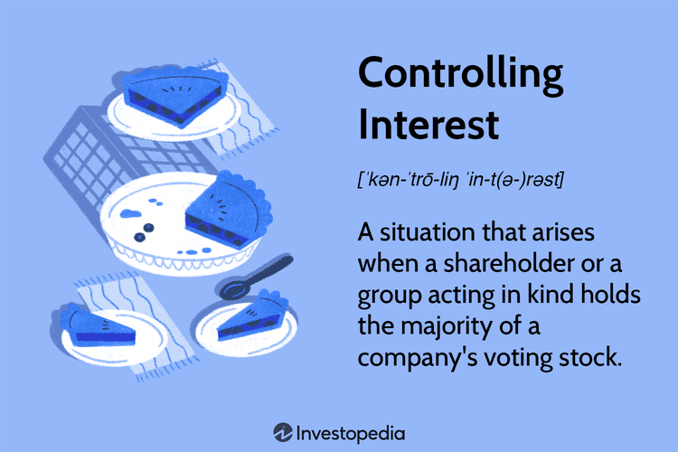

In today's fast-paced business landscape, comprehending key concepts such as business ownership, corporate control, and controlling interest is essential. These components form the backbone of major strategic decisions within corporations, influencing various aspects from shareholder dynamics to operational strategies. Business ownership signifies holding equity in a company, granting owners rights to a proportion of profits and an integral voice in corporate governance. Corporate control, on the other hand, transcends mere ownership by encompassing the authority to guide or influence a company's strategic trajectory.

Algorithmic trading has significantly transformed financial markets by automating intricate trading decisions and improving market efficiencies. It involves the use of advanced mathematical models and algorithms to execute trades at speeds and frequencies that are impossible for human traders. Algorithmic trading enhances liquidity and minimizes market impact, thereby optimizing trading performance. When integrated with corporate governance, algorithmic trading provides distinct advantages, such as increased market efficiency and profitability, but also introduces unique challenges, particularly in aligning trading strategies with corporate objectives and managing associated risks.

This article aims to explore the intersections between business ownership, corporate control, controlling interest, and algorithmic trading, shedding light on how these elements collectively shape modern business strategies. By examining the synergy between these concepts, we can better understand their role in driving corporate innovation, enhancing shareholder value, and navigating the complexities of today's financial markets.

## Table of Contents

## Understanding Business Ownership and Corporate Control

Business ownership refers to possessing equity in a company, granting owners specific entitlements such as profit-sharing and decision-making involvement. Equity is typically represented by ownership of shares, which reflect an individual's stake in the company. Shareholders, individuals or entities holding these shares, are fundamentally entitled to dividends, a portion of the profits distributed to shareholders, and voting rights in corporate matters. These voting rights play a significant role in corporate governance, as they influence critical decisions regarding the company's operations and strategic direction.

Corporate control extends beyond mere ownership, encompassing the authority to influence or direct the strategic decisions of a corporation. This control can be exercised by shareholders through their voting rights, enabling them to impact key aspects such as mergers and acquisitions, executive appointments, and other strategic initiatives. The concept of corporate control is intrinsically linked to the distribution of voting power among shareholders.

Shareholders with a controlling interest possess substantial voting power, allowing them to dictate corporate actions and steer the company’s direction. A controlling interest is typically achieved when a shareholder or a group of shareholders holds a significant percentage of the company’s voting shares, often over 50%. However, a controlling interest can sometimes be established with less than half of the shares if the remaining shares are widely dispersed. This situation can occur when no single shareholder or coalition accumulates enough votes to challenge the controlling shareholder's decisions.

In mathematical terms, the controlling interest can be determined by evaluating the distribution of shares among shareholders. Suppose that a company has $N$ shares in total, and a single shareholder owns $n$ shares. The percentage of control, $P$, held by this shareholder is given by:

$$
P = \left( \frac{n}{N} \right) \times 100\%
$$

For strategic corporate control, it is essential to evaluate the concentration of ownership and the distribution of shares to establish how decision-making power is allocated among stakeholders. Additionally, corporate control involves not just direct ownership but may include influence through various financial instruments and legal arrangements that confer voting power.

Understanding the interplay between business ownership and corporate control is pivotal for stakeholders, as it influences how companies are managed and the strategic paths they pursue. This understanding is also crucial for regulatory bodies monitoring corporate governance to ensure fair practices and shareholder rights.

## Controlling Interest: Key to Corporate Strategy

A controlling interest in a corporation is defined as owning enough shares to exert a significant level of influence over its strategic and operational decisions. This typically involves owning more than 50% of a company's voting stock, but in some cases, a smaller percentage might suffice if the remaining shares are widely dispersed among many smaller investors, allowing the controlling entity to wield substantial power despite not having an absolute majority.

The power obtained through a controlling interest enables the entity or individual to decisively influence the corporation's future by shaping its objectives, policies, and key strategic initiatives. This ability to drive corporate strategy is pivotal in significant actions such as mergers and acquisitions, where strategic realignments are necessary to enhance competitive advantage or enter new markets. Control over decision-making allows stakeholders to initiate these corporate restructuring efforts, aligning them with broader organizational goals.

Entities with a controlling stake also wield crucial governance power. This involves determining the composition of the board of directors, which is instrumental in steering the company’s approach to risk management, compliance, and ethical standards. The strategic trajectory that a corporation undertakes is largely dependent on these governing bodies, making the controlling stakeholder influential in setting long-term visions and policies that align with their strategic interests.

For example, in the case of a merger, a controlling stakeholder can negotiate terms that maximize shareholder value while maintaining alignment with overall corporate strategy. This ensures that synergy and integration efforts post-merger are optimized, enhancing the operational strengths of the newly formed entity. Moreover, by controlling significant voting power, these entities can effectively reject activities that they deem not in alignment with the company’s strategic interests, thereby safeguarding their investment and steering the future of the corporation.

In summary, controlling interest is a critical component in defining corporate strategy and governance. It offers the power to redefine business goals, leverage corporate assets effectively, and ensure that significant corporate endeavors, including mergers and acquisitions, align with the broader strategic vision. This strategic influence underscores the value of controlling interests in the landscape of modern business operations and corporate governance.

## Algorithmic Trading and Its Role in Modern Corporations

Algorithmic trading has become an integral component of modern financial markets, employing complex algorithms to automate the process of trading securities. This method allows corporations to execute large volumes of trades swiftly and accurately, thereby optimizing their trading operations. The core of [algorithmic trading](/wiki/algorithmic-trading) lies in its capacity to analyze massive datasets, apply advanced computational models, and react to real-time market dynamics, which together redefine the efficiency and profitability of corporate trading strategies.

The capability to execute trades at high speed is a significant advantage of algorithmic trading. Automated systems can process information and perform transactions within fractions of a second, a feat that far surpasses human traders. This rapid execution reduces the transaction costs associated with delays and takes advantage of fleeting market opportunities, enabling corporations to enhance their market efficiency.

Beyond speed, algorithmic trading leverages large-scale data analysis. By handling vast amounts of historical and real-time data, algorithms can discern patterns and make informed predictions about market movements. This analytical prowess is supported by sophisticated computational models that underpin the algorithms’ decision-making processes. Corporations investing in these models gain a competitive edge, as they can anticipate and respond to market changes more accurately than those relying on manual trading methods.

Real-time market analysis is crucial for the success of algorithmic trading strategies. Algorithms constantly monitor market conditions, adapting to changes in [liquidity](/wiki/liquidity-risk-premium), asset prices, and [volatility](/wiki/volatility-trading-strategies). This dynamic analysis facilitates the adjustment of trading strategies in real-time, ensuring that corporations remain aligned with current market trends and conditions. Additionally, real-time feedback mechanisms allow for the immediate execution of trades based on the latest data, further reinforcing the timely and effective nature of algorithmic trading.

In the context of corporations, integrating algorithmic trading strategies can lead to considerable enhancements in market efficiency and overall profitability. By optimizing trade execution and leveraging data-driven insights, companies can allocate resources more effectively and capitalize on lucrative market opportunities. The integration of algorithmic trading within a corporate framework requires not only technological investment but also an alignment with corporate objectives and risk management protocols.

Algorithmic trading is transforming how corporations engage with financial markets. Its ability to combine speed, data analysis, and real-time market engagement makes it a powerful tool for enhancing trading performance and achieving strategic business goals. As algorithmic technologies continue to develop, they promise to offer even greater efficiencies and opportunities for corporations worldwide.

## Interplay Between Corporate Control and Algorithmic Trading

The integration of algorithmic trading within corporate structures is significantly shaped by dynamics of ownership and control. Corporations with robust control mechanisms are better positioned to effectively govern trading strategies. Such governance is critical to ensuring that algorithmic trading aligns with broader corporate goals and adheres to established risk management frameworks. A company's ability to influence its trading operations hinges on its controlling interest, which provides the authority to shape these strategies in alignment with corporate objectives.

Algorithmic trading strategies are employed to execute trades with precision, often relying on a gamut of sophisticated models and extensive datasets for real-time analysis. However, the success of such strategies within a corporate framework is contingent upon the corporation's ability to integrate these activities with its overall strategic outlook. A well-aligned governance structure allows for seamless integration, improving operational efficiency and ensuring that trading activities support corporate profitability objectives.

Parent companies often leverage their subsidiaries to test and implement innovative trading techniques. This hierarchical structure allows for compartmentalized risk management, as the methodologies can be trialed in controlled environments. In this way, subsidiaries serve as experimental platforms for optimizing both risk and return. Moreover, the insights gained from subsidiary operations can be scaled to benefit the parent company, contributing to more informed and strategic decision-making.

The interplay between corporate control and algorithmic trading also plays a pivotal role in mitigating systematic risks. In this context, robust control mechanisms can be employed to monitor and adapt trading algorithms in response to market anomalies or technological failures. Effective governance structures not only facilitate compliance with regulatory standards but also enhance the corporation’s ability to quickly respond to changes in the trading landscape.

Ultimately, the key to successful integration of algorithmic trading within corporate structures lies in aligning these advanced trading strategies with the corporate governance model, thereby optimizing resource allocation and enhancing the corporation's ability to capitalize on market opportunities.

## Strategic Benefits of Merging Algo Trading with Corporate Ownership

Combining algorithmic trading with corporate control offers several strategic benefits for companies looking to optimize resource allocation and capitalize on market opportunities efficiently. Algorithmic trading, characterized by its ability to execute large volumes of trades with precision and speed, aligns well with the strategic oversight provided by corporate control. This synergy enables corporations to scale their operations, manage risk more effectively, and navigate complex market conditions.

Algorithmic trading systems utilize advanced computational models and vast datasets to make informed trading decisions in real time. This level of automation and analytical power provides corporations with the agility needed to respond quickly to market fluctuations, making it an ideal complement to the top-down strategic guidance offered by controlling stakeholders. With access to algorithmic trading, companies can fine-tune their trading strategies to align with corporate goals, ensuring a cohesive approach to market engagement.

The integration also enhances risk management capabilities. Companies can develop algorithms tailored to their risk appetite, enabling precise monitoring and management of market exposure. By leveraging these systems, corporations can maintain a balanced approach to trading, mitigating potential losses while capitalizing on profitable opportunities. This strategic alignment between algorithmic trading and corporate control allows for better anticipation of market trends and anomalies, facilitating a proactive rather than reactive approach to market participation.

Moreover, merging these elements supports scalable growth. Companies can leverage algorithmic trading to increase trade volumes without proportionally increasing their operational costs. This scalability is essential for corporations aiming to expand their market presence while maintaining efficiency. The agility inherent in algorithmic systems means companies can adjust their strategies dynamically, accommodating shifts in market conditions and ensuring sustained growth.

In sum, the integration of algorithmic trading with corporate ownership and control fosters a robust framework for strategic growth. This combination provides companies with the tools and insights necessary to enhance their market strategies, respond effectively to changing economic landscapes, and sustain competitive advantages. As market dynamics continue to evolve, this integrated approach will remain a critical component of successful corporate strategy.

## Challenges and Risks of Corporate Algo Trading

Blending algorithmic trading with corporate ownership offers numerous advantages but also presents several noteworthy challenges and risks. Central to these challenges are the complexities associated with regulatory requirements and operational risks, which corporations must navigate to harness the full potential of algorithmic trading successfully.

Corporations engaging in algorithmic trading must ensure that their trading algorithms are compliant with a wide array of global regulations. These regulations are not only complex but also subject to frequent updates, making compliance an ongoing challenge. Regulatory frameworks vary across jurisdictions and include aspects such as market conduct, investor protection, and systemic risk mitigation. For instance, in the European Union, algorithmic trading is regulated under the Markets in Financial Instruments Directive II (MiFID II), which emphasizes transparency and the responsible use of trading technologies. Similarly, in the United States, entities must adhere to regulations set forth by the Securities and Exchange Commission (SEC) and the Commodity Futures Trading Commission (CFTC). Failure to comply with these regulations can result in significant penalties, thus necessitating robust internal compliance mechanisms.

Operational challenges are also significant when algorithmic trading is integrated within corporations. One of the primary risks is systematic risk, which encompasses both technological failures and market anomalies. Technological failures can range from software bugs and system crashes to networking issues that can disrupt trading operations. Such disruptions can lead to significant financial losses, especially when large volumes of trades are executed rapidly. Market anomalies, such as sudden price spikes or flash crashes, introduce additional volatility and uncertainty, necessitating sophisticated risk management strategies.

Robust risk management strategies are essential to mitigating these operational risks. These strategies often involve the implementation of comprehensive monitoring systems, regular auditing of algorithms, and stress testing scenarios that simulate potential failures. Additionally, employing real-time surveillance systems helps in detecting anomalies or irregular activities promptly, allowing corporations to respond swiftly to mitigate adverse impacts.

In the context of technological resilience, corporations are investing in developing state-of-the-art infrastructure that can handle high-frequency data processing and ensure redundancy and fault tolerance. Moreover, incorporating advanced data analytics and [machine learning](/wiki/machine-learning) algorithms offers the potential to enhance predictive capabilities, which can aid in anticipating and countering market fluctuations.

Ultimately, successfully navigating these challenges requires corporations to adopt a proactive approach to regulatory compliance and risk management while leveraging technological advancements to bolster their operational frameworks. By doing so, they can mitigate the inherent risks and fully capitalize on the strategic benefits offered by algorithmic trading.

## Case Studies: Successful Corporate Algo Trading Integration

Examining real-world examples of companies such as Goldman Sachs and Renaissance Technologies provides valuable insights into the effective integration of algorithmic trading within corporate frameworks. These companies have demonstrated how strategic alignment between trading operations and corporate control can lead to significant advantages in terms of innovation, risk management, and governance.

Goldman Sachs, a leading global investment banking firm, has been at the forefront of using algorithmic trading to enhance its trading operations. The firm employs sophisticated algorithms to analyze large datasets and execute trades with precision and speed. This reliance on algorithmic trading allows Goldman Sachs to capitalize on fleeting market opportunities, optimize its resource allocation, and maintain competitiveness in dynamic and volatile market conditions. The strategic control exercised by the firm's leadership ensures that these trading operations align with the broader corporate objectives, including risk management and compliance with regulatory requirements.

Renaissance Technologies, a [hedge fund](/wiki/hedge-fund-trading-strategies) known for its technological prowess, exemplifies how a strong technological infrastructure coupled with a well-defined strategic vision can lead to successful algorithmic trading integration. The firm is renowned for its use of quantitative models, data analytics, and machine learning techniques to drive its trading decisions. This innovative approach has enabled Renaissance Technologies to achieve consistent returns and reinforce its position as a leader in the field. The governance structures within the firm play a crucial role in guiding these technological endeavors, ensuring that they are in line with corporate goals while managing the inherent risks associated with high-frequency trading.

In both cases, the success of algorithmic trading integration can be attributed to several key factors. First, a robust technological infrastructure is necessary to support the complex computational demands of algorithmic trading, facilitating the rapid processing of market data and the execution of trades. Additionally, a clear strategic vision from controlling stakeholders is essential to ensure that trading activities are aligned with corporate objectives and risk tolerance levels.

Furthermore, effective risk management strategies are critical in mitigating the potential downsides of algorithmic trading, such as technological failures or market anomalies. Both Goldman Sachs and Renaissance Technologies have demonstrated the importance of developing and maintaining rigorous risk management frameworks to address these challenges, safeguarding their trading operations and corporate reputation.

In summary, the successful integration of algorithmic trading within companies like Goldman Sachs and Renaissance Technologies underscores the importance of strategic alignment between trading operations and corporate control. The combination of technological innovation, strong governance, and effective risk management provides these firms with competitive advantages, enabling them to navigate the complexities of modern financial markets with agility and precision.

## Conclusion and Future Outlook

The integration of business ownership, corporate control, controlling interest, and algorithmic trading is significantly transforming modern business strategies. This multifaceted approach enables corporations to harness the precision and efficiency of algorithmic trading while leveraging corporate control to align these strategies with overarching business objectives. As technological advancements march forward, particularly in [artificial intelligence](/wiki/ai-artificial-intelligence) (AI) and machine learning, the potential to further enhance algorithmic trading capabilities is substantial. These technologies promise to deliver more sophisticated data analysis, predictive modeling, and tactical execution, opening new avenues for strategic opportunities in financial markets.

In the pursuit of competitive advantage, corporations must remain alert to the swiftly evolving regulatory landscape. As regulations surrounding algorithmic trading, data privacy, and financial reporting continue to evolve, staying compliant while capitalizing on technological advancements is critical. This necessitates a robust risk management framework that anticipates regulatory shifts and integrates them seamlessly into corporate governance structures.

Furthermore, continuous innovation is crucial for maintaining a competitive edge in this dynamic marketplace. Corporations are encouraged to invest in cutting-edge technological infrastructure and develop agile strategies to adapt quickly to changes. This might involve fostering a culture of innovation within the organization and ensuring that the technological infrastructure supports scalable and flexible trading operations.

Ultimately, the successful convergence of corporate control and algorithmic trading hinges on a strategic vision that aligns technology with corporate goals. By embracing these innovations, businesses can optimize resource allocation, streamline operations, and adeptly navigate complex market conditions, thus ensuring sustainable growth and profitability in an increasingly competitive environment.

## References & Further Reading

[1]: Bergstra, J., Bardenet, R., Bengio, Y., & Kégl, B. (2011). ["Algorithms for Hyper-Parameter Optimization."](https://papers.nips.cc/paper/4443-algorithms-for-hyper-parameter-optimization) Advances in Neural Information Processing Systems 24.

[2]: ["Advances in Financial Machine Learning"](https://www.amazon.com/Advances-Financial-Machine-Learning-Marcos/dp/1119482089) by Marcos Lopez de Prado

[3]: ["Evidence-Based Technical Analysis: Applying the Scientific Method and Statistical Inference to Trading Signals"](https://www.amazon.com/Evidence-Based-Technical-Analysis-Scientific-Statistical/dp/0470008741) by David Aronson

[4]: ["Machine Learning for Algorithmic Trading"](https://github.com/stefan-jansen/machine-learning-for-trading) by Stefan Jansen

[5]: ["Quantitative Trading: How to Build Your Own Algorithmic Trading Business"](https://www.amazon.com/Quantitative-Trading-Build-Algorithmic-Business/dp/1119800064) by Ernest P. Chan