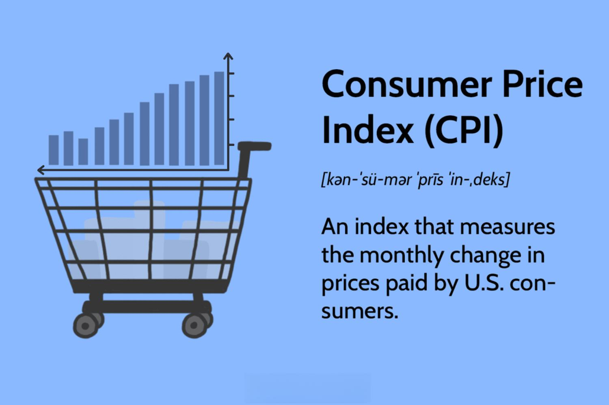

The Consumer Price Index (CPI) is a pivotal economic indicator devised to measure the average change over time in the prices paid by consumers for a standard basket of goods and services. Policymakers, economists, and financial professionals extensively rely on CPI data to gauge inflation, formulating monetary policies, and make informed economic decisions that affect both short-term consequences and long-term planning. Despite its integral role in economic analysis, the CPI is not without its controversies and has sparked numerous debates over its methodology and accuracy. These debates underscore the complexity of accurately measuring inflation and the inevitable impact of CPI data on the broader economy and financial markets.

Understanding controversies surrounding the CPI is vital, as its readings have significant implications for economic indicators and algorithmic trading strategies. Discrepancies in CPI calculations can lead to misinterpretations of inflation trends, influencing interest rates and investment decisions. Inaccurate readings may therefore ripple through the economy, altering wage adjustments, social benefits, and tax brackets, thus affecting everyday economic realities for consumers and businesses.



This article aims to explore the core controversies tied to the CPI, examining how they influence economic indicators and algorithmic trading systems which depend on precise data parameters and timely updates. Recognizing these controversies is essential for gaining insights into the CPI's impact on financial markets and informing the development of robust, transparent, and effective economic tools.

## Table of Contents

## Understanding the Consumer Price Index

The Consumer Price Index (CPI) is a measure used to evaluate the average change over time in the prices paid by urban consumers for a market basket of consumer goods and services. This index is essential for understanding inflation and cost-of-living changes. The calculation process involves selecting a basket that represents the consumption habits of a typical urban household. This basket includes categories such as food, housing, apparel, transportation, medical care, recreation, education, and communication. Each category is assigned a weight that mirrors its relative importance in aggregate consumer spending.

To elaborate, the CPI is expressed as a formula:

$$
\text{CPI} = \frac{\text{Cost of Market Basket in a Given Year}}{\text{Cost of Market Basket in Base Year}} \times 100
$$

This formula facilitates clear comparisons between different time periods regarding how prices for the basket of goods and services have shifted. 

Policymakers and financial analysts utilize CPI data to adjust wages, benefits, and tax brackets, helping ensure that payments keep pace with inflation. These adjustments are crucial, as failure to account for inflation could erode purchasing power and living standards. 

Furthermore, economists rely on CPI as a gauge for evaluating the real value of economic indicators like Gross Domestic Product (GDP). By stripping out the inflation component from nominal figures, CPI helps economists assess true economic growth, thereby guiding monetary policy decisions.

However, challenges arise with the CPI due to certain limitations. A prominent critique centers on its inability to immediately reflect substitution effects. When prices for a specific item rise, consumers may substitute it with a cheaper alternative. If the CPI basket isn't adjusted promptly to account for this behavior, it might overestimate the cost of living increases. Moreover, adjustments for changes in product quality can be contentious, as determining how much of a price increase is attributable to quality improvements versus inflation isn't always straightforward.

As such, while the CPI remains a fundamental instrument for economic analysis and policy formulation, awareness of its inherent limitations is necessary for accurate interpretation. This understanding helps stakeholders refine the CPI methodology for more precise inflation measurement, thus enhancing its reliability as an economic indicator.

## Key Controversies Surrounding the CPI

One major controversy related to the Consumer Price Index (CPI) is known as substitution bias. This occurs when consumers alter their purchasing habits, opting for cheaper alternatives as prices for certain goods and services rise. The CPI traditionally measures a fixed basket of goods, which may not immediately account for such changes in consumer behavior. This can lead to an overestimation of inflation, as the index does not reflect the cost-saving adjustments consumers actually make. For example, if the price of beef rises significantly, many consumers might switch to buying chicken, which is not immediately reflected in the CPI calculations.

Quality change adjustments also present challenges. When product improvements are made, the increased quality can distort the perceived change in price. For instance, a new model of a smartphone may have a higher price due to superior features rather than inflationary pressure. The CPI aims to adjust for these quality changes, but accurately quantifying the value of improvements is complex and sometimes subjective, potentially skewing the inflation rate derived from the CPI.

Another point of contention is the selection of the base year and the subsequent weighting of various items in the index. The base year is a benchmark year against which price changes are measured, and it can significantly impact the observed inflation rate. Additionally, the weights assigned to different goods and services in the CPI basket are based on their relative importance in a typical consumer's expenditure. Disagreements arise over both the choice of the base year and how current consumption patterns are represented, leading to debates among economists and policymakers. Adjusting these weights is essential to maintain an accurate reflection of real-world consumption, but it also introduces subjectivity and potential bias into the CPI calculations.

## Impact of CPI Controversies on Economic Indicators

The Consumer Price Index (CPI) plays a pivotal role in shaping economic strategies and decisions at various levels. However, inaccuracies and controversies surrounding the CPI can significantly impact economic indicators and policy decisions, with far-reaching consequences.

Firstly, inaccuracies in CPI reporting can lead to distorted assessments of inflation. Since the CPI is often used as a basis for calculating inflation rates, a misrepresented CPI figure can result in an inaccurate portrayal of inflationary pressures within an economy. This misrepresentation can influence interest rates set by central banks, as they rely on accurate inflation data to determine appropriate monetary policy. For example, if inflation is underestimated due to CPI inaccuracies, interest rates might be set too low, potentially overheating the economy.

Investment strategies are also affected by CPI discrepancies. Investors and financial analysts use inflation data to guide their investment decisions, particularly in bonds and other fixed-income securities. An inaccurate CPI can lead to miscalculations of real interest rates, which are defined as:

$$
\text{Real Interest Rate} = \text{Nominal Interest Rate} - \text{Inflation Rate}
$$

If the inflation rate is understated, it could result in overvaluing or undervaluing investments, thus impacting portfolio allocations and returns.

Additionally, government expenditure plans and budgeting processes rely heavily on precise CPI data. Public sector wages, social security benefits, and other indexed government outlays are often adjusted based on inflation estimates derived from the CPI. Errors in CPI reporting can lead to either a shortfall or an excess in allocated funds, thus affecting public services and fiscal sustainability.

The reliability of other economic indicators that depend on the CPI, such as the inflation rate and real Gross Domestic Product (GDP), is also compromised. Real GDP, which adjusts nominal GDP for inflation, uses the CPI to measure price level changes. Incorrect CPI calculations can therefore lead to skewed perceptions of economic growth and productivity, misguiding both policy and market expectations.

In summary, the controversies and inaccuracies associated with the Consumer Price Index can misinform a wide range of economic and financial decisions, from personal savings and investment strategies to national economic policies. It is essential to improve the accuracy and transparency of CPI calculations to ensure reliable economic planning and forecasting.

## CPI and Algorithmic Trading

Algorithmic trading is significantly influenced by the accuracy and timeliness of economic data releases, with Consumer Price Index (CPI) announcements playing a vital role. These announcements are pivotal events, triggering [algorithmic trading](/wiki/algorithmic-trading) models to make decisions based on the anticipated economic conditions indicated by the CPI. The precision of such data is crucial, as even slight discrepancies or adjustments can have profound effects on trading strategies and market behavior.

CPI controversies, such as those involving substitution bias or quality change adjustments, introduce an element of uncertainty that can result in unexpected market [volatility](/wiki/volatility-trading-strategies). For instance, if the reported CPI deviates significantly from market expectations due to these biases, it can trigger abrupt price movements. This volatility poses risks for algorithmic trading models, which are built on the assumption of accurate and timely data. Trading algorithms are configured to respond to economic indicators with well-defined parameters, and anomalies in CPI data can lead to unforeseen losses or missed opportunities if these models are not calibrated to handle such discrepancies.

To mitigate these risks, traders and developers must incorporate mechanisms that account for potential inconsistencies in CPI data. This can involve implementing additional analytics to assess the likelihood and impact of data anomalies, or coding algorithms to incorporate a buffer to absorb unexpected volatility. Below is a simple conceptual example in Python that shows how a trading algorithm might adjust its responses based on CPI discrepancies:

```python
def adjust_trading_strategy(cpi_announcement, expected_cpi):
    discrepancy = cpi_announcement - expected_cpi
    if abs(discrepancy) > threshold:
        adjust_parameters(discrepancy)
    execute_trading_logic()

def adjust_parameters(discrepancy):
    # Adjust risk levels, hedge ratios, or other parameters
    if discrepancy > 0:
        # Example: CPI higher than expected, possibly indicating higher inflation
        increase_risk_aversion()
    else:
        # Example: CPI lower than expected
        seize_opportunistic trades()

threshold = 0.2  # Define a suitable threshold for CPI discrepancy
cpi_announcement = get_latest_cpi()
expected_cpi = model_expected_cpi()

adjust_trading_strategy(cpi_announcement, expected_cpi)
```

In summary, while CPI announcements are critical to algorithmic trading, controversies surrounding its calculation introduce significant challenges. Traders and developers must remain vigilant and adapt their strategies to protect against the inherent risks posed by CPI-related volatility, ensuring that their trading models remain robust and profitable.

## Conclusion

The controversies surrounding the Consumer Price Index (CPI) underscore the inherent complexities in accurately measuring inflation and the subsequent effects on the economy. Despite its critical role in economic analysis, the limitations of the CPI, such as substitution bias and quality adjustments, provoke significant debate. These issues highlight the importance of comprehending the CPI's intricacies to mitigate potential misinterpretations affecting monetary policy and economic indicators.

Improving the measurement methods and increasing transparency in CPI calculations can enhance its effectiveness. For instance, adopting methods to more dynamically adjust the market basket reflecting real-time consumption changes could minimize biases. Additionally, incorporating technological advancements in data collection and analysis, such as [machine learning](/wiki/machine-learning) techniques, can streamline the process, allowing for more precise tracking of price changes over time.

Ultimately, by addressing these concerns, policymakers and economists can ensure the CPI remains a robust tool for informed decision-making, fostering stability and confidence in financial markets. Enhanced accuracy in the CPI will lead to better predictions of inflation trends, aiding in the formulation of sound economic policies and strategies that directly impact both individuals and broader economic structures.

## References & Further Reading

[1]: Wynne, M. A. & Sigalla, F. D. (1994). ["The Consumer Price Index"](https://www.researchgate.net/publication/5029912_The_consumer_price_index). Federal Reserve Bank of Dallas Economic Review.

[2]: Schultze, C. L. & Mackie, C. (Eds.). (2002). ["At What Price?: Conceptualizing and Measuring Cost-of-Living and Price Indexes"](https://archive.org/details/atwhatpriceconce0000unse). National Academies Press.

[3]: Boskin, M. J., Dulberger, E. R., Gordon, R. J., Griliches, Z., & Jorgenson, D. W. (1996). ["Toward a More Accurate Measure of the Cost of Living"](https://www.scholars.northwestern.edu/en/publications/consumer-prices-the-consumer-price-index-and-the-cost-of-living). Final Report to the Senate Finance Committee from the Advisory Commission to Study the Consumer Price Index.

[4]: Watson, R. (2016). ["Understanding the CPI: A Lesson Plan"](https://asia.themyersbriggs.com/wp-content/uploads/2016/09/CPI260_with_Watson-Glaser.pdf). U.S. Bureau of Labor Statistics.

[5]: Raj, M., Aggarwal, N., & Vij, M. (2020). ["Algorithmic Trading: Concepts and Application"](https://www.researchgate.net/publication/361296526_Fabrication_and_mechanical_characterization_of_hybrid_composite_reinforced_with_nanoparticles_of_alumina_and_zirconia). CRC Press.