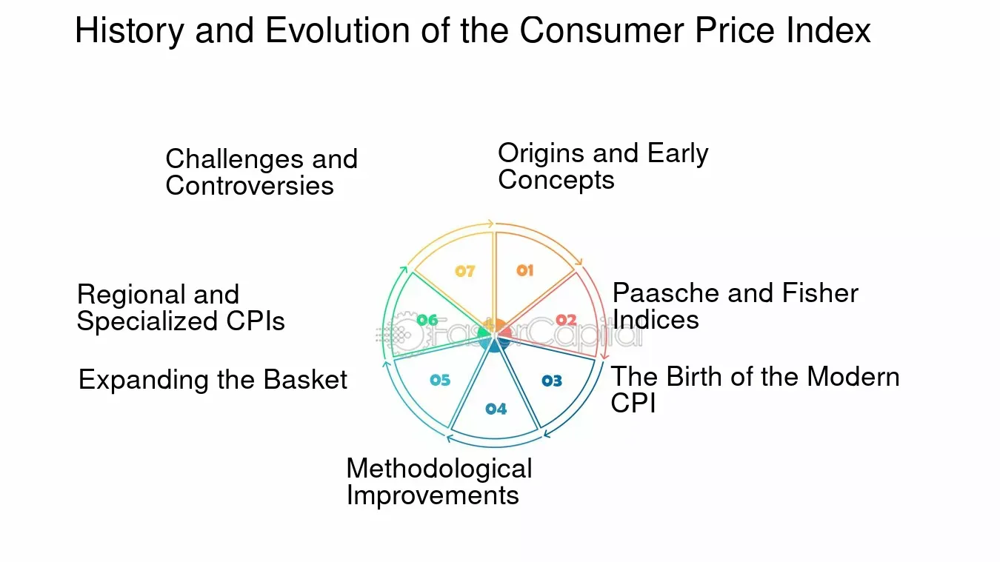

## Table of Contents

## What is the Consumer Price Index (CPI)?

The Consumer Price Index, or CPI, is a measure that tracks the average change over time in the prices paid by urban consumers for a market basket of goods and services. This includes things like food, housing, transportation, and medical care. The CPI is calculated by taking price changes for each item in the basket and averaging them. It's often used to understand inflation, which is the general increase in prices over time.

Governments and economists use the CPI to make important decisions. For example, it helps set monetary policy, adjust wages, and change benefits like Social Security. When the CPI goes up, it usually means that prices are rising and people's money can buy less than before. This is why the CPI is sometimes called a cost-of-living index. It's an important tool for understanding how the economy affects everyday life.

## How is the CPI calculated?

The CPI is calculated by looking at the prices of a bunch of different things that people buy, like food, clothes, and rent. First, people from the government go out and check the prices of these items in stores all over the country. They do this every month to see how prices have changed. Then, they put all these prices together in a big list called a "market basket." This basket is supposed to be like what a typical family buys.

After they have the prices, they figure out how much the total cost of the basket has changed from last month. They do this by comparing the new total cost to the old total cost. If the new total is higher, it means prices have gone up. They then turn this change into a percentage, which is the CPI. This percentage tells us how much, on average, prices have changed for the things people buy.

## Why is the CPI important for measuring inflation?

The CPI is really important for measuring inflation because it shows how the prices of things that people buy every day are changing. Inflation means that prices are going up over time, and the CPI helps us see this by looking at a big list of items, like food, clothes, and rent. When the CPI goes up, it means that, on average, these things are costing more money than they did before. This helps us understand if our money can buy less stuff than it used to.

Governments and people who study the economy use the CPI to make decisions. For example, if the CPI is going up a lot, it might mean that inflation is high, and the government might need to do something to slow it down. Also, the CPI helps set things like wages and benefits. If prices are going up, wages might need to go up too, so people can still afford to buy what they need. That's why the CPI is such a big deal for understanding inflation and how it affects our lives.

## What are some common criticisms of the CPI?

One common criticism of the CPI is that it might not always show the true cost of living. Some people say that the CPI doesn't include all the things that people really need to buy. For example, it might not count the costs of things like health care or education in the right way. Also, the CPI uses a fixed list of items, but what people buy can change over time. If people start buying different things, the CPI might not keep up with these changes.

Another criticism is that the CPI might not reflect how people change their spending when prices go up. When something gets more expensive, people might buy less of it or find cheaper options. The CPI doesn't always take this into account, so it might make inflation seem higher than it really is for people. This can be a problem because it can affect big decisions like setting wages or adjusting benefits.

Some people also think that the way the CPI is calculated can be too complicated and hard to understand. They worry that small changes in how the CPI is figured out can make a big difference in the final number. This can make it hard for people to trust the CPI as a good measure of inflation.

## How does the CPI affect government policies and social security adjustments?

The CPI is really important for the government because it helps them make decisions about money and rules. When the CPI goes up, it means that prices are going up, which is called inflation. The government uses the CPI to decide if they need to change how much money is in the economy. If inflation is too high, they might raise interest rates to slow it down. They also use the CPI to figure out if they need to change things like taxes or how much money they spend on programs.

The CPI also affects Social Security. Every year, the government looks at the CPI to see if they need to give more money to people who get Social Security benefits. This is called a Cost of Living Adjustment, or COLA. If the CPI shows that prices have gone up a lot, then Social Security payments might go up too. This helps make sure that people can still afford to buy what they need, even if prices are higher. So, the CPI is a big deal for both government policies and making sure people have enough money to live on.

## Can the CPI be manipulated, and if so, how?

Yes, the CPI can be manipulated, but it's not easy because a lot of people watch it closely. One way it could be manipulated is by changing what's in the "market basket" of goods and services that the CPI measures. If someone wanted to make inflation look lower, they could take out items that are getting more expensive and put in items that are not changing much in price. But, this would be hard to do without people noticing because the list of items is supposed to reflect what people actually buy.

Another way the CPI could be manipulated is by changing how the prices are collected or calculated. For example, if someone wanted to make the CPI look lower, they could choose to collect prices from stores where things are cheaper, or they could use a different way to average the prices that makes the overall number smaller. But, again, these changes would be hard to hide because the methods used to calculate the CPI are watched by many experts and the public.

## What alternative measures to the CPI exist, and how do they differ?

There are other ways to measure inflation besides the CPI. One of these is the Personal Consumption Expenditures Price Index, or PCE. The PCE looks at what people spend their money on, not just what they buy. This means it includes things like how much people spend on health care and education, even if they don't buy these things directly. The PCE also changes the list of things it measures more often than the CPI, so it can keep up with what people are actually spending money on. Because of these differences, the PCE can sometimes show a different picture of inflation than the CPI.

Another alternative is the GDP Deflator. This measure looks at the prices of all the goods and services that make up the country's total economic output, or Gross Domestic Product (GDP). The GDP Deflator is different from the CPI because it includes things that businesses buy, not just what people buy. It also changes the list of things it measures every time new data comes in, so it can be more up-to-date than the CPI. This makes the GDP Deflator useful for understanding inflation across the whole economy, not just for consumers.

Both the PCE and the GDP Deflator give a different view of inflation compared to the CPI. They can be helpful for understanding how prices are changing in different parts of the economy. While the CPI focuses on what urban consumers buy, the PCE and GDP Deflator look at broader spending and economic activity. This means they can sometimes show different rates of inflation, which can be important for making economic decisions.

## How do changes in consumer behavior impact the accuracy of the CPI?

Changes in what people buy can make the CPI less accurate. The CPI uses a fixed list of things, called a "market basket," to measure how prices are changing. But if people start buying different stuff, like switching from beef to chicken because it's cheaper, the CPI might not catch these changes right away. This can make the CPI seem like it's showing the wrong amount of inflation, because it's not looking at what people are actually spending their money on now.

To fix this problem, the people who make the CPI try to update the list of things they measure every few years. They do surveys to see what people are buying and change the basket to match. But even with these updates, the CPI can still be a bit off because consumer behavior can change really fast. So, while the CPI is a good tool, it's important to remember that it might not always show the full picture of how prices are affecting people's lives.

## What role does the CPI play in wage negotiations and cost of living adjustments?

The CPI is really important when people talk about how much they should get paid. When workers and their bosses are trying to decide on wages, they often look at the CPI. If the CPI shows that prices are going up a lot, workers might ask for more money so they can still afford to buy the things they need. This is called a cost of living adjustment, or COLA. The CPI helps both sides figure out a fair amount to adjust wages, so workers can keep up with rising prices.

The CPI also helps with setting cost of living adjustments for things like Social Security. Every year, the government looks at the CPI to see if they need to give more money to people who get Social Security benefits. If the CPI shows that prices have gone up, then Social Security payments might go up too. This helps make sure that people who rely on these benefits can still afford to live, even if everything is getting more expensive. So, the CPI is a big deal for making sure wages and benefits keep up with the cost of living.

## How have historical revisions to the CPI methodology affected its reliability?

Over the years, the way the CPI is calculated has changed a few times. These changes were made to make the CPI more accurate and up-to-date. For example, they started using new ways to figure out what people are buying and how prices are changing. They also started updating the list of things in the market basket more often. These changes were meant to make the CPI better at showing how inflation is really affecting people. But, when the method changes, it can be hard to compare the new CPI numbers to the old ones. This can make it seem like the CPI is less reliable because the numbers might look different even if inflation hasn't really changed.

Even though these changes can make the CPI seem less reliable at first, they usually make it better in the long run. The people who work on the CPI are always trying to make it more accurate. They want it to show a true picture of how prices are changing for things people buy. But, it's important for everyone to know about these changes so they understand why the CPI numbers might look different from year to year. Overall, these updates help the CPI stay a useful tool for understanding inflation and making decisions about money and policies.

## What are the international differences in CPI calculation and their implications?

Different countries calculate their CPI in slightly different ways, which can make it hard to compare inflation rates across the world. For example, some countries might include different things in their market basket, like more or less food, or different kinds of services. Also, the way they collect prices can be different. Some might check prices more often or in more places than others. These differences mean that the CPI in one country might not show the same level of inflation as another country, even if prices are going up at the same rate.

These differences can have big effects on how countries understand and deal with inflation. If a country's CPI shows lower inflation than another country's, it might affect how they set interest rates or make other economic decisions. It can also make it tricky for businesses that work in different countries to plan their prices and budgets. So, while the CPI is a useful tool everywhere, it's important to know about these differences when looking at inflation around the world.

## How do advanced statistical methods improve or challenge the traditional CPI?

Advanced statistical methods can make the CPI more accurate by helping to better understand how people spend their money. These methods can look at huge amounts of data from things like credit card purchases and online shopping to see exactly what people are buying and how prices are changing. This can help update the list of things in the market basket more often and make sure it matches what people are really buying. By using these methods, the CPI can show a more up-to-date and detailed picture of inflation, which can help governments and businesses make better decisions.

But these advanced methods can also make things more complicated. They can be hard to understand and explain to people who aren't experts in statistics. This can make it harder for people to trust the CPI numbers because they might not know how they were calculated. Also, if the methods change a lot, it can be tough to compare the new CPI numbers to the old ones. This means that while advanced statistical methods can improve the CPI, they also bring new challenges that need to be carefully managed to keep the CPI reliable and useful.

## What is the Consumer Price Index and how do we understand it?

The Consumer Price Index (CPI) is a measure used to evaluate the average change over time in the prices paid by urban consumers for a market basket of consumer goods and services. This index is essential for understanding inflation and cost-of-living changes. The calculation process involves selecting a basket that represents the consumption habits of a typical urban household. This basket includes categories such as food, housing, apparel, transportation, medical care, recreation, education, and communication. Each category is assigned a weight that mirrors its relative importance in aggregate consumer spending.

To elaborate, the CPI is expressed as a formula:

$$
\text{CPI} = \frac{\text{Cost of Market Basket in a Given Year}}{\text{Cost of Market Basket in Base Year}} \times 100
$$

This formula facilitates clear comparisons between different time periods regarding how prices for the basket of goods and services have shifted. 

Policymakers and financial analysts utilize CPI data to adjust wages, benefits, and tax brackets, helping ensure that payments keep pace with inflation. These adjustments are crucial, as failure to account for inflation could erode purchasing power and living standards. 

Furthermore, economists rely on CPI as a gauge for evaluating the real value of economic indicators like Gross Domestic Product (GDP). By stripping out the inflation component from nominal figures, CPI helps economists assess true economic growth, thereby guiding monetary policy decisions.

However, challenges arise with the CPI due to certain limitations. A prominent critique centers on its inability to immediately reflect substitution effects. When prices for a specific item rise, consumers may substitute it with a cheaper alternative. If the CPI basket isn't adjusted promptly to account for this behavior, it might overestimate the cost of living increases. Moreover, adjustments for changes in product quality can be contentious, as determining how much of a price increase is attributable to quality improvements versus inflation isn't always straightforward.

As such, while the CPI remains a fundamental instrument for economic analysis and policy formulation, awareness of its inherent limitations is necessary for accurate interpretation. This understanding helps stakeholders refine the CPI methodology for more precise inflation measurement, thus enhancing its reliability as an economic indicator.

## What is the impact of CPI controversies on economic indicators?

The Consumer Price Index (CPI) plays a pivotal role in shaping economic strategies and decisions at various levels. However, inaccuracies and controversies surrounding the CPI can significantly impact economic indicators and policy decisions, with far-reaching consequences.

Firstly, inaccuracies in CPI reporting can lead to distorted assessments of inflation. Since the CPI is often used as a basis for calculating inflation rates, a misrepresented CPI figure can result in an inaccurate portrayal of inflationary pressures within an economy. This misrepresentation can influence interest rates set by central banks, as they rely on accurate inflation data to determine appropriate monetary policy. For example, if inflation is underestimated due to CPI inaccuracies, interest rates might be set too low, potentially overheating the economy.

Investment strategies are also affected by CPI discrepancies. Investors and financial analysts use inflation data to guide their investment decisions, particularly in bonds and other fixed-income securities. An inaccurate CPI can lead to miscalculations of real interest rates, which are defined as:

$$
\text{Real Interest Rate} = \text{Nominal Interest Rate} - \text{Inflation Rate}
$$

If the inflation rate is understated, it could result in overvaluing or undervaluing investments, thus impacting portfolio allocations and returns.

Additionally, government expenditure plans and budgeting processes rely heavily on precise CPI data. Public sector wages, social security benefits, and other indexed government outlays are often adjusted based on inflation estimates derived from the CPI. Errors in CPI reporting can lead to either a shortfall or an excess in allocated funds, thus affecting public services and fiscal sustainability.

The reliability of other economic indicators that depend on the CPI, such as the inflation rate and real Gross Domestic Product (GDP), is also compromised. Real GDP, which adjusts nominal GDP for inflation, uses the CPI to measure price level changes. Incorrect CPI calculations can therefore lead to skewed perceptions of economic growth and productivity, misguiding both policy and market expectations.

In summary, the controversies and inaccuracies associated with the Consumer Price Index can misinform a wide range of economic and financial decisions, from personal savings and investment strategies to national economic policies. It is essential to improve the accuracy and transparency of CPI calculations to ensure reliable economic planning and forecasting.

## References & Further Reading

[1]: Wynne, M. A. & Sigalla, F. D. (1994). ["The Consumer Price Index"](https://www.researchgate.net/publication/5029912_The_consumer_price_index). Federal Reserve Bank of Dallas Economic Review.

[2]: Schultze, C. L. & Mackie, C. (Eds.). (2002). ["At What Price?: Conceptualizing and Measuring Cost-of-Living and Price Indexes"](https://archive.org/details/atwhatpriceconce0000unse). National Academies Press.

[3]: Boskin, M. J., Dulberger, E. R., Gordon, R. J., Griliches, Z., & Jorgenson, D. W. (1996). ["Toward a More Accurate Measure of the Cost of Living"](https://www.scholars.northwestern.edu/en/publications/consumer-prices-the-consumer-price-index-and-the-cost-of-living). Final Report to the Senate Finance Committee from the Advisory Commission to Study the Consumer Price Index.

[4]: Watson, R. (2016). ["Understanding the CPI: A Lesson Plan"](https://asia.themyersbriggs.com/wp-content/uploads/2016/09/CPI260_with_Watson-Glaser.pdf). U.S. Bureau of Labor Statistics.

[5]: Raj, M., Aggarwal, N., & Vij, M. (2020). ["Algorithmic Trading: Concepts and Application"](https://www.researchgate.net/publication/361296526_Fabrication_and_mechanical_characterization_of_hybrid_composite_reinforced_with_nanoparticles_of_alumina_and_zirconia). CRC Press.