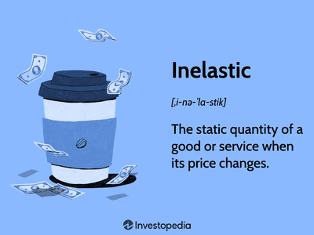

In today's fast-paced world, the shopping behaviors of consumers are intricately shaped by a combination of psychological elements and technological progress. Consumer psychology investigates into how individuals' thoughts, beliefs, emotions, and perceptions influence their purchasing decisions. Businesses keen on adapting to rapidly evolving market dynamics must understand these psychological drivers to predict and cater to consumer needs effectively.

Convenience goods, on the other hand, are ubiquitous products that require minimal effort and thought during purchase. These often include everyday essentials such as snacks, beverages, and household products. Their role in daily shopping routines is significant, as their low cost and wide availability make them frequent subjects of impulse buying. This behavior is often influenced by psychological triggers like habit formation and the pursuit of instant gratification.



On a different frontier, algorithmic trading showcases the interplay between technology and consumer behavior by facilitating high-speed trading decisions driven by complex algorithms. These systems minimize the emotional variances typical in human-driven trading, relying instead on data analysis to forecast market movements. The integration of psychological insights with such technologically driven methods offers businesses a unique vantage point, enhancing their ability to innovate and remain competitive in both retail and financial markets.

The exploration of these interconnected themes—consumer psychology, convenience goods, and algorithmic trading—reveals the complexities underlying modern shopping and investing habits. Understanding these components is key for businesses aiming not just to survive but to thrive, as they seek to craft marketing strategies and product offerings that align with evolving consumer expectations and technological advancements.

## Table of Contents

## Understanding Consumer Psychology

Consumer psychology is an interdisciplinary field that examines the myriad ways in which thoughts, beliefs, emotions, and perceptions influence purchasing behavior. This discipline draws from principles in psychology, sociology, and marketing to understand how consumers make decisions and what factors drive these decisions. Businesses, particularly in competitive markets, rely heavily on insights from consumer psychology to tailor their marketing strategies, optimize product offerings, and enhance customer experiences.

A primary [factor](/wiki/factor-investing) influencing consumer behavior is motivation, which refers to the internal processes that energize and direct consumer activities. Motivation can be driven by various needs, such as physiological (e.g., hunger and thirst), safety, social belonging, esteem, and self-fulfillment. The Hierarchy of Needs, proposed by Abraham Maslow, is often utilized to understand motivation hierarchically, suggesting that individuals progress from fulfilling basic needs to more complex psychological desires.

Perception plays a crucial role in consumer decision-making. It involves the process through which consumers select, organize, and interpret information to form a meaningful picture of the world. Perceptions are shaped by factors such as past experiences, individual expectations, and cultural influences. For example, the perception of a brand's quality can significantly affect a consumer's decision to purchase its products, as well as their willingness to pay a premium price.

Social influences encompass the role of family, friends, and social networks in shaping consumer preferences and behavior. Social factors can impact buying patterns through peer pressure, word-of-mouth recommendations, and social norms. In contemporary settings, social media platforms amplify social influences by facilitating the rapid exchange of information and opinions about products and brands.

Psychological drivers are particularly significant when considering convenience goods. These are items that consumers purchase frequently with little thought or effort, such as snacks, beverages, and toiletries. Due to the trivial nature and low cost of these items, consumers often make purchasing decisions based on habit or emotional triggers, such as the need for instant gratification or the influence of advertising. Research suggests that around 40% of consumer actions are driven by habits rather than deliberate decision-making processes.[^1]

By understanding these psychological mechanisms, businesses can devise strategies that align with consumer expectations and desires—whether through designing effective advertising campaigns, leveraging pricing strategies, or improving product accessibility. For instance, companies often employ promotional tactics such as buy-one-get-one-free offers to capitalize on consumer impulsivity associated with convenience goods. Moreover, incorporating consumer psychology insights can aid organizations in building strong brand loyalty by ensuring their offerings resonate emotionally with their target audience.

In conclusion, consumer psychology provides powerful tools for understanding and predicting consumer behavior. As markets continue to evolve with technological advancements, businesses that effectively harness these insights can anticipate consumer needs more accurately and achieve a competitive edge.

[^1]: Wood, W., & Neal, D. T. (2009). The habitual consumer. Journal of Consumer Psychology, 19(4), 579-609.

## The Role of Convenience Goods

Convenience goods are products that are essential in daily life, characterized by their ease of access and low-cost nature. These items, such as beverages, snacks, and various household essentials, are typically purchased with minimal effort and thought. The consumer's decision-making process regarding these goods is often quick and driven by routine.

The inherent characteristics of convenience goods make them particularly prone to impulse buying. Impulse buying is often driven by psychological triggers including habits and the desire for immediate satisfaction. For example, the habit of purchasing a specific brand of coffee can lead a consumer to buy it without extensive deliberation, driven by familiarity and routine.

Considering the psychology behind purchasing convenience goods, businesses can enhance their strategies by focusing on pricing and promotion tactics that cater to these automatic purchasing patterns. For instance, strategic placement of products in stores can capitalize on consumers' impulse buying tendencies. Furthermore, promotions such as buy-one-get-one-free offers can encourage consumers to purchase even more, as these deals tap into the psychological appeal of getting added value.

By understanding the variables influencing the sales of convenience goods, such as time of day, location, and consumer habits, businesses can improve their pricing strategies. For example, increasing the visibility of certain products during peak hours could boost sales. Additionally, companies might develop loyalty programs that reward repeated purchases, effectively reinforcing habits.

Through these approaches, businesses can enhance customer experiences, ensuring that consumers return for both convenience and satisfaction. The strategic management of convenience goods not only supports immediate sales but also fosters long-term consumer loyalty by aligning offerings with habitual purchasing behaviors.

## Algorithmic Trading and Consumer Behavior

Algorithmic trading, also known as algo trading, utilizes computer algorithms to execute financial trades at speeds and frequencies beyond human capability. By relying on pre-set criteria and complex algorithms, this approach minimizes emotion-based decision-making, which traditionally influences human traders. Instead, [algorithmic trading](/wiki/algorithmic-trading) employs data-driven analysis to capitalize on market inefficiencies and trends, thereby creating a trading environment that is largely governed by technology.

The primary advantage of algorithmic trading is its ability to process vast amounts of data rapidly, enabling traders to react to market conditions with unprecedented speed. Algorithms can instantly analyze indicators such as price movements, economic signals, and trading volumes to make informed decisions. For example, if a trading algorithm is programmed to buy a stock when it dips by 2% from its average price, it can execute the trade instantaneously when this condition is met. This replaces manual, time-consuming decision-making and mitigates the potential for human error.

**Example of a Basic Trading Algorithm in Python:**

```python
def simple_moving_average(prices, window):
    return sum(prices[-window:]) / window

def buy_signal(prices, window):
    current_price = prices[-1]
    sma = simple_moving_average(prices, window)
    return current_price < sma * 0.98  # Buy if current price is 2% below the moving average

def execute_trade(prices, window):
    if buy_signal(prices, window):
        print("Buying signal generated.")
    else:
        print("No buying signal.")
```

This script demonstrates a basic trading strategy using a simple moving average as a buy signal. Such algorithms can be expanded with more complex data analysis techniques like [machine learning](/wiki/machine-learning) to enhance their predictive power.

While convenience goods purchasing decisions are typically driven by psychological factors such as impulse and habit, algorithmic trading is strictly data-centric. This distinction illuminates a broader trend of decision-making increasingly guided by advanced technology. By reducing emotional bias in trading, algorithmic strategies not only aim for profitability but also offer a systematic approach to managing financial assets.

However, the reliance on technology-based trading strategies introduces new dynamics to financial markets. Markets become more efficient with the reduction of [arbitrage](/wiki/arbitrage) opportunities but also face challenges like "flash crashes" — rapid, deep, and volatile market drops resulting from automated trades. Thus, understanding the balance between technology and human oversight is crucial for developing robust investment strategies.

The symbiosis of human psychology with technological advancement in algorithmic trading creates a sophisticated landscape for financial markets. As algorithms evolve, they provide insights into market dynamics and foster more strategic, less emotionally driven investment decisions, underscoring the transformative role of technology in contemporary finance.

## The Intersection of Convenience Goods and Algo Trading

At first glance, convenience goods and algorithmic trading appear to operate in entirely separate realms. Convenience goods are everyday items like snacks and beverages, typically purchased with little thought or planning. In contrast, algorithmic trading involves complex computer programs executing high-frequency trades in financial markets based on pre-defined criteria. Despite their differences, both are deeply influenced by consumer behavior, albeit in distinct manners.

The quick decision-making process that characterizes the purchasing of convenience goods is driven largely by psychological factors such as habit, impulsivity, and the need for instant gratification. These purchases usually occur in environments where speed and ease of access are prioritized, emphasizing the consumer's desire for efficiency in their shopping experience. Similarly, algorithmic trading is designed for rapid execution, driven by the need to capitalize on immediate market opportunities with minimal human intervention. This speed and efficiency are achieved through the use of complex algorithms capable of processing large volumes of data and executing trades in fractions of a second.

The parallels between the two sectors showcase how speed and efficiency are paramount in driving consumer actions, whether in the form of quick grocery pickups or high-frequency trades. In both instances, the reliance on technology and behavioral cues informs the decision-making process, enabling a seamless experience for the end-user.

Exploring these connections offers valuable insights for businesses aiming to innovate and adapt by leveraging consumer psychology alongside advanced trading techniques. For example, companies can employ data analytics to understand consumer purchase patterns in convenience goods, potentially predicting future demands and optimizing inventory levels. Similarly, insights from consumer behavior can enhance the development of more sophisticated algorithms in financial trading, ensuring that market strategies align with investor psychology and preferences.

Ultimately, by merging the principles guiding consumer behavior in convenience goods with the technological advancements in algorithmic trading, businesses can enhance operational efficiencies and offer more tailored solutions to their customers. The intersection of these two seemingly disparate fields underscores the significant role that consumer behavior plays across different sectors, driving strategic decisions and fostering innovation.

## Impact on Marketing Strategies

The insights from consumer psychology and algorithmic trading present substantial opportunities for enhancing marketing strategies across different sectors, especially for brands dealing with convenience goods and financial products. Understanding the psychological drivers behind consumer impulses can significantly inform promotional campaigns tailored to convenience goods. Limited-time offers, for instance, can exploit the psychological phenomenon known as FOMO (Fear of Missing Out), an influential motivator that often leads to impulsive buying. This approach leverages the consumer's fear of losing out on an advantage or deal, thereby stimulating immediate purchases and enhancing sales [volume](/wiki/volume-trading-strategy).

For instance, a supermarket chain might initiate a flash sale on essential items that lasts only a few hours. By alerting consumers through targeted social media and mobile notifications, the brand can create a sense of urgency that prompts immediate action, thereby increasing foot traffic and driving sales.

In the context of algorithmic trading, the use of consumer data facilitates the development of personalized investment solutions that align with individual risk profiles and financial goals. This data-driven approach enables financial institutions to offer tailored investment strategies

## Conclusion

The interconnection between convenience goods, consumer psychology, and algorithmic trading highlights the intricate landscape of modern shopping and investment behaviors. By examining these interconnected elements, businesses gain a deeper understanding of consumer needs, paving the way for more effective marketing strategies and product offerings. Convenience goods exemplify the simplicity yet impact of habitual purchase decisions, driven by psychological factors such as instant gratification and ease of access. Meanwhile, algorithmic trading represents the evolution of decision-making, where technology leverages data analytics to inform financial investments, minimizing emotional biases.

With the continuous advancement of technology, the integration of psychological insights and data-driven approaches is poised to shape the future of consumer and investor behavior significantly. Businesses that can successfully navigate this fusion will not only cater to existing customer expectations but will also anticipate future trends, providing personalized and innovative solutions that resonate with their audience. As competition intensifies across industries, the ability to adapt to these multifaceted dynamics becomes imperative for maintaining relevance and achieving success in the marketplace.

To harness the full potential of this interplay, businesses must embrace technological innovations while continually assessing and incorporating psychological factors into their strategies. This dual approach ensures a comprehensive understanding of consumer motivations and market fluctuations, ultimately allowing organizations to thrive amidst an ever-changing landscape. By leveraging these insights, businesses can enhance customer engagement, foster brand loyalty, and secure a competitive edge.

## References & Further Reading

[1]: Wood, W., & Neal, D. T. (2009). ["The habitual consumer."](https://www.researchgate.net/publication/228742060_The_habitual_consumer) Journal of Consumer Psychology, 19(4), 579-609.

[2]: Berger, J., & Fitzsimons, G. (2008). ["Dogs on the Street, Pumas on your Feet: How Cues in the Environment Influence Product Evaluation and Choice."](https://knowledge.wharton.upenn.edu/wp-content/uploads/2013/09/1351.pdf) Journal of Marketing Research, 45(1), 1-14.

[3]: Kahneman, D. (2011). ["Thinking, Fast and Slow,"](https://link.springer.com/article/10.1007/s00362-013-0533-y) Farrar, Straus and Giroux.

[4]: Tversky, A., & Kahneman, D. (1974). ["Judgment under Uncertainty: Heuristics and Biases."](https://www2.psych.ubc.ca/~schaller/Psyc590Readings/TverskyKahneman1974.pdf) Science, 185(4157), 1124-1131.

[5]: Barberis, N., & Thaler, R. (2003). ["A survey of behavioral finance."](https://www.nber.org/papers/w9222) Handbook of the Economics of Finance, 1, 1053-1128.