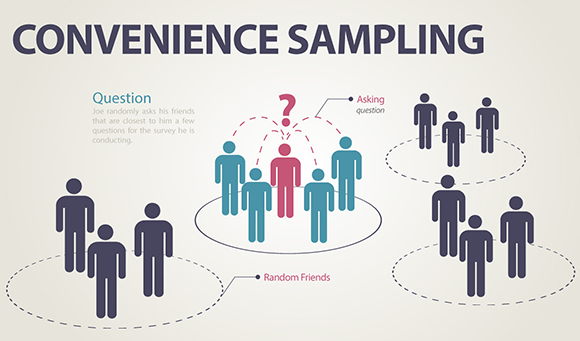

## Table of Contents

## What is convenience sampling in the context of machine learning?

Convenience sampling in machine learning is a method where data is collected from a group that is easy to access or reach. This type of sampling is often used because it's quick and doesn't require a lot of effort or resources. For example, if you're studying the behavior of online shoppers, you might choose to collect data from visitors to a particular website that you have easy access to. While this method is convenient, it can lead to biased results because the sample might not represent the whole population accurately.

The downside of convenience sampling is that it can affect the reliability of your machine learning models. If your data is not representative of the broader population, your model might perform well on the data you collected but poorly on new, different data. For instance, if you train a model to predict customer preferences using data from only one website, it might not work well for customers from other websites with different user demographics. To improve the model's performance, it's better to use more rigorous sampling methods, like random sampling, which can provide a more accurate picture of the entire population.

## How does convenience sampling differ from other sampling methods?

Convenience sampling is different from other sampling methods because it focuses on ease of access rather than representativeness. In convenience sampling, researchers collect data from whatever sources are readily available and easy to reach. This could mean surveying people in a shopping mall, using data from a specific website, or gathering information from a group that's easy to contact. The main goal is to get data quickly and with minimal effort. However, this method can lead to biased results because the sample might not represent the broader population accurately.

In contrast, other sampling methods like random sampling, stratified sampling, and cluster sampling aim to provide a more accurate representation of the population. Random sampling involves selecting individuals from the entire population in a way that each person has an equal chance of being chosen. This method helps ensure that the sample is representative of the whole population. Stratified sampling goes a step further by dividing the population into subgroups (strata) based on certain characteristics and then randomly sampling from each subgroup. This ensures that each important subgroup is represented in the sample. Cluster sampling involves dividing the population into clusters and then randomly selecting entire clusters to sample. Each of these methods is designed to reduce bias and increase the accuracy of the data collected, making them more reliable for machine learning models than convenience sampling.

## What are the advantages of using convenience sampling in machine learning projects?

Convenience sampling is really helpful in [machine learning](/wiki/machine-learning) projects because it is fast and easy to do. When you need data quickly, you can just collect it from people or places that are easy to reach. This means you don't have to spend a lot of time and money trying to get a perfect sample. For example, if you're building a model to predict what customers might buy, you could use data from your own website's visitors. This saves time and resources, which is great if you're working on a project with a tight deadline or limited budget.

Another advantage is that convenience sampling can be a good starting point for exploring new ideas. When you're just beginning a project, you might not know exactly what data you need. By using data that's easy to get, you can test your ideas and see if they work before you invest in more detailed data collection. This can help you figure out what's important and what's not, guiding you to collect better data later on. So, even though convenience sampling might not give you the best data, it can be a useful tool for getting started and learning as you go.

## What are the potential drawbacks or limitations of convenience sampling?

Convenience sampling can lead to biased results because it doesn't represent the whole population. When you only collect data from people who are easy to reach, you might miss out on important information from other groups. For example, if you only survey people at a shopping mall, you might not get data from people who don't shop there. This can make your machine learning model less accurate because it's trained on data that doesn't reflect everyone.

Another limitation is that convenience sampling can make it hard to generalize your findings. If your sample isn't a good representation of the population, the conclusions you draw from your data might not apply to other groups. This can be a big problem in machine learning, where you want your model to work well for everyone, not just the people in your sample. So, while convenience sampling is quick and easy, it might not give you the best results for your project.

## Can you provide an example of when convenience sampling might be used in a machine learning project?

Imagine you're working on a machine learning project to predict how long users will stay on a website. You want to get started quickly, so you decide to use data from the website's current visitors. This is an example of convenience sampling because you're using data that's easy to get. You don't have to spend time and money finding other people to survey; you can just use the data you already have.

While this method helps you get started fast, it might not give you the best results. If your website mainly attracts young people, your model might work well for them but not for older users. This means your predictions might not be accurate for everyone who visits the website. So, while convenience sampling is quick and easy, it's important to remember that it might not give you a complete picture of all your users.

## How does convenience sampling impact the generalizability of machine learning models?

Convenience sampling can make it harder for machine learning models to work well for everyone. When you use data that's easy to get, like from your own website's visitors, your model might be good at predicting things for those specific people. But if those people are not like everyone else who might use your website, your model won't work as well for them. For example, if your website is mostly visited by young people, your model might not predict well for older visitors.

This problem happens because convenience sampling doesn't give you a good mix of different kinds of people. If your data only comes from a small group, your model learns from that group and might not understand how other groups behave. This means your model's predictions might not be accurate for the whole population. To make your model better for everyone, it's important to use data from a wider range of people, even if it takes more time and effort.

## What steps can be taken to mitigate the biases introduced by convenience sampling?

To reduce the biases from convenience sampling, you can start by collecting more data from different groups of people. If you only have data from young people, try to get some from older people too. This way, your machine learning model can learn from a wider range of people and make better predictions for everyone. Another way is to use a method called stratified sampling. This means you divide your population into smaller groups based on important characteristics, like age or location, and then collect data from each group. This helps make sure your sample looks more like the whole population.

Another step is to use [data augmentation](/wiki/data-augmentation) techniques. This means you can create more data from what you already have by making small changes to it. For example, if you have images, you can flip them or change their brightness to make new images. This can help your model see different versions of the same thing and learn better. Finally, always check your model's performance on different groups of people. If it works well for some but not others, you know you need to collect more data from the groups it's not working well for. This way, you can keep improving your model to make it fair and accurate for everyone.

## How can the quality of data collected through convenience sampling be assessed?

To assess the quality of data collected through convenience sampling, you can start by checking if the data looks like what you expect. For example, if you're collecting data about people's ages, you should see a mix of different ages, not just one group. You can also look at how much the data varies. If everyone in your sample is very similar, your data might not be good enough to represent everyone. Another way to check is by comparing your data to other sources. If your data is very different from what others have found, it might be biased.

Another important step is to use statistical methods to see how reliable your data is. You can calculate things like the mean and standard deviation to understand the spread of your data. For example, if you're looking at ages, you might find the mean age $$ \bar{x} $$ and the standard deviation $$ s $$ to see how spread out the ages are. If the standard deviation is small, it means your data is not very varied, which can be a sign of bias. You can also use tools like histograms or box plots to see the distribution of your data visually. If the data looks skewed or has outliers, it might not be a good representation of the whole population.

Finally, you can test your machine learning model with your data to see how well it performs. If your model works well on the data you collected but poorly on new data, it's a sign that your sample might be biased. You can also split your data into training and testing sets to see if your model can predict well on data it hasn't seen before. If it can't, you might need to collect more varied data to improve your model's performance. By doing these checks, you can get a better idea of how good your convenience sampling data is and whether you need to collect more data to make your model more accurate.

## In what scenarios might convenience sampling be more appropriate than other sampling techniques?

Convenience sampling is more appropriate when you need to collect data quickly and don't have a lot of time or money. For example, if you're working on a project with a tight deadline, you might not have time to do a detailed survey of a large group of people. Instead, you can use data that's easy to get, like from people visiting your website or customers in your store. This way, you can start working on your machine learning model right away without waiting for more data.

Another scenario where convenience sampling might be better is when you're just starting to explore a new idea. If you're not sure what data you need, you can use convenience sampling to test your ideas with the data you have. This can help you figure out what's important and what's not, so you can plan better for collecting more detailed data later. While convenience sampling might not give you the best data, it can be a useful way to get started and learn as you go.

## How does the size of the sample affect the outcomes when using convenience sampling in machine learning?

The size of the sample can really change how well your machine learning model works when you use convenience sampling. If you have a small sample, your model might not learn enough about the different kinds of people it needs to predict for. For example, if you only have data from 100 people, your model might not see enough variety to understand how everyone behaves. This can make your predictions less accurate because your model is only good at guessing for the small group of people in your sample. A bigger sample, like 1000 people, can help your model learn more about different groups and make better predictions for everyone.

But even with a bigger sample, convenience sampling can still have problems. If your sample is still only from a small group of people, like visitors to one website, your model might not work well for people who are different from that group. So, while a larger sample can help, it's important to make sure your sample includes a good mix of different kinds of people. This way, your model can learn from a wider range of data and make more accurate predictions for everyone.

## What are some advanced statistical techniques that can be used to improve models trained on convenience samples?

One advanced statistical technique to improve models trained on convenience samples is called propensity score matching. This method helps balance the data by matching people in your sample with similar people in the broader population. For example, if your sample has more young people, you can use propensity scores to find older people who are similar in other ways, like income or location, and include them in your model. This can help make your sample more like the whole population and improve your model's accuracy. You can calculate propensity scores using logistic regression, where $$ P(X) = \frac{1}{1 + e^{-(\beta_0 + \beta_1 X_1 + ... + \beta_n X_n)}} $$ represents the probability of being in the sample based on different characteristics.

Another technique is using weighting methods, like inverse probability weighting. This method gives more importance to data from groups that are underrepresented in your sample. If your sample has fewer older people, you can give their data more weight so your model learns more from them. This can help balance out the biases in your sample and make your predictions more accurate for everyone. You can apply these weights in your machine learning model by adjusting the loss function or using libraries like scikit-learn in Python. For example, you might use code like this to apply weights:

```python
from sklearn.utils.class_weight import compute_sample_weight
weights = compute_sample_weight(class_weight='balanced', y=y_train)
model.fit(X_train, y_train, sample_weight=weights)
```

These techniques can help make your machine learning models better, even when you start with data from convenience sampling.

## How can machine learning practitioners ethically justify the use of convenience sampling in their research or applications?

Machine learning practitioners can ethically justify the use of convenience sampling by being transparent about its limitations and taking steps to address them. When they explain that they used convenience sampling because it was quick and easy, they should also mention that it might not represent everyone. This honesty helps others understand the results better and know when the findings might not apply. For example, if a model is trained on data from one website, the practitioners should say that the model might work well for that website's visitors but not for others. By being clear about these limitations, they can still use convenience sampling in a way that is fair and helpful.

Another way to justify convenience sampling ethically is by using it as a starting point and then improving the data over time. Practitioners can start with a convenience sample to test their ideas and get quick results. Then, they can collect more varied data to make their model better. For example, if they start with data from young people, they can later add data from older people to balance it out. By showing that they are working to improve their data and make their model more accurate for everyone, they can use convenience sampling responsibly. This approach helps build trust and shows a commitment to fairness and accuracy in their work.