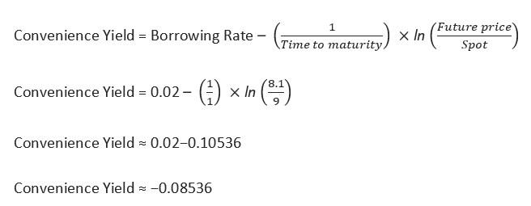

In the ever-evolving world of financial markets, gaining a comprehensive understanding of highly specialized concepts such as convenience yield and the varied methods of yield calculation is becoming increasingly important for effective trading and investment decisions. Convenience yield reflects the non-monetary benefits or strategic advantages associated with holding a physical asset as opposed to a derivative contract. Its significance is particularly pronounced in commodity markets where unpredictable price movements can make holding the physical asset more appealing.

Algorithmic trading, commonly known as algo trading, revolutionizes the trading landscape by utilizing automated systems to execute trades with unparalleled speed and precision. These systems are designed to analyze vast datasets, detect patterns, and respond to market signals with minimal human intervention, thus enhancing trading efficiency. By integrating insights from yield calculations, algorithmic trading systems can intelligently factor in variables such as interest rates and market volatilities. This integration allows for more informed and timely trading decisions, potentially maximizing returns while managing risks effectively.



This article explores the integration of these elements and provides insights valuable for traders, investors, and financial analysts. By examining the interplay between traditional financial metrics and advanced algorithmic systems, readers will gain a deeper understanding of how leveraging these tools can lead to optimized investment strategies and sustained competitive advantage in the financial markets.

## Table of Contents

## Understanding Convenience Yield

Convenience yield is a critical concept in the realm of commodity markets, representing the implicit value derived from physically holding a commodity as opposed to holding a future contract on the commodity. This yield is especially critical during conditions where physical availability or immediate access offers strategic advantages, such as protection against supply disruptions or benefiting from immediate sale in high-demand circumstances.

The primary significance of convenience yield lies in its application to commodities where physical possession can exert a greater return due to uncertain market conditions. Commodities such as oil, gold, and agricultural products often exhibit scenarios where convenience yield becomes an influential factor. During periods of market stress or increased uncertainty, the advantages of having immediate access to the physical commodity may outweigh the costs of storing and maintaining the asset.

Numerous factors influence convenience yield, including:

1. **Storage Costs**: The cost associated with storing a physical asset can directly impact the convenience yield. Lower storage costs can increase convenience yield by reducing the expenses of holding the commodity physically rather than owning a derivative contract. For instance, if the cost to store oil is low, the convenience yield is effectively higher.

2. **Scarcity**: When a commodity becomes scarce, its immediate availability becomes more valuable, increasing convenience yield. Scarcity may arise due to production limitations, geopolitical risks, or unexpected spikes in demand. For example, during a drought, the convenience yield of agricultural commodities such as wheat may rise due to reduced supply.

3. **Market Demand**: High demand for a physical commodity can enhance its convenience yield. This is often observed in markets where supply chain efficiency is crucial, and immediate asset transfer can capitalize on favorable prices or hedge against future price increases.

The mathematical relationship often used to express the components related to convenience yield in futures pricing is given by the Cost-of-Carry model:

$$
F = S \cdot e^{(r + c - y)t}
$$

where:
- $F$ is the futures price,
- $S$ is the spot price,
- $r$ is the risk-free rate,
- $c$ is the storage cost,
- $y$ is the convenience yield,
- $t$ is the time to maturity.

Through this equation, the convenience yield ($y$) is implicit within the pricing of futures contracts, reflecting its integral role in evaluating the benefits of holding physical commodities relative to derivative positions. Understanding and calculating convenience yield allows traders and investors to make more informed decisions in the commodities market.

## Yield Calculation Techniques

Yield calculation is a crucial component of investment analysis, helping investors assess the return on financial securities relative to their risk profile. This calculation is affected by various factors such as the type of asset, prevailing market conditions, interest rates, and the creditworthiness of the issuer.

### Types of Yield

#### Current Yield
Current Yield is a simple measure that calculates the annual return on an investment based on its current price. It is defined by the following formula:

$$
\text{Current Yield} = \frac{\text{Annual Coupon Payment}}{\text{Current Market Price}}
$$

This yield is commonly used for bonds, providing investors with insight into the income generated from their investment relative to its purchase price.

#### Yield to Maturity (YTM)
Yield to Maturity is a more comprehensive metric that assumes the investor holds the bond until its maturity date, with all coupon payments reinvested at the same rate. YTM is the internal rate of return (IRR) for an investor if the bond is held until maturity. It accounts for the bond's current market price, par value, coupon [interest rate](/wiki/interest-rate-trading-strategies), and time to maturity. The YTM is determined by solving the following equation:

$$
\text{Price} = \sum_{t=1}^{n} \frac{C}{(1 + YTM)^t} + \frac{F}{(1 + YTM)^n}
$$

where $C$ is the annual coupon payment, $F$ is the face value of the bond, and $n$ is the number of years until maturity.

#### Yield to Call (YTC)
Yield to Call applies to callable bonds, which can be redeemed by the issuer before the maturity date. It calculates the yield assuming the bond will be called at the earliest possible date. The calculation method is similar to YTM but replaces the maturity term with the call date and adjusts the redemption value to the call price.

#### Yield to Worst (YTW)
Yield to Worst is the lowest yield an investor can receive if the issuer decides to call the bond before maturity. It considers all call dates and calculates the yield for each, thereby protecting investors from potential early redemption that might affect returns adversely. The lowest resulting yield is the YTW, ensuring analysis in the worst-case scenario.

### Advanced Yield Calculations

Advanced yield calculations consider risk-adjusted and implied yields that offer a deeper understanding of potential returns.

#### Risk-Adjusted Yield
Risk-Adjusted Yield modifies the expected return by accounting for the investment's risk. This involves adjusting the nominal yield using metrics such as the Sharpe Ratio, which considers the excess return per unit of risk. Risk-adjusted returns are essential for comparing investments with different risk profiles.

$$
\text{Sharpe Ratio} = \frac{R_p - R_f}{\sigma_p}
$$

where $R_p$ is the expected portfolio return, $R_f$ is the risk-free rate, and $\sigma_p$ is the standard deviation of the portfolio's excess return.

#### Implied Yield
Implied Yield involves determining the yield on a security derived from theoretical models or existing market data. It is often used to evaluate derivatives or options by employing mathematical models, such as the Black-Scholes model, to calculate potential yields based on anticipated market movements.

Through these calculations, investors and financial analysts gain comprehensive insights into the performance and potential returns on various securities, providing essential data for informed investment decisions. Yield calculation serves as a foundational tool for investment analysis, integrating with other financial metrics to analyze the viability and attractiveness of securities.

## The Role of Algorithmic Trading

Algorithmic trading uses automated systems and algorithms to execute trading strategies with enhanced speed and precision. These systems are designed to capitalize on market conditions and yield calculations to maximize trading efficiency and minimize human error in decision-making processes. By leveraging large datasets, [algorithmic trading](/wiki/algorithmic-trading) systems can process information and identify trading opportunities more swiftly than human traders.

The integration of datasets and complex algorithms allows for high-frequency trading, where large numbers of orders are executed in fractions of a second. This rapid execution is facilitated by sophisticated mathematical models and computational techniques to predict market movements and optimize trade execution. For instance, by using historical data and real-time market analysis, algorithms can assess risk factors and potential returns to make informed trading decisions.

In the context of convenience yield, understanding market signals is crucial to refining algorithmic trading strategies. Convenience yield refers to the benefits of holding an actual or physical asset compared to its derivative or futures contracts. For commodities, this differential arises due to factors such as storage costs, scarcity, and fluctuating market demand. Algorithmic systems can analyze these components to discern anomalies or patterns that may suggest changes in convenience yield, enabling traders to adjust their positions accordingly.

Advanced algorithms incorporate yield calculations, such as Yield to Maturity (YTM), Yield to Call (YTC), and Yield to Worst (YTW), into their strategies. These yield types provide insights into the expected returns and risks associated with various financial instruments. By integrating risk-adjusted and implied yields, algorithms can assess the trade-off between risk and return, thereby achieving better optimization in portfolio management.

Moreover, [machine learning](/wiki/machine-learning) and [artificial intelligence](/wiki/ai-artificial-intelligence) are becoming increasingly critical in algorithmic trading. Machine learning models can refine trading algorithms by continuously learning from new data and adapting to evolving market conditions. Python, with libraries such as Pandas for data manipulation and Scikit-learn for machine learning, is frequently used by developers to create and test these models. These technologies allow for more accurate predictions and adaptive strategies that align with current and emerging market trends.

Overall, the role of algorithmic trading extends beyond mere automation; it involves the intelligent application of data analysis and scientific methods to enhance trading outcomes. The continuous advancements in technology promise to further refine these systems, potentially leading to even more sophisticated and adaptable trading strategies in the future.

## Case Studies and Examples

Case studies within the realm of commodities provide valuable context to understand the application of convenience yield in investment strategies. Consider a classic case involving the oil market, where convenience yield significantly impacts trading decisions. During periods of supply disruptions or heightened geopolitical tensions, the convenience yield of holding physical oil can rise dramatically. This scenario ensures that businesses facing immediate energy needs have access to physical inventories rather than relying solely on futures contracts, which may not meet urgent demand requirements due to delivery time lags.

For instance, during the Gulf War in the early 1990s, there was a substantial spike in oil prices driven by fears of supply shortages. Traders holding physical inventory were at an advantage due to the increased convenience yield as prices surged beyond the costs of storing and insuring these assets. The convenience yield reflects the premium willingly paid by the market to access immediate supplies, hence becoming a critical consideration in volatile markets.

Algorithmic trading systems capitalize on the differences between various yields, including convenience yield, to enhance trading efficiency. By embedding market data concerning current yields, future price expectations, and convenience yields, these systems can determine optimal trading strategies to exploit yield differentials. For instance, in commodity markets like natural gas, algorithmic trading can decode signals suggesting changes in convenience yields from real-time data feeds on weather forecasts, geopolitical news, and pipeline infrastructure reports. These algorithms employ complex mathematical models to predict when the yield disparities will widen or narrow, executing trades with the aim of achieving the best possible return within milliseconds.

Code example:

```python
import numpy as np
from scipy.optimize import minimize

def convenience_yield_optimization(future_price, spot_price, storage_costs):
    """Calculate optimal convenience yield using simple inventory model."""
    convenience_yield = lambda cy: np.abs(future_price - (spot_price + storage_costs - cy))
    result = minimize(convenience_yield, x0=0, bounds=[(0, None)])

    return result.x[0]

# Example scenario
spot_price = 70  # current market spot price of the commodity
future_price = 75  # expected future price
storage_costs = 2  # associated storage costs

optimal_cy = convenience_yield_optimization(future_price, spot_price, storage_costs)
print(f"Optimal Convenience Yield: {optimal_cy}")
```

In another case, agricultural commodities like corn might see their convenience yields affected by seasonal weather patterns. During peak demand periods, such as planting or harvest seasons, holding physical supplies provides a strategic advantage due to immediate availability, thus increasing the convenience yield.

These examples underscore how traders can leverage both convenience yield and algorithmic systems to make data-driven decisions enhancing their ability to capture profitable opportunities within markets characterized by [volatility](/wiki/volatility-trading-strategies) and cyclical demand patterns. By effectively combining historical data and current market conditions, traders can devise algorithms that adjust to shifts in convenience yields, optimizing portfolio performance. This synergy of quantitative analysis and real-time data interpretation illustrates the transformative potential of marrying convenience yield analysis with cutting-edge trading technology.

## Challenges and Opportunities

Yield calculation presents various challenges and opportunities in the dynamic environment of financial markets. One of the primary challenges is the accuracy of data used in calculating yields. Data inaccuracies can stem from multiple sources, including outdated information, errors in data entry, or unreliable data providers. Inaccuracies can significantly affect yield computations, leading traders and investors to make suboptimal decisions. Unpredictable market fluctuations pose another challenge by introducing volatility that can distort expected yields and complicate prediction models.

Algorithmic trading systems offer significant opportunities to address these challenges. These systems can process large datasets swiftly and accurately, reducing errors stemming from manual data handling. Advanced algorithmic strategies can adapt to market fluctuations in real time, allowing traders to exploit short-term opportunities that human traders might miss. For instance, machine learning algorithms can enhance the precision of yield forecasts by identifying patterns that are not immediately apparent to human analysts. 

Furthermore, algorithmic trading systems can automate the adjustment of trading strategies based on real-time yield calculations, optimizing trade execution and increasing profitability. These systems can also incorporate risk-adjusted metrics, such as Value at Risk (VaR) or Conditional Value at Risk (CVaR), providing traders with a more comprehensive understanding of potential returns versus associated risks.

Looking ahead, future advancements in technology promise to deepen the integration between yield metrics and trading algorithms. The development of quantum computing could potentially revolutionize yield calculations by drastically increasing computational power, enabling more sophisticated modeling of financial markets. Additionally, advancements in artificial intelligence and machine learning could allow for more accurate predictions of market behavior, further fine-tuning algorithmic trading strategies.

In code, a simplified yield calculation adjusted for risk might look like this in Python:

```python
import numpy as np

# Example function for calculating risk-adjusted yield
def risk_adjusted_yield(returns, risk_free_rate, risk_factor):
    """
    Calculate the risk-adjusted yield.

    returns: np.array - Expected returns from the asset
    risk_free_rate: float - The risk-free rate of return
    risk_factor: float - Risk adjustment factor based on market volatility
    """
    return np.mean(returns) - risk_free_rate - risk_factor * np.std(returns)

# Example usage
asset_returns = np.array([0.05, 0.07, 0.06, 0.08, 0.07])  # Example return values
risk_free_rate = 0.02  # Example risk-free rate
risk_factor = 1.5  # Adjustment factor for a volatile market

adjusted_yield = risk_adjusted_yield(asset_returns, risk_free_rate, risk_factor)
print(f"Risk-Adjusted Yield: {adjusted_yield:.4f}")
```

This snippet demonstrates a simplified method of calculating risk-adjusted yield, where variations in market conditions are accounted for using an adjustment [factor](/wiki/factor-investing) multiplied by the standard deviation of returns, reflecting market volatility. As algorithmic trading systems continue to evolve, such integrations could provide more robust and adaptive trading frameworks.

## Conclusion

Understanding convenience yield and yield calculation techniques significantly enhances trading strategies, particularly when integrated with algorithmic trading. Convenience yield, which reflects the inherent benefits of holding a physical asset over its futures, becomes a critical factor in commodities trading. It affects pricing and investment decisions by accounting for variables such as storage and scarcity.

Yield calculation techniques, involving metrics like Current Yield, Yield to Maturity (YTM), and risk-adjusted returns, offer comprehensive insights into an investment's potential. These calculations allow traders to assess the profitability and risks associated with various assets, providing a more rounded view of market opportunities. By combining these techniques with algorithmic trading, which leverages data-driven strategies and advanced computational algorithms, traders can process vast amounts of market data swiftly and accurately, subsequently optimizing trade execution.

The integration of yield calculations with algorithmic trading strategies allows traders and investors to identify and capitalize on yield differentials, significantly influencing decision-making processes in dynamic market environments. For example, understanding when to exploit convenience yield advantages through algorithmic adjustments can lead to improved returns on commodity investments.

Staying updated with advancements in these areas ensures financial professionals maintain a competitive edge. As technology continues to evolve, traders must adapt to innovations in yield metrics and algorithmic trade execution techniques. By continuously refining their understanding and application of these concepts, financial analysts and investors can optimize their investment decisions, adapt to market conditions, and ultimately achieve superior performance in financial markets.

## References & Further Reading

[1]: Frenkel, J. A., & Johnson, H. G. (Eds.). (2013). "The Economics of Exchange Rates: Selected Studies." Addison-Wesley Publishing Company.

[2]: Hull, J. C. (2014). "Options, Futures, and Other Derivatives." Pearson Education Limited.

[3]: "Advances in Financial Machine Learning" by Marcos Lopez de Prado. Available at: [Amazon](https://www.amazon.com/Advances-Financial-Machine-Learning-Marcos/dp/1119482089)

[4]: Kolb, R. W., & Overdahl, J. A. (Eds.). (2007). "Futures, Options, and Swaps." Blackwell Publishing.

[5]: "Quantitative Trading: How to Build Your Own Algorithmic Trading Business" by Ernest P. Chan. Available at: [Amazon](https://www.amazon.com/Quantitative-Trading-Build-Algorithmic-Business/dp/0470284889)

[6]: "Machine Learning for Algorithmic Trading" by Stefan Jansen. Available at: [Amazon](https://www.amazon.com/Machine-Learning-Algorithmic-Trading-alternative/dp/1839217715)

[7]: Geman, H. (2005). "Commodities and Commodity Derivatives: Modeling and Pricing for Agriculturals, Metals and Energy." Wiley Finance.

[8]: Aronson, D. R. (2007). "Evidence-Based Technical Analysis: Applying the Scientific Method and Statistical Inference to Trading Signals." Wiley Trading. Available at: [Wiley](https://www.amazon.com/Evidence-Based-Technical-Analysis-Scientific-Statistical/dp/0470008741)