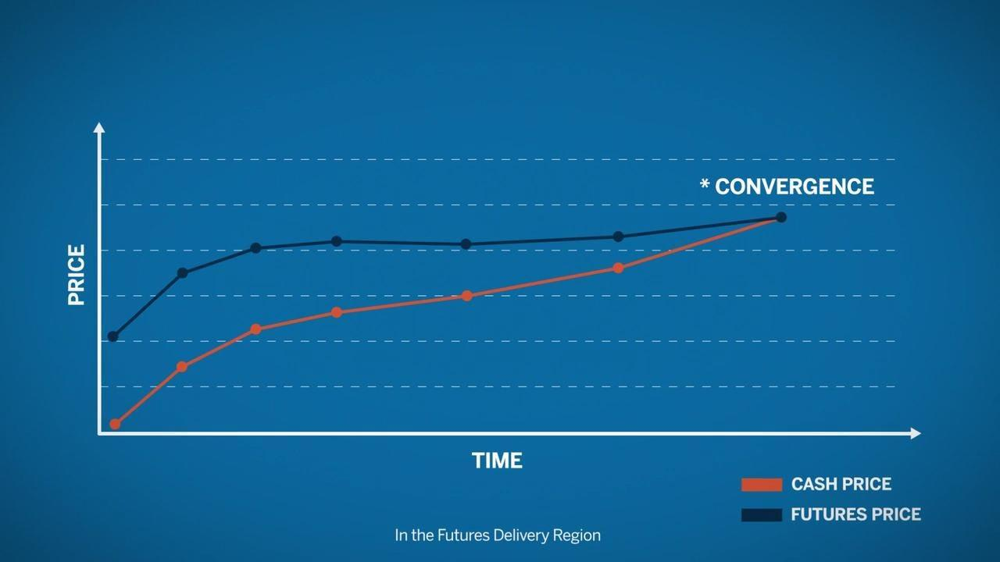

## Table of Contents

## What is convergence in futures trading?

Convergence in futures trading is when the price of a futures contract gets closer to the price of the actual thing it represents, like a commodity or stock, as the contract gets closer to its expiration date. This happens because as the contract nears its end, traders have less time to guess about future prices, so the futures price starts to match the current market price of the actual thing more closely.

Sometimes, the futures price might be higher or lower than the actual price because of things like storage costs, interest rates, or how easy it is to get the commodity. But, as the expiration date comes, these differences usually get smaller, and the prices converge. This is important for traders because it helps them know when to buy or sell to make a profit or avoid losses.

## Why is convergence important in futures trading?

Convergence is important in futures trading because it helps traders know when the price of a futures contract will be close to the price of the actual thing it represents. This is useful for traders because it lets them plan when to buy or sell. If they know the prices will be close as the contract ends, they can make better decisions to make money or avoid losing money.

Also, convergence makes the futures market work well. It makes sure that the prices in the futures market are linked to the real market prices. This link is important because it keeps the market fair and helps everyone trust that the futures prices are based on real values. Without convergence, the futures market could be confusing and less reliable for traders.

## How does convergence affect the pricing of futures contracts?

Convergence affects the pricing of futures contracts by making the futures price get closer to the actual price of the thing it represents as the contract gets closer to expiring. At the start, the futures price might be different from the actual price because of things like storage costs, interest rates, or how easy it is to get the commodity. But as the expiration date comes closer, these differences start to go away, and the futures price starts to match the actual price more closely.

This process is important because it helps traders know what to expect as the contract ends. If traders can see that the futures price is moving towards the actual price, they can plan their buying and selling better. It also makes the futures market fair and reliable, because everyone can trust that the futures prices are based on real values. Without convergence, the futures market could be confusing and less trustworthy for traders.

## What are the key factors that influence convergence in futures trading?

The main things that affect how futures prices get closer to the actual price are the time left until the contract ends, the costs of holding onto the thing the contract is for, and how much people want it. When there's a lot of time left on the contract, the futures price can be different because traders are guessing about what will happen in the future. But as the contract gets closer to ending, there's less time for guessing, so the futures price starts to match the actual price more.

Other things like how much it costs to store the thing, interest rates, and how easy it is to get the thing also play a part. If it costs a lot to store something, the futures price might be higher to cover those costs. Interest rates can also make a difference because they affect the cost of money over time. And if something is hard to get, its price might go up, which can make the futures price different from the actual price until they get closer as the contract ends.

## Can you explain the concept of basis and its role in convergence?

The basis is the difference between the price of a futures contract and the price of the actual thing it represents, like a commodity or stock. It can be positive, meaning the futures price is higher, or negative, meaning the futures price is lower. The basis changes over time and is influenced by things like storage costs, interest rates, and how easy it is to get the commodity. Traders watch the basis closely because it helps them understand how the futures price might change as the contract gets closer to expiring.

The role of the basis in convergence is important because as the futures contract gets closer to its expiration date, the basis should get smaller. This means the futures price and the actual price start to get closer to each other. If the basis stays the same or gets bigger, it can mean there are problems in the market, like it's hard to get the commodity or there are big changes in costs. So, traders use the basis to predict how the futures price will move and to make better trading decisions as the contract nears its end.

## What are the different types of convergence observed in futures markets?

In futures markets, there are two main types of convergence that traders watch: price convergence and calendar spread convergence. Price convergence happens when the price of a futures contract gets closer to the price of the actual thing it represents as the contract gets closer to its expiration date. This is important because it helps traders know when to buy or sell to make a profit or avoid losing money. If the price doesn't converge, it can mean there are problems in the market, like it's hard to get the commodity or there are big changes in costs.

Calendar spread convergence is about the difference between the prices of two futures contracts for the same thing but with different expiration dates. As the earlier contract gets closer to expiring, the price difference between it and the later contract should get smaller. This helps traders understand how the market expects prices to change over time. If the calendar spread doesn't converge, it can mean there are big changes expected in the future, like changes in supply or demand.

Both types of convergence are important for traders because they help them make better decisions. By watching how the prices are moving and how the calendar spreads are changing, traders can plan their trades to take advantage of the market's movements and avoid big losses.

## How do traders use convergence to make trading decisions?

Traders use convergence to help them decide when to buy or sell futures contracts. They watch how the price of the futures contract gets closer to the price of the actual thing it represents as the contract gets closer to expiring. If they see that the futures price is moving towards the actual price, they can plan their trades better. For example, if a trader thinks the futures price will soon match the actual price, they might buy the futures contract now and sell it later when the prices are the same, making a profit from the difference.

Traders also look at calendar spread convergence, which is the difference between the prices of two futures contracts for the same thing but with different expiration dates. As the earlier contract gets closer to expiring, the price difference between it and the later contract should get smaller. Traders use this information to guess how the market expects prices to change over time. If they see that the calendar spread is getting smaller, they might decide to buy the earlier contract and sell the later one, or vice versa, to make money from the changing prices. By watching both types of convergence, traders can make smarter decisions and avoid big losses.

## What are some common strategies traders employ to capitalize on convergence?

Traders use a strategy called "cash and carry arbitrage" to make money from convergence. They buy the actual thing, like a commodity, and at the same time, they sell a futures contract for that thing. As the futures contract gets closer to expiring, its price gets closer to the price of the actual thing. Traders make money from the difference between the two prices. This works well when the futures price is higher than the actual price, and they can cover their costs, like storage and interest.

Another strategy is "reverse cash and carry arbitrage." Here, traders do the opposite: they sell the actual thing and buy a futures contract for it. This strategy works when the futures price is lower than the actual price. As the contract gets closer to expiring, the futures price goes up to meet the actual price, and traders make money from the difference. Both strategies help traders take advantage of how the futures price and the actual price get closer as the contract ends.

Traders also use "calendar spread trading" to make money from convergence. They buy and sell futures contracts for the same thing but with different expiration dates. As the earlier contract gets closer to expiring, its price difference with the later contract gets smaller. Traders can make money by betting on this difference getting smaller. By watching how the prices are moving and how the calendar spreads are changing, traders can plan their trades to take advantage of the market's movements and avoid big losses.

## Can you provide examples of convergence in commodity futures?

In commodity futures, convergence happens when the price of a futures contract gets closer to the price of the actual commodity as the contract gets closer to expiring. For example, let's say there's a futures contract for corn that will expire in six months. At the start, the futures price might be higher than the actual price of corn because traders are guessing about what will happen in the future. But as the six months go by, the futures price starts to match the actual price of corn more closely. This is because there's less time for guessing, and the futures price has to be close to the actual price when the contract ends.

Another example is with oil futures. Imagine there's a futures contract for oil that will expire in three months. At first, the futures price might be different from the actual price of oil because of things like storage costs and how easy it is to get oil. But as the three months go by, the futures price starts to get closer to the actual price of oil. This happens because traders know the contract will soon end, so they have to make sure the futures price is close to the actual price. By watching this convergence, traders can plan when to buy or sell to make money or avoid losing money.

## How does convergence differ across various futures markets, such as financial versus commodity futures?

Convergence works a bit differently in financial futures compared to commodity futures. In financial futures, like those for stock indexes or interest rates, convergence happens because the futures price gets closer to the price of the financial thing it represents as the contract gets closer to expiring. For example, if you have a futures contract for the S&P 500, as the contract nears its end, the futures price will start to match the actual S&P 500 index more closely. This is because there's less time for guessing about future prices, and the futures price has to be close to the actual price when the contract ends. Financial futures don't have to worry about things like storage costs, so the convergence is more about the time left until the contract expires.

In commodity futures, like those for corn or oil, convergence is affected by more things than just time. At the start, the futures price might be different from the actual price of the commodity because of costs like storage and how easy it is to get the commodity. For example, if you have a futures contract for oil, the futures price might be higher to cover the cost of storing the oil until the contract ends. But as the contract gets closer to expiring, these costs start to matter less, and the futures price starts to match the actual price of oil more closely. So, in commodity futures, traders have to think about both the time left until the contract expires and the costs of holding onto the commodity.

## What are the potential risks associated with convergence in futures trading?

One risk of convergence in futures trading is that sometimes the futures price might not get close to the actual price as expected. This can happen if there are big changes in the market, like it's hard to get the commodity or there are big changes in costs. If the futures price doesn't converge, traders can lose money because they were expecting the prices to be close when the contract ends. This can be a big problem if traders have made big bets on the futures price matching the actual price.

Another risk is that traders might not understand all the things that can affect convergence. For example, in commodity futures, things like storage costs and how easy it is to get the commodity can make a big difference. If traders don't think about these things, they might make bad trading decisions. This can lead to losses if the futures price doesn't move the way they expected. So, it's important for traders to know all the things that can affect convergence and to be ready for surprises in the market.

## How can advanced traders predict and manage convergence more effectively?

Advanced traders can predict and manage convergence better by watching the market closely and understanding all the things that can affect it. They pay attention to the time left until the contract expires, the costs of holding onto the thing the contract is for, and how much people want it. By keeping an eye on these things, traders can guess how the futures price will move towards the actual price. They also use tools like charts and computer programs to help them see patterns and make better guesses about the future. This helps them plan their trades and make money from the difference between the futures price and the actual price.

To manage convergence risks, advanced traders use different strategies. They might use "cash and carry arbitrage," where they buy the actual thing and sell a futures contract for it, or "reverse cash and carry arbitrage," where they do the opposite. These strategies help them make money from the difference between the futures price and the actual price as they get closer. Traders also use "calendar spread trading" to bet on the difference between the prices of two futures contracts for the same thing but with different expiration dates. By using these strategies and understanding the market well, advanced traders can take advantage of convergence and avoid big losses.

## What is Convergence in Futures Trading?

Convergence in futures trading denotes the phenomenon where the futures price of an asset aligns with its spot price as the futures contract reaches its expiration date. This alignment aims to ensure that opportunities for [arbitrage](/wiki/arbitrage)—the practice of profiting from price differences between markets—are minimized or eliminated at contract maturity. The relationship between futures prices ($F$) and spot prices ($S$) can be expressed as follows: as the time to expiration ($T$) approaches zero, $F$ should equal $S$.

The principle behind convergence rests on the forces of supply and demand, which naturally adjust any discrepancies between futures and spot prices. When discrepancies exist, market participants engage in trading activities that push these prices toward equilibrium. For instance, if the futures price is higher than the spot price as the expiration date draws near, traders may choose to sell futures contracts while purchasing the asset in the spot market, thereby profiting from the price difference. This increased supply of futures and demand for the asset in the spot market exerts pressure on the prices to converge.

By the contract's expiration, the futures price should theoretically match the spot price, reflecting the asset's actual market value. This is particularly important in avoiding pricing anomalies that can lead to market inefficiency. Market efficiency improves as traders capitalize on discrepancies, ensuring that prices reflect all available information.

In addition to minimizing arbitrage opportunities, understanding convergence is vital for traders aiming to mitigate risks associated with pricing discrepancies. Traders who effectively anticipate and respond to convergence can optimize their positions and enhance their strategies. Convergence is also influenced by other factors, such as interest rates, dividends (in the case of equity futures), and storage costs (for commodity futures), which can all affect the difference between futures and spot prices during the contract's duration.

To model these dynamics, the cost-of-[carry](/wiki/carry-trading) model is frequently applied. This model states that the futures price is a function of the spot price and the cost of carrying the asset until the futures contract expires. The formula is:

$$
F = S \times e^{(r+d-c)T}
$$

where:
- $F$ is the futures price,
- $S$ is the spot price,
- $r$ is the risk-free interest rate,
- $d$ is the dividend yield (for equity futures, if applicable),
- $c$ is the storage cost (for commodity futures, if applicable),
- $T$ is the time to expiration, and
- $e$ is the base of the natural logarithm.

This systematic approach allows traders and market participants to predict and exploit convergence accurately, ultimately fostering a more robust and efficient futures market.

## References & Further Reading

[1]: Apte, P. (2009). ["International Financial Management."](https://books.google.com/books/about/International_Financial_Management_8th_E.html?id=Dz7oDwAAQBAJ) Tata McGraw-Hill.

[2]: Black, F., & Scholes, M. (1973). ["The Pricing of Options and Corporate Liabilities."](https://www.cs.princeton.edu/courses/archive/fall09/cos323/papers/black_scholes73.pdf) Journal of Political Economy, 81(3), 637-654.

[3]: Hull, J. C. (2017). ["Options, Futures, and Other Derivatives."](https://www.semanticscholar.org/paper/Options%2C-Futures%2C-and-Other-Derivatives-Hull/89bdee500c8623864fc9eb7a471546aa713acc44) Pearson Education.

[4]: Johnson, L. L., & Hazen, S. L. (1987). ["Fundamentals of Futures and Options Markets."](https://api.pageplace.de/preview/DT0400.9781292422121_A43290044/preview-9781292422121_A43290044.pdf) Prentice Hall.

[5]: Tsay, R. S. (2010). ["Analysis of Financial Time Series."](https://onlinelibrary.wiley.com/doi/book/10.1002/9780470644560) Wiley.