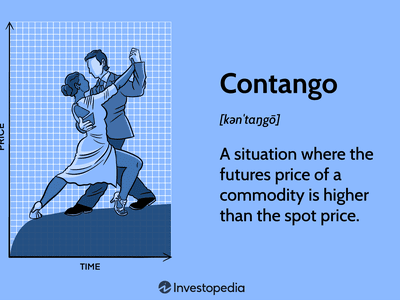

Futures trading represents a crucial component of financial markets, enabling participants to seek profit by speculating on price movements while managing risks associated with those fluctuations. These standardized contracts serve as agreements to buy or sell an asset at a predetermined price at a specified future date. The real power of futures contracts lies in their versatility, allowing traders to hedge against uncertainties and exploit speculative opportunities across various assets, including commodities, stocks, indices, and bonds.

The advent of algorithmic trading has indeed transformed futures markets, seamlessly integrating technology with strategy to enhance execution. Algorithmic trading, or algo trading, uses computer programs to automate trading strategies, executing complex trades rapidly and often more accurately than human traders. This technological evolution has paved the way for more nuanced strategies like convergence. Convergence strategies focus on the natural alignment between futures prices and the spot prices of their underlying assets as contract expiration nears.



This article intends to provide a detailed exploration of futures trading by focusing on convergence and the pivotal role of algorithmic trading in refining strategy execution. Readers will be equipped with a comprehensive understanding of futures contracts, the process of convergence, and the strategic advantages and challenges associated with using algorithms in trading. As financial markets continue to embrace technology, understanding these core concepts becomes essential for anyone looking to harness the potential of futures markets for profit. Algorithmic trading, especially, offers immense promise in navigating the complexities of these markets, providing cutting-edge tools for traders to maintain competitiveness in increasingly dynamic environments.

## Table of Contents

## Understanding Futures Trading

Futures contracts are standardized financial instruments obligating the buyer to purchase, or the seller to sell, a specific asset at a predetermined price and date in the future. These contracts are essential tools for risk management, particularly in environments characterized by price volatility. By locking in future prices, participants can mitigate the impact of adverse price movements, thereby stabilizing their financial outlooks.

Within financial markets, futures contracts serve crucial roles across a diverse array of asset classes, including commodities, stocks, indices, and bonds. For instance, agricultural producers may use futures to secure a future selling price for their harvest, while investors may buy index futures to hedge against market downturns. Such versatility underscores their significance as a hedging mechanism against potential volatility.

Moreover, futures markets provide fertile grounds for speculative activities. Speculators are market participants who seek to profit from price changes by predicting future movements in asset prices. Their activities add liquidity to the market, which aids in more consistent price discovery. Speculation allows traders to benefit from anticipations of market trends without the intention of owning the underlying asset. 

Understanding the operational mechanics of futures contracts is paramount for participants looking to utilize them effectively. These contracts are traded on exchanges, which act as intermediaries by guaranteeing contract fulfillment and minimizing counterparty risk. The standardization of contracts—specifying quantities, delivery locations, and expiration dates—ensures clarity and comparability in the market.

One of the critical aspects of trading futures is leveraging, which allows traders to control a large contract value with a relatively small amount of capital, known as the margin. This leverage amplifies potential gains but also magnifies losses, requiring meticulous risk management strategies. For example, a commodity trader buying a futures contract for [crude oil](/wiki/crude-oil) at a future price of $100 per barrel would profit if the market price rises to $110 per barrel at maturity. Conversely, if the price drops to $90, they would incur a loss, reinforcing the necessity for strategic decision-making. 

In summary, futures contracts are integral to the financial markets, playing diverse roles from risk management to speculation. A firm grasp of their mechanics, including leveraging and standardization, is essential for traders seeking to leverage futures for hedging or speculative purposes.

## What is Convergence in Futures Trading?

Convergence in futures trading denotes the phenomenon where the futures price of an asset aligns with its spot price as the futures contract reaches its expiration date. This alignment aims to ensure that opportunities for [arbitrage](/wiki/arbitrage)—the practice of profiting from price differences between markets—are minimized or eliminated at contract maturity. The relationship between futures prices ($F$) and spot prices ($S$) can be expressed as follows: as the time to expiration ($T$) approaches zero, $F$ should equal $S$.

The principle behind convergence rests on the forces of supply and demand, which naturally adjust any discrepancies between futures and spot prices. When discrepancies exist, market participants engage in trading activities that push these prices toward equilibrium. For instance, if the futures price is higher than the spot price as the expiration date draws near, traders may choose to sell futures contracts while purchasing the asset in the spot market, thereby profiting from the price difference. This increased supply of futures and demand for the asset in the spot market exerts pressure on the prices to converge.

By the contract's expiration, the futures price should theoretically match the spot price, reflecting the asset's actual market value. This is particularly important in avoiding pricing anomalies that can lead to market inefficiency. Market efficiency improves as traders capitalize on discrepancies, ensuring that prices reflect all available information.

In addition to minimizing arbitrage opportunities, understanding convergence is vital for traders aiming to mitigate risks associated with pricing discrepancies. Traders who effectively anticipate and respond to convergence can optimize their positions and enhance their strategies. Convergence is also influenced by other factors, such as interest rates, dividends (in the case of equity futures), and storage costs (for commodity futures), which can all affect the difference between futures and spot prices during the contract's duration.

To model these dynamics, the cost-of-[carry](/wiki/carry-trading) model is frequently applied. This model states that the futures price is a function of the spot price and the cost of carrying the asset until the futures contract expires. The formula is:

$$
F = S \times e^{(r+d-c)T}
$$

where:
- $F$ is the futures price,
- $S$ is the spot price,
- $r$ is the risk-free interest rate,
- $d$ is the dividend yield (for equity futures, if applicable),
- $c$ is the storage cost (for commodity futures, if applicable),
- $T$ is the time to expiration, and
- $e$ is the base of the natural logarithm.

This systematic approach allows traders and market participants to predict and exploit convergence accurately, ultimately fostering a more robust and efficient futures market.

## Convergence versus Arbitrage

Convergence and arbitrage are two distinct trading strategies often observed within futures markets. Despite being frequently discussed together, their operational mechanisms and strategic objectives differ significantly.

Convergence involves the natural alignment of futures and spot prices as a futures contract approaches its expiration date. This mechanism operates under the principle that at maturity, the futures price should equal the spot price of the underlying asset. Such equilibrium is driven by market forces balancing discrepancies over time. For instance, if the futures price is significantly higher than the spot price, sellers may increase supply, driving the future price down, and vice versa. This natural tendency mitigates pricing discrepancies, thereby reducing potential arbitrage opportunities.

On the contrary, arbitrage entails capitalizing on price differences by simultaneously executing buying and selling positions across related assets. The primary goal is to lock in risk-free profits from these discrepancies. Arbitrage tends to be a short-term strategy as it often requires swift execution to exploit transient price inefficiencies before convergence takes place. For example, if a futures contract is overpriced compared to the spot price, an arbitrageur might short the futures and buy the underlying asset, expecting the two prices to converge.

Traders need to be proficient in distinguishing scenarios where convergence will naturally correct price disparities to avoid losses when exploiting arbitrage opportunities. Understanding the timing and mechanism of convergence allows traders to anticipate when arbitrage conditions might diminish, thus influencing their decision-making process. This knowledge is crucial for optimizing trading strategies in futures markets, where misjudgments in price movements can lead to substantial financial repercussions.

## Algorithmic Trading in Futures Markets

Algorithmic trading, known as algo trading, is a method in which computer programs execute trading strategies in futures markets. These programs are designed to automate and optimize trading strategies by analyzing market data, executing trades, and managing risks in real-time. Algorithms detect patterns and inefficiencies in the market, including opportunities related to the convergence of futures and spot prices. 

A key advantage of [algorithmic trading](/wiki/algorithmic-trading) is its ability to handle and process vast amounts of data at a speed far surpassing human capabilities. This enables more precise and timely trade execution, which is particularly beneficial in volatile markets where prices can change within milliseconds. For instance, algorithms can quickly capitalize on minor price discrepancies between futures and their underlying assets, facilitating efficient convergence plays. 

The transformation brought about by algo trading has significantly enhanced the efficiency and accessibility of futures markets. By automating complex trading strategies, algorithms reduce manual intervention, mitigate human error, and increase the speed of execution. This efficiency often results in tighter bid-ask spreads and improved [liquidity](/wiki/liquidity-risk-premium), benefiting the overall market environment.

However, the integration of algorithmic systems in futures trading is not without its challenges. One significant concern is the market impact of high-frequency trading strategies, which can exacerbate price [volatility](/wiki/volatility-trading-strategies) and lead to flash crashes. Moreover, the complexity of these algorithms necessitates rigorous testing and compliance with ever-evolving regulatory standards to ensure market integrity.

Algorithmic trading in futures markets thus represents a double-edged sword. On one hand, it offers enhanced precision, speed, and the ability to exploit fleeting market inefficiencies. On the other, it requires careful consideration of its potential to inadvertently contribute to market instability and the stringent need for regulatory oversight. As technology advances, balancing these aspects will remain crucial for traders and policymakers alike.

## Types of Convergence Trading Strategies

Several trading strategies exploit convergence, leveraging opportunities when discrepancies in pricing align towards theoretical values. Among these strategies are pairs trading, [statistical arbitrage](/wiki/statistical-arbitrage), and fixed income convergence trades.

Pairs trading is a strategy that takes advantage of temporary divergences between two correlated securities. Traders simultaneously execute a long position on the underperforming security and a short position on the outperforming one. The premise is that the price relationship between these securities will revert to the mean over time. For example, if two stocks have historically moved together, but one suddenly drops, a trader might buy the underperforming stock and short the other, expecting the spread to close.

Statistical arbitrage, or stat arb, involves using quantitative models to identify and exploit price disparities. This strategy typically includes a broad range of securities where traders analyze historical price data and statistical measures to predict future price movements. The strategy involves executing a large number of trades that aim to profit from expected price movements towards a group mean. Here's a simplified Python example to illustrate statistical arbitrage calculations:

```python
import numpy as np
import statsmodels.api as sm

# Example price series of two correlated assets
X = np.random.normal(loc=100, scale=5, size=100)
Y = 1.5 * X + np.random.normal(scale=2, size=100)

# Running an ordinary least squares regression
X = sm.add_constant(X)
model = sm.OLS(Y, X)
results = model.fit()

# Analyze the residuals
residuals = results.resid

# If residuals deviate from zero mean, the trader could take a position
mean_residuals = np.mean(residuals)
```

In this example, a trader might look for deviations in residuals as triggers for trades, expecting mean reversion over time.

Fixed income convergence trades involve exploiting price discrepancies in the bond markets. This strategy focuses on bonds with similar characteristics whose prices are expected to converge as their maturity dates approach. Traders identify bonds that are mispriced relative to each other based on factors such as credit ratings, maturity dates, and issuer profiles. The goal is to profit when these relationships normalize. For instance, if two bonds issued by the same company with similar maturities have different yields without justified reasons, a trader might purchase the undervalued bond and short the other.

These strategies leverage the anticipation of convergence to achieve profits. However, their success depends heavily on accurate modeling, timing, and the ability to manage associated risks effectively.

## Risks and Challenges

Despite the allure of substantial rewards, futures trading and convergence strategies inherently entail a range of risks. Market volatility is a primary concern; the high degree of price fluctuations can lead to significant financial losses if not managed properly. This volatility is exacerbated by leverage, a common feature in futures trading. While leverage allows traders to control larger positions with a relatively small amount of capital, it also magnifies both potential gains and losses. For instance, a 10% adverse movement in the price of a futures contract can result in a total loss of the initial margin placed by the trader.

Pricing errors are another significant risk. In futures trading, a mispricing can occur due to incorrect data input or delays in data feeds, often leading to erroneous trades or missed opportunities. Algorithmic trading systems, although designed to mitigate human error, are not foolproof. They can still malfunction due to software bugs, hardware failures, or erroneous algorithmic logic which might lead to substantial financial impacts. These malfunctions can be exacerbated by the rapid pace of trading, where thousands of transactions might occur in a second, amplifying the effect of an error.

Execution lag poses additional challenges. In markets where speed is crucial, even a slight delay in executing trades can result in unfavorable entry or [exit](/wiki/exit-strategy) points. This lag may be due to network latency, slow processing speeds, or inefficient algorithms, and it can significantly impact the profitability of a strategy, particularly in high-frequency trading environments.

Given these risks, robust risk management strategies are paramount. Traders must employ techniques such as stop-loss orders, position sizing, and portfolio diversification to mitigate potential losses. Algorithms must also be rigorously tested under various market conditions to ensure reliability and effectiveness.

Investors should stay informed about the specific characteristics and risks associated with their chosen convergence strategies. Market conditions can shift rapidly, necessitating a flexible approach to adapt to changing dynamics. Continuous monitoring and adjustment of strategies can help mitigate risks and optimize for changing market conditions, ensuring that the potential for high rewards in futures trading is not overshadowed by avoidable pitfalls.

## Conclusion

Futures trading and convergence strategies, enhanced by algorithmic trading, offer a complex yet rewarding framework for traders aiming to take advantage of market inefficiencies. These approaches enable market participants to anticipate and react swiftly to price movements, leveraging both technological advancements and strategic insights. A deep understanding of futures contracts, convergence principles, and the automation provided by algorithmic trading systems grants traders a notable competitive advantage in executing successful trades. As technology continues to advance, the role of algorithmic trading in executing these strategies is expected to expand. The capacity for algorithms to rapidly analyze vast datasets and execute trades with precision positions them as an essential component of modern trading strategies. However, with the increasing adoption of these technologies, traders must not overlook the importance of implementing rigorous risk management practices. This involves not only maintaining robust error-checking mechanisms within trading algorithms but also being prepared to adapt to the dynamic nature of financial markets to mitigate potential risks. Balancing technological innovation with effective risk management is crucial for safeguarding against adverse outcomes while maximizing the potential of futures and convergence trading strategies.

## References & Further Reading

[1]: Apte, P. (2009). ["International Financial Management."](https://books.google.com/books/about/International_Financial_Management_8th_E.html?id=Dz7oDwAAQBAJ) Tata McGraw-Hill.

[2]: Black, F., & Scholes, M. (1973). ["The Pricing of Options and Corporate Liabilities."](https://www.cs.princeton.edu/courses/archive/fall09/cos323/papers/black_scholes73.pdf) Journal of Political Economy, 81(3), 637-654.

[3]: Hull, J. C. (2017). ["Options, Futures, and Other Derivatives."](https://www.semanticscholar.org/paper/Options%2C-Futures%2C-and-Other-Derivatives-Hull/89bdee500c8623864fc9eb7a471546aa713acc44) Pearson Education.

[4]: Johnson, L. L., & Hazen, S. L. (1987). ["Fundamentals of Futures and Options Markets."](https://api.pageplace.de/preview/DT0400.9781292422121_A43290044/preview-9781292422121_A43290044.pdf) Prentice Hall.

[5]: Tsay, R. S. (2010). ["Analysis of Financial Time Series."](https://onlinelibrary.wiley.com/doi/book/10.1002/9780470644560) Wiley.