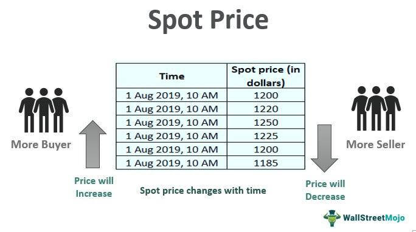

In the complex world of trading and investments, two essential concepts that investors frequently encounter are futures prices and spot prices. Futures prices are predetermined rates agreed upon today for transactions that will occur at a specified future date, while spot prices represent the current market value for immediate delivery of securities or commodities. These price mechanisms are fundamental in financial markets as they offer critical insights into market expectations, liquidity levels, and risk management strategies.

The phenomenon of price convergence between futures and spot prices is of significant interest, particularly as market participants aim to understand the movement and relationship between the two. Price convergence refers to the tendency for the futures price to move closer to the spot price as the contract approaches its expiration date. This convergence is driven by various factors, including anticipated returns, risk considerations, and external variables such as geopolitical events.



Algorithmic trading plays a prominent role in the convergence process, leveraging advanced algorithms and high-frequency trading systems to identify and capitalize on price discrepancies. By executing trades at incredible speeds, these algorithms enhance market efficiency and promote price alignment. The application of machine learning and artificial intelligence in these algorithms allows for the rapid analysis of vast amounts of data, pushing the boundaries of traditional trading methods and driving the convergence phenomenon more effectively.

The exploration in this article aims to shed light on the mechanics and implications of price convergence between futures and spot markets. Understanding the factors driving this convergence, including the impact of arbitrage and the circumstances under which divergence may occur, offers valuable insights to traders and investors seeking to navigate the volatile financial landscape. Ultimately, knowledge of these dynamics empowers market participants to make informed decisions, optimizing their trading strategies in the face of evolving market conditions.

## Table of Contents

## Understanding Futures and Spot Prices

Futures prices and spot prices are fundamental concepts within financial markets, particularly in the trading of commodities and financial instruments. Futures prices are established in advance for contracts that specify the purchase or sale of a commodity or financial instrument at a future date. These contracts are often used by traders to hedge against unfavorable price movements. Traders can secure a specified price, thus protecting against potential losses that may arise from price fluctuations in the underlying asset.

Spot prices, in contrast, represent the current market value of a commodity or financial instrument available for immediate delivery and settlement. Spot prices reflect the immediate demand and supply conditions in the market, offering real-time valuation for the asset in question.

The futures market serves several significant roles. One of its primary functions is to facilitate risk management. By locking in prices for future transactions, both producers and consumers can hedge against the unpredictability of price swings. This hedging capability allows businesses and investors to plan and budget more effectively, safeguarding profit margins and cost structures against adverse price changes.

Moreover, the futures market supports trading across various time horizons, catering to both short-term and long-term market participants. The ability to trade futures contracts with different expiration dates provides traders with the flexibility to manage their exposure and strategies over different time frames.

The differences between futures and spot prices are often attributed to several factors. One notable component is the concept of "[carry](/wiki/carry-trading)," which refers to the costs and benefits associated with holding the underlying asset until the contract's expiration. These include storage costs, interest expenses, or income from possessing the asset for the contract duration. These considerations are typically embedded in the futures price to compensate for the costs incurred or benefits foregone over time.

In financial markets, the relationship between futures and spot prices can also be described using the cost of carry model. This model helps to explain how the futures price is derived from the spot price:

$$
F = S \times e^{(r + c) \times T}
$$

Where:
- $F$ is the futures price.
- $S$ is the spot price.
- $r$ is the risk-free interest rate or cost of capital.
- $c$ represents the cost of carry (including storage and convenience yield).
- $e$ is the base of the natural logarithm.
- $T$ is the time to maturity.

This relationship indicates how future prices are often higher than spot prices when the costs of carry exceed the convenience yield. Conversely, futures prices can be lower if the convenience yield—a measure of the convenience or benefit of holding the physical asset—outweighs carrying costs.

Ultimately, both futures and spot prices possess unique qualities and roles within markets, enabling traders to engage in price risk management and facilitating trading activity across various time frames. Understanding these mechanisms is pivotal for effective participation in financial markets.

## Factors Influencing Price Convergence

Price convergence is a fundamental concept in the trading and investment sector, primarily driven by factors such as interest rates, supply and demand dynamics, and market expectations. Understanding these elements is essential for comprehending how futures prices and spot prices align as a futures contract nears its expiration date.

Interest rates play a significant role in price convergence. In essence, the relationship between futures prices and spot prices can be expressed using the cost-of-carry model, which considers storage costs, dividends, and the risk-free [interest rate](/wiki/interest-rate-trading-strategies). Mathematically, this relationship is given by the formula:

$$
F = S \times e^{(r \times t)}
$$

where $F$ is the futures price, $S$ is the spot price, $r$ is the risk-free interest rate, and $t$ is the time to maturity of the futures contract. The equation illustrates how futures prices factor in the opportunity cost of capital, thereby adjusting as interest rates fluctuate. A rise in interest rates increases the opportunity cost, often widening the futures-spot price gap until other forces enforce convergence as maturity nears.

Supply and demand dynamics are equally critical in influencing price convergence. The futures market allows participants to trade based on expectations about future supply and demand conditions. When a market anticipates increased demand or a supply shock, it often impacts the futures prices, potentially resulting in temporary misalignments with spot prices. As the expiration of the contract approaches, market participants adjust their positions to reflect actual supply and demand, facilitating convergence.

Market expectations also drive the alignment between futures and spot prices. Traders and investors formulate their strategies based on forecasts about economic indicators, geopolitical events, and weather conditions, particularly in commodity markets. For instance, projections of an economic downturn may reduce the demand for certain commodities, leading to a lower futures price trajectory. As more information becomes available and the contract nears expiration, expectations align closer with real-time data, pulling the futures and spot prices together.

These factors collectively contribute to the mechanism of price convergence. Interest rates define the cost framework, while supply-demand conditions and market expectations adjust perceptions and positions within that framework as expiration approaches. The interaction of these forces ensures that futures prices gravitate towards spot prices, maintaining market equilibrium as contracts mature.

## The Role of Arbitrage in Price Convergence

Arbitrage is a fundamental process that exploits discrepancies between futures and spot prices to generate profits while simultaneously promoting price convergence. In financial markets, [arbitrage](/wiki/arbitrage) involves buying an asset at a lower price in one market and selling it at a higher price in another, thus capitalizing on the price differential. This activity plays a critical role in harmonizing market prices, ensuring that any temporary deviations between futures and spot prices are corrected swiftly, thereby enhancing market efficiency.

In the context of futures and spot prices, arbitrageurs identify opportunities where the futures price differs from the expected future spot price, adjusted for factors such as interest rates, storage costs, and convenience yield. For an efficient market without arbitrage profits, the relationship can be expressed through the cost-of-carry model, given by the formula:

$$
F = S \times e^{(r + c - y) \times t}
$$

where $F$ represents the futures price, $S$ is the spot price, $r$ is the risk-free interest rate, $c$ is the storage cost, $y$ is the convenience yield, and $t$ is the time to maturity of the futures contract. This equation ensures that any misalignment between futures and spot prices is corrected by natural market forces.

For instance, consider an arbitrage opportunity where the futures price of a commodity, such as [crude oil](/wiki/crude-oil), is overvalued compared to the cost-of-carry adjusted expected spot price. An arbitrageur would execute a series of trades: purchasing the spot commodity while simultaneously selling its corresponding futures contract. As expiration approaches, the prices will likely converge due to the counteracting pressures exerted by arbitrageurs seeking to close their positions for profit. This activity reduces the price gap, aligning the futures price more closely with the spot price.

Real-world examples highlight the power of arbitrage in managing price discrepancies. During periods of market [volatility](/wiki/volatility-trading-strategies), discrepancies between futures and spot prices can widen, offering arbitrageurs lucrative trading opportunities. For example, in the gold market, if futures are trading at a premium to the spot price, a trader might buy gold in the spot market and sell it in the futures market to lock in profits. Such actions drive convergence by adjusting the prices until no further arbitrage opportunities exist.

Arbitrage is not confined to manual trading strategies; it is increasingly dominated by [algorithmic trading](/wiki/algorithmic-trading), which employs automated systems to detect and exploit price differentials. These algorithms can perform high-frequency trading, significantly accelerating the pace of arbitrage operations. By swiftly executing trades across multiple markets, algorithms compound the convergence effect, continuously aligning futures and spot prices as new information enters the market.

In summary, arbitrage acts as a correcting force that not only offers profit potential for traders but also enhances market efficiency by ensuring that prices reflect their true economic value. This dynamic, emphasized by both manual and algorithmic strategies, is key to understanding the convergence of futures and spot prices in financial markets.

## Algorithmic Trading and Its Influence

Algorithmic trading has emerged as a transformative force in the financial markets, profoundly impacting the convergence of futures and spot prices. By deploying sophisticated algorithms, traders can execute large volumes of trades at unprecedented speeds, which allows them to capitalize on arbitrage opportunities that might exist between these two pricing mechanisms. This rapid execution is crucial for minimizing price discrepancies and promoting market efficiency.

The core of algorithmic trading relies on advanced computational models designed to identify and exploit negligible differences in price. Typically, these algorithms process vast amounts of market data in real-time, assess potential trading opportunities, and execute buy or sell orders without direct human intervention. The following Python pseudo-code example outlines a basic structure for an arbitrage algorithm focusing on futures and spot price convergence:

```python
def find_arbitrage_opportunities(futures, spot):
    # Calculate the price difference
    difference = futures - spot

    # Define an acceptable threshold for arbitrage
    threshold = 0.5

    if abs(difference) > threshold:
        if difference > 0:
            # Futures price is higher than spot price
            return "Sell futures, buy spot"
        else:
            # Spot price is higher than futures price
            return "Buy futures, sell spot"
    return "No arbitrage opportunity"

# Example usage
futures_price = 105
spot_price = 100
action = find_arbitrage_opportunities(futures_price, spot_price)
print(action)
```

Advances in [machine learning](/wiki/machine-learning) and [artificial intelligence](/wiki/ai-artificial-intelligence) further enhance the capabilities of algorithmic trading. These technologies enable the development of more sophisticated algorithms that can adapt to market conditions, learn from historical data, and predict price movements with greater accuracy. As a result, the models become increasingly effective at aligning futures and spot prices, reducing deviations more efficiently than traditional trading methods.

The presence of algorithmic trading contributes to what economists refer to as "price efficiency"—the idea that asset prices reflect all available information. By quickly arbitraging away discrepancies, algorithms not only move prices closer together but also ensure that both futures and spot prices incorporate all known data, leading to more efficient markets.

Despite the efficiencies introduced by algorithmic trading, challenges such as market volatility and technological risks persist. High-frequency trading, a subset of algorithmic trading, can sometimes exacerbate market swings, leading to temporary price distortions. Nevertheless, its influence in promoting price convergence remains a cornerstone of modern trading strategies, emphasizing the dual role of technology as both a catalyst and a stabilizing entity in financial ecosystems.

## When Futures and Spot Prices Diverge

Despite the fundamental tendency of futures and spot prices to converge as a contract nears expiration, various factors can lead to their divergence. This divergence can be attributed to market inefficiencies, insufficient [liquidity](/wiki/liquidity-risk-premium), and market manipulation.

**Market Inefficiencies**: In an ideal market, information is immediately reflected in asset prices. However, inefficiencies such as delays in information dissemination or processing can cause futures and spot prices to diverge. These inefficiencies often arise from technological limitations or human error within trading institutions, which can inhibit the ability of the market to reflect real-time changes in supply and demand.

**Insufficient Liquidity**: Liquidity refers to the ease with which an asset can be bought or sold in the market without affecting its price. In markets where there is insufficient liquidity, large trades can disproportionately influence prices, leading to significant price discrepancies between futures and spot markets. For example, if a futures market lacks liquidity, small orders can lead to large price swings, creating a divergence from the spot market price.

**Market Manipulation**: Certain market participants may engage in practices that artificially influence prices, such as creating false demand or supply scenarios. This intentional manipulation can result in significant discrepancies between futures and spot prices. By generating misleading signals, manipulators can disrupt the natural balance and convergence expected between these two pricing mechanisms.

The implications of these divergences for traders and the market are significant. Traders relying on strategies that assume convergence may incur substantial losses if divergence persists. Furthermore, persistent divergence can undermine market confidence, deterring participation and reducing overall market efficiency.

To manage and mitigate these divergences, traders often employ strategies such as [statistical arbitrage](/wiki/statistical-arbitrage), which involves using complex statistical models to identify and exploit pricing inefficiencies. Additionally, regulatory oversight and technological advancements are continuously evolving to address these challenges and promote a more efficient trading environment.

In summary, while futures and spot prices are driven to converge by the very nature of their constructs, several hurdles, such as inefficiencies, liquidity issues, and manipulation, can introduce divergence, impacting trading strategies and market stability.

## Conclusion

Understanding the convergence of futures and spot prices is essential for investors and traders navigating financial markets. This convergence is a critical indicator of market health and efficiency, driven by various economic forces and trading mechanisms. Algorithmic trading has emerged as a significant contributor to this dynamic, enhancing market efficiency by leveraging computational power to execute trades swiftly and effectively. By capitalizing on minor price discrepancies between futures and spot prices, algorithmic trading promotes alignment, ensuring that futures prices reflect current market realities as closely as possible.

Investors and traders must remain vigilant and informed about the factors influencing price convergence. These factors include interest rate fluctuations, supply and demand dynamics, and market expectations. Each plays a role in the complex interplay that governs futures and spot prices, influencing how and when they converge. By keeping abreast of these elements, market participants can better anticipate price movements and make decisions that minimize risks while maximizing potential gains.

In conclusion, the interaction between futures and spot prices is a fundamental aspect of modern trading. Algorithmic trading, with its capabilities and continuous advancements, is at the forefront of ensuring these prices converge efficiently. By staying informed about the underlying factors and leveraging technology, traders can enhance their strategic decision-making, leading to more successful outcomes in the financial markets.

## References & Further Reading

[1]: Hull, J. C. (2017). ["Options, Futures, and Other Derivatives"](https://www.semanticscholar.org/paper/Options%2C-Futures%2C-and-Other-Derivatives-Hull/89bdee500c8623864fc9eb7a471546aa713acc44). Pearson Education.

[2]: Garcia, P., Leuthold, R. M., & Sarhan, M. E. (1984). ["Basis Convergence in Commodity Futures Markets"](https://onlinelibrary.wiley.com/doi/10.1002/%28SICI%291096-9934%28199606%2916%3A4%3C421%3A%3AAID-FUT4%3E3.0.CO%3B2-K). American Journal of Agricultural Economics, 66(3), 471-479.

[3]: Hasbrouck, J. (2003). ["Intraday Price Formation in U.S. Equity Index Markets"](https://onlinelibrary.wiley.com/doi/10.1046/j.1540-6261.2003.00609.x). The Journal of Finance, 58(2), 791-812.

[4]: Liu, J., & Longstaff, F. A. (2004). ["Losing money on arbitrage: Institutional constraints and relative pricing errors"](https://academic.oup.com/rfs/article-abstract/17/3/611/1612936). The Review of Financial Studies, 17(2), 611-641.

[5]: Black, F. (1976). ["The Pricing of Commodity Contracts"](https://www.sciencedirect.com/science/article/pii/0304405X76900246). Journal of Financial Economics, 3(1-2), 167-179.