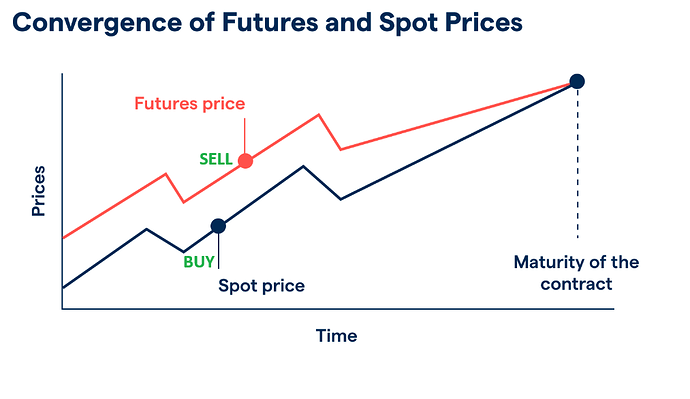

## Table of Contents

## What is the basic concept of futures prices?

Futures prices are what people agree to pay for something in the future. They are used in markets where people buy and sell contracts to trade things like oil, wheat, or stocks at a later date. The price is set today, but the actual trading happens later. This helps people plan and manage risks because they know what they will pay or receive in the future.

The price of a future can change every day based on what people think will happen in the market. If more people want to buy the future, the price goes up. If more people want to sell, the price goes down. Things like weather, news, and how much of the product is available can all affect the price. This makes futures prices important for farmers, companies, and investors who need to plan for the future.

## What are spot prices and how do they differ from futures prices?

Spot prices are the prices you pay for things right now. If you want to buy something and take it home today, you pay the spot price. It's like going to the store and buying a loaf of bread; you pay what it costs at that moment. Spot prices can change quickly because they depend on what's happening right now, like how much of something is available or how much people want it.

Futures prices are different because they are about buying or selling things in the future. When you agree on a futures price, you're making a deal to trade something at a later date, not right away. For example, a farmer might agree to sell their wheat next month at a set price, even if the price of wheat changes between now and then. Futures prices help people plan because they know what they will pay or get in the future, even if the spot price changes.

The main difference between spot and futures prices is when you pay and get the thing you're buying. Spot prices are for immediate transactions, while futures prices are for transactions that will happen later. Both can be affected by things like supply and demand, but futures prices also consider what people think will happen in the future.

## Why is the convergence of futures and spot prices important?

The convergence of futures and spot prices is important because it shows that the futures market is working well. When the date to trade the thing you bought or sold in the future gets closer, the futures price should get closer to the spot price. This happens because as the time to deliver the thing gets near, the futures price and the spot price should be almost the same. If they don't come together, it can mean there's a problem in the market, like not enough of the thing or people not trusting the market.

This convergence helps people who use futures to plan better. If you're a farmer selling wheat next month, you want the price you agreed on to be close to what the wheat is actually worth when you deliver it. It also helps companies and investors manage their risks because they can trust that the price they set for the future will be fair when the time comes. So, when futures and spot prices come together, it makes the market more reliable and helps everyone involved.

## What factors influence the convergence of futures and spot prices?

The main thing that affects how futures and spot prices come together is time. As the date to trade the thing gets closer, the futures price should get closer to the spot price. This is because the futures price is a guess about what the spot price will be in the future, and as that future time comes, the guess should be more accurate. If the futures price doesn't get close to the spot price, it can mean there's a problem, like not enough of the thing being traded or people not trusting the market.

Other things can also affect how well futures and spot prices come together. Changes in how much people want the thing, or how much of it is available, can make the spot price move a lot. If there's a big change in supply or demand, the futures price might not match the spot price as well. Also, things like news, weather, or new laws can make the spot price go up or down quickly, which can make it harder for the futures price to catch up. So, while time is the biggest [factor](/wiki/factor-investing), other things can make the convergence of futures and spot prices more or less smooth.

## Can you explain the theory of storage and its impact on price convergence?

The theory of storage says that the difference between futures and spot prices can be explained by how much it costs to store the thing you're trading. If it's expensive to keep something like oil or wheat until the future date, the futures price will be higher than the spot price. This is because the futures price includes the cost of storing it until you trade it. On the other hand, if it's cheap to store, the futures price might be closer to the spot price because there's not much extra cost to consider.

This theory affects how futures and spot prices come together as the delivery date gets closer. If storage costs stay the same, the futures price should slowly get closer to the spot price. But if storage costs change a lot, like if it suddenly becomes more expensive to store oil because of new rules, it can make the futures price move differently from the spot price. So, understanding storage costs helps explain why futures and spot prices might not always match up perfectly until the very end.

## How do market expectations affect the convergence of futures and spot prices?

Market expectations are what people think will happen in the future, and they can really affect how futures and spot prices come together. If people expect the price of something to go up in the future, they might be willing to pay more for a futures contract now. This makes the futures price higher than the spot price. But as the time to trade gets closer, if those expectations don't change much, the futures price will start to match the spot price more closely. So, what people think will happen can make the futures price different from the spot price until the very end.

Sometimes, though, expectations can change a lot as the delivery date gets closer. If new information comes out, like a big change in how much of something is available or a new law that affects prices, people's expectations can shift quickly. This can make the futures price move around a lot, and it might not get as close to the spot price as smoothly as you'd expect. So, while market expectations help explain why futures and spot prices might be different at first, big changes in those expectations can make the convergence more complicated.

## What role do arbitrage opportunities play in the convergence of futures and spot prices?

Arbitrage opportunities help make sure that futures and spot prices come together as they should. Arbitrage is when someone buys something in one place and sells it in another place to make a profit because the prices are different. If the futures price is a lot higher than the spot price, someone might buy the thing now at the spot price, store it, and then sell it later at the higher futures price. This buying and selling helps push the futures price down and the spot price up until they are closer together.

But arbitrage works both ways. If the futures price is lower than the spot price, someone might sell the thing now at the spot price and buy a futures contract to get it back later at a lower price. This selling and buying helps push the spot price down and the futures price up. So, arbitrage helps make sure that as the time to trade gets closer, the futures and spot prices get closer to each other, making the market work better.

## How does the cost of carry model explain the relationship between futures and spot prices?

The cost of carry model says that the futures price is the spot price plus the costs of holding onto something until the future date. If you want to buy something now and keep it until later, you have to pay for storage, insurance, and maybe even interest on the money you used to buy it. All these costs together are called the cost of carry. So, the futures price is higher than the spot price because it includes these extra costs.

As the date to trade gets closer, the time you have to pay for holding the thing gets shorter. This means the cost of carry goes down, and the futures price should get closer to the spot price. If the costs stay the same, the futures price will slowly move towards the spot price until they are almost the same at the end. But if the costs change a lot, like if storage suddenly becomes more expensive, it can make the futures price move differently from the spot price. So, the cost of carry model helps explain why futures and spot prices might not always match up perfectly until the very end.

## What are some common reasons for non-convergence of futures and spot prices?

Sometimes futures and spot prices don't come together like they should, and there are a few common reasons for this. One big reason is if there are big changes in how much of something is available or how much people want it. If there's suddenly a lot more or a lot less of something, the spot price can change a lot, making it hard for the futures price to catch up. Another reason is if the costs of keeping something until the future date change a lot. If it suddenly becomes more expensive to store oil or wheat, the futures price might not match the spot price as well as expected.

Another reason for non-convergence can be if people's expectations about the future change a lot. If new news comes out that makes people think prices will go up or down more than they thought, it can make the futures price move around a lot. Also, if there are problems with the market, like not enough people wanting to buy or sell at the end, it can make it hard for the prices to come together. So, changes in supply and demand, storage costs, and what people expect can all make it tricky for futures and spot prices to match up perfectly at the end.

## How do seasonal patterns influence the convergence of futures and spot prices in commodity markets?

Seasonal patterns can really affect how futures and spot prices come together in commodity markets. For example, if you're trading something like wheat, there are times of the year when there's a lot of wheat because it's harvest time, and other times when there's less because farmers are waiting for the next harvest. When there's a lot of wheat, the spot price might go down because there's more of it around. But people buying futures might still expect prices to go up later when there's less wheat, so the futures price might stay higher. This can make it harder for the futures and spot prices to match up until the seasonal changes even out.

Another way seasonal patterns influence convergence is through changes in how much people want certain things at different times of the year. For example, natural gas prices might go up in winter because more people use it to heat their homes. If people expect this to happen, the futures price might be higher than the spot price in the summer. As winter gets closer, the spot price might start to go up to meet the futures price. But if the winter is warmer than expected, the spot price might not go up as much, making it harder for the prices to come together. So, seasonal patterns can make the relationship between futures and spot prices more complicated, but understanding them helps people plan better.

## What advanced statistical models are used to predict the convergence of futures and spot prices?

Advanced statistical models help people guess how futures and spot prices will come together. One common model is the time series model, which looks at past prices to predict future ones. These models can use things like moving averages or more complex methods like ARIMA (AutoRegressive Integrated Moving Average) to see patterns over time. They help people understand how prices have moved in the past and use that to guess what might happen next. Another model is the regression model, which looks at how different things, like supply and demand or storage costs, affect prices. By studying these factors, regression models can help predict how futures and spot prices will change and come together.

Another useful model is the GARCH (Generalized Autoregressive Conditional Heteroskedasticity) model, which focuses on how much prices can change suddenly. It helps predict when prices might go up or down a lot, which can affect how futures and spot prices match up. Machine learning models are also becoming more popular. They can look at a lot of data and find patterns that other models might miss. For example, neural networks can learn from past data to predict how prices will converge. All these models help traders and investors make better guesses about the future, but they're not perfect because the market can be unpredictable.

## How have regulatory changes impacted the convergence of futures and spot prices in financial markets?

Regulatory changes can really affect how futures and spot prices come together in financial markets. When rules change, it can make it more or less expensive to trade things, which can change the spot price. For example, if new rules make it harder to store oil, the cost of keeping oil until the future date goes up, and this can make the futures price higher than the spot price. Also, if the rules make people trust the market more or less, it can change how much they want to buy or sell, which can affect both futures and spot prices. So, when the rules change, it can make the prices move differently and harder to predict.

Another way regulatory changes can impact convergence is by affecting how much information people have. If new rules make companies share more information about how much of something they have or how much it costs to store it, people can make better guesses about the future. This can make the futures price more accurate and help it get closer to the spot price as the time to trade gets closer. But if the rules make it harder to get good information, it can make the futures price less accurate, and it might not match the spot price as well. So, the rules can change how well people can predict prices, which affects how futures and spot prices come together.

## What is the understanding of Futures and Spot Prices?

Futures prices and spot prices are fundamental concepts within financial markets, particularly in the trading of commodities and financial instruments. Futures prices are established in advance for contracts that specify the purchase or sale of a commodity or financial instrument at a future date. These contracts are often used by traders to hedge against unfavorable price movements. Traders can secure a specified price, thus protecting against potential losses that may arise from price fluctuations in the underlying asset.

Spot prices, in contrast, represent the current market value of a commodity or financial instrument available for immediate delivery and settlement. Spot prices reflect the immediate demand and supply conditions in the market, offering real-time valuation for the asset in question.

The futures market serves several significant roles. One of its primary functions is to facilitate risk management. By locking in prices for future transactions, both producers and consumers can hedge against the unpredictability of price swings. This hedging capability allows businesses and investors to plan and budget more effectively, safeguarding profit margins and cost structures against adverse price changes.

Moreover, the futures market supports trading across various time horizons, catering to both short-term and long-term market participants. The ability to trade futures contracts with different expiration dates provides traders with the flexibility to manage their exposure and strategies over different time frames.

The differences between futures and spot prices are often attributed to several factors. One notable component is the concept of "[carry](/wiki/carry-trading)," which refers to the costs and benefits associated with holding the underlying asset until the contract's expiration. These include storage costs, interest expenses, or income from possessing the asset for the contract duration. These considerations are typically embedded in the futures price to compensate for the costs incurred or benefits foregone over time.

In financial markets, the relationship between futures and spot prices can also be described using the cost of carry model. This model helps to explain how the futures price is derived from the spot price:

$$
F = S \times e^{(r + c) \times T}
$$

Where:
- $F$ is the futures price.
- $S$ is the spot price.
- $r$ is the risk-free interest rate or cost of capital.
- $c$ represents the cost of carry (including storage and convenience yield).
- $e$ is the base of the natural logarithm.
- $T$ is the time to maturity.

This relationship indicates how future prices are often higher than spot prices when the costs of carry exceed the convenience yield. Conversely, futures prices can be lower if the convenience yield—a measure of the convenience or benefit of holding the physical asset—outweighs carrying costs.

Ultimately, both futures and spot prices possess unique qualities and roles within markets, enabling traders to engage in price risk management and facilitating trading activity across various time frames. Understanding these mechanisms is pivotal for effective participation in financial markets.

## What are the factors influencing price convergence?

Price convergence is a fundamental concept in the trading and investment sector, primarily driven by factors such as interest rates, supply and demand dynamics, and market expectations. Understanding these elements is essential for comprehending how futures prices and spot prices align as a futures contract nears its expiration date.

Interest rates play a significant role in price convergence. In essence, the relationship between futures prices and spot prices can be expressed using the cost-of-carry model, which considers storage costs, dividends, and the risk-free [interest rate](/wiki/interest-rate-trading-strategies). Mathematically, this relationship is given by the formula:

$$
F = S \times e^{(r \times t)}
$$

where $F$ is the futures price, $S$ is the spot price, $r$ is the risk-free interest rate, and $t$ is the time to maturity of the futures contract. The equation illustrates how futures prices factor in the opportunity cost of capital, thereby adjusting as interest rates fluctuate. A rise in interest rates increases the opportunity cost, often widening the futures-spot price gap until other forces enforce convergence as maturity nears.

Supply and demand dynamics are equally critical in influencing price convergence. The futures market allows participants to trade based on expectations about future supply and demand conditions. When a market anticipates increased demand or a supply shock, it often impacts the futures prices, potentially resulting in temporary misalignments with spot prices. As the expiration of the contract approaches, market participants adjust their positions to reflect actual supply and demand, facilitating convergence.

Market expectations also drive the alignment between futures and spot prices. Traders and investors formulate their strategies based on forecasts about economic indicators, geopolitical events, and weather conditions, particularly in commodity markets. For instance, projections of an economic downturn may reduce the demand for certain commodities, leading to a lower futures price trajectory. As more information becomes available and the contract nears expiration, expectations align closer with real-time data, pulling the futures and spot prices together.

These factors collectively contribute to the mechanism of price convergence. Interest rates define the cost framework, while supply-demand conditions and market expectations adjust perceptions and positions within that framework as expiration approaches. The interaction of these forces ensures that futures prices gravitate towards spot prices, maintaining market equilibrium as contracts mature.

## What is the Role of Arbitrage in Price Convergence?

Arbitrage is a fundamental process that exploits discrepancies between futures and spot prices to generate profits while simultaneously promoting price convergence. In financial markets, [arbitrage](/wiki/arbitrage) involves buying an asset at a lower price in one market and selling it at a higher price in another, thus capitalizing on the price differential. This activity plays a critical role in harmonizing market prices, ensuring that any temporary deviations between futures and spot prices are corrected swiftly, thereby enhancing market efficiency.

In the context of futures and spot prices, arbitrageurs identify opportunities where the futures price differs from the expected future spot price, adjusted for factors such as interest rates, storage costs, and convenience yield. For an efficient market without arbitrage profits, the relationship can be expressed through the cost-of-carry model, given by the formula:

$$
F = S \times e^{(r + c - y) \times t}
$$

where $F$ represents the futures price, $S$ is the spot price, $r$ is the risk-free interest rate, $c$ is the storage cost, $y$ is the convenience yield, and $t$ is the time to maturity of the futures contract. This equation ensures that any misalignment between futures and spot prices is corrected by natural market forces.

For instance, consider an arbitrage opportunity where the futures price of a commodity, such as [crude oil](/wiki/crude-oil), is overvalued compared to the cost-of-carry adjusted expected spot price. An arbitrageur would execute a series of trades: purchasing the spot commodity while simultaneously selling its corresponding futures contract. As expiration approaches, the prices will likely converge due to the counteracting pressures exerted by arbitrageurs seeking to close their positions for profit. This activity reduces the price gap, aligning the futures price more closely with the spot price.

Real-world examples highlight the power of arbitrage in managing price discrepancies. During periods of market [volatility](/wiki/volatility-trading-strategies), discrepancies between futures and spot prices can widen, offering arbitrageurs lucrative trading opportunities. For example, in the gold market, if futures are trading at a premium to the spot price, a trader might buy gold in the spot market and sell it in the futures market to lock in profits. Such actions drive convergence by adjusting the prices until no further arbitrage opportunities exist.

Arbitrage is not confined to manual trading strategies; it is increasingly dominated by [algorithmic trading](/wiki/algorithmic-trading), which employs automated systems to detect and exploit price differentials. These algorithms can perform high-frequency trading, significantly accelerating the pace of arbitrage operations. By swiftly executing trades across multiple markets, algorithms compound the convergence effect, continuously aligning futures and spot prices as new information enters the market.

In summary, arbitrage acts as a correcting force that not only offers profit potential for traders but also enhances market efficiency by ensuring that prices reflect their true economic value. This dynamic, emphasized by both manual and algorithmic strategies, is key to understanding the convergence of futures and spot prices in financial markets.

## References & Further Reading

[1]: Hull, J. C. (2017). ["Options, Futures, and Other Derivatives"](https://www.semanticscholar.org/paper/Options%2C-Futures%2C-and-Other-Derivatives-Hull/89bdee500c8623864fc9eb7a471546aa713acc44). Pearson Education.

[2]: Garcia, P., Leuthold, R. M., & Sarhan, M. E. (1984). ["Basis Convergence in Commodity Futures Markets"](https://onlinelibrary.wiley.com/doi/10.1002/%28SICI%291096-9934%28199606%2916%3A4%3C421%3A%3AAID-FUT4%3E3.0.CO%3B2-K). American Journal of Agricultural Economics, 66(3), 471-479.

[3]: Hasbrouck, J. (2003). ["Intraday Price Formation in U.S. Equity Index Markets"](https://onlinelibrary.wiley.com/doi/10.1046/j.1540-6261.2003.00609.x). The Journal of Finance, 58(2), 791-812.

[4]: Liu, J., & Longstaff, F. A. (2004). ["Losing money on arbitrage: Institutional constraints and relative pricing errors"](https://academic.oup.com/rfs/article-abstract/17/3/611/1612936). The Review of Financial Studies, 17(2), 611-641.

[5]: Black, F. (1976). ["The Pricing of Commodity Contracts"](https://www.sciencedirect.com/science/article/pii/0304405X76900246). Journal of Financial Economics, 3(1-2), 167-179.