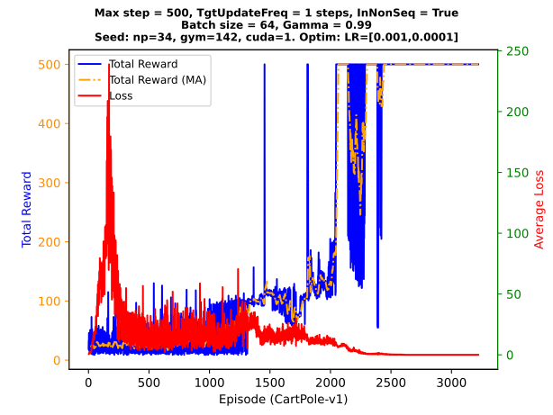

## Table of Contents

## What is Reinforcement Learning (RL)?

Reinforcement Learning (RL) is a type of artificial intelligence where a computer learns to make decisions by trying things out and seeing what works best. Imagine you're teaching a dog a new trick. You give the dog treats when it does something right, and over time, the dog learns to do the trick to get more treats. In RL, the computer is like the dog, and the treats are called rewards. The computer tries different actions in different situations and learns which actions lead to the best rewards.

In RL, the computer doesn't know the best way to do things at first. It learns by making mistakes and getting feedback from its environment. For example, if a computer is learning to play a game, it might try moving left, right, up, or down, and see which move helps it score points or avoid losing. Over time, the computer gets better at the game by figuring out which actions lead to more points. This method of learning through trial and error is what makes RL powerful and useful for teaching computers to solve complex problems.

## What does convergence mean in the context of RL?

In the context of Reinforcement Learning, convergence means that the computer has learned the best way to do things and stops changing its behavior. Imagine you're trying to find the fastest route to school. You try different paths each day, and after a while, you find the quickest one. Once you stick to that route every day, you've converged on the best solution.

In RL, the computer keeps trying different actions and learning from the rewards it gets. Over time, it figures out the best actions to take in different situations. When it stops changing its strategy because it has found the most rewarding path, it has converged. This is important because it shows that the computer has learned well and can now perform tasks efficiently.

## Why is convergence important in RL algorithms?

Convergence is important in RL algorithms because it means the computer has found the best way to do things. When an RL algorithm converges, it stops changing its actions and sticks to the best strategy it has learned. This is like finally figuring out the quickest way to school after trying different routes. If the algorithm doesn't converge, it keeps trying new things and never settles on the best solution, which makes it less useful.

Having a convergent algorithm also means the computer can be trusted to perform well in the task it was trained for. For example, if you're using RL to teach a robot to pick up objects, you want the robot to eventually find the best way to do it and stick with that method. Convergence gives us confidence that the RL system has learned effectively and can be relied upon to make good decisions consistently.

## What are the basic conditions required for an RL algorithm to converge?

For an RL algorithm to converge, it needs to meet a few key conditions. First, the algorithm needs to explore all possible actions enough times to understand their outcomes. Think of it like trying every path to school to see which is the quickest. If the algorithm doesn't try all the options, it might miss the best solution. Second, the algorithm needs to balance exploration with exploitation. This means it should keep trying new things but also use what it has learned so far. If it only tries new things, it might never settle on the best way. If it only uses what it knows, it might miss out on better options.

Another important condition is that the rewards given by the environment need to be consistent. If the rewards keep changing, the algorithm will have a hard time figuring out the best actions. Imagine if the fastest route to school changed every day; it would be tough to settle on a good path. Lastly, the algorithm needs enough time to learn. Just like you need to try different routes to school over many days, the RL algorithm needs many attempts to find the best strategy. If it doesn't have enough time, it might not converge to the best solution.

## How does the choice of learning rate affect convergence in RL?

The learning rate in RL is like how fast you learn from your experiences. If the learning rate is too high, the algorithm might jump around a lot and miss the best solution. It's like trying to find the quickest route to school but changing your mind too quickly after trying just one new path. You might end up never settling on the best way because you keep jumping to different routes without giving any of them a fair chance.

On the other hand, if the learning rate is too low, the algorithm might take forever to find the best solution. It's like being too cautious and sticking to one route for too long, even if it's not the best. You need to try new paths to find the quickest one, but if you change too slowly, you might miss out on better options. So, choosing the right learning rate is important for the RL algorithm to converge to the best solution at a good pace.

## What is the role of exploration vs. exploitation in achieving convergence?

In RL, exploration means trying new things to see if they lead to better rewards, while exploitation means using what you already know to get the best rewards you can. Both are important for the algorithm to converge to the best solution. If the algorithm only explores, it keeps trying new actions and never settles on the best one. It's like always trying new routes to school and never sticking to one long enough to see if it's the quickest. On the other hand, if the algorithm only exploits, it sticks to what it knows and might miss out on a better way. It's like always taking the same route to school even though there might be a faster one you haven't tried.

Finding the right balance between exploration and exploitation is key to making the RL algorithm converge. If the balance is right, the algorithm will explore enough to find new, better actions but also exploit what it has learned to get good rewards. This balance helps the algorithm settle on the best strategy over time. It's like trying new routes to school but also sticking with a good route once you find it, so you can get to school quickly and reliably.

## Can you explain the concept of value function convergence in RL?

In RL, a value function tells the computer how good it is to be in a certain situation. It's like knowing how close you are to the finish line in a race. The value function helps the computer decide what to do next by predicting how much reward it will get. When the value function converges, it means the computer has figured out the best guesses for how good each situation is, and it stops changing those guesses. It's like finally knowing exactly how long each route to school will take, so you can pick the quickest one every time.

Getting the value function to converge is important because it helps the computer make the best decisions. If the value function keeps changing, the computer might keep trying different things and never settle on the best way to do something. But if the value function converges, the computer can trust its guesses and use them to get the most rewards. It's like having a reliable map that shows you the quickest way to school, so you can get there faster and more easily every day.

## What are some common algorithms used in RL that guarantee convergence under certain conditions?

One common RL algorithm that can guarantee convergence under certain conditions is Q-learning. Q-learning works by trying different actions and learning how good each action is in different situations. It keeps updating its guesses about how good each action is until it finds the best ones. If Q-learning explores enough and the rewards stay the same, it will eventually find the best way to do things and stop changing its guesses. It's like trying different routes to school until you find the quickest one and stick with it.

Another algorithm that can guarantee convergence is SARSA (State-Action-Reward-State-Action). SARSA is similar to Q-learning but it takes into account what action it plans to take next when it updates its guesses. This makes it a bit different but still effective. Like Q-learning, SARSA will converge to the best solution if it explores enough and the rewards are consistent. It's like trying different routes to school but also thinking about where you'll go after school, which helps you pick the best path overall.

## How do Temporal Difference (TD) methods contribute to convergence in RL?

Temporal Difference (TD) methods are a big help in getting RL algorithms to converge. They work by learning from the differences between what the computer thinks will happen and what actually happens. Imagine you're guessing how long it takes to walk to school. If you guess it takes 10 minutes, but it actually takes 12, you'll adjust your guess next time. TD methods do something similar by updating their guesses about how good different situations are based on what they see happening. This helps the computer get closer to the best guesses over time, which is important for finding the best way to do things and stopping the changes.

TD methods are good at balancing exploration and exploitation. They don't need to wait until the end of a task to learn; they can learn from each step along the way. It's like trying a new route to school and learning from each part of the trip, not just the total time. By learning from these smaller steps, TD methods help the computer find the best way to do things faster. This means the computer can settle on the best solution more quickly and reliably, which is what convergence is all about.

## What challenges might prevent an RL algorithm from converging?

One big challenge that can stop an RL algorithm from converging is not exploring enough. If the computer doesn't try all the different actions it can do, it might miss the best way to solve a problem. Imagine if you only tried one route to school and never looked for a faster way. You'd never know if there was a quicker path. The same goes for the computer; it needs to try different things to find the best solution. If it sticks to what it knows too soon, it might get stuck and never find the best way.

Another challenge is if the rewards keep changing. If the computer is trying to learn the best way to do something, but the rewards it gets are different each time, it will have a hard time figuring out what's best. It's like if the time it takes to get to school changed every day. You'd never settle on the quickest route because it keeps changing. The computer needs consistent rewards to learn the best actions and stop changing its strategy. If the rewards are always different, the computer might keep trying new things and never converge.

## How can one evaluate whether an RL algorithm has converged?

To check if an RL algorithm has converged, you can look at how much the computer's guesses about how good different actions are keep changing. If these guesses stop changing a lot and stay pretty much the same over time, then the algorithm has probably converged. It's like if you keep trying different routes to school and finally find one that's the quickest, and you stick with that route because it's always the best. If the computer's guesses about the best actions are steady, it means it has found the best way to do things and isn't changing its mind anymore.

Another way to see if an RL algorithm has converged is by watching how well it does at the task it's trying to learn. If the computer gets better and better at the task and then stays at that high level of performance, it's a good sign that it has converged. It's like if you keep getting faster at getting to school until you can't get any faster, and then you keep using that route every day. If the computer's performance stops improving and stays good, it means it has learned the best way to do the task and has converged on the best solution.

## What advanced techniques can be used to improve the convergence speed of RL algorithms?

One way to make RL algorithms converge faster is by using something called "experience replay." Imagine you're trying to learn the quickest route to school. Instead of just remembering the last route you tried, you keep a notebook of all the routes you've taken and how long each one took. With experience replay, the computer does something similar. It saves all its past experiences and learns from them again and again. This helps the computer learn faster because it can see patterns and make better guesses about the best actions without having to try everything over and over from scratch.

Another technique to speed up convergence is called "function approximation." This is like using a map to find the quickest route to school instead of trying every possible path. In RL, the computer uses a simpler model to guess how good different actions are instead of keeping track of every single situation. This can help the computer learn faster because it doesn't need to remember so many details. It can focus on the big picture and find the best way to do things more quickly. By using these advanced techniques, the computer can reach the best solution faster and stop changing its strategy sooner.

## References & Further Reading

[1]: Sutton, R. S., & Barto, A. G. (2018). ["Reinforcement Learning: An Introduction."](https://web.stanford.edu/class/psych209/Readings/SuttonBartoIPRLBook2ndEd.pdf) MIT Press.

[2]: Silver, D., Lever, G., Heess, N., & al. (2014). ["Deterministic Policy Gradient Algorithms."](http://proceedings.mlr.press/v32/silver14.pdf) Proceedings of the 31st International Conference on Machine Learning.

[3]: Lillicrap, T. P., Hunt, J. J., Pritzel, A., & al. (2016). ["Continuous Control with Deep Reinforcement Learning."](https://arxiv.org/abs/1509.02971) arXiv:1509.02971.

[4]: Aldridge, I. (2013). ["High-Frequency Trading: A Practical Guide to Algorithmic Strategies and Trading Systems."](https://www.ahmetbeyefendi.com/wp-content/uploads/2020/07/High-Frequency-Trading-Irene-Aldridge.pdf) John Wiley & Sons.

[5]: Busseti, E., Ryu, E., & Boyd, S. (2016). ["Risk-Constrained Trading via Conic Optimization."](https://web.stanford.edu/~boyd/papers/kelly.html) Stanford University.

[6]: Friedman, J., Hastie, T., & Tibshirani, R. (2001). ["The Elements of Statistical Learning."](https://link.springer.com/book/10.1007/978-0-387-84858-7) Springer Series in Statistics.

[7]: Mnih, V., Kavukcuoglu, K., Silver, D., & al. (2015). ["Human-level control through deep reinforcement learning."](https://www.nature.com/articles/nature14236) Nature.

[8]: Lopez de Prado, M. (2018). ["Advances in Financial Machine Learning."](https://www.amazon.com/Advances-Financial-Machine-Learning-Marcos/dp/1119482089) Wiley.