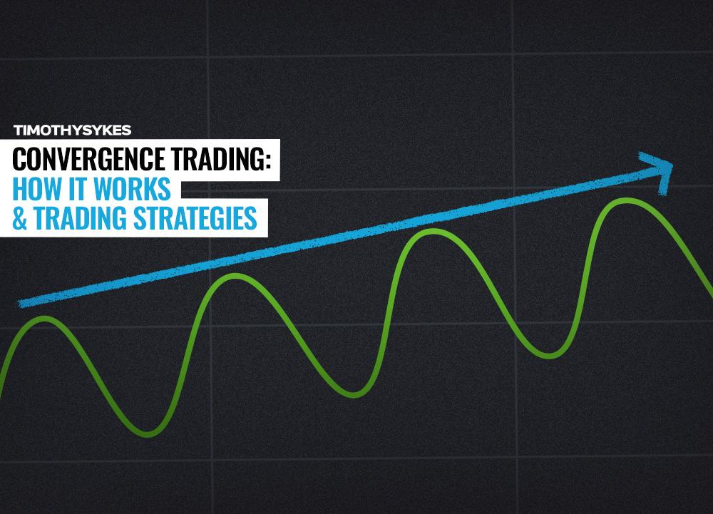

## Table of Contents

## What is a convergence trade?

A convergence trade is a type of investment strategy where an investor tries to make money by betting that the prices of two similar things will eventually become the same. Imagine you have two identical toys, but one is being sold for $10 and the other for $8. If you believe that over time, people will realize they are the same and the prices should be equal, you might buy the cheaper toy and sell the more expensive one. If the prices do come together, you can make a profit from the difference.

This strategy is often used in financial markets, like with stocks or bonds. For example, if a company has two different types of stocks that should have the same value but are currently priced differently, an investor might buy the cheaper stock and sell the more expensive one. The hope is that the prices will converge, or come together, allowing the investor to profit from the price difference. It's a bit like betting on the prices to correct themselves over time.

## How does a convergence trade work?

A convergence trade works by taking advantage of the difference in prices between two similar things that should have the same value. Let's say there are two similar stocks from the same company, but one is selling for $50 and the other for $45. An investor might buy the cheaper stock at $45 and at the same time, sell the more expensive stock at $50. The idea is that these two stocks should eventually have the same price because they are so similar.

The investor is betting that over time, the prices will come together, or converge. If this happens, and the cheaper stock goes up to $50, the investor can sell it for a profit. At the same time, if they had sold the more expensive stock at $50 earlier, they can now buy it back at the lower price of $45, making a profit on that side too. The key to a convergence trade is patience and the belief that the market will correct the price difference.

## What are the key components of a convergence trade?

The main part of a convergence trade is finding two things that are very similar but have different prices. These could be stocks, bonds, or even commodities. The idea is that because they are so alike, their prices should be the same. So, if one is cheaper and one is more expensive, an investor will buy the cheaper one and sell the more expensive one at the same time.

The next important part is waiting for the prices to come together, or converge. This means that the investor believes that over time, the market will realize that these two things should have the same value and adjust the prices accordingly. If this happens, the investor can then sell the cheaper item at the higher price and buy back the more expensive item at the lower price, making a profit from the difference. The whole strategy relies on the belief that the market will correct the price difference eventually.

## What are the typical markets where convergence trades are executed?

Convergence trades are often done in the stock market. Investors look for companies that have different kinds of stocks, like common stock and preferred stock, which should have similar values but might be priced differently. If one type of stock is cheaper than the other, an investor might buy the cheaper one and sell the more expensive one, hoping that their prices will eventually be the same. This can also happen with stocks of companies that are very similar to each other, like two companies in the same industry.

Another place where convergence trades happen a lot is in the bond market. Sometimes, bonds from the same issuer can have different prices even though they should be worth about the same. An investor might buy the cheaper bond and sell the more expensive one, expecting their prices to come together over time. Convergence trades can also be seen in commodity markets, where the same commodity might be traded on different exchanges at slightly different prices. In all these cases, the key is to find and take advantage of these price differences, betting that they will eventually correct themselves.

## What are the benefits of engaging in convergence trades?

Convergence trades can be a smart way to make money. When you see two things that are almost the same but have different prices, you can buy the cheaper one and sell the more expensive one. If their prices come together like you expect, you can make a profit from the difference. It's like finding a deal and betting that others will see it too. This can be less risky than other types of trading because you're not just guessing which way the market will go; you're betting on the prices getting closer to each other.

Another benefit is that convergence trades can work in many different markets, like stocks, bonds, and commodities. This means you have lots of chances to find these price differences and make a trade. Plus, if you're good at spotting these opportunities, you can keep doing it over and over, which can add up to a nice profit over time. It's all about being patient and waiting for the market to correct itself, which can be a steady way to make money if you're willing to wait.

## What are the risks associated with convergence trades?

One big risk with convergence trades is that the prices might not come together like you expect. Just because two things should have the same price doesn't mean they will. If the prices stay different or move even further apart, you could lose money. For example, if you buy the cheaper stock and sell the more expensive one, but the cheaper stock stays low and the expensive one keeps going up, you'll end up losing money on both sides of the trade.

Another risk is that it can take a long time for the prices to converge. You need to be patient and have enough money to keep the trade going until the prices come together. If you need your money back before the prices converge, you might have to close the trade at a loss. Also, things like sudden news or changes in the market can make the prices move in unexpected ways, which can mess up your trade and lead to losses.

## How can one identify opportunities for convergence trades?

To find opportunities for convergence trades, you need to look for things that are very similar but have different prices. This could be two stocks from the same company, bonds from the same issuer, or even the same commodity sold on different exchanges. You can use tools like financial news websites, stock screeners, and market analysis platforms to spot these differences. Keep an eye on companies or assets that are closely related, as they are more likely to have prices that should be the same but aren't yet.

Once you find a price difference, you need to do some research to understand why it exists. Sometimes, the market might have good reasons for the difference, like one stock having more risk or one bond paying out more interest. But if you think the reasons aren't strong enough and the prices should really be the same, that's when you might have found a good opportunity for a convergence trade. It's all about spotting these mismatches and believing that the market will eventually correct them.

## What strategies are commonly used in convergence trading?

One common strategy in convergence trading is called pairs trading. This is when you find two things that are very similar, like two stocks from the same company or two companies in the same industry. If one is cheaper than the other, you buy the cheaper one and sell the more expensive one at the same time. You're betting that their prices will eventually come together. This can be done with stocks, bonds, or even commodities. The key is to find things that should have the same price but don't yet.

Another strategy is called relative value [arbitrage](/wiki/arbitrage). This is a bit like pairs trading but focuses more on bonds or other fixed income securities. You look for bonds from the same issuer that have different prices. If you think the market has made a mistake and the prices should be the same, you buy the cheaper bond and sell the more expensive one. You're hoping that over time, the market will correct itself and the prices will converge. Both strategies need patience and a good understanding of why the prices are different in the first place.

## How do regulatory environments affect convergence trading?

Regulatory environments can have a big impact on convergence trading. Different countries and markets have their own rules about what you can and can't do when trading. These rules can affect how easy or hard it is to do convergence trades. For example, some places might have strict rules about short selling, which is when you sell something you don't own, hoping to buy it back later at a lower price. If short selling is limited, it can make convergence trades harder to do because you need to be able to sell the more expensive item to make the trade work.

Also, regulations can change how much information you have about the things you're trading. If the rules make it hard to get good information, it can be tougher to spot the price differences that make convergence trades possible. On the other hand, strong regulations can also help by making markets more fair and transparent, which can make it easier to trust that the prices will eventually come together. So, understanding the regulatory environment is important for anyone doing convergence trades.

## What role does technology play in executing convergence trades?

Technology is really important for doing convergence trades. It helps traders find the price differences between similar things quickly. There are special computer programs and trading platforms that can look at lots of data from different markets all at once. These tools can spot when two things that should have the same price don't, and they can do it much faster than a person could. This means traders can find and act on these opportunities before the prices change.

Once a trader finds a good opportunity, technology helps them make the trade happen. Trading platforms let you buy and sell things with just a few clicks. They also help you keep track of your trades and see how they're doing in real time. Plus, there are tools that can automatically make trades for you based on rules you set up. This can be really helpful if you want to do a lot of convergence trades without having to watch the market all the time.

## How can one measure the success of a convergence trade?

To measure the success of a convergence trade, you look at how much money you made or lost from the trade. If you bought the cheaper item and sold the more expensive one, and their prices came together like you expected, you would make a profit from the difference. For example, if you bought a stock for $45 and sold another for $50, and then the $45 stock went up to $50, you could sell it for a $5 profit and buy back the other stock for $5 less, making a total profit of $10. The more the prices converge, the more money you can make.

Another way to measure success is by looking at how long it took for the prices to come together. If the prices converged quickly, you might consider the trade a success because you didn't have to wait long to make your profit. But if it took a long time, or if the prices never came together, you might see it as less successful. It's all about balancing the profit you made with how long you had to wait and whether the trade worked out like you hoped.

## What advanced techniques can be used to enhance the effectiveness of convergence trades?

One advanced technique to make convergence trades work better is to use something called [statistical arbitrage](/wiki/statistical-arbitrage). This means using math and computer programs to find and take advantage of small price differences between similar things. These programs can look at lots of data really fast and find patterns that a person might miss. They can also help you decide when to buy and sell to make the most money. This can make your trades more successful because you're using data to guide your decisions.

Another technique is to use [machine learning](/wiki/machine-learning). This is a type of computer program that can learn from past trades and get better over time. It can look at what worked and what didn't in the past and use that information to make smarter trades in the future. Machine learning can help you spot opportunities for convergence trades more quickly and accurately. By using these advanced techniques, you can improve your chances of making money from convergence trades.

## References & Further Reading

[1]: Gatev, E. G., Goetzmann, W. N., & Rouwenhorst, K. G. (2006). ["Pairs Trading: Performance of a Relative-Value Arbitrage Rule."](http://www-stat.wharton.upenn.edu/~steele/Courses/434/434Context/PairsTrading/PairsTradingGGR.pdf) The Review of Financial Studies, 19(3), 797-827.

[2]: Elliott, R. J., van der Hoek, J., & Malcolm, W. P. (2005). ["Pairs Trading."](http://stat.wharton.upenn.edu/~steele/Courses/434/434Context/PairsTrading/PairsTradingQFin05.pdf) Quantitative Finance, 5(3), 271-276.

[3]: Lo, A. W., & MacKinlay, A. C. (1990). ["When Are Contrarian Profits Due to Stock Market Overreaction?"](https://www.jstor.org/stable/2962020) The Review of Financial Studies, 3(2), 175-205.

[4]: Avellaneda, M., & Lee, J. H. (2010). ["Statistical Arbitrage in the U.S. Equities Market."](https://papers.ssrn.com/sol3/papers.cfm?abstract_id=1153505) Quantitative Finance, 10(7), 761-782.

[5]: Narang, R. K. (2009). ["Inside the Black Box: The Simple Truth About Quantitative Trading."](https://onlinelibrary.wiley.com/doi/book/10.1002/9781118267738) Wiley Finance.