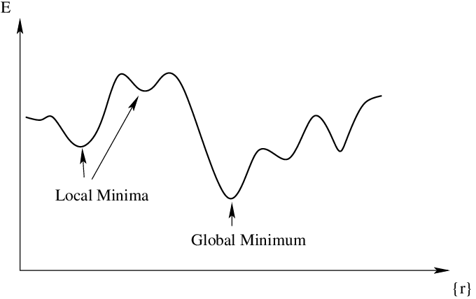

## Table of Contents

## What is convergence in the context of machine learning?

Convergence in machine learning refers to the process where a model's performance stabilizes over time as it learns from the data. Imagine training a model like teaching a child to ride a bike. At first, the child might wobble a lot, but with practice, they get better and eventually ride smoothly. Similarly, a machine learning model starts with random guesses and, through repeated adjustments based on the data, its predictions become more accurate until they stop improving significantly. This point of stability is called convergence.

To understand if a model has converged, we look at metrics like loss or accuracy over training iterations. If the loss, which measures how wrong the model's predictions are, stops decreasing and levels off, or if the accuracy, which measures how correct the model's predictions are, stops increasing, we say the model has converged. For example, in gradient descent, a common optimization algorithm, the model updates its parameters to minimize the loss function. If the updates become very small, indicating that further changes won't significantly improve performance, the model has likely reached convergence. This can be visualized as the model finding the lowest point in a valley, where moving in any direction won't lead to a lower point.

## Why is convergence important in training machine learning models?

Convergence is important in training machine learning models because it tells us when the model has learned as much as it can from the data. Think of it like studying for a test. You keep studying until you feel you can't learn any more. When a machine learning model converges, it means it has found the best way to make predictions based on the training data. If the model doesn't converge, it might keep changing its predictions without getting better, which is like studying without actually learning anything useful.

Knowing when a model has converged helps us decide when to stop training. If we train a model too long after it has converged, we might start to see overfitting, where the model learns the training data too well, including any mistakes or noise, and performs poorly on new data. On the other hand, if we stop training too soon, before convergence, the model might not have learned enough to make good predictions. So, finding the right point of convergence is key to getting the best performance from a machine learning model.

## How does convergence relate to the concept of loss in machine learning?

Convergence in machine learning is closely tied to the concept of loss. Loss is a measure of how wrong a model's predictions are compared to the actual data. When we train a model, we're trying to minimize this loss, making our predictions as accurate as possible. As the model learns from the data, the loss usually goes down. When the loss stops decreasing and stays at a stable level, we say the model has converged. This means the model has found the best way it can to predict outcomes based on the training data.

Think of loss like the score in a game where the goal is to get the lowest score possible. At the start, the model might make big mistakes, leading to a high loss. As it learns, it makes smaller mistakes, and the loss goes down. When the loss stops getting lower, it's like reaching the end of the game with the best score you can get. That's when the model has converged. If the loss keeps going down without stopping, the model might be overfitting, learning the training data too well and not generalizing to new data. If the loss stops decreasing too soon, the model might not have learned enough to make good predictions. So, watching the loss helps us know when the model has converged and is ready to use.

## What are the common indicators that a model has reached convergence?

Common indicators that a model has reached convergence include a stable loss value and no significant changes in the model's performance metrics. When training a model, we often track the loss, which measures how wrong the model's predictions are. If the loss stops getting smaller and stays at about the same level for a while, it's a good sign that the model has converged. Another way to check is by looking at the model's accuracy or other performance metrics. If these metrics stop improving and stay steady, it means the model has learned as much as it can from the data.

Sometimes, we also look at how much the model's parameters change during training. If these changes become very small, it suggests the model is close to the best solution it can find. For example, in gradient descent, if the updates to the parameters get tiny, it means the model is at the bottom of the loss function's valley and won't get much better by moving. We can use a simple formula to describe this: if $$\Delta w$$ represents the change in the model's weights, and $$\Delta w \approx 0$$ for several iterations, the model has likely converged.

In practice, we might set a threshold for the loss or the change in weights and say the model has converged when these values stay below the threshold for a certain number of iterations. This helps us know when to stop training and use the model for making predictions. By watching these indicators, we can make sure the model is ready to perform well on new data.

## Can you explain the difference between local and global convergence in machine learning?

In machine learning, when we talk about convergence, we can think about it in two ways: local convergence and global convergence. Local convergence happens when a model finds a good solution that's better than the ones around it, but it might not be the best solution overall. Imagine you're hiking and you find a low spot in a valley. It's the lowest point near you, but there might be an even lower valley somewhere else on the mountain. In machine learning, if a model's loss stops decreasing and stays stable at this point, we say it has reached local convergence. Mathematically, if the gradient of the loss function at a point is zero, $$ \nabla L(w) = 0 $$, and the loss is lower than nearby points, the model has locally converged.

Global convergence, on the other hand, is when the model finds the absolute best solution possible. Using the hiking example again, global convergence would be finding the lowest point on the entire mountain. In machine learning, this means the model has found the lowest possible loss value across all possible solutions. However, finding global convergence can be very hard, especially with complex models and large datasets, because the search space is so big. While local convergence is more common and easier to achieve, global convergence is the ideal goal, but we often settle for local convergence because it's practical and still gives us good results.

## What are some common techniques used to achieve convergence in machine learning algorithms?

To help machine learning models reach convergence, one common technique is using optimization algorithms like gradient descent. These algorithms work by making small adjustments to the model's parameters to minimize the loss function. For example, in gradient descent, the model calculates the gradient of the loss function, $$ \nabla L(w) $$, and moves in the opposite direction of this gradient to reduce the loss. The learning rate, which controls the size of these adjustments, plays a crucial role. If it's too large, the model might overshoot the best solution, while if it's too small, the model might take too long to converge.

Another technique is to use learning rate schedules, which change the learning rate during training. For instance, starting with a high learning rate can help the model move quickly towards a good solution, and then gradually reducing it can help fine-tune the model to reach convergence. Techniques like momentum can also help, where the model's updates consider the direction of previous updates, helping it move past small bumps and reach a better solution faster. These methods help the model find a good balance between speed and accuracy, guiding it towards convergence.

Regularization is another important technique that helps models converge by preventing overfitting. Overfitting happens when a model learns the training data too well, including any noise or errors, which can stop it from generalizing to new data. Regularization adds a penalty to the loss function, like L1 or L2 regularization, which discourages the model from making its parameters too large. This helps the model find a simpler solution that's more likely to work well on new data, aiding in convergence. By using these techniques together, we can help machine learning models find the best solutions and reach convergence more effectively.

## How does the learning rate affect the convergence of a machine learning model?

The learning rate is like the speed at which a machine learning model learns from the data. It controls how big the steps are that the model takes to minimize the loss function. If the learning rate is too high, the model might take big jumps and overshoot the best solution, causing it to bounce around and never settle down. This can prevent the model from converging because it keeps missing the target. On the other hand, if the learning rate is too low, the model takes tiny steps and might take a very long time to reach the best solution, or it might get stuck in a spot that's not the best but is good enough. So, finding the right learning rate is crucial for the model to converge smoothly and quickly.

To help with this, people often use learning rate schedules, which change the learning rate during training. For example, you might start with a high learning rate to get the model close to a good solution quickly, and then slowly lower it so the model can fine-tune its parameters and reach the best solution. This can be done using a formula like $$ \alpha_t = \frac{\alpha_0}{1 + \frac{t}{t_0}} $$, where $$ \alpha_t $$ is the learning rate at time step $$ t $$, $$ \alpha_0 $$ is the initial learning rate, and $$ t_0 $$ is a constant that controls how fast the learning rate decreases. By adjusting the learning rate in this way, the model can converge more reliably and efficiently, finding the best solution without getting stuck or overshooting.

## What challenges might prevent a machine learning model from converging?

Sometimes, a machine learning model might have trouble reaching convergence because of a few common problems. One big issue is choosing the wrong learning rate. If the learning rate is too high, the model might jump around and never settle on the best solution. It's like trying to find a small target while taking giant steps. If the learning rate is too low, the model might take tiny steps and take forever to get to the best solution, or it might stop too soon and not get to the best spot. Another problem is noisy or bad data. If the data the model is learning from has a lot of mistakes or is not a good representation of what the model needs to predict, the model might get confused and not be able to find a good solution.

Another challenge is the model's complexity. If the model is too simple, it might not be able to learn the patterns in the data well enough to reach a good solution. On the other hand, if the model is too complex, it might start to learn the noise in the data instead of the real patterns, which can lead to overfitting and prevent convergence. Regularization can help with this by adding a penalty to the model's loss function, like $$ L = L_0 + \lambda \sum_{i=1}^n w_i^2 $$, where $$ L_0 $$ is the original loss, $$ \lambda $$ is the regularization parameter, and $$ w_i $$ are the model's weights. This encourages the model to find simpler solutions that are more likely to work well on new data. By understanding and addressing these challenges, we can help machine learning models reach convergence more reliably.

## How can one diagnose and address non-convergence issues in machine learning models?

When a machine learning model isn't converging, the first step is to check the learning rate. If the learning rate is too high, the model might jump around and never settle on a good solution. You can try lowering the learning rate to see if the model starts to converge. If the learning rate is too low, the model might take tiny steps and take forever to reach the best solution. In this case, you might want to increase the learning rate a bit or use a learning rate schedule. A learning rate schedule changes the learning rate during training, like starting with a high rate and slowly lowering it. You can use a formula like $$ \alpha_t = \frac{\alpha_0}{1 + \frac{t}{t_0}} $$ to adjust the learning rate over time, where $$ \alpha_t $$ is the learning rate at time step $$ t $$, $$ \alpha_0 $$ is the initial learning rate, and $$ t_0 $$ is a constant that controls how fast the learning rate decreases.

Another thing to look at is the quality of your data. If the data has a lot of mistakes or isn't a good representation of what the model needs to predict, the model might get confused and not be able to find a good solution. Try cleaning the data, removing any errors, and making sure it's a good fit for your model. Also, check if your model is too simple or too complex. If it's too simple, it might not be able to learn the patterns in the data well enough. If it's too complex, it might start to learn the noise in the data instead of the real patterns, which can lead to overfitting. You can use regularization to help with this. Regularization adds a penalty to the model's loss function, like $$ L = L_0 + \lambda \sum_{i=1}^n w_i^2 $$, where $$ L_0 $$ is the original loss, $$ \lambda $$ is the regularization parameter, and $$ w_i $$ are the model's weights. This encourages the model to find simpler solutions that are more likely to work well on new data. By addressing these issues, you can help your machine learning model reach convergence more reliably.

## What role does the choice of optimization algorithm play in achieving convergence?

The choice of optimization algorithm is super important for helping a machine learning model reach convergence. Different algorithms have different ways of adjusting the model's parameters to minimize the loss function. For example, gradient descent is a common one that moves the model in the direction that reduces the loss the most. But there are fancier versions like stochastic gradient descent (SGD), which can help the model converge faster by using random samples of the data instead of the whole dataset at once. Another cool algorithm is Adam, which not only looks at the gradient but also at how much the gradient changes over time, making the model's updates smoother and helping it find the best solution more reliably.

Sometimes, the choice of algorithm can make a big difference in how quickly and reliably a model reaches convergence. For instance, if the loss function has a lot of bumps and valleys, an algorithm like SGD with momentum can help the model move past small bumps and get to a better solution faster. Momentum adds a bit of the previous update to the current one, like $$ v_t = \beta v_{t-1} + (1 - \beta) \nabla L(w_t) $$, where $$ v_t $$ is the update at time step $$ t $$, $$ \beta $$ is the momentum parameter, and $$ \nabla L(w_t) $$ is the gradient of the loss function. By picking the right optimization algorithm, you can make sure your model finds the best solution without getting stuck or taking too long to converge.

## How do advanced techniques like adaptive learning rates influence convergence?

Advanced techniques like adaptive learning rates can really help machine learning models reach convergence faster and more reliably. Instead of using a fixed learning rate, these methods change the learning rate during training based on how the model is doing. For example, if the loss is going down quickly, the learning rate might get smaller to help the model fine-tune its predictions. If the loss isn't changing much, the learning rate might get bigger to help the model move out of a plateau. One popular method is called Adam, which not only adjusts the learning rate but also considers how the gradient changes over time. This helps the model make smoother updates and find the best solution more easily.

Using adaptive learning rates can make a big difference in how well a model converges. For instance, with a formula like $$ \alpha_t = \frac{\alpha_0}{\sqrt{t}} $$, the learning rate $$ \alpha_t $$ decreases as the number of iterations $$ t $$ increases, helping the model to get closer to the best solution without overshooting. Another method, called learning rate annealing, slowly reduces the learning rate over time, which can be done using a formula like $$ \alpha_t = \alpha_0 \cdot \gamma^t $$, where $$ \gamma $$ is a decay rate. By adjusting the learning rate in these ways, the model can learn more efficiently and reach a point where the loss stops changing significantly, meaning it has converged.

## What are the latest research trends in improving convergence in deep learning models?

Recent research in deep learning focuses a lot on making models reach convergence faster and better. One big trend is using smarter optimization methods. For example, researchers are working on new versions of algorithms like Adam and SGD that adapt even better to the data. These new methods, like AdamW and Lookahead, change the learning rate and other settings during training to help the model find the best solution more quickly. Another trend is using techniques like learning rate warm-up, where the learning rate starts small and slowly increases before decreasing again. This helps the model start learning smoothly and then fine-tune its predictions. Researchers are also looking into ways to make the model's loss function smoother, so it's easier for the model to find the best solution.

Another exciting area is the use of meta-learning, where models learn how to learn from other models. This can help them figure out the best settings for things like the learning rate and other hyperparameters, making convergence faster and more reliable. For example, some researchers use techniques like Hyperband to search for the best hyperparameters more efficiently. There's also a lot of work on understanding why models sometimes don't converge well, like when they get stuck in local minima or plateaus. By studying these problems, researchers hope to find new ways to help models escape these traps and reach global convergence. Overall, these trends are all about making deep learning models smarter and more efficient at finding the best solutions.