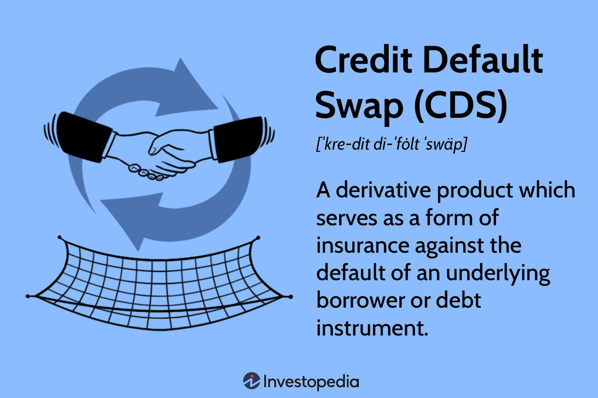

Financial derivatives are crucial instruments in contemporary financial markets, offering a means for participants to manage a variety of risks and capitalize on market inefficiencies. Derivatives derive their value from underlying entities, such as stocks, bonds, commodities, or interest rates, providing versatile tools for risk management, speculation, and arbitrage. In particular, credit-based derivatives like credit default swaps (CDS) are indispensable for managing credit risk. CDS function similarly to insurance policies, allowing the transfer of credit risk from one party to another and thus providing a hedge against potential credit events, such as defaults or restructurings.

The advent of algorithmic trading has significantly revolutionized the trading landscape for financial derivatives, particularly credit-based products. Algorithmic trading employs sophisticated mathematical models and automated systems to execute trades at speeds and efficiencies unattainable by human traders. This technological advancement has led to unparalleled improvements in trade execution, liquidity provision, and risk management across derivative markets. Algorithms can swiftly assess vast datasets, identify patterns, and optimize trading strategies, thereby enhancing market efficiency and enabling precise handling of credit risk.



This article investigates the intersection of credit derivatives and algorithmic trading, shedding light on how their integration impacts financial markets. As technology continues to evolve, understanding the confluence of these two aspects of finance can unlock new opportunities and bolster the strategic capabilities of market participants. The role of technology, particularly algorithmic trading, remains pivotal in optimizing the efficiency and effectiveness of derivative trading, contributing significantly to advancements in credit risk management and financial market operations.

## Table of Contents

## Understanding Financial Derivatives

Financial derivatives are financial instruments whose value is contingent upon the value of underlying assets such as stocks, bonds, or other financial entities. The primary types of financial derivatives include futures, options, and swaps, each serving distinct and significant purposes within financial markets.

1. **Futures Contracts**: A futures contract is an agreement to buy or sell an asset at a predetermined future date and price. It provides market participants with a means to hedge against price fluctuations. For example, an investor can secure a price for oil, reducing the risk of adverse price movements in the future.

2. **Options**: Options grant the holder the right, but not the obligation, to buy (call option) or sell (put option) an asset at a specified price before or at the expiration date. This inherent flexibility makes them a vital tool for hedging and speculative purposes. A call option can hedge against rising stock prices, while a put option can protect against falling prices.

3. **Swaps**: Swaps are agreements to exchange cash flows or financial instruments between parties. The most common type is the interest rate swap, allowing parties to exchange fixed rate payments for floating rate payments or vice versa. Swaps enable institutions to manage exposure to fluctuations in interest rates or currency exchange rates.

Derivatives play a critical role in risk management, allowing corporations and investors to shield against unfavorable market movements. For instance, by using derivatives, an agricultural producer can hedge against price declines in their crop, ensuring financial stability irrespective of market [volatility](/wiki/volatility-trading-strategies).

Additionally, derivatives facilitate speculation, allowing traders to take advantage of expected market movements without owning the underlying asset. This aspect contributes to market [liquidity](/wiki/liquidity-risk-premium) and price discovery, enhancing the market's overall efficiency.

Arbitrage is another important function of derivatives. Arbitrageurs utilize derivatives to exploit price discrepancies between markets, thus ensuring that prices remain aligned globally. Their activities contribute to market efficiency and prevent the establishment of unexploited opportunities for profit.

Ultimately, financial derivatives allow market participants to manage and optimize their financial exposure by facilitating strategies to hedge against volatility and capitalize on anticipated price movements. This capability underscores their indispensable nature in contemporary financial markets.

## Exploring Credit Events

Credit events are pivotal occurrences that can significantly alter the creditworthiness of an entity. These events typically include defaults, restructurings, and bankruptcies. When such events occur, they can have far-reaching impacts on the stability and financial health of the affected entities, necessitating intricate credit risk management processes.

Defaults occur when a borrower fails to meet the legal obligations of debt repayment, leading to a breach of contract. This can happen with varying severity, from missing a single payment to complete inability to meet debt commitments. Restructurings, on the other hand, involve altering the terms of existing debt agreements, often to provide the borrower with relief from debt obligations that they are unable to meet under the original terms. This can include changes to the repayment schedule, interest rates, or the amount of the principal.

Bankruptcies are formal legal proceedings in which a debtor declares an inability to repay outstanding debts. This allows for the fair distribution of the debtor's assets among creditors. Bankruptcies have significant implications, not just for the entity filing for bankruptcy but also for creditors and stakeholders, as they often lead to a reevaluation of the entity’s credit risk and financial standing.

These credit events are critical triggers in the credit derivatives market, particularly in the context of credit default swaps (CDS). A CDS is essentially a financial agreement that allows the transfer of credit exposure between parties. When a credit event such as default, restructuring, or bankruptcy occurs, it triggers settlement processes in CDS contracts, leading to potential payouts for protection buyers who have bet against the creditworthiness of the reference entity.

Understanding credit events is crucial for effective credit risk management. It enables financial institutions and investors to assess the likelihood of such events and manage their exposure to potential losses effectively. Advanced credit risk assessment methodologies, often involving statistical models and financial analysis, are employed to predict and prepare for these events. This understanding not only supports risk mitigation strategies but also informs decision-making around investment and lending by anticipating changes in entity creditworthiness.

In summary, credit events play a crucial role in determining the creditworthiness of entities and in the settlement processes of the credit derivatives market. Their understanding is indispensable for managing credit risk and ensuring financial stability.

## Credit Default Swaps: An Essential Tool

Credit Default Swaps (CDS) are financial contracts that enable the transfer of credit risk related to a particular entity, commonly referred to as the reference entity, between two parties. Acting similarly to insurance, the buyer of a CDS receives protection against credit events such as defaults, restructurings, or bankruptcies of the reference entity, while the seller of the CDS commits to compensating the buyer in the occurrence of such credit events. This mechanism allows parties to hedge against potential losses from credit events affecting debt instruments.

CDS are used extensively to manage and hedge credit risks associated with various debt instruments, including corporate bonds, sovereign debt, and municipal securities. By purchasing a CDS, bondholders can protect themselves from potential losses arising from the issuer's credit deterioration. For instance, if a bondholder fears that a company might default on its bond payments, they can buy a CDS as a form of protection. Should the company default, the CDS seller compensates the bondholder, thus mitigating the loss.

The CDS market features different types of instruments, including single-name CDS and CDS indices such as CDX and iTraxx. Single-name CDS pertain to individual reference entities, whereas CDS indices represent a basket of several entities. For example, the CDX index in North America and the iTraxx index in Europe are popular instruments that offer exposure to a broad range of credit risks. These indices help investors to diversify their credit risk and gain exposure to multiple entities without purchasing individual CDS contracts for each one.

Despite facing scrutiny, particularly during the 2008 financial crisis, CDS remain critical for managing credit exposure. Critics argue that CDS can lead to speculative trading and lack transparency. However, advocates highlight their role in providing liquidity and spreading credit risk across the financial system. The CDS market can enhance price discovery and enable market participants to express their views on credit quality quickly.

Overall, Credit Default Swaps are indispensable tools in the financial markets for transferring and managing credit risk. They offer both protection for investors and flexibility in trading, ensuring that credit exposure is properly managed and mitigated. As a result, CDS continue to play a pivotal role in modern finance, enabling strategic risk management and fostering resilience against credit events.

## The Interplay of Credit Derivatives and Algo Trading

Algorithmic trading has significantly transformed the trading landscape for credit derivatives such as credit default swaps (CDS). By leveraging algorithms, trading operations now execute with enhanced efficiency and speed, thereby reshaping traditional trading paradigms. These algorithms facilitate high-frequency trades, offering the capability to react to market changes in milliseconds. This precision ensures that traders can capitalize on fleeting market opportunities, thus optimizing trading performance.

Algorithms provide much-needed liquidity in credit derivative markets, characterized by their complexity and periodic illiquidity. By automating the matching of buy and sell orders, these algorithms help maintain market fluidity, enabling continuous price discovery processes and tighter spreads. This liquidity enhances overall market stability, even amidst high volatility periods.

Additionally, algorithms are central to precise risk management strategies in credit derivative transactions. They can dynamically adjust trading parameters in response to real-time data, enabling market participants to hedge exposures swiftly. This dynamic adaptability is critical in managing credit risks effectively, especially when dealing with unexpected credit events like defaults or downgrades.

The integration of [machine learning](/wiki/machine-learning) in [algorithmic trading](/wiki/algorithmic-trading) has further propelled the sophistication of trading strategies. Machine learning models analyze vast datasets to recognize patterns and predict market movements, thereby informing decision-making processes. For example, supervised learning models can be trained on historical market data to identify profitable trading strategies, while [reinforcement learning](/wiki/reinforcement-learning) approaches might optimize execution algorithms by learning from simulated market environments.

However, algorithmic trading in credit derivatives is not without its challenges. The complexity of credit markets, coupled with the intrinsic risks of automated trading systems, can sometimes lead to disruptions. Technical failures or erroneous algorithms have the potential to cause significant market imbalances. Despite these risks, the advantages offered by algorithmic trading—in terms of speed, efficiency, and risk management—render it indispensable in modern credit markets.

In conclusion, algorithmic trading is not just a facilitator but a driver of innovation and efficiency in credit derivative markets. By ensuring liquidity, supporting complex risk management frameworks, and leveraging machine learning, algorithms play a crucial role in optimizing credit derivative trading strategies. As technology evolves, the integration of more advanced computational techniques will likely continue to shape and enhance these trading dynamics.

## Risk Management and Regulatory Implications

Effective risk management is a cornerstone of successful derivatives trading, serving as a safeguard against systemic risk. In the context of financial derivatives, and particularly credit derivatives, risk management plays a critical role in maintaining the integrity and stability of financial markets. This is achieved through a combination of regulatory frameworks, advanced technological tools, and strategic financial practices.

Regulatory frameworks such as the Dodd-Frank Wall Street Reform and Consumer Protection Act in the United States and the European Market Infrastructure Regulation (EMIR) in the European Union have been implemented to enhance transparency and mitigate risks in derivative markets. These regulations mandate central clearing for standardized over-the-counter (OTC) derivatives and require robust reporting and record-keeping, which collectively serve to reduce counterparty risk and improve market transparency.

Risk management in the derivatives market involves several key components:

1. **Credit Risk Assessment**: This involves evaluating the probability of a counterparty defaulting on its obligations. Credit risk models, such as the Credit Valuation Adjustment (CVA), are employed to quantify the potential exposure to credit risk. Sophisticated statistical tools and models, including those based on the Gaussian copula or structural models like Merton's model, are used to assess and manage this risk efficiently.

2. **Collateral Management**: Collateral serves as a critical risk mitigant in derivative transactions. By requiring counterparties to post collateral – typically cash or securities – financial institutions can protect themselves against potential defaults. Collateral management systems have evolved with advancements in technology, allowing for real-time monitoring and adjustment of collateral based on market movements and counterparty creditworthiness.

3. **Market and Liquidity Risk**: These are addressed through stress testing and scenario analysis, which simulate potential adverse market conditions and their impact on portfolio value. Advanced risk management platforms integrate these analyses to provide comprehensive oversight of market and liquidity risks.

The advent of advanced technology has significantly enhanced risk management capabilities. Real-time risk monitoring systems utilize big data analytics and machine learning algorithms to deliver prompt insights and predictive analytics. This allows market participants to make informed decisions quickly, reducing the latency between risk identification and mitigation.

For instance, Python's libraries such as Pandas and NumPy enable the handling of large datasets for risk calculations, while machine learning libraries like Scikit-learn can be employed to develop predictive models for market trends and credit events. The implementation of integrated systems that leverage these technological advancements is crucial for maintaining competitive advantage and ensuring robust risk management.

In conclusion, effective risk management is crucial in the derivatives market to prevent systemic risk. Regulatory regimes like Dodd-Frank and EMIR, alongside advanced technologies, empower financial institutions to manage credit risk, collateral, and other market-related risks efficiently. The continuous evolution of risk management strategies and tools will remain essential to maintaining stability and competitiveness in financial markets.

## Conclusion

Credit derivatives and algorithmic trading form a dynamic synergy in financial markets by offering enhanced tools for risk management and enabling more strategic trading activities. By facilitating the transfer of credit risk, credit derivatives play a crucial role in the broader financial ecosystem, allowing participants to hedge against potential adverse credit events and mitigate exposure. Algorithmic trading complements this by providing the technological infrastructure necessary to execute these trades with unparalleled speed and precision. 

The integration of credit derivatives and algorithmic trading not only enhances transactional efficiency but also broadens the strategic possibilities for market participants. Mastery of algorithmic trading strategies allows traders to capitalize on market inefficiencies and dynamic pricing opportunities, further optimizing their portfolios. Moreover, the synergy of these elements offers traders the ability to deploy complex strategies that align seamlessly with their risk management and investment objectives.

The role of technology is pivotal in optimizing the efficiency of derivative trading. The use of advanced computing power and machine learning models in algorithmic trading can significantly minimize latency and transaction costs. For example, predictive modeling techniques can be employed to foresee market trends and adapt strategies accordingly. The following Python snippet demonstrates how a simple moving average crossover algorithm can be used to generate trading signals:

```python
import pandas as pd

# Sample data
data = pd.DataFrame({
    'Price': [100, 101, 102, 99, 98, 100, 104, 105, 103, 108]
})

# Calculate moving averages
data['SMA_5'] = data['Price'].rolling(window=5).mean()
data['SMA_3'] = data['Price'].rolling(window=3).mean()

# Generate signals
data['Signal'] = 0
data.loc[data['SMA_3'] > data['SMA_5'], 'Signal'] = 1
data.loc[data['SMA_3'] < data['SMA_5'], 'Signal'] = -1

print(data[['Price', 'SMA_5', 'SMA_3', 'Signal']])
```

Overall, the convergence of credit derivatives and algorithmic trading represents a significant advancement in financial market operations, propelling improvements in both transaction processing and strategic decision-making efficiency. This interplay continues to unlock new opportunities for market participants, driving innovation and competitiveness within the financial industry. Understanding and leveraging this dynamic combination are essential for those looking to thrive in modern financial markets.

## References & Further Reading

Hull, J. C., in his book "Alternatives, Futures, and Other Derivatives," provides a comprehensive overview of derivatives, including pricing, trading, and risk management techniques. It is an essential resource for understanding the mechanics and applications of derivatives in financial markets.

Stulz, R. M., in "Credit Default Swaps and the Credit Crisis," analyzes the role of credit default swaps (CDS) during financial crises. This work explores their impact on market dynamics and systemic risk, making it crucial for understanding the complexities of CDS markets.

Duffie, D.'s "Credit Swap Valuation" offers an in-depth examination of valuation methods for credit derivatives, focusing on mathematical models and market practices. This work is a valuable resource for professionals engaged in credit risk assessment and management.

Lopez de Prado, M., in "Advances in Financial Machine Learning," investigates into machine learning techniques applied to financial markets. The book emphasizes quantitative strategies and provides practical examples of algorithmic trading enhancements through machine learning.

Durbin, M.'s "All About Derivatives" serves as a primer on derivatives, explaining the different types and their uses in risk management and speculation. It is suitable for beginners and those seeking to solidify their foundational knowledge of financial derivatives.

Awrey, D. explores regulatory frameworks in "The FSA, Integrated Regulation, and the Curious Case of OTC Derivatives." This work discusses regulatory responses to the complexities and risks associated with over-the-counter (OTC) derivatives, offering insights into policy formation and enforcement challenges.

