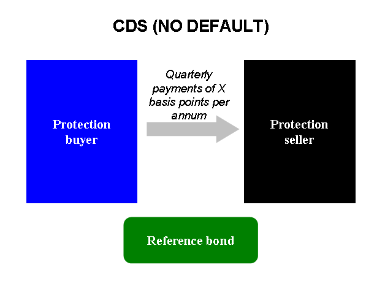

## Table of Contents

## What is a Convergent Credit Default Swap (CCDS)?

A Convergent Credit Default Swap (CCDS) is a type of financial agreement that helps manage the risk of a borrower not being able to pay back their debt. In a CCDS, one party, called the buyer, pays a regular fee to another party, called the seller. In return, the seller agrees to pay the buyer if the borrower fails to make their payments. This arrangement is similar to insurance, where the buyer is protected against the risk of default.

What makes a CCDS different from a regular credit default swap is that it uses a special formula to adjust the payments over time. This formula helps make sure that the value of the CCDS stays in line with the actual risk of the borrower defaulting. By doing this, the CCDS aims to be more accurate and fair for both the buyer and the seller. This can make it a useful tool for investors who want to manage their risk more effectively.

## How does a CCDS differ from a traditional Credit Default Swap (CDS)?

A Convergent Credit Default Swap (CCDS) and a traditional Credit Default Swap (CDS) both help manage the risk of a borrower not paying back their debt. In both cases, one party, the buyer, pays regular fees to another party, the seller. If the borrower fails to make their payments, the seller compensates the buyer. This is similar to an insurance policy where the buyer is protected against the risk of default.

The main difference between a CCDS and a CDS lies in how they handle the payments over time. A traditional CDS has fixed payments that do not change unless there is a credit event. On the other hand, a CCDS uses a special formula to adjust the payments. This formula helps ensure that the value of the CCDS stays in line with the actual risk of the borrower defaulting. By doing this, a CCDS aims to be more accurate and fair, making it a potentially better tool for investors who want to manage their risk more effectively.

## What are the key components of a CCDS?

A Convergent Credit Default Swap (CCDS) has several important parts that make it work. The first part is the buyer and the seller. The buyer pays the seller regular fees, like a subscription. The seller promises to pay the buyer if the borrower, who owes money, cannot pay it back. This is like an insurance policy where the buyer is protected from the risk of the borrower not paying.

The second important part of a CCDS is the special formula it uses. This formula is different from a regular credit default swap. It changes the payments over time to match the actual risk of the borrower not paying back their debt. This means the payments can go up or down depending on how likely it is that the borrower will default. This helps make the CCDS fair and accurate for both the buyer and the seller.

## Who are the typical participants in a CCDS market?

The typical participants in a Convergent Credit Default Swap (CCDS) market are investors and financial institutions. Investors use CCDS to protect themselves from the risk that a borrower might not pay back their debt. They pay regular fees to a seller, who could be a bank or another financial institution. If the borrower defaults, the seller pays the investor to cover the loss. This is like buying insurance for their investment.

Financial institutions, like banks and hedge funds, are also big players in the CCDS market. They might sell CCDS to earn the regular fees paid by investors. They use their knowledge of the market and special formulas to adjust the fees over time. This makes the CCDS more accurate and fair for both the buyer and the seller. By participating in the CCDS market, these institutions help investors manage their risk better and keep the financial system stable.

## What are the benefits of using a CCDS over other credit derivatives?

Using a Convergent Credit Default Swap (CCDS) has some big advantages over other credit derivatives. One main benefit is that a CCDS uses a special formula to change the payments over time. This makes sure the payments match the real risk of the borrower not paying back their debt. This means the CCDS is more accurate and fair for both the buyer and the seller. Other credit derivatives might not adjust their payments, which can make them less accurate if the risk changes.

Another benefit of a CCDS is that it helps investors manage their risk better. Because the payments change to match the risk, investors can feel more confident that they are protected if the borrower defaults. This can make CCDS a useful tool for investors who want to protect their investments without paying too much. Financial institutions also like CCDS because they can earn steady fees from selling them, which can be good for their business.

## How is the pricing of a CCDS determined?

The pricing of a Convergent Credit Default Swap (CCDS) is based on a special formula that looks at how likely it is that the borrower will not pay back their debt. This formula changes the payments over time to make sure they match the real risk. The price is also affected by things like the credit rating of the borrower, how long the CCDS will last, and what the market thinks about the economy. All these things help decide how much the buyer will pay to the seller.

Because the payments in a CCDS can change, the price can be more fair and accurate than other credit derivatives. If the risk of the borrower not paying goes up, the payments might go up too. If the risk goes down, the payments might go down. This makes the CCDS a good tool for investors who want to manage their risk without paying too much. Financial institutions like banks and hedge funds use this pricing method to make sure they are getting a good deal when they sell CCDS.

## What are the risks associated with trading CCDSs?

Trading Convergent Credit Default Swaps (CCDSs) comes with several risks. One big risk is that the buyer might have to pay more if the risk of the borrower not paying back their debt goes up. This can happen if the borrower's credit rating gets worse or if the economy is not doing well. The payments in a CCDS change over time to match the risk, so if the risk goes up, the buyer has to pay more to the seller.

Another risk is that the seller might not be able to pay the buyer if the borrower does default. This is called counterparty risk. If the seller, like a bank or financial institution, runs into financial trouble, they might not be able to keep their promise to pay. This can leave the buyer without the protection they were counting on. It's important for buyers to check the financial health of the seller before entering into a CCDS agreement.

Lastly, there's the risk that the market for CCDSs might not be very liquid. This means it can be hard to buy or sell a CCDS quickly or at a good price. If an investor wants to get out of a CCDS, they might have to wait or accept a lower price than they hoped for. This can make it harder to manage risk and can lead to unexpected losses if the market changes suddenly.

## Can you explain the process of settling a CCDS?

When a Convergent Credit Default Swap (CCDS) needs to be settled, it happens because the borrower can't pay back their debt. This is called a credit event. When this happens, the buyer of the CCDS tells the seller about it. The seller then checks to make sure the credit event really happened. If it did, the seller has to pay the buyer to cover the loss from the borrower not paying.

The way the seller pays the buyer can be different depending on the agreement. Usually, the seller will either pay the buyer the full amount of the debt that wasn't paid, or they will buy the debt from the buyer at its full value. This helps the buyer get back the money they lost because the borrower couldn't pay. The whole process is meant to be quick and fair, so the buyer doesn't have to wait too long to get their money back.

## How do regulatory frameworks affect the use of CCDSs?

Regulatory frameworks can have a big impact on how Convergent Credit Default Swaps (CCDSs) are used. Governments and financial regulators set rules to make sure that trading CCDSs is safe and fair. For example, they might require banks and other financial institutions to report their CCDS deals and keep enough money on hand to cover any losses. These rules help prevent big problems in the financial system, like what happened during the 2008 financial crisis when many credit derivatives were not well regulated.

These regulations can also make it harder for some people to use CCDSs. For instance, small investors might find it tough to meet the strict rules and reporting requirements. On the other hand, big banks and financial institutions often have the resources to follow these rules, so they can keep using CCDSs to manage their risk. Overall, while regulations help keep the market stable and protect investors, they can also limit who can use CCDSs and how they can be used.

## What are some real-world applications or case studies of CCDSs?

One real-world application of Convergent Credit Default Swaps (CCDSs) can be seen in how big banks use them to manage their risk. For example, a bank might have a lot of loans to a company that is starting to struggle financially. The bank can buy a CCDS to protect itself in case the company can't pay back the loans. The CCDS payments adjust over time based on how likely it is that the company will default, so the bank only pays what's fair for the risk. This helps the bank manage its risk better and keep its finances stable, even if the company runs into trouble.

Another example involves hedge funds using CCDSs to make money from changes in the market. A hedge fund might think that a company's credit rating is going to get worse soon. They can buy a CCDS on that company's debt. If the company's credit rating does drop, the CCDS payments will go up, and the hedge fund can sell the CCDS at a higher price to make a profit. This shows how CCDSs can be used not just for protection but also as a way to bet on changes in the market, although it comes with its own set of risks.

## How does the convergence mechanism in CCDSs work, and what is its impact on the swap's value?

The convergence mechanism in a Convergent Credit Default Swap (CCDS) is like a smart tool that helps keep the swap fair. It uses a special formula to change the payments over time. This formula looks at how likely it is that the borrower will not pay back their debt. If the risk goes up, the payments go up too. If the risk goes down, the payments go down. This way, the CCDS always matches the real risk, making it fair for both the buyer and the seller.

The impact of this convergence mechanism on the swap's value is big. Because the payments change to match the risk, the CCDS stays accurate and fair. This means the value of the CCDS reflects the true risk of the borrower defaulting. For buyers, this means they only pay what's fair for the risk they are taking. For sellers, it means they can earn a steady income from selling CCDSs. Overall, the convergence mechanism makes the CCDS a useful tool for managing risk in a way that's fair and accurate for everyone involved.

## What advanced strategies can be employed using CCDSs in portfolio management and risk hedging?

In portfolio management, investors can use Convergent Credit Default Swaps (CCDSs) to protect their investments from the risk of borrowers not paying back their debts. For example, if an investor has a lot of money in bonds from a company that might struggle financially, they can buy a CCDS on those bonds. The CCDS will pay them if the company can't pay its debts. Because the CCDS payments change over time to match the real risk, the investor only pays what's fair. This helps the investor keep their portfolio safe and stable, even if some of their investments are risky.

CCDSs can also be used for advanced risk hedging strategies. For instance, a hedge fund might use CCDSs to bet on changes in the market. If they think a company's credit rating will get worse, they can buy a CCDS on that company's debt. If the credit rating does drop, the CCDS payments will go up, and the hedge fund can sell the CCDS at a higher price to make a profit. This way, they can make money from their predictions about the market. However, this strategy comes with risks, as the market might not change the way they expect, and they could lose money if they're wrong.

## References & Further Reading

Hull, J. C., in his book "Alternatives, Futures, and Other Derivatives," provides a comprehensive overview of derivatives, including pricing, trading, and risk management techniques. It is an essential resource for understanding the mechanics and applications of derivatives in financial markets.

Stulz, R. M., in "Credit Default Swaps and the Credit Crisis," analyzes the role of credit default swaps (CDS) during financial crises. This work explores their impact on market dynamics and systemic risk, making it crucial for understanding the complexities of CDS markets.

Duffie, D.'s "Credit Swap Valuation" offers an in-depth examination of valuation methods for credit derivatives, focusing on mathematical models and market practices. This work is a valuable resource for professionals engaged in credit risk assessment and management.

Lopez de Prado, M., in "Advances in Financial Machine Learning," investigates into [machine learning](/wiki/machine-learning) techniques applied to financial markets. The book emphasizes quantitative strategies and provides practical examples of [algorithmic trading](/wiki/algorithmic-trading) enhancements through machine learning.

Durbin, M.'s "All About Derivatives" serves as a primer on derivatives, explaining the different types and their uses in risk management and speculation. It is suitable for beginners and those seeking to solidify their foundational knowledge of financial derivatives.

Awrey, D. explores regulatory frameworks in "The FSA, Integrated Regulation, and the Curious Case of OTC Derivatives." This work discusses regulatory responses to the complexities and risks associated with over-the-counter (OTC) derivatives, offering insights into policy formation and enforcement challenges.

