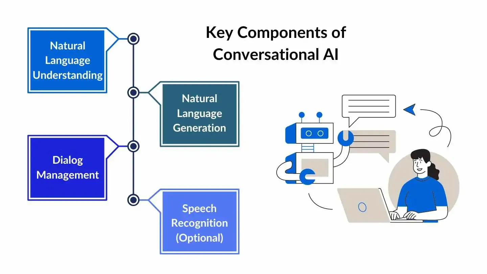

## Table of Contents

## What is a conversational model in machine learning?

A conversational model in machine learning is a type of artificial intelligence system designed to understand and generate human-like responses during a conversation. These models are trained on large datasets of text to learn patterns and structures of language, allowing them to engage in dialogues that can seem quite natural. They are commonly used in chatbots, virtual assistants, and customer service applications, where they can answer questions, provide information, or even entertain users.

The core technology behind these models often involves neural networks, particularly a type known as recurrent neural networks (RNNs) or more advanced versions like long short-term memory (LSTM) networks. These networks are good at processing sequences of data, which is crucial for understanding and generating language. Some of the latest models use transformer architectures, which have shown even better performance in handling language tasks. By training on vast amounts of text, these models learn to predict the next word in a sentence, which helps them generate coherent and contextually relevant responses during a conversation.

In practice, a conversational model works by taking an input (like a user's question or statement) and processing it to understand its meaning. Then, it generates an output based on what it has learned from its training data. For example, if a user asks, "What will the weather be like today?", the model processes this question and might respond with, "It will be sunny with a high of 75 degrees." The effectiveness of these models depends heavily on the quality and quantity of the training data, as well as the sophistication of the algorithms used to process and generate language.

## How do conversational models differ from traditional chatbots?

Conversational models and traditional chatbots both aim to interact with users, but they work in different ways. Traditional chatbots often use rule-based systems or decision trees. This means they follow a set path based on keywords or specific phrases that users type. For example, if a user types "hello," the chatbot might be programmed to respond with "Hi! How can I help you?" These systems are good for simple tasks but can struggle with more complex or varied conversations.

On the other hand, conversational models use machine learning, which allows them to learn from lots of text data. They can understand the context of a conversation and generate more natural responses. For instance, if you ask a conversational model about the weather, it might not only give you the forecast but also suggest what to wear based on the weather. These models can handle a wider range of topics and have more human-like interactions because they are trained on diverse datasets and can adapt to different conversational styles.

## What are some common applications of conversational models?

Conversational models are used in many places to help people. One common use is in customer service. Many companies use these models to answer questions from customers quickly. For example, if you have a problem with a product, you can talk to a chatbot that uses a conversational model. It can understand your problem and give you a solution or connect you to a human if needed. This makes it easier and faster for customers to get help.

Another use is in virtual assistants like Siri, Alexa, or Google Assistant. These assistants use conversational models to understand what you want and help you with tasks. You can ask them to set reminders, play music, or find information on the internet. They make life easier by letting you do things with just your voice. People use these assistants every day to help with small tasks, making them very useful.

Conversational models are also used in education and entertainment. In education, they can help students learn by answering questions or giving practice exercises. In entertainment, they can be used in games or interactive stories where you talk to characters. This makes the experience more fun and engaging because the characters can respond to what you say in a natural way.

## What is the role of natural language processing (NLP) in conversational models?

Natural language processing (NLP) is a key part of how conversational models work. NLP helps the model understand what people are saying or typing. It breaks down the words and sentences into pieces that the model can process. This way, the model can figure out the meaning behind the words. Without NLP, the model would not be able to understand human language well, and it would not be able to respond in a helpful way.

NLP also helps the model create responses that sound natural. It uses what it learns from lots of text to make sentences that fit the conversation. This makes talking to the model feel more like talking to another person. NLP is what makes conversational models good at understanding and making human-like responses, which is important for things like customer service, virtual assistants, and interactive games.

## How does a model like SRS contribute to the development of conversational AI?

A model like SRS, which stands for Sparse Reward Shaping, helps make conversational AI better by teaching it how to learn from very little feedback. In regular learning, AI needs a lot of examples to know if it's doing well. But with SRS, the AI can learn even when it gets only a few hints. This is really helpful for talking with people because in real conversations, people don't always say if the AI is doing a good job or not. SRS helps the AI figure out how to keep the conversation going and improve without needing lots of direct feedback.

Using SRS, conversational AI can become smarter and more like a human. It learns to pick up on small signs in the conversation, like when someone sounds happy or confused. This helps the AI respond in a way that makes sense and keeps the chat going smoothly. By getting better at understanding these little cues, the AI can have more natural and helpful conversations with people, making it useful in things like customer service or virtual assistants.

## What are the key components of a conversational model architecture?

The key components of a conversational model architecture include an input layer, a processing layer, and an output layer. The input layer takes in the user's text or speech and turns it into something the model can understand. This often involves natural language processing (NLP) techniques to break down sentences into words and understand their meaning. The processing layer is where the magic happens. It uses machine learning algorithms, like neural networks, to figure out what the user means and what a good response would be. This layer can use different types of models, like recurrent neural networks (RNNs) or transformer models, to process the input and generate a response.

The output layer then takes the processed information and turns it back into human language. It creates a response that sounds natural and fits the conversation. This might involve choosing the right words and putting them together in a way that makes sense. The whole system works together to make sure the conversation flows smoothly and the AI can understand and respond to what the user says. By using these components, conversational models can handle a wide range of topics and provide helpful and engaging interactions.

## How is the performance of conversational models evaluated?

The performance of conversational models is evaluated using several methods to see how well they understand and respond to people. One common way is through metrics like accuracy, which measures how often the model gives the right answer. Another important metric is the F1 score, which looks at both how well the model finds the right answers and how many of its answers are actually right. People also use perplexity, which shows how well the model predicts the next word in a sentence. A lower perplexity means the model is better at guessing what comes next, which is important for making conversations sound natural.

Another way to evaluate conversational models is through human evaluations. This means real people talk to the model and rate how helpful and natural the responses are. They might use a scale from 1 to 5 to say how good the conversation was. This helps see if the model can really understand what people mean and respond in a way that feels like talking to another person. Sometimes, special tests like the Turing test are used, where people try to guess if they are talking to a human or a machine. If the model can fool people into thinking it's human, it's doing a good job.

## What challenges are faced in training conversational models like Meena?

Training conversational models like Meena is hard because they need to understand and respond like humans. One big problem is getting enough good data. These models need lots of examples of real conversations to learn from. But it's tough to find data that covers all the ways people talk and all the things they might say. Also, the data has to be clean and not have any bad or wrong information. If the data is not good, the model might learn the wrong things and give bad answers.

Another challenge is making sure the model can handle long conversations. People often talk about many things in one chat, and the model needs to remember what was said before to keep the conversation going well. This is called maintaining context, and it's really hard for machines. Also, the model has to be fast and not take too long to think of a response. If it's too slow, people might get bored or think it's not working right. So, training a model like Meena takes a lot of work to make sure it can talk like a human in a smooth and helpful way.

## How do conversational models handle context and maintain coherent dialogues?

Conversational models handle context and maintain coherent dialogues by using special parts called memory and attention. Memory helps the model remember what was said before in the chat. This way, it can bring up things that were talked about earlier and make the conversation flow better. Attention is like the model focusing on the most important parts of what you said. It helps the model understand what you mean right now and respond in a way that makes sense with the whole chat.

For example, if you ask about the weather and then later mention going outside, the model uses its memory to know you were talking about the weather before. It will then give you advice based on that earlier part of the chat. The attention part makes sure the model knows you're still talking about the same day's weather and not some other time. By using memory and attention together, the model can keep the conversation going smoothly and make it feel more like talking to a real person.

## What advancements have been made in conversational models with the introduction of transformer architectures?

The introduction of transformer architectures has brought big improvements to conversational models. Before transformers, models like recurrent neural networks (RNNs) and long short-term memory (LSTM) networks were used. These models had to process words one at a time, which made it hard for them to understand long sentences or keep track of what was said earlier in the conversation. Transformers changed this by looking at all the words in a sentence at once. This makes them better at understanding the whole context and keeping the conversation on track. They use something called "attention" to focus on the most important parts of the text, which helps them give better and more natural responses.

One of the most famous transformer models is the BERT (Bidirectional Encoder Representations from Transformers) model. BERT can understand the meaning of words by looking at the words that come before and after them. This helps it understand the context better than older models. Another important model is the GPT (Generative Pre-trained Transformer) series, which can generate human-like text. These models have made conversational AI much better at understanding and responding to people. They can handle longer and more complex conversations, making them useful in things like customer service, virtual assistants, and even entertainment.

## How can conversational models be integrated with other AI technologies to enhance their capabilities?

Conversational models can work better when they are used with other AI technologies. One way to do this is by using speech recognition, which turns what people say into text that the model can understand. This makes it possible for the model to talk with people using their voice, not just typing. Another helpful technology is natural language understanding (NLU), which helps the model understand what people really mean, not just the words they use. By using NLU, the model can give more accurate and helpful answers. Also, machine learning can help the model learn from new conversations and get better over time. This means the model can keep improving and understand more about how people talk.

Another way to make conversational models better is by using them with other AI tools like sentiment analysis. This technology can tell if someone is happy, sad, or angry from what they say. When a conversational model knows how someone feels, it can respond in a way that fits their mood. For example, if someone sounds upset, the model can be more gentle and helpful. Also, integrating conversational models with knowledge graphs can help them find and use information from many different places. This makes the model's answers more complete and correct. By working together with these other AI technologies, conversational models can have more natural and useful conversations with people.

## What are the ethical considerations and potential biases in deploying conversational models?

When we use conversational models, we need to think about ethics and fairness. One big worry is that these models might treat some people unfairly. This can happen if the data used to train the models has biases in it. For example, if the data mostly comes from one group of people, the model might not understand or help other groups well. This can lead to unfair treatment, like giving bad advice or not understanding what some people need. It's important to check the data and make sure it includes many different kinds of people so the model can be fair to everyone.

Another ethical issue is privacy. When people talk to conversational models, they might share personal information. It's important that this information is kept safe and not used in ways that could harm them. Also, we need to be clear with people about how their data is used. If the model learns from what people say, it should not repeat personal details in other conversations. Companies and researchers need to work hard to make sure conversational models are used in a way that respects people's privacy and treats everyone fairly.