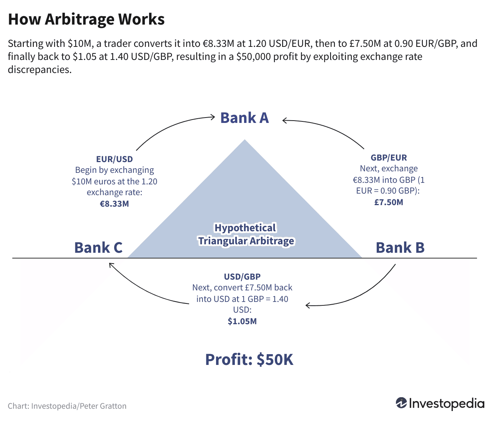

## Table of Contents

## What is conversion arbitrage?

Conversion arbitrage is a trading strategy where someone tries to make money by taking advantage of price differences between two related financial products. Imagine you have two items that are supposed to be worth the same amount, but for some reason, one is cheaper than the other. A person using conversion arbitrage would buy the cheaper one and sell the more expensive one at the same time, making a profit from the difference in their prices.

This strategy is often used in the stock market, especially with convertible securities like bonds that can be turned into stocks. If the bond is priced lower than the stock it can be converted into, someone might buy the bond, convert it into stock, and then sell the stock for a higher price. It sounds simple, but it involves a lot of quick calculations and understanding of market trends to be successful.

## How does conversion arbitrage work?

Conversion arbitrage works by taking advantage of the price difference between a convertible security, like a bond, and the stock it can be converted into. Imagine you find a bond that can be turned into stock. If the bond is cheaper than the stock it turns into, you can buy the bond, convert it to stock, and then sell the stock for more money. This way, you make a profit from the difference in prices.

To do this successfully, you need to be quick and good at math. You have to watch the market closely to spot when the bond is cheaper than the stock. Once you see this, you buy the bond, convert it, and sell the stock before the prices change. It's like buying something on sale and then selling it for the regular price. But it's not easy because the market can change fast, and you need to know a lot about how stocks and bonds work.

## What are the key components involved in conversion arbitrage?

Conversion arbitrage involves a few main parts. The first part is a convertible security, like a bond that can be turned into stock. This bond is important because it's the thing you buy when it's cheaper than the stock. The second part is the stock itself, which is what the bond turns into. If the stock is worth more than the bond, you can make money by buying the bond, turning it into stock, and then selling the stock.

The other key part is understanding the market. You need to keep an eye on the prices of both the bond and the stock. When you see that the bond is cheaper than the stock, that's your chance to do conversion arbitrage. It's like finding a sale where you can buy something cheap and sell it for more. But you have to be quick because prices can change fast. Knowing how to do the math and understanding how stocks and bonds work is also really important for this strategy to work well.

## Can you provide a simple example of conversion arbitrage?

Imagine you find a convertible bond from a company called XYZ Corp. This bond can be turned into 10 shares of XYZ Corp's stock. You see that the bond is selling for $900, but if you convert it into stock and sell those 10 shares right away, you would get $1,000. That's a $100 profit just from the difference in prices.

So, you buy the bond for $900, convert it into 10 shares of stock, and then sell those shares for $1,000. You made $100 because the bond was cheaper than the stock it turned into. This is a simple example of conversion arbitrage, where you take advantage of the price difference between a convertible bond and the stock it can be turned into.

## What are the risks associated with conversion arbitrage?

Conversion arbitrage can be risky because the prices of stocks and bonds can change quickly. If you buy a bond thinking it's cheaper than the stock it turns into, but the stock price drops before you can sell it, you might lose money instead of making a profit. The market can be unpredictable, and even small changes can affect whether your arbitrage strategy works out.

Another risk is the cost of doing the arbitrage. There are fees for buying and selling stocks and bonds, and these costs can eat into your profits. If the price difference between the bond and the stock isn't big enough to cover these costs, you might not make any money at all. It's important to think about these costs and make sure the potential profit is worth the risk.

## How do traders identify opportunities for conversion arbitrage?

Traders look for conversion arbitrage opportunities by closely watching the prices of convertible bonds and the stocks they can turn into. They use special tools and computer programs to keep track of these prices all the time. When they see that a bond is cheaper than the stock it can be converted into, they know there might be a chance to make money. They have to be quick because these price differences don't last long.

Besides watching prices, traders also look at other things like how much the stock price might change in the future and what the company's financial situation is. They use this information to guess if the price difference they see is likely to stay or get bigger. This helps them decide if it's worth the risk to try the arbitrage. It's all about being smart and fast in a market that can change in a snap.

## What tools or software are commonly used in conversion arbitrage?

Traders use special computer programs to help them find conversion arbitrage opportunities. These programs are called trading platforms or arbitrage software. They watch the prices of convertible bonds and stocks all the time, so traders can see when a bond is cheaper than the stock it can turn into. Some popular trading platforms are Bloomberg Terminal, Thinkorswim, and MetaTrader. These tools help traders make quick decisions because they show real-time data and can even do the math for them to see if an arbitrage opportunity is worth it.

Besides these platforms, traders also use other kinds of software to help them. For example, they might use risk management tools to understand how much they could lose if the prices change. They also use analytical software to study past price movements and predict future trends. This helps them decide if a conversion arbitrage opportunity is likely to be profitable. All these tools together make it easier for traders to spot and act on conversion arbitrage opportunities quickly and safely.

## How does conversion arbitrage differ from other types of arbitrage?

Conversion arbitrage is different from other types of arbitrage because it focuses on convertible securities, like bonds that can turn into stocks. In conversion arbitrage, traders look for a price difference between a bond and the stock it can convert into. If the bond is cheaper, they buy it, convert it to stock, and then sell the stock for more money. This is different from other arbitrage strategies where traders might look for price differences between the same product in different markets, like buying a stock on one exchange where it's cheaper and selling it on another where it's more expensive.

Another way conversion arbitrage differs is in the risks involved. With conversion arbitrage, traders have to deal with the risks of both the bond and the stock markets. The bond's price and the stock's price can change quickly, and if they move in the wrong direction, the trader could lose money. Other types of arbitrage, like spatial arbitrage or statistical arbitrage, might not involve convertible securities and could have different kinds of risks, like the cost of moving goods from one place to another or the risk of using complex mathematical models to predict price movements.

## What are the regulatory considerations for conversion arbitrage?

When doing conversion arbitrage, traders need to follow rules set by financial regulators. These rules are there to make sure the market is fair and safe for everyone. For example, traders must report their trades and follow rules about how much they can buy or sell at one time. They also need to make sure they're not doing anything that could be seen as cheating or manipulating the market, like spreading false information to change stock prices.

Another important thing to know is that different countries have their own rules about arbitrage. So, if a trader is doing conversion arbitrage across borders, they need to understand and follow the rules in each country they're working in. This can be tricky because the rules can change and might be different from one place to another. It's really important for traders to keep up with these rules to avoid getting in trouble and to keep their arbitrage strategies legal and fair.

## How can one measure the profitability of conversion arbitrage strategies?

To measure the profitability of conversion arbitrage strategies, you need to look at the difference between the price of the convertible bond and the stock it turns into. If you buy the bond for less than the value of the stock you get from converting it, the difference is your profit. But you also have to think about the costs of buying and selling, like fees and taxes. These costs can make your profit smaller, so you need to subtract them from the price difference to see if you're really making money.

Another way to measure profitability is by looking at how often your arbitrage strategy works out. If you make money most of the time, your strategy is probably good. But if you lose money more often than you make it, you might need to change your approach. It's also important to think about how much risk you're taking. If you're making a little bit of money but taking a big risk, it might not be worth it. So, you need to balance the potential profit with the risk to see if conversion arbitrage is a good strategy for you.

## What advanced techniques can be used to enhance conversion arbitrage?

To make conversion arbitrage better, traders can use special computer programs that watch the market all the time. These programs can spot price differences between convertible bonds and stocks faster than a person can. They can also do quick math to see if the price difference is big enough to cover the costs of buying and selling. Some traders also use these programs to guess how the prices might change in the future, which helps them decide when to make their move. This way, they can catch more opportunities and make more money.

Another way to improve conversion arbitrage is by using something called hedging. Hedging means buying or selling other things to protect against losing money if the prices move the wrong way. For example, if you buy a convertible bond, you might also sell some of the stock it turns into, just in case the stock price goes down. This can help limit your losses if things don't go as planned. By combining these advanced techniques, traders can make their conversion arbitrage strategies more successful and safer.

## Can you discuss a case study where conversion arbitrage was successfully implemented?

Let's look at a case where a trader named Sarah successfully used conversion arbitrage. Sarah was keeping an eye on the market and noticed that a convertible bond from ABC Company was selling for $950. This bond could be turned into 10 shares of ABC's stock. At the same time, the stock was trading at $110 per share, which means 10 shares would be worth $1,100. Sarah saw a chance to make a profit because the bond was cheaper than the stock it could be converted into. She bought the bond for $950, converted it into stock, and then sold the 10 shares for $1,100. After paying some small fees, Sarah made a nice profit of about $100.

Sarah's success came from being quick and using a special computer program that helped her spot the price difference right away. The program also helped her do the math to see if the profit would be worth it after paying for the costs of buying and selling. Sarah also used a strategy called hedging to protect herself. She sold some of the stock short, which means she sold stock she didn't own yet, just in case the stock price went down before she could sell her converted shares. This way, if the stock price dropped, she wouldn't lose all her profit. By combining these techniques, Sarah was able to make conversion arbitrage work well for her.

## What is Defining Conversion Arbitrage?

Conversion [arbitrage](/wiki/arbitrage) is an advanced strategy employed within options trading to exploit pricing inefficiencies between call and put options. This method primarily leverages the principle of put-call parity, which is a foundational concept in options pricing theory. Put-call parity establishes a relationship between the prices of European call and put options with the same strike price and expiration date, ensuring that no arbitrage opportunities exist.

The basic setup for conversion arbitrage involves three key steps: 

1. **Buying the underlying asset**: The trader first acquires the underlying stock. This step is crucial as it helps to establish a base for the entire strategy.

2. **Buying a put option**: The trader purchases a put option on the same stock with a specific strike price and maturity. A put option gives the holder the right, but not the obligation, to sell a stock at the strike price by the expiration date.

3. **Writing a covered call option**: Simultaneously, the trader writes (sells) a call option with the identical strike price and expiration date. A call option gives the buyer the right to purchase the stock at the strike price by the expiration date.

The strategy appears as follows:

- **Buy Underlying Asset at Price** $S_0$
- **Buy Put Option at Strike** $K$
- **Sell (Write) Call Option at Strike** $K$

By structuring these positions, the trader effectively creates a riskless portfolio, assuming that the principle of put-call parity holds: 

$$
C - P = S_0 - K e^{-rT}
$$

Where:
- $C$ is the price of the call option
- $P$ is the price of the put option
- $S_0$ is the current stock price
- $K$ is the strike price of both the call and put options
- $r$ is the risk-free interest rate
- $T$ is the time to maturity

Conversion arbitrage profits from discrepancies in this equation, usually making small, consistent profits due to these inefficiencies being frequently corrected by market mechanisms. However, the effectiveness of this strategy is contingent upon low transaction costs and the ability to execute trades swiftly before market corrections occur. Furthermore, conversion arbitrage is primarily applicable in stable markets where the likelihood of unexpected [volatility](/wiki/volatility-trading-strategies) is minimal. 

Ultimately, while conversion arbitrage offers a systematic approach to exploiting pricing inefficiencies in options markets, traders need to remain vigilant about the risks involved, such as fluctuations in the underlying asset price, changes in interest rates, and potential deviations from theoretical values predicted by the put-call parity.

## References & Further Reading

[1]: ["Options, Futures, and Other Derivatives"](https://www.amazon.com/Options-Futures-Other-Derivatives-10th/dp/013447208X) by John C. Hull

[2]: ["Algorithmic Trading and DMA: An introduction to direct access trading strategies"](https://www.amazon.com/Algorithmic-Trading-DMA-introduction-strategies/dp/0956399207) by Barry Johnson

[3]: ["Advances in Financial Machine Learning"](https://www.amazon.com/Advances-Financial-Machine-Learning-Marcos/dp/1119482089) by Marcos Lopez de Prado

[4]: Market Technicians Association. (2012). ["The Handbook of Technical Analysis."](https://sacredtraders.com/product/the-handbook-of-technical-analysis-the-practitioners-comprehensive-guide-to-technical-analysis-by-mark-andrew-lim/)

[5]: Kearns, M., & Nevmyvaka, Y. (2013). ["Machine learning for market microstructure and high-frequency trading."](https://www.cis.upenn.edu/~mkearns/papers/KearnsNevmyvakaHFTRiskBooks.pdf) In High-Frequency Trading: New Realities for Traders, Markets and Regulators.

[6]: ["Quantitative Trading: How to Build Your Own Algorithmic Trading Business"](https://www.amazon.com/Quantitative-Trading-Build-Algorithmic-Business/dp/1119800064) by Ernest P. Chan

[7]: Pedersen, Lasse Heje. (2015). ["Efficiently Inefficient: How Smart Money Invests and Market Prices Are Determined"](https://www.amazon.com/Efficiently-Inefficient-Invests-Market-Determined/dp/0691166196)