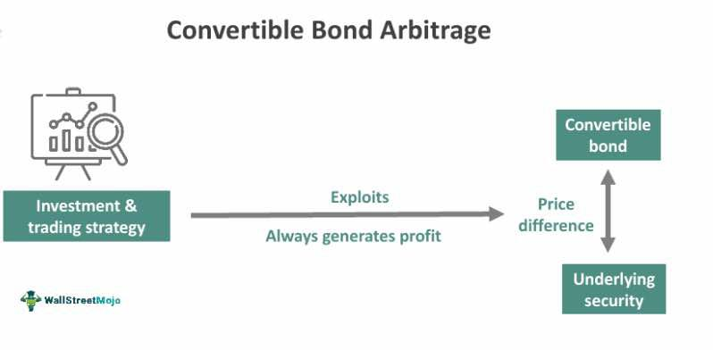

Understanding financial markets often requires exploring complex strategies such as arbitrage, which involves the exploitation of price differences across markets to achieve profits. Arbitrage plays a vital role in the landscape of finance and trading, acting as a mechanism for correcting mispricing and ensuring efficiency across financial systems. Among these strategies, conversion arbitrage, financial arbitrage, investment strategies, and algorithmic trading have emerged as critical components in structuring successful trading activities.

Conversion arbitrage is primarily utilized in the context of options trading. It capitalizes on pricing inefficiencies between call and put options, relying heavily on theoretical principles like put-call parity. This strategy involves simultaneous transactions that offset potential risks, positioning traders to benefit from the discrepancies between theoretical and actual market values.



Financial arbitrage extends beyond options to leverage differences in prices across various markets or trading instruments. Although opportunities for riskless profits are infrequent and transient, they form the cornerstone of arbitrage practices. Through quick, strategic actions, arbitrageurs can navigate these fleeting opportunities to secure returns that are ostensibly free of risk.

Incorporating arbitrage within broader investment strategies allows traders and investors to enhance their portfolios by seeking consistent returns while managing exposure to potential downsides. This not only diversifies investment approaches but also provides a calculated avenue for minimizing risks inherent in market transactions.

Moreover, algorithmic trading has profoundly influenced the execution of arbitrage strategies. The advent of sophisticated algorithms enables traders to swiftly exploit market inefficiencies with precision, reshaping how arbitrage is conducted in today's fast-paced trading environments. These technological advancements have made it possible to handle complex arbitrage operations that would be otherwise unfeasible if done manually.

This article will explore these concepts in detail, dissecting their applications across modern trading environments. Through an examination of conversion arbitrage, financial arbitrage, integrated investment strategies, and the impact of algorithmic trading, we aim to provide a comprehensive overview of the multifaceted role arbitrage plays in financial markets. 

## Table of Contents

## Defining Conversion Arbitrage

Conversion [arbitrage](/wiki/arbitrage) is an advanced strategy employed within options trading to exploit pricing inefficiencies between call and put options. This method primarily leverages the principle of put-call parity, which is a foundational concept in options pricing theory. Put-call parity establishes a relationship between the prices of European call and put options with the same strike price and expiration date, ensuring that no arbitrage opportunities exist.

The basic setup for conversion arbitrage involves three key steps: 

1. **Buying the underlying asset**: The trader first acquires the underlying stock. This step is crucial as it helps to establish a base for the entire strategy.

2. **Buying a put option**: The trader purchases a put option on the same stock with a specific strike price and maturity. A put option gives the holder the right, but not the obligation, to sell a stock at the strike price by the expiration date.

3. **Writing a covered call option**: Simultaneously, the trader writes (sells) a call option with the identical strike price and expiration date. A call option gives the buyer the right to purchase the stock at the strike price by the expiration date.

The strategy appears as follows:

- **Buy Underlying Asset at Price** $S_0$
- **Buy Put Option at Strike** $K$
- **Sell (Write) Call Option at Strike** $K$

By structuring these positions, the trader effectively creates a riskless portfolio, assuming that the principle of put-call parity holds: 

$$
C - P = S_0 - K e^{-rT}
$$

Where:
- $C$ is the price of the call option
- $P$ is the price of the put option
- $S_0$ is the current stock price
- $K$ is the strike price of both the call and put options
- $r$ is the risk-free interest rate
- $T$ is the time to maturity

Conversion arbitrage profits from discrepancies in this equation, usually making small, consistent profits due to these inefficiencies being frequently corrected by market mechanisms. However, the effectiveness of this strategy is contingent upon low transaction costs and the ability to execute trades swiftly before market corrections occur. Furthermore, conversion arbitrage is primarily applicable in stable markets where the likelihood of unexpected [volatility](/wiki/volatility-trading-strategies) is minimal. 

Ultimately, while conversion arbitrage offers a systematic approach to exploiting pricing inefficiencies in options markets, traders need to remain vigilant about the risks involved, such as fluctuations in the underlying asset price, changes in interest rates, and potential deviations from theoretical values predicted by the put-call parity.

## Exploring Financial Arbitrage

Financial arbitrage capitalizes on price differences between markets or instruments, providing opportunities for risk-free profits when executed efficiently. The goal of financial arbitrageurs is to exploit these discrepancies before market forces rectify them. However, such opportunities are fleeting due to the competitive nature of financial markets.

One primary form of financial arbitrage is spatial arbitrage. This involves buying an asset in one market at a lower price and simultaneously selling it in another market at a higher price. For instance, if a stock is trading at $100 on the New York Stock Exchange (NYSE) but $101 on the London Stock Exchange (LSE), an arbitrageur can buy the stock on the NYSE and sell it on the LSE, pocketing the $1 difference per share.

Another common form is temporal arbitrage, where price discrepancies are exploited over time. This often involves forward contracts or futures. The arbitrageur enters into contracts to buy or sell an asset at today's price for future delivery, taking advantage of expected price changes to lock in a profit.

Statistical arbitrage is a more complex strategy relying on quantitative models to identify price discrepancies. Using historical price data, these models can detect patterns or relationships between financial instruments to predict mean reversion, allowing traders to exploit temporary mispricings.

Triangular arbitrage in currency markets is another form, which exploits inconsistencies in exchange rates between three currencies. For example, consider three currencies: USD, EUR, and GBP. If the exchange rate between USD and EUR, EUR and GBP, and GBP and USD do not align to a perfect circular parity, an arbitrage opportunity arises to convert back to the starting currency with a profit.

The implications of financial arbitrage in today's marketplace are substantial. Arbitrage acts as a mechanism for market efficiency, as discrepancies are quickly eliminated by competitive trading activities. However, to succeed, arbitrageurs must execute trades swiftly, often relying on advanced technology and [algorithmic trading](/wiki/algorithmic-trading) systems to detect and act on opportunities instantaneously.

One notable example includes the role of algorithmic trading in modern arbitrage. Algorithms can process vast arrays of data in seconds, enabling traders to capitalize on microsecond-level price differences that are invisible to the human eye. These algorithms not only improve efficiency but also necessitate robust risk management strategies due to the inherent volatility and complexity of deploying such methods effectively.

Despite its potential, financial arbitrage also presents risks. Transaction costs can erode the slim margins typical of arbitrage trades, while unexpected market movements can negate perceived arbitrage opportunities. Furthermore, changes in regulatory environments and market conditions may alter the viability of exploitative strategies, demanding continuous adaptation from market participants.

In conclusion, financial arbitrage remains a crucial facet of financial markets, contributing to price discovery and [liquidity](/wiki/liquidity-risk-premium). Although opportunities are fleeting and require advanced technical capabilities, successful execution can yield significant rewards.

## Investment Strategies in Arbitrage

Arbitrage strategies can be an integral part of investment portfolios, serving to enhance returns while mitigating associated risks. Traders and investors utilize arbitrage by taking advantage of price mismatches across various markets or instruments, capitalizing on these differences to achieve potential profits that are typically considered low-risk. This approach can be especially effective in environments where market inefficiencies are present, allowing for profitable trades without additional market exposure.

Incorporating arbitrage into broader investment strategies involves a meticulous analysis of markets, and often employs sophisticated technologies, algorithms, and financial instruments to identify and execute trades in a timely manner. Practitioners typically deploy quantitative models to identify arbitrage opportunities and assess the potential impact on their portfolios. For instance, [statistical arbitrage](/wiki/statistical-arbitrage) relies on complex mathematical models to identify pricing patterns and discrepancies across correlated financial instruments.

Moreover, the use of derivatives such as options and futures contracts can amplify the power of arbitrage strategies. Traders might employ tactics such as pairs trading, where complementary assets are bought and sold simultaneously to profit from converging price movements. This strategy reduces the exposure to the market direction by balancing potential gains from undervalued positions with corresponding overvalued positions.

While arbitrage strategies can provide significant benefits, practitioners must also navigate several challenges and risks. Transaction costs, including brokerage fees and taxes, can erode the potential profits from arbitrage opportunities, particularly when the price discrepancies are minor. Additionally, market volatility poses a significant risk, as rapid price movements can lead to unexpected losses or positions becoming unhedged.

Regulatory considerations are equally important, as changes in trading regulations can impact the viability of certain arbitrage strategies. Continuous monitoring of compliance requirements is essential to avoid legal pitfalls. Moreover, the advent of algorithmic trading has ushered in increased competition and reduced the duration of arbitrage opportunities, necessitating faster execution and more advanced analytical tools.

Overall, successfully integrating arbitrage into an investment strategy requires a comprehensive understanding of market dynamics, rigorous risk management, and a robust technological framework to rapidly respond to market conditions. In doing so, traders and investors can harness arbitrage strategies to potentially enhance their returns and achieve more balanced portfolios.

## Algorithmic Trading and Arbitrage

Algorithmic trading represents a significant leap in the execution of arbitrage strategies, drastically improving the efficiency and speed with which traders can exploit market inefficiencies. At its core, algorithmic trading involves the use of complex algorithms and computer programs to automate trading activities, thereby facilitating the rapid execution of arbitrage across global markets. By deploying advanced computational techniques, traders can promptly identify and act on price discrepancies between different markets or financial instruments, often in milliseconds.

A fundamental aspect of algorithmic trading in arbitrage is the reliance on sophisticated algorithms that can process vast amounts of data, execute trades at high speed, and mitigate the risk of manual errors. These algorithms serve a crucial role in monitoring price movements, executing trades, and ensuring optimal execution conditions. Additionally, they can be programmed to implement specific strategies, taking into account variables such as transaction costs, liquidity, and timing. This automation capability is particularly advantageous in arbitrage, where the window of opportunity to profit from price differences is typically very short.

Technological advancements have further augmented the capabilities of algorithmic trading. High-frequency trading ([HFT](/wiki/high-frequency-trading-strategies)), a subset of algorithmic trading, exemplifies this revolution, allowing traders to engage in a large number of trades at extremely fast speeds. HFT leverages cutting-edge hardware and network infrastructure to gain proximity to financial exchanges, thereby reducing latency and enhancing the chances of successful arbitrage trades. The integration of [machine learning](/wiki/machine-learning) and [artificial intelligence](/wiki/ai-artificial-intelligence) in algorithmic strategies also represents a notable development, enabling algorithms to learn from historical data and adapt to changing market conditions.

To illustrate the role of technology in reshaping the trading landscape, consider a simple example of statistical arbitrage involving two correlated stocks. A Python script can be employed to constantly monitor the price spread between these two stocks and execute trades when the spread deviates from its historical mean by a predefined threshold. The code snippet below provides a basic illustration:

```python
import numpy as np
import pandas as pd
import statsmodels.api as sm
from datetime import datetime

# Simulate fetching historical price data for two stocks
data = pd.DataFrame({
    'stock_A': np.random.normal(100, 1, 1000),
    'stock_B': np.random.normal(99, 1, 1000)
})

# Calculate the spread using Ordinary Least Squares
model = sm.OLS(data['stock_A'], data['stock_B'])
results = model.fit()

# Define the spread
spread = data['stock_A'] - results.params[0] * data['stock_B']

# Define threshold for arbitrage opportunity
threshold = 1.0  # example threshold

# Strategy execution
positions = []
for i in range(1, len(spread)):
    if spread[i] > threshold:
        # Short stock_A and buy stock_B
        positions.append(('short', 'stock_A', data.index[i]))
        positions.append(('long', 'stock_B', data.index[i]))
    elif spread[i] < -threshold:
        # Long stock_A and short stock_B
        positions.append(('long', 'stock_A', data.index[i]))
        positions.append(('short', 'stock_B', data.index[i]))
```

In conclusion, algorithmic trading significantly enhances the execution of arbitrage strategies by leveraging speed, precision, and adaptability. The dynamic interplay between technology and trading strategies continues to reshape financial markets, offering both opportunities and challenges for market participants. As technology evolves, the scope and effectiveness of arbitrage through algorithmic trading are expected to expand, underscoring the importance of such innovations in the contemporary trading ecosystem.

## Case Studies and Examples

### Case Studies and Examples

Real-world examples of arbitrage provide invaluable insights into the practical application of this financial strategy, bridging the gap between theory and practice. These case studies highlight the technology utilized in these endeavors and lessons derived from past trades.

One notable instance of successful arbitrage occurred in the foreign exchange markets, commonly known as [forex](/wiki/forex-system) arbitrage. In this scenario, a trader exploited minor discrepancies in currency exchange rates across different trading platforms. By simultaneously buying a currency in one market where the price was marginally lower and selling it in another where the price was higher, the trader secured a risk-free profit. This approach requires swift execution and often relies on algorithmic trading systems to detect and exploit these inefficiencies.

Algorithmic approaches to arbitrage have become increasingly common, with high-frequency trading firms developing sophisticated algorithms capable of executing transactions in milliseconds. These algorithms scan multiple markets, identify price discrepancies, and automatically execute buy and sell orders to capture gains before the inefficiencies are corrected by the market.

Another historical example of arbitrage is in the convertible bond market, where conversion arbitrage strategies have been effectively utilized. In this instance, traders exploit the price differences between a company's convertible bonds and its underlying stock. Investors might purchase the convertible bond and simultaneously short the company's stock, anticipating that the convertible bond is undervalued relative to the stock. This strategy assumes price convergence over time, allowing traders to profit from the realignment of the bond’s price.

In commodities markets, arbitrage opportunities arise when price differences exist between related commodities in different locations or forms. For instance, geographic arbitrage involves purchasing a commodity in a region where the price is lower and selling it in another where the price is higher, considering logistics and transportation costs.

However, engaging in arbitrage is not without challenges. Issues such as transaction costs, latency in executing trades, or regulatory barriers can erode potential profits. Additionally, as more traders adopt algorithmic strategies, arbitrage opportunities have become more fleeting, necessitating rapid technological advancements to maintain competitive advantages.

In conclusion, these case studies underscore the importance of technology and timing in successful arbitrage. They demonstrate that while arbitrage can provide opportunities for riskless profit, the complexity and dynamic nature of financial markets demand continuous innovation and adaptability in strategy execution.

## Risks and Considerations

In the complex landscape of arbitrage, understanding and managing risks is vital for maintaining profitability and preserving capital. While arbitrage strategies aim to exploit price discrepancies for riskless profits, several factors can influence their success, potentially transforming seemingly safe opportunities into challenging endeavors.

One of the primary considerations is transaction costs. These include brokerage fees, taxes, and any other costs incurred during the execution of trades. High transaction costs can erode the thin profit margins typically associated with arbitrage. Therefore, traders must ensure that the expected returns from an arbitrage position exceed these costs. For instance, if the profit from a price discrepancy is $1, but the transaction costs amount to $1.50, the trade results in a net loss.

Market volatility poses another significant risk. Volatility can lead to rapid changes in prices, causing an arbitrage position to become unprofitable before execution. This is particularly concerning for strategies that require simultaneous transactions across different markets or instruments. Even slight delays in execution can lead to slippage, where the actual execution price deviates from the expected price, further impacting profitability.

The regulatory environment also plays a critical role in arbitrage. Different markets have distinct rules and regulations that can affect the feasibility of arbitrage strategies. For example, certain jurisdictions may impose restrictions on short selling or have stringent capital requirements. Moreover, regulatory changes can occur with little warning, necessitating that traders stay informed and prepared to adapt their strategies accordingly.

To manage these risks, traders often employ various techniques. Utilizing advanced algorithmic trading systems can enhance speed and accuracy, mitigating the risks associated with volatility and execution delays. These systems leverage complex algorithms to swiftly identify and act on arbitrage opportunities, minimizing human intervention and reducing the chance of error.

Risk management techniques, such as stop-loss orders and portfolio diversification, further protect against adverse market movements and unexpected losses. By setting predefined [exit](/wiki/exit-strategy) points, traders can automate the liquidation of an unprofitable position, thereby limiting potential losses.

Additionally, some traders establish robust monitoring and adjustment mechanisms to cater to fluctuating market conditions and regulatory changes. This proactive stance allows them to quickly modify strategies and maintain profitability in the dynamic trading environment.

In summary, while arbitrage can offer profitable opportunities, successfully navigating its landscape requires careful consideration of transaction costs, market volatility, and regulatory influences. Through the use of sophisticated technology and prudent risk management practices, traders can address these challenges, effectively capitalizing on arbitrage opportunities while minimizing potential downsides.

## Conclusion

Arbitrage serves as a crucial mechanism in maintaining the efficiency and stability of financial markets. By exploiting price discrepancies across different markets or instruments, arbitrage helps align prices and rectify market inefficiencies. This alignment is essential for an equilibrium where asset prices truly reflect their intrinsic value. In a highly interconnected global market, strategies such as conversion arbitrage—where traders exploit inefficiencies between call and put options—and algorithmic trading, which leverages technology for high-speed transactions, play a pivotal role.

Understanding and implementing arbitrage strategies is essential for anyone navigating the complexities of modern financial markets. These strategies are not merely isolated techniques; they intricately weave into broader investment strategies, allowing traders to enhance returns while mitigating risks. While the allure of riskless profit through arbitrage is compelling, it requires a nuanced understanding of market dynamics, access to technology, and a keen eye for detail.

In conclusion, comprehending the fundamentals and applications of arbitrage is indispensable for market participants. This understanding allows one to adeptly navigate the financial landscape and harness arbitrage opportunities as they arise. Whether through the structured approach of conversion arbitrage or the rapid execution enabled by algorithmic trading, arbitrage remains a fundamental aspect of financial strategy with significant implications for market behavior and investment performance.

## References & Further Reading

[1]: ["Options, Futures, and Other Derivatives"](https://www.amazon.com/Options-Futures-Other-Derivatives-10th/dp/013447208X) by John C. Hull

[2]: ["Algorithmic Trading and DMA: An introduction to direct access trading strategies"](https://www.amazon.com/Algorithmic-Trading-DMA-introduction-strategies/dp/0956399207) by Barry Johnson

[3]: ["Advances in Financial Machine Learning"](https://www.amazon.com/Advances-Financial-Machine-Learning-Marcos/dp/1119482089) by Marcos Lopez de Prado

[4]: Market Technicians Association. (2012). ["The Handbook of Technical Analysis."](https://sacredtraders.com/product/the-handbook-of-technical-analysis-the-practitioners-comprehensive-guide-to-technical-analysis-by-mark-andrew-lim/)

[5]: Kearns, M., & Nevmyvaka, Y. (2013). ["Machine learning for market microstructure and high-frequency trading."](https://www.cis.upenn.edu/~mkearns/papers/KearnsNevmyvakaHFTRiskBooks.pdf) In High-Frequency Trading: New Realities for Traders, Markets and Regulators.

[6]: ["Quantitative Trading: How to Build Your Own Algorithmic Trading Business"](https://www.amazon.com/Quantitative-Trading-Build-Algorithmic-Business/dp/1119800064) by Ernest P. Chan

[7]: Pedersen, Lasse Heje. (2015). ["Efficiently Inefficient: How Smart Money Invests and Market Prices Are Determined"](https://www.amazon.com/Efficiently-Inefficient-Invests-Market-Determined/dp/0691166196)