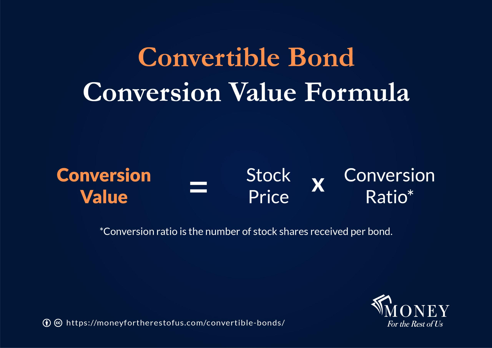

## Table of Contents

## What is a convertible bond?

A convertible bond is a type of bond that can be changed into a certain number of shares of the company's stock. This means that instead of getting their money back with interest at the end of the bond's term, the bondholder can choose to receive stock in the company instead. This can be a good option if the company's stock price goes up a lot, because the bondholder can then own part of the company and possibly make more money.

Convertible bonds are popular because they offer a mix of safety and potential for growth. The bond part gives the investor regular interest payments and the return of their money at the end of the term, which is safer than just owning stock. But if the company does well and the stock price goes up, the investor can convert the bond into stock and benefit from the increase in the stock's value. This makes convertible bonds attractive to people who want to balance risk and reward.

## How does a convertible bond differ from a regular bond?

A convertible bond is different from a regular bond because it can be turned into company stock. With a regular bond, you lend money to a company or government and they pay you back with interest over time. At the end, you get your money back. But with a convertible bond, you have the choice to change your bond into shares of the company's stock instead of getting your money back.

This choice makes convertible bonds special. If the company's stock price goes up a lot, you can convert your bond into stock and possibly make more money than you would with just the interest from a regular bond. But if the stock price doesn't go up, you can still get your money back like with a regular bond. So, convertible bonds give you a bit of safety like a regular bond, but also the chance to gain more if the company does well.

## What are the benefits of converting a convertible bond to stock?

Converting a convertible bond to stock can be a good choice if the company's stock price has gone up a lot. When you convert, you trade your bond for shares of the company. This means instead of getting your money back with interest, you become a part-owner of the company. If the stock price keeps going up, the value of your shares could go up too. This gives you the chance to make more money than you would have just from the interest on the bond.

Another benefit is that converting to stock can give you more potential for growth than keeping the bond. Stocks can sometimes grow much faster than the interest you get from a bond. If you believe in the company and think it will do well in the future, converting to stock lets you be part of that growth. This is why people who are willing to take a bit more risk might choose to convert their convertible bond to stock.

## What are the risks associated with converting a convertible bond to stock?

Converting a convertible bond to stock can be risky because the stock market can go up and down a lot. If you convert your bond to stock and the stock price goes down, you could lose money. With a bond, you know you will get your money back at the end plus interest, but with stock, there's no guarantee. If the company doesn't do well, the stock price might drop, and you could end up with less money than if you had kept the bond.

Another risk is that you might convert at the wrong time. If you convert when the stock price is high, thinking it will keep going up, but it goes down instead, you could lose out on the chance to get your money back from the bond. Also, if you convert and the stock price doesn't go up as much as you hoped, you might wish you had kept the bond for its steady interest payments. So, timing and the company's future performance are big factors to think about before converting.

## How is the conversion ratio of a convertible bond determined?

The conversion ratio of a convertible bond is decided when the bond is first issued. It tells you how many shares of the company's stock you can get for each bond you own. This ratio is set by the company and is usually based on the bond's face value and the stock's price at the time the bond is issued. For example, if the conversion ratio is 20, that means for every bond you have, you can convert it into 20 shares of stock.

The conversion ratio is important because it affects how valuable the convertible bond is to investors. If the stock price goes up a lot, a higher conversion ratio means you can get more shares, which could be worth more money. But if the stock price doesn't go up much, a lower conversion ratio might be better because you still get some stock but don't need as big of an increase in the stock price to make converting worthwhile. Companies set the conversion ratio to make the bond attractive to investors while also considering their own financial goals.

## What is the conversion price and how is it set?

The conversion price is the price per share at which a convertible bond can be turned into stock. It's figured out by dividing the bond's face value by the conversion ratio. For example, if a bond has a face value of $1,000 and a conversion ratio of 20, the conversion price would be $50 per share ($1,000 divided by 20).

The conversion price is set when the bond is issued and is usually a bit higher than the current stock price. This makes the bond more attractive to investors because they have the chance to buy the stock at a lower price if they convert later. But if the stock price doesn't go above the conversion price, it might not be worth converting the bond to stock.

## Can you explain the process of converting a convertible bond to stock?

Converting a convertible bond to stock is a choice you can make as a bondholder. When you decide to convert, you tell the company you want to change your bond into stock. You do this by following the steps the company has set up, which might include filling out a form or contacting their investor relations department. Once you've made your request, the company will handle the conversion based on the conversion ratio that was set when the bond was issued. This means they'll give you a certain number of shares for each bond you convert.

The number of shares you get depends on the conversion ratio. For example, if the ratio is 20 and you have one bond, you'll get 20 shares of stock. After the conversion, you won't get any more interest payments on that bond because it's now stock. You'll own part of the company instead, and the value of your investment will go up or down with the stock price. It's important to think about whether converting is a good idea based on the current stock price and where you think it might go in the future.

## What are the tax implications of converting a convertible bond to stock?

When you convert a convertible bond to stock, there can be tax effects to think about. If you convert the bond, you won't have to pay taxes right away on the conversion itself. This is because the IRS sees the conversion as just changing the form of your investment, not as a taxable event. But, if you got any interest payments from the bond before converting, you'll need to pay taxes on those as regular income.

However, if you later sell the stock you got from converting the bond, you might have to pay capital gains tax. The tax you pay depends on how long you held the stock. If you sell the stock within a year of converting, any profit is taxed as short-term capital gains, which is usually at your regular income tax rate. If you hold the stock for more than a year before selling, the profit is taxed as long-term capital gains, which often has a lower tax rate. So, it's important to think about these tax rules when deciding whether to convert your bond to stock and when to sell the stock.

## How does the conversion of a convertible bond affect the company's financial statements?

When a company converts a convertible bond into stock, it changes how the company's financial statements look. Before the conversion, the bond is listed as a liability on the company's balance sheet because it's money the company owes to bondholders. When the bond is converted to stock, this liability goes away. Instead, the company's equity goes up because it's now issuing more shares to the bondholders. This makes the company's total liabilities go down and its total equity go up on the balance sheet.

The conversion also affects the company's income statement and cash flow statement, but usually not right away. On the income statement, there's no immediate impact from the conversion itself. But if the bondholders were getting interest payments before the conversion, those payments will stop, which means the company's interest expense will go down in future periods. On the cash flow statement, converting the bond to stock doesn't directly change the cash flow because no cash is exchanged during the conversion. However, because the company no longer has to pay interest on the bond, its cash flow from operations might improve in the future.

## What market conditions might influence the decision to convert a convertible bond to stock?

The choice to convert a convertible bond to stock can be influenced by what's happening in the stock market and the economy. If the stock market is doing well and the company's stock price is going up a lot, it might be a good time to convert. When the stock price is higher than the conversion price, converting the bond to stock means you could make more money than if you just kept the bond for its interest payments. Also, if people think the economy will keep getting better, they might feel more confident about the stock market and decide to convert their bonds to stock to be part of that growth.

On the other hand, if the stock market is going down or if there's a lot of uncertainty about the economy, it might be better to keep the bond. Bonds are usually safer than stocks because they give you regular interest payments and you get your money back at the end. If the stock price is lower than the conversion price, it might not make sense to convert because you could lose money. So, it's important to look at what's happening in the market and think about where it might be headed before deciding to convert a convertible bond to stock.

## How do issuers and investors typically negotiate the terms of conversion?

When a company decides to issue convertible bonds, they work with investors to set the terms of conversion. This usually happens before the bonds are sold. The company and investors talk about things like the conversion ratio, which says how many shares you get for each bond, and the conversion price, which is the price per share when you convert. They want to make sure the terms are good for both sides. The company wants to make the bonds attractive enough to get people to buy them, but they also need to think about how converting the bonds to stock will affect their business in the future.

The negotiation can be a bit tricky because both the company and the investors are trying to get the best deal. The company might suggest a conversion ratio and price that they think is fair, but investors might want a better deal, like a lower conversion price or a higher conversion ratio. They might go back and forth until they agree on terms that everyone is happy with. It's important for both sides to look at what's happening in the market and think about where the company's stock price might go in the future. This helps them decide on terms that make sense for everyone involved.

## What advanced strategies can be used to optimize the conversion of convertible bonds to stock?

One advanced strategy to optimize the conversion of convertible bonds to stock is to use a technique called "delta hedging." This means you buy or sell the company's stock to balance out the risk of the bond's conversion. If you think the stock price will go up a lot, you might buy more stock to make sure you're ready to convert your bonds at the right time. If you think the stock price might go down, you might sell some stock to protect yourself from losing money. This can help you make the most out of your convertible bonds by timing the conversion just right.

Another strategy is to pay attention to "forced conversion." Sometimes, a company will set up the bond so that if the stock price goes above a certain level for a while, they can force bondholders to convert their bonds to stock. If you know this might happen, you can plan ahead. You might decide to convert your bonds early if you think the stock price will keep going up, or you might wait if you think it will go down soon. By understanding these rules, you can make smarter choices about when to convert and how to get the best value from your investment.

## What is the Conversion Process?

Convertible bonds offer a unique feature where bondholders can convert their fixed-income securities into a predetermined number of shares of the issuing company's stock. This conversion feature is a key attraction of these hybrid instruments, enabling investors to capitalize on the company's stock price appreciation while retaining bond-like characteristics.

### Conversion Ratio and Conversion Price

The conversion ratio determines how many shares a bondholder gets in exchange for each bond. It is typically stipulated at the time of issuance and remains fixed. The conversion price, on the other hand, is the price per share at which conversion can be executed and is calculated as follows:

$$
\text{Conversion Price} = \frac{\text{Par Value of Bond}}{\text{Conversion Ratio}}
$$

For instance, if a bond with a par value of $1,000 has a conversion ratio of 50, the conversion price would be:

$$
\text{Conversion Price} = \frac{1,000}{50} = 20
$$

This means the investor can convert the bond into shares at $20 per share.

### Factors Influencing the Decision to Convert

Investors weigh several factors when deciding whether to convert:

- **Stock Price Movement**: If the current stock price exceeds the conversion price, converting bonds into stocks becomes financially advantageous, allowing investors to benefit from potential upside in the stock price.

- **Dividend Considerations**: Convertible bondholders do not receive stock dividends unless they convert. Thus, high and growing dividend yields on the stock may incentivize conversion.

- **Market Conditions**: Bullish market sentiment may encourage conversion due to anticipated further capital gains, while bearish conditions might deter conversion.

- **Residual Maturity and Interest Rates**: As bonds near maturity and if interest rates are rising, conversion might be preferred to avoid holding a depreciating bond.

### Mechanics of the Conversion Process

The conversion process involves a formal declaration by the bondholder to convert their bonds. This declaration typically includes completing a notice of conversion. Once submitted, the bondholder relinquishes the bond in exchange for shares according to the conversion ratio.

Here is a Python code snippet demonstrating how one might calculate whether it's beneficial to convert based on current market conditions:

```python
def should_convert(current_stock_price, conversion_price):
    return current_stock_price > conversion_price

bond_par_value = 1000
conversion_ratio = 50
conversion_price = bond_par_value / conversion_ratio

current_stock_price = 25  # Example current stock price

if should_convert(current_stock_price, conversion_price):
    print("Conversion is beneficial.")
else:
    print("Hold the bonds.")

```

Understanding these conversion mechanics and the associated calculations can guide strategic investment decisions, maximizing potential profits while minimizing risks. Convertible bonds, therefore, offer flexibility and opportunities that savvy investors can harness, especially under favorable market conditions.

## References & Further Reading

1. **"Convertible Bonds: Structure, Valuation, Market Environment" by Tomasz R. Bielecki and Marek Rutkowski**  
   This comprehensive book provides an in-depth analysis of convertible bonds, focusing on their structural features, valuation models, and the market dynamics surrounding them. It's an essential resource for understanding theoretical and practical aspects of convertible bonds.

2. **"Convertible Securities: The Latest Instruments, Portfolio Strategies, and Valuation Analysis" by Tracy V. Maitland and Adam Issac**  
   This text explores the various types of convertible securities, offering insights into portfolio strategies and valuation techniques. It is designed for both newcomers and seasoned investors interested in maximizing the benefits of convertible securities.

3. **"The Handbook of Convertible Bonds: Pricing, Strategies and Risk Management" by Jan De Spiegeleer and Wim Schoutens**  
   Offering a detailed exploration of convertible bond pricing and strategies, this handbook covers the quantitative aspects of convertible bonds, including derivatives pricing, hedging strategies, and risk management considerations.

4. **"Quantitative Momentum: A Practitioner's Guide to Building a Momentum-Based Stock Selection System" by Wesley R. Gray and Jack R. Vogel**  
   While focused on [momentum](/wiki/momentum) trading strategies, this book provides useful insights that can be applied to algorithmic trading, especially for implementing strategies involving convertible bonds.

5. **Research papers by Marco Avellaneda on Convertible Bond Arbitrage**  
   Marco Avellaneda has authored numerous papers on algorithmic trading and convertible bond arbitrage. His work often focuses on developing models to identify arbitrage opportunities and manage risks associated with convertible securities.

6. **Investopedia - Convertible Bonds**  
   [Investopedia](https://www.investopedia.com/terms/c/convertiblebond.asp) offers a fundamental overview of convertible bonds, explaining their basics, advantages, and disadvantages. It is a good starting point for beginners.

7. **"Algorithmic Trading and DMA: An introduction to direct access trading strategies" by Barry Johnson**  
   This book offers foundational knowledge on algorithmic trading, including strategies that might benefit traders interested in applying algorithmic tactics to convertible bond markets.

8. **Python Libraries for Financial Analysis**  
   Python libraries such as `numpy`, `pandas`, and `scipy` are instrumental for quantitative analysis and modeling in finance. Additionally, the `QuantLib` library provides comprehensive tools for convertible bond analysis and valuation. Here's a simple code snippet for pricing a convertible bond:

   ```python
   import QuantLib as ql

   # Define the bond parameters
   face_value = 1000
   coupon_rate = 0.05
   maturity_date = ql.Date(15, 3, 2028)
   issue_date = ql.Date(15, 3, 2023)

   # Convertibles specifics
   conversion_ratio = 10
   stock_price = 150

   # Pricing the convertible bond
   schedule = ql.Schedule(issue_date, maturity_date, ql.Period(ql.Annual))
   bond = ql.ConvertibleFixedCouponBond(schedule, coupon_rate, face_value, conversion_ratio, stock_price)

   # Bond engine setup
   bond_engine = ql.BinomialVanillaEngine(ql.CoxRossRubinsteinProcess(stock_price, 0.2, 0.01), 100)
   bond.setPricingEngine(bond_engine)

   # Pricing result
   bond_price = bond.cleanPrice()
   print(f"Convertible Bond Price: {bond_price}")
   ```

9. **"Options, Futures, and Other Derivatives" by John C. Hull**  
   An essential read for understanding derivatives and risk management strategies, which are relevant for professionals dealing with convertible bonds.

These resources provide a solid foundation for anyone interested in expanding their understanding of convertible bonds and integrating them effectively into their trading strategies.

