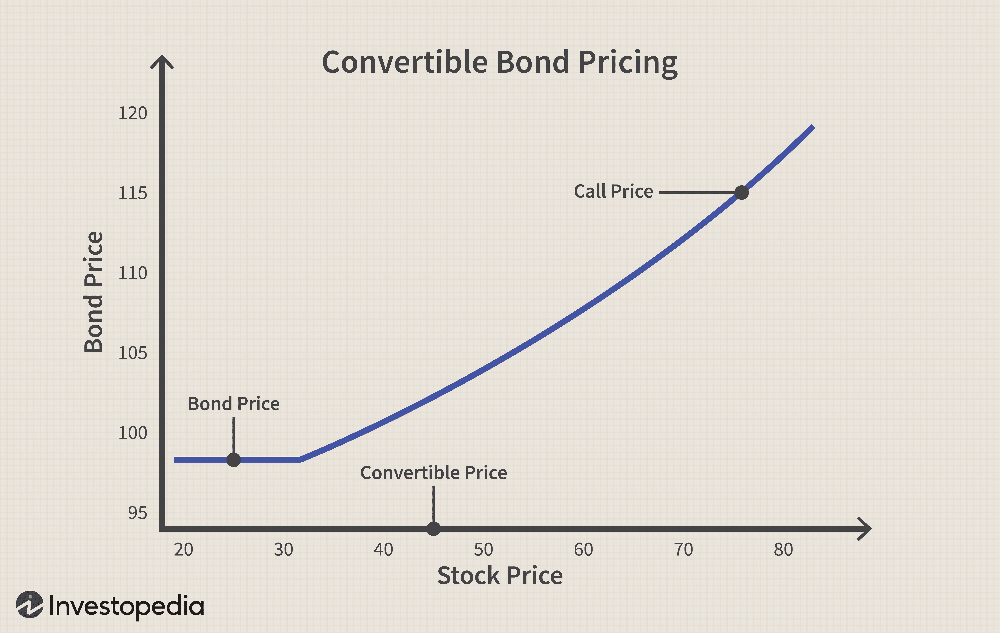

In the dynamic world of financial markets, convertible bonds stand out as versatile instruments that offer a unique blend of debt and equity features. These hybrid securities provide both issuers and investors with strategic advantages, such as the ability to access financing while potentially benefiting from stock price appreciation. Convertible bonds give bondholders the right, but not the obligation, to convert their bonds into a predetermined number of shares of the issuing company’s stock. This feature allows investors to participate in the equity upside of a company while enjoying the fixed income characteristics of traditional bonds.

The appeal of convertible bonds lies in their dual nature, offering a safety net via regular interest payments and the possibility of conversion into equity, which can lead to substantial financial gains if the company's stock performs well. This article explores the intricate relationship between convertible bonds, stock conversion, securities, and algorithmic trading, highlighting how these financial instruments are integral to sophisticated trading strategies. 



The convergence of convertible bonds and algorithmic trading represents a fascinating intersection in modern finance where technology meets traditional financial instruments. Algorithmic trading allows market participants to exploit pricing inefficiencies, execute complex strategies, and manage risks associated with convertible bonds more effectively. By leveraging quantitative models, traders can optimize their portfolios and enhance returns. Through this exploration, we aim to provide a comprehensive understanding of how these financial instruments function and their significance in today’s rapidly evolving trading landscape. 

By the end of this article, you will gain insights into the mechanics of convertible bonds, their integration into algorithmic trading platforms, and their contribution to innovative investment strategies. Embracing these insights will pave the way for understanding and capitalizing on the opportunities posed by convertible bonds in the financial markets.

## Table of Contents

## Understanding Convertible Bonds

Convertible bonds are hybrid securities that incorporate elements of both debt and equity. These financial instruments give bondholders the flexibility to convert their bonds into a predetermined number of shares of the issuing company's stock. This conversion feature is a distinctive aspect of convertible bonds, setting them apart from traditional fixed-income securities.

### Key Characteristics of Convertible Bonds

1. **Fixed Interest Payments**: Convertible bonds typically offer fixed interest payments, similar to conventional bonds. This makes them attractive to investors seeking regular income with the potential for capital appreciation.

2. **Conversion Option**: The hallmark of a convertible bond is the option to convert the bond into a specific number of shares. This conversion option allows investors to capitalize on the company's stock price appreciation, thus providing an opportunity for equity-like returns.

3. **Conversion Ratio and Conversion Price**: The conversion option is governed by two essential components:
   - **Conversion Ratio**: This is the number of shares that a bondholder can receive upon conversion. If a bond has a conversion ratio of 50, it means the holder can convert each bond into 50 shares of stock.
   - **Conversion Price**: This is the effective price per share at which the bond can be converted into stock, calculated as the face value of the bond divided by the conversion ratio.

4. **Call and Put Options**: Many convertible bonds are callable, allowing the issuer to redeem the bonds before maturity. Similarly, some bonds have put options, enabling the investor to sell the bond back to the issuer under certain conditions.

### Benefits for Issuers

- **Lower Interest Costs**: Issuers may benefit from reduced interest costs compared to traditional bonds due to the conversion feature, which typically allows lower coupon rates.
- **Deferred Dilution**: Conversion can be timed in accordance with the issuer's strategic needs, aiding in managing equity dilution.
- **Capital Structure Flexibility**: Convertible bonds provide issuers with a flexible financing option, blending debt and potential future equity.

### Benefits for Investors

- **Income and Growth**: Investors receive fixed interest payments while having the option to participate in the equity upside if the company's stock performs well.
- **Risk Management**: The debt component of convertible bonds serves as a buffer against equity market volatility, while the conversion option offers upside potential.
- **Diverse Return Profiles**: Convertible bonds can enhance portfolio returns by providing a mix of fixed-income-like stability and equity-like growth.

Convertible bonds thus present a compelling value proposition for both issuers and investors, combining the stable income of bonds with the growth potential of stocks. This unique combination makes convertible bonds an attractive vehicle for varied financial strategies.

## The Conversion Process

Convertible bonds offer a unique feature where bondholders can convert their fixed-income securities into a predetermined number of shares of the issuing company's stock. This conversion feature is a key attraction of these hybrid instruments, enabling investors to capitalize on the company's stock price appreciation while retaining bond-like characteristics.

### Conversion Ratio and Conversion Price

The conversion ratio determines how many shares a bondholder gets in exchange for each bond. It is typically stipulated at the time of issuance and remains fixed. The conversion price, on the other hand, is the price per share at which conversion can be executed and is calculated as follows:

$$
\text{Conversion Price} = \frac{\text{Par Value of Bond}}{\text{Conversion Ratio}}
$$

For instance, if a bond with a par value of $1,000 has a conversion ratio of 50, the conversion price would be:

$$
\text{Conversion Price} = \frac{1,000}{50} = 20
$$

This means the investor can convert the bond into shares at $20 per share.

### Factors Influencing the Decision to Convert

Investors weigh several factors when deciding whether to convert:

- **Stock Price Movement**: If the current stock price exceeds the conversion price, converting bonds into stocks becomes financially advantageous, allowing investors to benefit from potential upside in the stock price.

- **Dividend Considerations**: Convertible bondholders do not receive stock dividends unless they convert. Thus, high and growing dividend yields on the stock may incentivize conversion.

- **Market Conditions**: Bullish market sentiment may encourage conversion due to anticipated further capital gains, while bearish conditions might deter conversion.

- **Residual Maturity and Interest Rates**: As bonds near maturity and if interest rates are rising, conversion might be preferred to avoid holding a depreciating bond.

### Mechanics of the Conversion Process

The conversion process involves a formal declaration by the bondholder to convert their bonds. This declaration typically includes completing a notice of conversion. Once submitted, the bondholder relinquishes the bond in exchange for shares according to the conversion ratio.

Here is a Python code snippet demonstrating how one might calculate whether it's beneficial to convert based on current market conditions:

```python
def should_convert(current_stock_price, conversion_price):
    return current_stock_price > conversion_price

bond_par_value = 1000
conversion_ratio = 50
conversion_price = bond_par_value / conversion_ratio

current_stock_price = 25  # Example current stock price

if should_convert(current_stock_price, conversion_price):
    print("Conversion is beneficial.")
else:
    print("Hold the bonds.")

```

Understanding these conversion mechanics and the associated calculations can guide strategic investment decisions, maximizing potential profits while minimizing risks. Convertible bonds, therefore, offer flexibility and opportunities that savvy investors can harness, especially under favorable market conditions.

## Convertible Bonds in Algorithmic Trading

Algorithmic trading plays a pivotal role in modern financial markets by enabling traders to automate and optimize trading strategies through the use of advanced statistical and mathematical models. The integration of [algorithmic trading](/wiki/algorithmic-trading) in the trading of convertible bonds offers unique opportunities to capitalize on pricing inefficiencies. Convertible bonds, with their hybrid nature, present distinctive valuation challenges due to their combination of debt and equity characteristics, which algorithms can efficiently address.

Algorithms in convertible bond trading often focus on identifying and exploiting discrepancies between the market price of a convertible bond and its theoretical value. These pricing inefficiencies can arise due to market [volatility](/wiki/volatility-trading-strategies), mispricing in related underlying securities, or shifts in interest rates. By leveraging statistical [arbitrage](/wiki/arbitrage) techniques, traders can use algorithms to execute trades with precision and speed, thereby maximizing potential profits while minimizing transaction costs.

Quantitative models form the backbone of algorithmic trading strategies in convertible bonds. These models commonly incorporate factors such as [interest rate](/wiki/interest-rate-trading-strategies) movements, credit spreads, and stock volatility to assess the value of a convertible bond. One widely used model is the Black-Scholes model, adapted for convertible bond pricing to [factor](/wiki/factor-investing) in the complexities of embedded conversion options. The model helps in estimating the theoretical price of the bond, which can then be compared against the market price to identify potential arbitrage opportunities.

A \textit{delta-neutral} strategy is another sophisticated approach used in algorithmic trading of convertible bonds. This strategy aims to create a hedge by maintaining a balanced position where the overall portfolio is insensitive to small changes in the underlying stock price. The delta, a measure of sensitivity of the convertible bond’s price to changes in the underlying stock price, guides traders in adjusting their positions to keep the portfolio delta-neutral. By continuously rebalancing the portfolio, traders attempt to capture profit from movements in the underlying stock’s volatility without being exposed to the stock price’s directional movements.

Implementing these strategies in algorithmic trading often involves the use of programming languages such as Python. For example, using Python's data analysis libraries like pandas and numpy, traders can build models to simulate and assess potential trading strategies. An example of a simple pseudo-code outline for a delta-neutral strategy might look like this:

```python
import numpy as np
import pandas as pd

def calculate_delta(stock_price, conversion_ratio):
    # Placeholder for delta calculation
    return conversion_ratio * (stock_price / 100)  # Simplified delta calculation

def rebalance_portfolio(portfolio, current_delta):
    hedge_ratio = -portfolio['bond_position'] * current_delta
    portfolio['hedge_position'] += hedge_ratio
    return portfolio

stock_price = 100  # Example stock price
conversion_ratio = 0.5  # Example conversion ratio
current_delta = calculate_delta(stock_price, conversion_ratio)

portfolio = {'bond_position': 1000, 'hedge_position': 0}
portfolio = rebalance_portfolio(portfolio, current_delta)

print(f"Rebalanced Portfolio: {portfolio}")
```

This code outlines a basic framework for managing the delta-hedging process by dynamically adjusting positions in response to changes in stock price or conversion attributes.

In essence, algorithmic trading within the context of convertible bonds enhances the ability of traders to systematically explore and exploit complex interactions within the market, leveraging computational power and sophisticated models to optimize trading outcomes effectively.

## Risk Management in Convertible Bond Strategies

Convertible bond trading encompasses several unique risks that require effective management to optimize returns. These primarily include [liquidity](/wiki/liquidity-risk-premium) risk, credit risk, and interest rate risk. Understanding and mitigating these risks is crucial for investors and traders involved in convertible bonds.

**Liquidity Risk:** Liquidity risk arises due to the potential difficulty in buying or selling bonds without affecting their price. Convertible bonds may have lower liquidity than more standard types of debt, making it challenging to execute large trades without experiencing significant price slippage. To manage this risk, traders often rely on liquidity providers or market makers who facilitate trading by maintaining bid and ask spreads. Additionally, liquidity risk can be mitigated by diversifying investments across different issuers and maturities to ensure access to sufficient market depth.

**Credit Risk:** This refers to the risk of default by the bond issuer. Convertible bonds, being subordinate to other types of debt in the capital structure, inherently carry higher credit risk. This risk can be managed by conducting rigorous credit analysis and monitoring changes in the issuer's credit rating. Credit ratings agencies provide assessments that help investors gauge the risk of issuer default. For quantitative assessment, the credit spread, which is the difference between the yield of a corporate bond and a risk-free government bond, can serve as an indicator of credit risk. A wider credit spread suggests higher risk.

**Interest Rate Risk:** Convertible bonds are sensitive to changes in interest rates. An increase in interest rates can decrease bond prices, as the fixed interest payments become less attractive compared to new issues offering higher coupon rates. To hedge against interest rate risk, investors can use derivative instruments such as interest rate swaps or options. For instance, an interest rate swap could be employed to exchange the fixed payments of a convertible bond for a floating rate, thus reducing exposure to rising rates.

Trading decisions are significantly influenced by credit ratings and interest rate movements. Credit ratings provide insights into the creditworthiness of issuers, affecting both the pricing and yield of convertible bonds. Changes in interest rates not only impact the bond's valuation but also the attractiveness of conversion into equity. 

To illustrate, consider a scenario where interest rates rise unexpectedly. A trader hedging a portfolio of convertible bonds might use the following Python code snippet to calculate the potential price impact using modified duration, which measures the sensitivity of a bond's price to interest rate changes:

```python
def interest_rate_impact(price, duration, yield_change):
    """Calculate the price impact of interest rate changes."""
    return -price * duration * (yield_change / 100)

# Example parameters
bond_price = 1000  # current bond price
modified_duration = 5  # bond's modified duration
yield_change = 1  # change in yield by 1%

price_impact = interest_rate_impact(bond_price, modified_duration, yield_change)
print(f"Price Impact: ${price_impact:.2f}")
```

Managing these risks through strategic analysis and the use of financial derivatives enhances the stability and profitability of convertible bond investments. In addition to these techniques, maintaining awareness of macroeconomic indicators and continuously assessing the credit quality of issuers provides a robust framework for successful risk management in convertible bond trading.

## Opportunity and Challenges

Convertible bonds offer promising investment opportunities, but they also present a set of inherent challenges that market participants must navigate. The competitive nature of the convertible bond markets is characterized by both the complexity of these instruments and the sophistication of investors who participate in this space. Market perceptions play a crucial role in determining the pricing and demand for convertible bonds, as investor sentiment toward the issuing company's equity prospects and broader market conditions can heavily influence conversion decisions.

One opportunity presented by convertible bonds is their ability to provide downside protection through fixed interest payments while also offering potential equity upside. This dual characteristic can make them appealing during periods of market volatility. Furthermore, convertible bonds can attract a diverse investor base ranging from risk-averse bondholders to those seeking equity-like returns without direct exposure to stock market fluctuations.

However, challenges arise in accurately valuing convertible bonds due to their hybrid nature. Factors such as interest rate movements, the volatility of the underlying stock, and credit risks associated with the issuing company must be meticulously analyzed. The pricing efficiency in the convertible bond market can be hampered by these complex dynamics, creating potential pricing inefficiencies that skilled traders can exploit.

To address these challenges and capitalize on opportunities, various strategies can be employed. One effective approach is to leverage advanced quantitative models that assess the fair value of convertible bonds by integrating different risk parameters. Utilizing a delta-neutral strategy, in which traders hedge equity exposure by balancing long and short positions, can also mitigate market risks while optimizing returns.

Algorithmic trading systems, equipped with sophisticated algorithms, are increasingly being used to identify and act on arbitrage opportunities in convertible bond markets. These systems can execute trades at high speeds, capturing small mispricings between the convertible bond and its underlying stock efficiently.

Additionally, maintaining a dynamic risk management framework is essential. This includes monitoring credit ratings and interest rate trends, as these factors can significantly impact convertible bond performance. By continuously analyzing these elements and adjusting trading strategies accordingly, traders can better manage potential risks.

In conclusion, while the convertible bond market presents notable opportunities for diverse investment strategies, it demands a thorough understanding and strategic approach to overcome its challenges. By employing innovative trading techniques and robust risk management practices, market participants can effectively navigate this competitive landscape.

## Conclusion

Convertible bonds present a unique investment opportunity by merging the attributes of debt instruments and equity securities. They provide investors with regular interest payments typical of bonds while offering the flexibility to participate in the potential upside of equity markets through conversion options. This dual nature allows convertible bonds to serve as a strategic tool for portfolio diversification and risk management.

The integration of algorithmic trading techniques with convertible bonds further enhances their attractiveness and utility in modern financial markets. Algorithmic trading, which utilizes complex mathematical models and computational power to exploit market inefficiencies, can be particularly effective in optimizing the returns from convertible bonds. For instance, algorithms can help identify arbitrage opportunities or construct delta-neutral strategies, which are designed to profit from the relative movement between the convertible bonds and underlying stocks while minimizing market exposure.

Success in trading convertible bonds requires more than just recognizing their potential; it necessitates embracing innovation and adopting robust risk management strategies. Efficient risk management addresses various challenges, including liquidity shortages, credit quality changes, and fluctuating interest rates. A disciplined approach to credit assessment and interest rate forecasting is vital to anticipate and react to market shifts that could impact convertible bond valuations.

In conclusion, convertible bonds, when coupled with advanced trading algorithms, offer sophisticated prospects for traders to enhance their profitability. By leveraging the hybrid nature of these instruments and applying cutting-edge trading techniques, investors can navigate complex market environments and seize opportunities that align with their risk-return objectives. As financial markets continue to evolve, the role of convertible bonds as a strategic asset class is likely to become increasingly significant, provided that innovative solutions and comprehensive risk management remain at the forefront of investment strategies.

## References & Further Reading

1. **"Convertible Bonds: Structure, Valuation, Market Environment" by Tomasz R. Bielecki and Marek Rutkowski**  
   This comprehensive book provides an in-depth analysis of convertible bonds, focusing on their structural features, valuation models, and the market dynamics surrounding them. It's an essential resource for understanding theoretical and practical aspects of convertible bonds.

2. **"Convertible Securities: The Latest Instruments, Portfolio Strategies, and Valuation Analysis" by Tracy V. Maitland and Adam Issac**  
   This text explores the various types of convertible securities, offering insights into portfolio strategies and valuation techniques. It is designed for both newcomers and seasoned investors interested in maximizing the benefits of convertible securities.

3. **"The Handbook of Convertible Bonds: Pricing, Strategies and Risk Management" by Jan De Spiegeleer and Wim Schoutens**  
   Offering a detailed exploration of convertible bond pricing and strategies, this handbook covers the quantitative aspects of convertible bonds, including derivatives pricing, hedging strategies, and risk management considerations.

4. **"Quantitative Momentum: A Practitioner's Guide to Building a Momentum-Based Stock Selection System" by Wesley R. Gray and Jack R. Vogel**  
   While focused on [momentum](/wiki/momentum) trading strategies, this book provides useful insights that can be applied to algorithmic trading, especially for implementing strategies involving convertible bonds.

5. **Research papers by Marco Avellaneda on Convertible Bond Arbitrage**  
   Marco Avellaneda has authored numerous papers on algorithmic trading and convertible bond arbitrage. His work often focuses on developing models to identify arbitrage opportunities and manage risks associated with convertible securities.

6. **Investopedia - Convertible Bonds**  
   [Investopedia](https://www.investopedia.com/terms/c/convertiblebond.asp) offers a fundamental overview of convertible bonds, explaining their basics, advantages, and disadvantages. It is a good starting point for beginners.

7. **"Algorithmic Trading and DMA: An introduction to direct access trading strategies" by Barry Johnson**  
   This book offers foundational knowledge on algorithmic trading, including strategies that might benefit traders interested in applying algorithmic tactics to convertible bond markets.

8. **Python Libraries for Financial Analysis**  
   Python libraries such as `numpy`, `pandas`, and `scipy` are instrumental for quantitative analysis and modeling in finance. Additionally, the `QuantLib` library provides comprehensive tools for convertible bond analysis and valuation. Here's a simple code snippet for pricing a convertible bond:

   ```python
   import QuantLib as ql

   # Define the bond parameters
   face_value = 1000
   coupon_rate = 0.05
   maturity_date = ql.Date(15, 3, 2028)
   issue_date = ql.Date(15, 3, 2023)

   # Convertibles specifics
   conversion_ratio = 10
   stock_price = 150

   # Pricing the convertible bond
   schedule = ql.Schedule(issue_date, maturity_date, ql.Period(ql.Annual))
   bond = ql.ConvertibleFixedCouponBond(schedule, coupon_rate, face_value, conversion_ratio, stock_price)

   # Bond engine setup
   bond_engine = ql.BinomialVanillaEngine(ql.CoxRossRubinsteinProcess(stock_price, 0.2, 0.01), 100)
   bond.setPricingEngine(bond_engine)

   # Pricing result
   bond_price = bond.cleanPrice()
   print(f"Convertible Bond Price: {bond_price}")
   ```

9. **"Options, Futures, and Other Derivatives" by John C. Hull**  
   An essential read for understanding derivatives and risk management strategies, which are relevant for professionals dealing with convertible bonds.

These resources provide a solid foundation for anyone interested in expanding their understanding of convertible bonds and integrating them effectively into their trading strategies.

