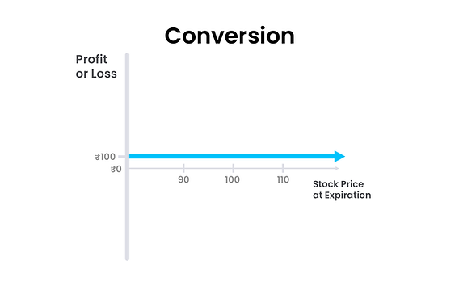

## Table of Contents

## What is conversion in options trading?

Conversion in options trading is a strategy where an investor buys a stock, buys a put option, and sells a call option all at the same time. The strike price for both the put and call options is the same, and the expiration date is also the same. This strategy is used to lock in a certain price for the stock, creating a position that is similar to owning a bond. It's called conversion because it converts the risk of owning the stock into a more predictable, fixed outcome.

The main goal of using a conversion strategy is to earn a small, risk-free profit from the difference between the stock price, the put option price, and the call option price. This profit comes from the option premiums. Because the strategy involves buying and selling options at the same strike price and expiration date, it eliminates the risk of significant price movements in the stock. This makes it a popular choice for professional traders who want to take advantage of small price discrepancies in the options market.

## How does conversion work in options trading?

Conversion in options trading is a way to lock in a certain price for a stock. It involves three steps: buying the stock, buying a put option, and selling a call option. All these actions happen at the same time. The put and call options have the same price (strike price) and the same end date (expiration date). By doing this, the trader turns the risk of owning the stock into a more predictable outcome, similar to owning a bond.

The main reason traders use conversion is to make a small, safe profit. This profit comes from the differences in prices between the stock and the options. Because the put and call options are bought and sold at the same price and end date, the strategy removes the risk of big price changes in the stock. This makes it a good choice for professional traders who want to use small price differences in the options market to their advantage.

## What are the key components of a conversion strategy?

A conversion strategy in options trading has three main parts. First, you buy the stock you are interested in. Second, you buy a put option for that stock. This gives you the right to sell the stock at a certain price in the future. Third, you sell a call option for the same stock. This means you agree to sell the stock at that same price if someone wants to buy it. The put and call options must have the same price, called the strike price, and the same end date, known as the expiration date.

The goal of using a conversion strategy is to make a small, safe profit. This profit comes from the differences in prices between the stock and the options. By buying the stock, buying a put option, and selling a call option at the same time, you create a position that is safe from big price changes in the stock. This makes it a good choice for traders who want to take advantage of small price differences in the options market without taking on a lot of risk.

## What are the benefits of using a conversion strategy?

Using a conversion strategy in options trading has several benefits. One big benefit is that it helps you lock in a certain price for a stock. This means you know exactly what you will get for the stock, no matter what happens in the market. This can be really helpful if you want to protect yourself from big price drops.

Another benefit is that a conversion strategy can help you make a small, safe profit. This profit comes from the differences in prices between the stock and the options. Because you buy the stock, buy a put option, and sell a call option at the same time, you create a position that is safe from big price changes. This makes it a good choice for traders who want to take advantage of small price differences in the options market without taking on a lot of risk.

## What are the risks associated with conversion in options trading?

Using a conversion strategy in options trading is usually seen as a safe way to make a small profit, but there are still some risks to think about. One risk is the cost of the options. You have to pay for the put option, which can eat into your profits. If the price of the put option is high, it might not be worth doing the conversion because the cost could be more than the profit you make.

Another risk is that the market can change in ways you don't expect. Even though a conversion strategy is meant to protect you from big price changes, there can still be small changes that affect your profit. If the stock price moves a lot right before the options expire, it could make your position less valuable. This means you might not make as much money as you hoped, or you might even lose some money.

In summary, while conversion strategies are generally low-risk, it's important to be aware of the costs involved and the potential for unexpected market movements. These factors can impact the overall success of the strategy, so it's crucial to carefully consider them before deciding to use a conversion strategy.

## How can a beginner identify opportunities for conversion?

A beginner can identify opportunities for conversion by looking at the prices of stocks and options. They should find a stock they are interested in and then check the prices of put and call options for that stock. The key is to find a situation where the price of the stock, the price of the put option, and the price of the call option line up in a way that allows for a small profit. This means the cost of buying the stock and the put option should be less than the money you get from selling the call option.

To do this, beginners can use tools like options pricing calculators or trading platforms that show real-time data. These tools help them see if the prices are right for a conversion strategy. It's also important for beginners to keep an eye on the market and learn about how options work. By understanding the basics and watching the market, they can spot good opportunities for conversion and make smart trading decisions.

## What are the steps to execute a conversion trade?

To execute a conversion trade, you first need to find a stock you want to trade. Look at the current price of the stock and then check the prices of put and call options for that stock. You need to find options with the same strike price and the same expiration date. The key is to make sure the cost of buying the stock and the put option is less than the money you get from selling the call option. This will give you a small profit.

Once you have found the right prices, you can start the trade. First, buy the stock at the current market price. Then, buy a put option for the stock at the chosen strike price and expiration date. Finally, sell a call option for the stock at the same strike price and expiration date. By doing all these steps at the same time, you create a position that is safe from big price changes in the stock. This is how you execute a conversion trade and lock in a small, safe profit.

## How does conversion differ from other options strategies like reversal?

Conversion and reversal are two options strategies that seem similar but have key differences. In a conversion strategy, you buy the stock, buy a put option, and sell a call option all at the same time. The put and call options have the same price and end date. This strategy helps you lock in a certain price for the stock and aims to make a small, safe profit from the differences in prices between the stock and the options.

On the other hand, a reversal strategy is like the opposite of conversion. In a reversal, you sell the stock short, buy a call option, and sell a put option. Again, the call and put options have the same price and end date. The goal of a reversal is also to make a small, safe profit, but it's used when you think the stock price will go down. Both strategies help you manage risk, but they work in different ways depending on whether you expect the stock price to go up or down.

## What are the tax implications of using a conversion strategy?

Using a conversion strategy in options trading can have tax implications that you need to think about. When you do a conversion, you buy a stock, buy a put option, and sell a call option. If you make a profit from this, it's usually considered a short-term capital gain because the options have a short expiration date. Short-term capital gains are taxed at your regular income tax rate, which can be higher than the rate for long-term capital gains.

It's also important to know that the tax rules can change based on how long you hold the stock and options. If you hold the stock for more than a year, any profit from selling the stock could be taxed as a long-term capital gain, which has a lower tax rate. But, because conversion strategies often involve short-term options, the profits are usually taxed at the higher short-term rate. Always talk to a tax professional to understand how these rules apply to your specific situation.

## How can advanced traders optimize their conversion strategies?

Advanced traders can optimize their conversion strategies by carefully choosing the right stock and options. They look for stocks with high [liquidity](/wiki/liquidity-risk-premium) and options with tight bid-ask spreads. This helps them get the best prices when they buy the stock, buy the put option, and sell the call option. They also use tools like options pricing models to find the best strike prices and expiration dates. By doing this, they can find small price differences that they can use to make a profit.

Another way advanced traders optimize their conversion strategies is by managing their positions well. They keep an eye on the market and are ready to adjust their positions if the stock price moves a lot. They might close out the options early if they see a chance to lock in a bigger profit or cut their losses. They also use their knowledge of market trends and events to time their trades better. By being smart about when and how they trade, advanced traders can make the most out of their conversion strategies.

## What are some real-world examples of successful conversion trades?

One real-world example of a successful conversion trade happened during a time when a company was about to release its earnings report. A trader thought the stock price might go down after the report, but they wanted to make a safe profit no matter what happened. They bought the stock at $50, bought a put option with a $50 strike price for $2, and sold a call option with the same $50 strike price for $2.50. The total cost was $50 for the stock and $2 for the put, but they got $2.50 from selling the call. This gave them a small profit of $0.50 right away. Even if the stock price dropped after the earnings report, the put option protected them, and they still made their profit.

Another example was when a trader saw a chance to make a small profit from a stock that was not moving much. The stock was trading at $100. The trader bought the stock, bought a put option at a $100 strike price for $3, and sold a call option at the same $100 strike price for $3.50. The cost of the stock and put was $103, but they got $3.50 from the call, giving them a small profit of $0.50. The stock stayed around $100 until the options expired, so the trader kept their profit. By using the conversion strategy, the trader turned a quiet stock into a small, safe gain.

## How can market conditions affect the effectiveness of a conversion strategy?

Market conditions can make a big difference in how well a conversion strategy works. If the market is calm and the stock price doesn't move much, a conversion strategy can be very effective. This is because the small price differences between the stock and the options can be used to make a small, safe profit. But if the market is very up and down, it can be harder to make a profit. Big price changes right before the options expire can affect the value of the conversion position, making it less profitable or even causing a loss.

It's also important to think about how the overall market feels. If people are feeling good about the market and think stock prices will go up, it might be harder to find good conversion opportunities because the options prices might not line up right. On the other hand, if people are worried and think stock prices will go down, it might be easier to find good conversion trades. By keeping an eye on these market conditions, traders can pick the best times to use a conversion strategy and make the most out of it.

## What is Options Trading and How Does it Work?

Options trading involves the execution of contracts known as options, which are financial derivatives linked to the value of an underlying asset, such as stocks, commodities, or indices. These contracts grant the holder the right, but not the obligation, to buy (call option) or sell (put option) an asset at a predetermined price, referred to as the strike price, before or at the contract's expiry date.

The primary appeal of options trading lies in its flexibility, allowing traders to engage in various strategies that cater to hedging, speculation, or the enhancement of returns. Options provide a mechanism for hedge against potential losses in other investments, offer potential leverage with comparatively lower capital, and allow for profit from both rising and falling markets.

However, the complexity of options trading arises from the multitude of factors influencing their pricing. The Black-Scholes model, widely used for European options, is an example of a mathematical model that helps determine fair prices. The key elements of the model include the underlying asset's current price ($S$), the option's strike price ($K$), the time remaining until expiry ($T$), risk-free [interest rate](/wiki/interest-rate-trading-strategies) ($r$), and asset price [volatility](/wiki/volatility-trading-strategies) ($\sigma$). The formula for a European call option is expressed as:

$$
C = S \cdot N(d_1) - K \cdot e^{-rT} \cdot N(d_2)
$$

where:
$$
d_1 = \frac{\ln(S/K) + (r + \sigma^2/2)T}{\sigma \sqrt{T}}
$$
$$
d_2 = d_1 - \sigma \sqrt{T}
$$

Here, $N(d)$ denotes the cumulative distribution function of the standard normal distribution.

The complexity is further heightened by factors like volatility, which reflects the degree of variation of the asset's price over time. An increase in volatility generally raises an option's premium, making volatility a pivotal consideration in options pricing. Additionally, time decay or Theta—a measure of the sensitivity of the option's price to the passage of time—can erode an option's value as expiry nears.

By leveraging these dynamics, traders can tailor options contracts to diverse market conditions. They can construct strategies like covered calls, protective puts, or straddles to enhance portfolio performance or mitigate risks. A thorough understanding of variables affecting an option's price, such as intrinsic value, extrinsic value, and the Greeks, is vital for effectively employing options trading in financial management.

## References & Further Reading

[1]: Black, F., & Scholes, M. (1973). ["The Pricing of Options and Corporate Liabilities."](https://www.cs.princeton.edu/courses/archive/fall09/cos323/papers/black_scholes73.pdf) Journal of Political Economy, 81(3), 637-654.

[2]: Hull, J. C. (2022). ["Options, Futures, and Other Derivatives"](https://www.pearson.com/en-us/subject-catalog/p/options-futures-and-other-derivatives/P200000005938/9780136939917) (11th Edition). Pearson.

[3]: Narang, R. K. (2009). ["Inside the Black Box: The Simple Truth About Quantitative Trading"](https://onlinelibrary.wiley.com/doi/book/10.1002/9781118267738) (1st Edition). Wiley.

[4]: Aldridge, I. (2013). ["High-Frequency Trading: A Practical Guide to Algorithmic Strategies and Trading Systems"](https://www.amazon.com/High-Frequency-Trading-Practical-Algorithmic-Strategies/dp/1118343506) (2nd Edition). Wiley.

[5]: Mauboussin, M. J., & Callahan, D. (2012). ["Measured Success: Testing Factor Models for Equity Portfolio Returns"](https://scholar.google.com/citations?user=tzttrvsAAAAJ&hl=en). Credit Suisse Global Financial Strategies.

[6]: Wilmott, P. (2006). ["Paul Wilmott Introduces Quantitative Finance"](https://www.amazon.com/Paul-Wilmott-Introduces-Quantitative-Finance/dp/0470319585) (2nd Edition). Wiley.