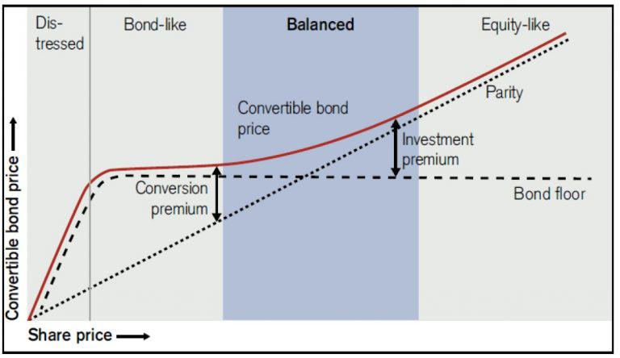

The financial landscape is characterized by constant evolution, providing traders with an array of opportunities to maximize returns through diverse strategies. Among these strategies, options trading, conversion techniques, and algorithmic trading have emerged as significant avenues for maximizing returns and managing financial risks. These strategies cater to a wide spectrum of trading objectives, from hedging risks to enhancing returns and exploiting market inefficiencies.

Options trading is a versatile financial strategy involving the buying and selling of options contracts. These contracts, derivatives based on the value of underlying assets, provide the holder with the right, but not the obligation, to buy or sell the asset at a predetermined price before a specified expiration date. The strategic use of options allows traders to achieve a variety of outcomes, including managing risk, speculating on market movements, and leveraging positions.



Conversion techniques in options trading involve transforming one type of financial asset into another to capitalize on market inefficiencies and arbitrage opportunities. This approach reduces risk and secures profit by realigning positions in options and the underlying assets, making the most of price discrepancies. Conversion is a strategic approach that seeks to harness the benefits of derivatives while minimizing exposure to market volatility.

Algorithmic trading is the use of advanced computer algorithms to execute trades based on predefined criteria. It revolutionizes the trading process by significantly increasing the speed, accuracy, and efficiency of executing orders. Algorithms can process vast amounts of data and execute complex strategies with precision, thereby reducing the influence of human biases and emotions in trading decisions. In the context of options, algorithmic trading facilitates the management of intricate strategies, optimizing trade execution and minimizing transaction costs.

By gaining a comprehensive understanding of options trading, conversion strategies, and algorithmic trading, traders can enhance financial management of their portfolios. These components, when utilized effectively, provide sophisticated tools for optimizing financial outcomes and maintaining a competitive edge in dynamic markets. Through strategic application and continuous refinement of these strategies, traders can develop a robust framework for achieving financial goals amidst the complexities of modern markets.

## Table of Contents

## Understanding Options Trading

Options trading involves the execution of contracts known as options, which are financial derivatives linked to the value of an underlying asset, such as stocks, commodities, or indices. These contracts grant the holder the right, but not the obligation, to buy (call option) or sell (put option) an asset at a predetermined price, referred to as the strike price, before or at the contract's expiry date.

The primary appeal of options trading lies in its flexibility, allowing traders to engage in various strategies that cater to hedging, speculation, or the enhancement of returns. Options provide a mechanism for hedge against potential losses in other investments, offer potential leverage with comparatively lower capital, and allow for profit from both rising and falling markets.

However, the complexity of options trading arises from the multitude of factors influencing their pricing. The Black-Scholes model, widely used for European options, is an example of a mathematical model that helps determine fair prices. The key elements of the model include the underlying asset's current price ($S$), the option's strike price ($K$), the time remaining until expiry ($T$), risk-free [interest rate](/wiki/interest-rate-trading-strategies) ($r$), and asset price [volatility](/wiki/volatility-trading-strategies) ($\sigma$). The formula for a European call option is expressed as:

$$
C = S \cdot N(d_1) - K \cdot e^{-rT} \cdot N(d_2)
$$

where:
$$
d_1 = \frac{\ln(S/K) + (r + \sigma^2/2)T}{\sigma \sqrt{T}}
$$
$$
d_2 = d_1 - \sigma \sqrt{T}
$$

Here, $N(d)$ denotes the cumulative distribution function of the standard normal distribution.

The complexity is further heightened by factors like volatility, which reflects the degree of variation of the asset's price over time. An increase in volatility generally raises an option's premium, making volatility a pivotal consideration in options pricing. Additionally, time decay or Theta—a measure of the sensitivity of the option's price to the passage of time—can erode an option's value as expiry nears.

By leveraging these dynamics, traders can tailor options contracts to diverse market conditions. They can construct strategies like covered calls, protective puts, or straddles to enhance portfolio performance or mitigate risks. A thorough understanding of variables affecting an option's price, such as intrinsic value, extrinsic value, and the Greeks, is vital for effectively employing options trading in financial management.

## Conversion in Options Trading

A conversion strategy involves transforming one type of financial asset into another by utilizing specific characteristics of options. In options trading, this approach is mainly applied to reduce risk and secure profits through [arbitrage](/wiki/arbitrage) opportunities. By aligning long and short positions in options with the positions in underlying assets, traders can effectively capitalize on price discrepancies present in the market.

For instance, a typical options conversion strategy includes buying one call option and selling one put option while simultaneously selling the underlying asset. Such a setup creates a synthetic long position on the asset, neutralizing exposure to the underlying asset's price fluctuations. This method allows traders to exploit inefficiencies in the pricing models of options and underlying assets. The premise of this strategy is based on the premise that the options market may sometimes misprice the implied volatility relative to the actual volatility expected by the trader.

The low-risk nature of conversion strategies makes them appealing to traders and investors seeking steady returns. These strategies exploit arbitrage opportunities and are considered less risky because they aim to lock in small but consistent profits from pricing inefficiencies. However, executing conversion strategies effectively requires a deep understanding of market dynamics, expertise in pricing models, and quick execution to capture potential profits before the market corrects the identified inefficiency.

In practice, successful application of conversion strategies often requires access to real-time data, sophisticated trading platforms, and occasionally, algorithmic assistance to swiftly detect and act on arbitrage opportunities. Consequently, traders must remain vigilant and adaptable to changing market conditions to ensure these strategies continuously yield favorable outcomes.

## Algorithmic Trading: An Overview

Algorithmic trading employs sophisticated computer algorithms to execute trades based on a pre-defined set of rules. These rules can relate to timing, price, quantity, or any mathematical model, enabling traders to maximize efficiency, accuracy, and speed. The method significantly enhances the ability to quickly respond to dynamic market changes, thus conferring a competitive edge in financial markets.

One of the primary advantages of [algorithmic trading](/wiki/algorithmic-trading) is its capacity to minimize human biases, which often cloud judgment in traditional trading. By automating decisions, algorithms provide a more systematic and emotion-free approach to trading activities. This introduces a higher level of discipline to trading strategies, ensuring consistency and reliability in execution.

In options trading, algorithms have proven especially advantageous for managing complex strategies that would be difficult and time-consuming to execute manually. Algorithms help optimize execution by identifying optimal entry and [exit](/wiki/exit-strategy) points, and they also contribute to reducing transaction costs through precise order placement and timing. For example, through optimal order slicing, algorithms can break up large orders into smaller ones, thus minimizing market impact and adverse price movements.

The success of algorithmic trading hinges on a few foundational elements: data integrity, robust programming, and continuous performance monitoring. Ensuring data accuracy is crucial, as flawed data can lead to incorrect trading decisions. Algorithm robustness involves writing efficient code that can handle various market scenarios, utilizing languages such as Python to leverage its scientific computing libraries like NumPy and Pandas for data analysis.

Moreover, ongoing performance monitoring is essential to ensure that the algorithms operate as expected and adapt to changing market conditions. Traders often use [backtesting](/wiki/backtesting) to simulate historical data and refine their strategies accordingly, enhancing the algorithms' reliability and profitability in real-time trading. Here is a basic example of what a trading algorithm might look like in Python:

```python
import numpy as np
import pandas as pd

# Load market data
data = pd.read_csv('market_data.csv')

# Define a simple moving average strategy
def moving_average_strategy(data, short_window, long_window):
    signals = pd.DataFrame(index=data.index)
    signals['signal'] = 0.0

    # Compute short and long simple moving averages (SMA)
    signals['short_mavg'] = data['price'].rolling(window=short_window, min_periods=1, center=False).mean()
    signals['long_mavg'] = data['price'].rolling(window=long_window, min_periods=1, center=False).mean()

    # Generate signals when short SMA crosses long SMA
    signals['signal'][short_window:] = np.where(signals['short_mavg'][short_window:] 
                                 > signals['long_mavg'][short_window:], 1.0, 0.0)   
    signals['positions'] = signals['signal'].diff()

    return signals

# Example execution with short and long window periods
signals = moving_average_strategy(data, short_window=40, long_window=100)
```

This code demonstrates a basic moving average crossover strategy, a common technique used in algorithmic trading. The code generates buy signals when a short-term moving average crosses above a long-term moving average, and sell signals otherwise. Despite its simplicity, this example highlights how algorithms can be designed to automate complex trading strategies.

In summary, algorithmic trading enhances the execution of trades through precision, discipline, and adaptability. It requires meticulous preparation and constant refinement but offers substantial benefits over traditional trading methods, especially in the high-speed environment of modern financial markets.

## Integrating Conversion and Algo Trading

The integration of conversion strategies with algorithmic trading enhances both efficiency and returns in options markets by leveraging technology to automate and optimize these processes. Algorithms are capable of swiftly identifying conversion opportunities, which involve the alignment of long and short positions in both options and their underlying assets to exploit pricing discrepancies. Once identified, these opportunities can be executed instantly, maximizing the profitability of arbitrage conditions.

By employing advanced analytics, traders are able to consistently refine their strategies based on real-time market data. The vast amounts of data generated in the financial markets are often too voluminous and complex for manual analysis. However, algorithmic systems can easily process this data, identifying patterns and trends that might indicate potential conversion opportunities. The ability to adjust strategies dynamically based on live data is crucial for maintaining a competitive edge.

The synergy between conversion strategies and algorithmic trading also allows for the efficient execution of complex, multifaceted strategies. Traditional trading methods would require significant human resources and time, potentially missing out on transient market inefficiencies. Algorithms automate these processes, performing transactions with high speed and accuracy, which is essential in a market environment where conditions can change rapidly.

Moreover, algorithmic trading offers a structured framework for risk management when implementing conversion strategies. Automated systems can be programmed to monitor the market continuously and adjust positions to manage risk, such as through the application of stop-loss orders or portfolio rebalancing. This systematic approach ensures that traders remain within their risk parameters, optimizing potential returns while minimizing potential losses.

In summary, the integration of conversion strategies with algorithmic trading represents a powerful toolset for modern traders. It not only amplifies the efficiency of identifying and executing trades but also enhances the ability to manage risk and adapt strategies in real-time. As technology continues to advance, the potential for further innovation and improved market outcomes through this integration remains significant.

## Strategies and Applications

Combining options conversion and algorithmic trading expands the toolkit for financial strategizing, enabling traders to optimize their approaches in dynamic markets. One prominent application is executing arbitrage strategies. By leveraging algorithmic trading, traders can swiftly identify discrepancies between the theoretical and market prices of options, exploiting these inefficiencies for profit. Sophisticated algorithms can automate this process, ensuring timely and accurate trade execution without succumbing to emotional biases.

Another critical application is the management of option Greeks—sensitivity measures of an option's price concerning underlying variables. Algorithmic trading allows for precise adjustments to portfolios in response to changes in Greeks like Delta, Gamma, Theta, and Vega. For example, through automation, a trader can maintain a delta-neutral position, mitigating directional risk while profiting from time decay or volatility shifts.

Delta-hedging is another strategy amplified by algorithmic trading. Traders aim to neutralize the risk associated with adverse price movements in the underlying asset. Algorithms can continuously monitor the portfolio's Delta and execute trades to keep it as close to zero as possible, thereby optimizing the hedge in real-time.

Several case studies showcase the practical implementation of these strategies. For instance, in speculative trading, algorithmic trading coupled with options conversion can enhance returns by exploiting short-term market trends while maintaining controlled risk levels. Similarly, for hedging purposes, the automation of these strategies allows for comprehensive risk mitigation without the manual overhead.

Real-world examples also underline the benefits and hurdles of merging these strategies. The primary advantage lies in the increased efficiency and precision of trade execution. However, challenges such as algorithmic errors, market data inaccuracies, and the need for continuous strategy refinement persist.

Ongoing innovation in algorithmic trading fosters the development of more sophisticated and profitable approaches. The application of [machine learning](/wiki/machine-learning) models, for instance, heralds advancements in predictive analytics, enabling traders to anticipate market movements with greater accuracy. By integrating these technological innovations into traditional strategies like options conversion, financial professionals are better equipped to maximize returns and manage risks effectively, paving the way for more efficient market operations.

## Risk Management and Best Practices

Risk management is paramount when deploying sophisticated trading strategies involving options and algorithms. Effective risk management strategies ensure traders can mitigate potential losses and optimize the benefits of their trading systems. One fundamental approach includes setting stop-loss levels, which automatically limit potential losses by selling assets when they fall to a predetermined price. This practice helps protect capital and prevents severe losses from abrupt market movements. 

Diversification is another important strategy, which involves spreading investments across various instruments, sectors, or markets. By diversifying, traders reduce their exposure to any single asset or market event, thus minimizing risk. For algorithmic trading, this might involve employing multiple algorithms that operate on different trading principles or market conditions.

Regular monitoring and updating of algorithms are crucial for maintaining performance and adapting to market changes. As markets evolve, the conditions under which an algorithm was initially designed may no longer be relevant. Therefore, continuous evaluation and adjustment ensure that trading strategies remain aligned with market dynamics. This process often involves recalibrating algorithm parameters or integrating new data sources to enhance decision-making.

Incorporating backtesting and simulation is also essential for understanding the potential risks associated with trading strategies. Backtesting involves running a trading strategy on historical data to evaluate its performance. By simulating trading scenarios, traders can identify potential issues and refine their strategies before implementation. This practice helps in assessing the robustness and consistency of strategies under various market conditions.

By adhering to these best practices, traders can effectively manage the risks associated with options and algorithmic trading. This proactive approach not only safeguards investments but also maximizes the potential returns from sophisticated trading strategies.

## Conclusion

Financial strategies, particularly those involving options trading, conversion, and algorithmic trading, provide substantial advantages for traders seeking to optimize their portfolios and manage risk effectively. Options trading enables traders to employ flexible strategies, such as hedging and speculation, by allowing them to secure positions against fluctuating market conditions. Conversion techniques offer the ability to mitigate risk through arbitrage, capitalizing on mispricings in the market. 

Algorithmic trading enhances these advantages by executing trades with high efficiency and precision, driven by robust data analysis and minimizing human error. When conversion strategies are integrated into algorithmic frameworks, the synergy not only amplifies potential returns but also strengthens risk management protocols.

Traders who continuously monitor market trends and adapt their strategies are poised to maintain a competitive edge. This dynamic approach allows for the identification of new opportunities while ensuring strategies remain relevant in ever-evolving markets. 

The future of trading is shaped by the innovative application of technology and insightful strategic planning. As trading platforms and algorithms become more sophisticated, the accessibility to powerful trading tools increases, paving the way for more efficient and transparent markets. Embracing these advances promises not only enhanced profitability but also a more robust financial ecosystem, capable of adapting to, and thriving amidst, the complexities of global financial markets.

## References & Further Reading

[1]: Black, F., & Scholes, M. (1973). ["The Pricing of Options and Corporate Liabilities."](https://www.cs.princeton.edu/courses/archive/fall09/cos323/papers/black_scholes73.pdf) Journal of Political Economy, 81(3), 637-654.

[2]: Hull, J. C. (2022). ["Options, Futures, and Other Derivatives"](https://www.pearson.com/en-us/subject-catalog/p/options-futures-and-other-derivatives/P200000005938/9780136939917) (11th Edition). Pearson.

[3]: Narang, R. K. (2009). ["Inside the Black Box: The Simple Truth About Quantitative Trading"](https://onlinelibrary.wiley.com/doi/book/10.1002/9781118267738) (1st Edition). Wiley.

[4]: Aldridge, I. (2013). ["High-Frequency Trading: A Practical Guide to Algorithmic Strategies and Trading Systems"](https://www.amazon.com/High-Frequency-Trading-Practical-Algorithmic-Strategies/dp/1118343506) (2nd Edition). Wiley.

[5]: Mauboussin, M. J., & Callahan, D. (2012). ["Measured Success: Testing Factor Models for Equity Portfolio Returns"](https://scholar.google.com/citations?user=tzttrvsAAAAJ&hl=en). Credit Suisse Global Financial Strategies.

[6]: Wilmott, P. (2006). ["Paul Wilmott Introduces Quantitative Finance"](https://www.amazon.com/Paul-Wilmott-Introduces-Quantitative-Finance/dp/0470319585) (2nd Edition). Wiley.