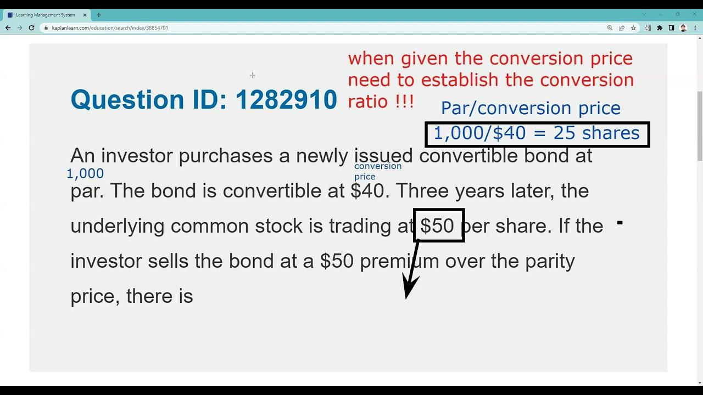

## Table of Contents

## What is Conversion Parity Price (CPP)?

Conversion Parity Price (CPP) is a term used in finance, especially when talking about convertible securities like bonds or preferred stocks. It tells you the price at which a convertible security can be turned into common stock without any loss or gain in value. In other words, it's the stock price where the value of the convertible security equals the value of the stock you would get from converting it.

To find the CPP, you divide the face value of the convertible security by the conversion ratio. The conversion ratio is the number of shares of common stock you get for each unit of the convertible security. For example, if a bond with a face value of $1,000 can be converted into 20 shares of stock, the CPP would be $1,000 divided by 20, which equals $50 per share. This means if the stock price is $50, the bond and the stock are worth the same, making it a fair exchange.

## How is Conversion Parity Price calculated?

Conversion Parity Price (CPP) is figured out by dividing the face value of a convertible security by its conversion ratio. The face value is the amount you get back when the security matures. The conversion ratio tells you how many shares of common stock you get for each unit of the convertible security. For example, if you have a bond worth $1,000 that can be turned into 20 shares of stock, you divide $1,000 by 20 to get a CPP of $50 per share.

This means if the stock price hits $50, the value of the bond and the stock you would get from converting it are the same. It's like a balance point where neither the bond nor the stock is worth more than the other. Knowing the CPP helps investors decide if it's a good time to convert their securities into stock or keep holding onto them.

## What is the significance of Conversion Parity Price in convertible securities?

The Conversion Parity Price (CPP) is really important for people who invest in convertible securities, like bonds or preferred stocks that can be turned into common stock. It helps investors figure out if it's a good time to convert their securities into stock. When the price of the stock reaches the CPP, the value of the convertible security and the stock you would get from converting it are the same. This means it's a fair swap, and investors can decide if they want to convert without losing or gaining value.

Knowing the CPP also helps investors make smart choices about their investments. If the stock price is above the CPP, it might be a good idea to convert because the stock is worth more than the security. But if the stock price is below the CPP, it might be better to hold onto the security because it's worth more than the stock you would get. This way, investors can keep an eye on the stock price and decide the best time to act, helping them get the most out of their investments.

## Can you explain the relationship between Conversion Parity Price and stock price?

The Conversion Parity Price (CPP) is like a special point where the value of a convertible security, like a bond or preferred stock, matches the value of the common stock you would get if you converted it. Imagine you have a bond worth $1,000 that can be turned into 20 shares of stock. If the stock price is $50, the bond and the 20 shares are worth the same amount. So, the CPP is $50 in this case. When the stock price is at the CPP, it's a fair trade to convert the security into stock because you're not losing or gaining any value.

If the stock price goes above the CPP, it might be a good time to convert your security into stock. For example, if the stock price goes up to $60, the 20 shares you would get are now worth $1,200, which is more than the $1,000 bond. So, converting would give you more value. On the other hand, if the stock price drops below the CPP, like to $40, the 20 shares would only be worth $800, which is less than the $1,000 bond. In this case, it's better to keep the bond because it's worth more than the stock you would get. By watching how the stock price moves around the CPP, investors can make smart choices about when to convert their securities.

## How does Conversion Parity Price affect investment decisions?

The Conversion Parity Price (CPP) is a key number that helps people who invest in convertible securities make smart choices. It's the price where the value of the convertible security, like a bond or preferred stock, is the same as the value of the common stock you would get if you turned it into stock. When the stock price hits the CPP, it's a fair trade to convert because you're not losing or gaining any value. This helps investors decide if it's a good time to convert their securities into stock or if they should wait.

If the stock price goes above the CPP, it might be a good idea to convert the security into stock. For example, if the CPP is $50 and the stock price goes up to $60, the stock is worth more than the security. So, converting would give you more value. But if the stock price drops below the CPP, like to $40, the stock is worth less than the security. In this case, it's better to keep the security because it's worth more than the stock you would get. By keeping an eye on how the stock price moves around the CPP, investors can make the best choices about when to convert their securities to get the most out of their investments.

## What are the key factors that influence Conversion Parity Price?

The Conversion Parity Price (CPP) is affected by a few main things. One big factor is the face value of the convertible security, like a bond or preferred stock. This is the amount you get back when the security matures. If the face value changes, the CPP will change too because the CPP is calculated by dividing the face value by the conversion ratio. The conversion ratio is how many shares of common stock you get for each unit of the convertible security. If the company decides to change the conversion ratio, that will also change the CPP.

Another factor that can influence the CPP is any changes made to the terms of the convertible security. For example, if the company decides to adjust the interest rate on a convertible bond, it can affect its value, which in turn affects the CPP. Also, if the company does something like a stock split or a reverse stock split, it changes the number of shares outstanding and can change the conversion ratio. All these changes can make the CPP go up or down, which is important for investors to keep an eye on when deciding if it's a good time to convert their securities into stock.

## How does Conversion Parity Price differ from Conversion Price?

Conversion Parity Price (CPP) and Conversion Price are two different but related ideas when you're talking about convertible securities like bonds or preferred stocks. The Conversion Price is set by the company when they issue the convertible security. It's the price at which you can turn your security into common stock. For example, if a bond has a Conversion Price of $50, you can convert it into stock when the stock price hits $50. This price doesn't change unless the company decides to change it.

On the other hand, the Conversion Parity Price (CPP) is a bit more dynamic. It's the price where the value of the convertible security is the same as the value of the stock you would get if you converted it. To find the CPP, you divide the face value of the security by the conversion ratio. If a $1,000 bond can be converted into 20 shares of stock, the CPP would be $1,000 divided by 20, which is $50 per share. The CPP changes with the stock price and can be different from the Conversion Price. It helps investors decide if it's a good time to convert their securities into stock based on the current stock price.

## What are the implications of a high Conversion Parity Price for a convertible bond?

A high Conversion Parity Price (CPP) for a convertible bond means the stock price needs to be really high before the bond is worth the same as the stock you would get from converting it. This can make investors think twice about buying the bond because they might not believe the stock will ever reach that high price. If the stock price stays below the CPP, the bond won't be a good deal to convert, and people might just hold onto the bond for its interest payments instead.

But a high CPP isn't always bad. If the stock does reach or go above the CPP, the bond could become very valuable. Investors who took the risk might get a big reward because they can convert their bond into stock that's worth more than the bond itself. So, while a high CPP might scare some investors away, it can also offer a chance for big gains if the stock performs well.

## How can Conversion Parity Price be used to assess the value of a convertible security?

The Conversion Parity Price (CPP) is a helpful tool for figuring out if a convertible security, like a bond or preferred stock, is a good deal. It tells you the price where the value of the convertible security is the same as the value of the stock you would get if you turned it into stock. For example, if a $1,000 bond can be converted into 20 shares of stock, the CPP would be $50 per share. If the stock price is $50, the bond and the stock are worth the same, so it's a fair trade to convert. But if the stock price is above $50, the stock is worth more than the bond, making it a good time to convert. If the stock price is below $50, the bond is worth more, so it might be better to keep the bond.

Investors can use the CPP to decide if a convertible security is a good investment. If the stock price is way below the CPP, it might not be worth buying the bond because it's not likely to be a good time to convert it into stock. But if the stock price is close to or above the CPP, the bond could be a good buy because there's a chance to convert it into stock that's worth more. By watching how the stock price moves around the CPP, investors can make smart choices about whether to buy, hold, or convert their convertible securities.

## What are the risks associated with Conversion Parity Price in volatile markets?

In volatile markets, the Conversion Parity Price (CPP) can be risky because stock prices can go up and down a lot. If the stock price is always changing, it can be hard to know when it's a good time to convert your convertible security into stock. If you convert when the stock price is high but it drops right after, you could lose money. On the other hand, if you wait too long hoping for a higher price and it never comes, you might miss out on converting at a good time.

Another risk is that the company might change the terms of the convertible security. If they decide to change the conversion ratio or the face value, it can mess up your plans. For example, if the company does a stock split, it can change the number of shares you get when you convert, which changes the CPP. This can make it even harder to decide when to convert, especially if the market is already unpredictable. So, it's important to keep an eye on both the stock price and any changes the company might make to the convertible security.

## How do changes in interest rates impact Conversion Parity Price?

Changes in interest rates can affect the Conversion Parity Price (CPP) of a convertible security like a bond. When interest rates go up, the value of the bond usually goes down because new bonds will offer higher interest rates, making the old bonds less attractive. If the bond's value drops, the CPP goes up because you need a higher stock price to make the value of the stock you would get from converting equal to the lower value of the bond. So, a rise in interest rates can make it harder for the stock price to reach the CPP, making it less likely for investors to want to convert their bonds into stock.

On the other hand, when interest rates fall, the value of the bond goes up because it's now offering a better interest rate than new bonds. This means the CPP goes down because the stock price doesn't need to be as high to match the higher value of the bond. A lower CPP makes it easier for the stock price to reach that level, which could encourage investors to convert their bonds into stock if they think the stock price will keep going up. So, changes in interest rates can really change how investors think about converting their convertible securities.

## Can you discuss advanced strategies for trading based on Conversion Parity Price?

One advanced strategy for trading based on Conversion Parity Price (CPP) is to use it to time your conversions. If you own a convertible bond and the stock price is getting close to the CPP, you might want to wait a bit longer to see if it goes above the CPP. If it does, converting the bond into stock could give you more value. But if the stock price is far below the CPP, you might hold onto the bond for its interest payments and wait for a better time to convert. This strategy needs you to keep a close eye on the stock price and be ready to act when it's right.

Another strategy is to use CPP to spot good buying opportunities. If you think a stock is going to go up a lot, you might buy a convertible bond with a high CPP. Even if the stock price doesn't reach the CPP right away, you can still get interest payments from the bond. If the stock price does go above the CPP later, you can convert the bond into stock and make a profit. This can be a good way to bet on a stock without risking as much as if you just bought the stock outright.

A third strategy involves hedging. If you own a lot of stock in a company, you might buy convertible bonds as a way to protect yourself. If the stock price drops, the value of the bond might not drop as much because it still pays interest. But if the stock price goes up and reaches the CPP, you can convert the bond into more stock. This way, you can have the best of both worlds: protection if the stock goes down and the chance to gain if it goes up. It's a bit like having a safety net while still being able to reach for the stars.

## What is Understanding Conversion Parity?

Conversion parity is a critical concept in the investment world, specifically concerning convertible securities such as convertible bonds and convertible preferred stocks. These financial instruments offer the holder the option to convert their securities into a predetermined number of shares of the issuer's common stock. Conversion parity refers to the breakeven point at which the value of the convertible security is equivalent to the value of the underlying shares if converted. This concept guides investors in deciding whether and when to convert their holdings.

The calculation of conversion parity involves a straightforward formula:

$$
\text{Conversion Parity Price} = \frac{\text{Market Price of Convertible Security}}{\text{Conversion Ratio}}
$$

Where the conversion ratio is the number of shares an investor receives upon conversion of one unit of the convertible security. For example, if a convertible bond worth \$1,000 can be converted into 50 shares of the company's stock, the conversion ratio is 50. If the current market price of the convertible bond is \$1,100, the conversion parity price of the stock would be:

$$
\text{Conversion Parity Price} = \frac{1100}{50} = 22
$$

This price indicates that if the market price of the company's stock is above \$22, converting the bond into stock may be beneficial as the investor would obtain a more valuable position by holding the shares instead of the bond. Conversely, if the stock price is below \$22, maintaining the bond without conversion might yield better returns, given the additional bond benefits such as interest payments.

Investors consider conversion parity because it provides a benchmark for assessing the potential advantage of conversion. Recognizing when the parity conditions are favorable helps investors optimize their portfolio decisions, especially when factoring in market conditions and individual financial goals.

Let's examine an example to provide clarity: Suppose an investor holds a convertible bond with a face value of \$1,000, convertible into 40 shares of a company's stock. If the bond trades at \$1,200 and the stock currently trades at \$30 per share, the conversion parity price can be calculated as follows:

$$
\text{Conversion Parity Price} = \frac{1200}{40} = 30
$$

In this scenario, the stock's current price matches the conversion parity price, signifying that converting the bond does not offer a price advantage at this time. However, if the stock price were to rise to \$35, conversion would become attractive, surpassing the breakeven parameter and enhancing the investor's return.

Ultimately, understanding conversion parity equips investors with a calculative tool to make more strategic decisions. It helps gauge the optimal timing for converting securities based on the comparative valuation, enhancing investment strategy outcomes.

## What are Financial Pricing Mechanisms?

Financial pricing mechanisms are vital for determining the value of various financial instruments, such as stocks, bonds, and derivatives. These mechanisms use a combination of market dynamics, economic indicators, and mathematical models to arrive at accurate pricing.

Stocks, which represent ownership in a company, are typically priced based on supply and demand dynamics in the market. Factors influencing stock prices include company performance, investor sentiment, and broader economic conditions. Pricing models, such as the Dividend Discount Model (DDM), can also be used to estimate the intrinsic value of a stock based on expected future dividends.

Bonds, which are debt securities issued by entities to raise capital, are priced primarily on the basis of interest rates and credit risk. The price of a bond is inversely related to interest rates; when rates rise, bond prices fall and vice versa. This relationship can be mathematically represented through the bond pricing formula:

$$

P = \sum_{t=1}^{n} \frac{C}{(1 + r)^t} + \frac{F}{(1 + r)^n}
$$

where $P$ is the price of the bond, $C$ is the periodic coupon payment, $r$ is the interest rate, $F$ is the face value of the bond, and $n$ is the number of periods until maturity.

Derivatives, which are financial instruments whose value is derived from the value of an underlying asset, are priced using complex mathematical models. The Black-Scholes model, for example, is commonly used for pricing options. It takes into account the current price of the underlying asset, the option's strike price, time to expiration, risk-free [interest rate](/wiki/interest-rate-trading-strategies), and asset [volatility](/wiki/volatility-trading-strategies).

Market volatility plays a crucial role in financial pricing as it affects the uncertainty associated with an instrument’s future value. Higher volatility leads to higher option premiums due to increased risk. Volatility is often measured through metrics like the standard deviation or the more advanced VIX index, known as the "fear gauge" for the stock market.

Interest rates are another critical [factor](/wiki/factor-investing) in financial pricing. They influence the cost of borrowing and the return on savings, thereby affecting investment decisions and the valuation of financial instruments. For example, lower interest rates can lead to higher stock valuations due to cheaper borrowing costs for companies, enhancing their investment potential and profitability.

Economic indicators, including inflation rates, GDP growth, and employment data, provide essential insights into the health of an economy and influence pricing mechanisms. These indicators impact investor expectations and confidence, thereby affecting demand and supply dynamics in financial markets.

Understanding these financial pricing mechanisms allows investors to make informed decisions. For instance, by anticipating interest rate movements or analyzing volatility trends, investors can appropriately adjust their portfolios to optimize returns. A strong grasp of the factors that influence the pricing of stocks, bonds, and derivatives can lead to more strategic and successful investment outcomes.

## What is the conclusion?

The financial landscape is continuously evolving, and familiarizing oneself with key investment terms such as conversion parity, pricing mechanisms, and [algorithmic trading](/wiki/algorithmic-trading) provides a substantial competitive edge. Mastery of these concepts can significantly enhance an investor's ability to navigate increasingly complex markets.

By integrating knowledge of conversion parity, investors can make informed decisions about when to convert convertible securities to maximize their potential returns. Understanding the mathematical calculation of conversion parity price is crucial, where the formula is:

$$
\text{Conversion Parity Price} = \frac{\text{Market Price of Convertible Security}}{\text{Conversion Ratio}}
$$

Familiarity with financial pricing mechanisms allows investors to grasp how various factors, such as market volatility and interest rates, influence the pricing of financial instruments. This understanding crystallizes into better prediction models and more strategic pricing of assets, potentially improving investment outcomes.

Meanwhile, the rise of algorithmic trading empowers traders by facilitating faster and more efficient execution of trades. Algorithmic trading strategies leverage computational power to analyze massive datasets and execute trades at speeds beyond human capability, optimizing transaction timing and reducing market impact costs.

In conclusion, these three elements—conversion parity, financial pricing, and algorithmic trading—form a triad of investment knowledge crucial for modern-day finance. A cohesive comprehension and application of these terms enable investors to design robust and sophisticated investment strategies, ultimately enhancing their market performance and maximizing returns.

## References & Further Reading

[1]: Damodaran, A. (2016). ["Investment Valuation: Tools and Techniques for Determining the Value of Any Asset"](https://books.google.com/books/about/Investment_Valuation.html?id=5SRHAAAAQBAJ). Wiley.

[2]: Hull, J. C. (2014). ["Options, Futures, and Other Derivatives"](https://elibrary.pearson.de/book/99.150005/9781292410623). Pearson.

[3]: Chan, E. P. (2009). ["Quantitative Trading: How to Build Your Own Algorithmic Trading Business"](https://github.com/ftvision/quant_trading_echan_book). Wiley.

[4]: Jansen, S. (2018). ["Machine Learning for Algorithmic Trading: Predictive Models to Extract Signals from Market and Alternative Data for Systematic Trading Strategies with Python"](https://github.com/stefan-jansen/machine-learning-for-trading). Packt Publishing.

[5]: Shiller, R. J. ["Financial Markets"](https://archive.org/details/OpenYaleCourseFinancialMarketsWithProfessorRobertShiller), Coursera Course. 

[6]: Lopez de Prado, M. (2018). ["Advances in Financial Machine Learning"](https://www.amazon.com/Advances-Financial-Machine-Learning-Marcos/dp/1119482089). Wiley.

[7]: Aronson, D. R. (2006). ["Evidence-Based Technical Analysis: Applying the Scientific Method and Statistical Inference to Trading Signals"](https://www.amazon.com/Evidence-Based-Technical-Analysis-Scientific-Statistical/dp/0470008741). Wiley.