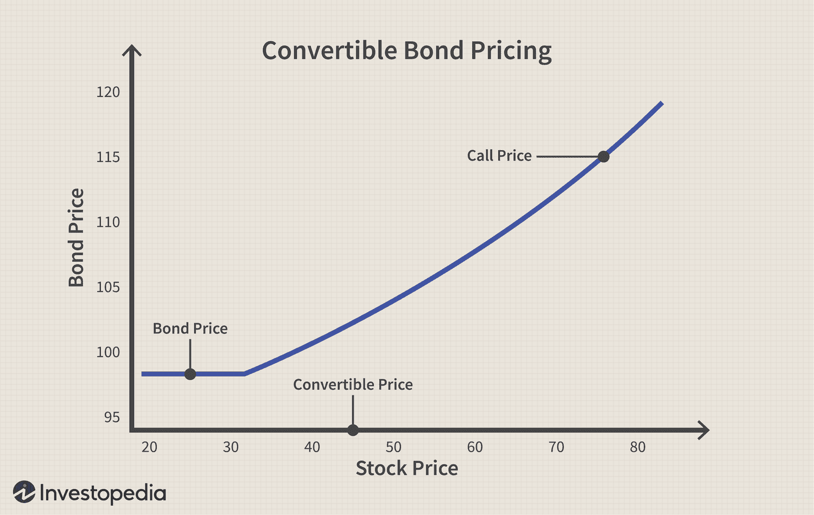

In finance, understanding key investment terms can significantly impact an investor's strategy and success. The ever-evolving financial markets require investors to be agile and informed about various concepts that can influence their decisions. This article explores the concepts of conversion parity, financial pricing mechanisms, and the role of algorithmic trading in the market. Each of these terms plays a critical role in shaping financial strategies and outcomes.

Conversion parity is a fundamental concept, particularly relevant to convertible securities. It informs investors when the conversion of a security into another form, like stock, would neither result in a gain nor a loss. This break-even point is crucial for making strategic decisions regarding whether to hold or convert an investment. Understanding conversion parity aids in maximizing the returns on convertible securities and is an essential part of any comprehensive investment strategy.



Financial pricing mechanisms are the methods used to determine the market value of financial instruments such as stocks, bonds, and derivatives. Factors such as market volatility, interest rates, and economic indicators all play a role in this pricing. A clear grasp of these elements can significantly enhance investment decisions, allowing investors to better predict market movements and capitalize on pricing opportunities.

Algorithmic trading, or algo trading, represents the forefront of technological integration in financial markets. By utilizing advanced algorithms to execute trades, it allows for faster and more efficient market participation. Constructing algorithmic strategies requires an in-depth understanding of market trends and data analytics, which can greatly improve market liquidity and impact volatility. Despite its obvious advantages, algorithmic trading also poses risks and challenges, necessitating a thorough understanding of its mechanics for effective application.

This article aims to provide clarity on these key investment terms, illustrating their significance and how they interplay in modern investment strategies. By familiarizing themselves with these concepts, investors can gain a competitive edge in navigating today's complex financial landscape.

## Table of Contents

## Understanding Conversion Parity

Conversion parity is a critical concept in the investment world, specifically concerning convertible securities such as convertible bonds and convertible preferred stocks. These financial instruments offer the holder the option to convert their securities into a predetermined number of shares of the issuer's common stock. Conversion parity refers to the breakeven point at which the value of the convertible security is equivalent to the value of the underlying shares if converted. This concept guides investors in deciding whether and when to convert their holdings.

The calculation of conversion parity involves a straightforward formula:

$$
\text{Conversion Parity Price} = \frac{\text{Market Price of Convertible Security}}{\text{Conversion Ratio}}
$$

Where the conversion ratio is the number of shares an investor receives upon conversion of one unit of the convertible security. For example, if a convertible bond worth \$1,000 can be converted into 50 shares of the company's stock, the conversion ratio is 50. If the current market price of the convertible bond is \$1,100, the conversion parity price of the stock would be:

$$
\text{Conversion Parity Price} = \frac{1100}{50} = 22
$$

This price indicates that if the market price of the company's stock is above \$22, converting the bond into stock may be beneficial as the investor would obtain a more valuable position by holding the shares instead of the bond. Conversely, if the stock price is below \$22, maintaining the bond without conversion might yield better returns, given the additional bond benefits such as interest payments.

Investors consider conversion parity because it provides a benchmark for assessing the potential advantage of conversion. Recognizing when the parity conditions are favorable helps investors optimize their portfolio decisions, especially when factoring in market conditions and individual financial goals.

Let's examine an example to provide clarity: Suppose an investor holds a convertible bond with a face value of \$1,000, convertible into 40 shares of a company's stock. If the bond trades at \$1,200 and the stock currently trades at \$30 per share, the conversion parity price can be calculated as follows:

$$
\text{Conversion Parity Price} = \frac{1200}{40} = 30
$$

In this scenario, the stock's current price matches the conversion parity price, signifying that converting the bond does not offer a price advantage at this time. However, if the stock price were to rise to \$35, conversion would become attractive, surpassing the breakeven parameter and enhancing the investor's return.

Ultimately, understanding conversion parity equips investors with a calculative tool to make more strategic decisions. It helps gauge the optimal timing for converting securities based on the comparative valuation, enhancing investment strategy outcomes.

## Financial Pricing Mechanisms

Financial pricing mechanisms are vital for determining the value of various financial instruments, such as stocks, bonds, and derivatives. These mechanisms use a combination of market dynamics, economic indicators, and mathematical models to arrive at accurate pricing.

Stocks, which represent ownership in a company, are typically priced based on supply and demand dynamics in the market. Factors influencing stock prices include company performance, investor sentiment, and broader economic conditions. Pricing models, such as the Dividend Discount Model (DDM), can also be used to estimate the intrinsic value of a stock based on expected future dividends.

Bonds, which are debt securities issued by entities to raise capital, are priced primarily on the basis of interest rates and credit risk. The price of a bond is inversely related to interest rates; when rates rise, bond prices fall and vice versa. This relationship can be mathematically represented through the bond pricing formula:

$$

P = \sum_{t=1}^{n} \frac{C}{(1 + r)^t} + \frac{F}{(1 + r)^n}
$$

where $P$ is the price of the bond, $C$ is the periodic coupon payment, $r$ is the interest rate, $F$ is the face value of the bond, and $n$ is the number of periods until maturity.

Derivatives, which are financial instruments whose value is derived from the value of an underlying asset, are priced using complex mathematical models. The Black-Scholes model, for example, is commonly used for pricing options. It takes into account the current price of the underlying asset, the option's strike price, time to expiration, risk-free [interest rate](/wiki/interest-rate-trading-strategies), and asset [volatility](/wiki/volatility-trading-strategies).

Market volatility plays a crucial role in financial pricing as it affects the uncertainty associated with an instrument’s future value. Higher volatility leads to higher option premiums due to increased risk. Volatility is often measured through metrics like the standard deviation or the more advanced VIX index, known as the "fear gauge" for the stock market.

Interest rates are another critical [factor](/wiki/factor-investing) in financial pricing. They influence the cost of borrowing and the return on savings, thereby affecting investment decisions and the valuation of financial instruments. For example, lower interest rates can lead to higher stock valuations due to cheaper borrowing costs for companies, enhancing their investment potential and profitability.

Economic indicators, including inflation rates, GDP growth, and employment data, provide essential insights into the health of an economy and influence pricing mechanisms. These indicators impact investor expectations and confidence, thereby affecting demand and supply dynamics in financial markets.

Understanding these financial pricing mechanisms allows investors to make informed decisions. For instance, by anticipating interest rate movements or analyzing volatility trends, investors can appropriately adjust their portfolios to optimize returns. A strong grasp of the factors that influence the pricing of stocks, bonds, and derivatives can lead to more strategic and successful investment outcomes.

## The Rise of Algorithmic Trading

Algorithmic trading, often abbreviated as algo trading, has significantly transformed financial markets by enabling rapid and efficient execution of trades, surpassing human capabilities. This advancement relies on pre-defined mathematical trading strategies, executed automatically by computers to buy or sell securities.

**Construction of Algorithmic Strategies**

At the core of [algorithmic trading](/wiki/algorithmic-trading) strategies lies a well-defined set of rules that determine various trade parameters. These rules typically involve timing, price, quantity, and trigger points. Strategies can be quantitative, using sophisticated mathematical models to identify opportunities, or based on historical trading patterns.

A common approach within algorithmic trading is the use of statistical [arbitrage](/wiki/arbitrage), which exploits price discrepancies between related stocks or markets. For instance, consider two stocks with historically correlated prices. An algorithm might buy one and sell the other when they diverge in expectation of a re-convergence, profiting from the adjustments.

```python
# Hypothetical Python example to illustrate basic logic
import numpy as np

def calculate_signal(stock1, stock2):
    correlation = np.corrcoef(stock1, stock2)[0, 1]
    if correlation > 0.9:
        return "buy stock1, sell stock2"
    elif correlation < -0.9:
        return "sell stock1, buy stock2"
    else:
        return "hold"

stock1_prices = np.array([10, 10.2, 10.3, 10.5, 10.6])
stock2_prices = np.array([11, 11.1, 11.2, 11.5, 11.7])

action = calculate_signal(stock1_prices, stock2_prices)
print(action)
```

**Impact on Market Liquidity and Volatility**

Algorithmic trading contributes significantly to market [liquidity](/wiki/liquidity-risk-premium). High-frequency trading firms, which are subsets of algo trading, make a large number of trades in milliseconds, providing liquidity and smoothing out market fluctuations. This improved liquidity means lower transaction costs and tighter bid-ask spreads for all traders.

However, the efficiencies of algorithmic trading are accompanied by increased volatility risks. The "Flash Crash" of May 6, 2010, highlighted these risks, where algorithms collectively exacerbated a rapid market downturn, followed by equally swift recovery, within minutes. Such events underscore the potential for algo trading-induced market disruptions.

**Risks and Challenges**

Algorithmic trading, while offering efficiency and liquidity benefits, also introduces unique challenges. One primary concern is the oversensitivity of algorithms to market conditions, which can lead to unintended consequences. Market conditions can change erratically, making it essential for algorithms to adapt quickly, a task that presents substantial programming and data interpretation challenges.

Additionally, algorithms can exhibit emergent behavior when interacting with one another in complex markets, leading to phenomena not foreseen by their developers. Regulatory scrutiny has increased due to these factors, as authorities strive to mitigate systemic risks associated with high-frequency trading and its propensity to cause abrupt market movements.

**Future Prospects**

As technology continues to evolve, so too will algorithmic trading. The integration of [machine learning](/wiki/machine-learning) and [artificial intelligence](/wiki/ai-artificial-intelligence) is expected to further refine and enhance algorithmic strategies, offering even more precise trading models capable of handling complex datasets and extracting actionable insights.

Furthermore, with the rise in decentralized finance and blockchain technology, new algorithmic trading opportunities will emerge, necessitating adaptations in strategy formulation and risk management.

Overall, algorithmic trading is poised to further revolutionize trading dynamics, enhancing market efficiency while posing challenges that require careful management and regulatory oversight.

## Integration: How Conversion Parity, Pricing, and Algo Trading Interplay

In contemporary investment strategies, the integration of conversion parity, financial pricing, and algorithmic trading can significantly enhance investment efficiency and maximize returns. Each concept plays a distinct yet interconnected role in shaping smarter investment decisions.

### Understanding the Synergy

Conversion parity provides investors with a critical decision-making tool, indicating when it is optimal to convert securities, such as convertible bonds, into stocks. It serves as a threshold for comparing the market value of a convertible security to its conversion value. This parity ensures that investors do not convert prematurely, thus protecting potential returns from unfavorable market conditions. For instance, if the conversion parity price of a bond exceeds its market price, it would be unwise to convert immediately, as the bond holds greater value in its current form.

Financial pricing involves the assessment and valuation of financial instruments like stocks, bonds, and derivatives, based on market volatility, interest rates, and broader economic indicators. Accurate pricing is essential for investors to comprehend the intrinsic value of an asset and determine when securities are mispriced, thereby identifying profitable entry and [exit](/wiki/exit-strategy) points.

Algorithmic trading introduces automation and precision into the execution of investment strategies. Algorithms can process vast amounts of data quickly, identifying trends and executing trades at speeds impossible for human traders. This rapid action reduces transaction costs, improves liquidity, and can exploit minor price discrepancies due to mispricing.

### Case Studies and Examples

1. **Convertible Arbitrage**: Investors use conversion parity in combination with algo trading to execute convertible arbitrage strategies. This involves purchasing convertible bonds and shorting the underlying stock when conversion parity suggests an advantageous conversion. Algorithms efficiently monitor price changes and execute trades, capturing arbitrage opportunities between market inefficiencies.

2. **Volatility-Based Strategies**: Financial pricing models incorporate market volatility through tools like the Black-Scholes model for option pricing. Algorithmic systems track volatility indices and economic releases to anticipate pricing shifts. For example, in high-frequency trading (HFT), algorithms exploit small price movements to capture quick gains, which is especially effective during volatile periods.

3. **Market Making**: Algorithmic trading also enhances market-making strategies by setting bid and ask prices based on real-time pricing data. This reduces spreads (the difference between buying and selling prices), providing liquidity and stability to the market. Conversion parity assessments help market makers price convertibles accurately, reflecting conversion possibilities in their spreads.

### Enhancing Investment Efficiency

By integrating these elements into a cohesive strategy, investors can simplify complex investment processes. Understanding when to convert securities via conversion parity, applying precise financial pricing models, and utilizing the speed and intelligence of algorithmic trading provides a comprehensive approach to market operations. This synergy not only maximizes returns but also minimizes risks by ensuring that investment decisions are data-driven and strategically aligned with market conditions.

The harmonization of conversion parity, financial pricing, and algorithmic trading creates a robust framework for modern-day investing, equipping investors with the tools to navigate and capitalize on dynamic market environments efficiently.

## Conclusion

The financial landscape is continuously evolving, and familiarizing oneself with key investment terms such as conversion parity, pricing mechanisms, and algorithmic trading provides a substantial competitive edge. Mastery of these concepts can significantly enhance an investor's ability to navigate increasingly complex markets.

By integrating knowledge of conversion parity, investors can make informed decisions about when to convert convertible securities to maximize their potential returns. Understanding the mathematical calculation of conversion parity price is crucial, where the formula is:

$$
\text{Conversion Parity Price} = \frac{\text{Market Price of Convertible Security}}{\text{Conversion Ratio}}
$$

Familiarity with financial pricing mechanisms allows investors to grasp how various factors, such as market volatility and interest rates, influence the pricing of financial instruments. This understanding crystallizes into better prediction models and more strategic pricing of assets, potentially improving investment outcomes.

Meanwhile, the rise of algorithmic trading empowers traders by facilitating faster and more efficient execution of trades. Algorithmic trading strategies leverage computational power to analyze massive datasets and execute trades at speeds beyond human capability, optimizing transaction timing and reducing market impact costs.

In conclusion, these three elements—conversion parity, financial pricing, and algorithmic trading—form a triad of investment knowledge crucial for modern-day finance. A cohesive comprehension and application of these terms enable investors to design robust and sophisticated investment strategies, ultimately enhancing their market performance and maximizing returns.

## Additional Resources

### Additional Resources

For further exploration of conversion parity, "Convertible Securities: A Complete Guide to Investment and Corporate Financing Strategies" by Kevin Spillane provides an in-depth analysis of convertible securities and their role in financial strategies. Additionally, Aswath Damodaran's lectures on convertible securities available on YouTube offer valuable insights into the concept of conversion parity and its applications.

To expand your understanding of financial pricing mechanisms, consider reading "Options, Futures, and Other Derivatives" by John C. Hull, a comprehensive resource that covers various financial instruments and their pricing. The online [course](/wiki/best-algorithmic-trading-courses) "Financial Markets" available on Coursera, taught by Robert Shiller from Yale University, offers foundational knowledge on market pricing influenced by economic indicators and other critical factors.

For those interested in algorithmic trading, "Algorithmic Trading: Winning Strategies and Their Rationale" by Ernest P. Chan provides practical insights into building successful trading algorithms. The course "Algorithmic Trading and Finance Models with Python, R, and Stata Essential Training" on LinkedIn Learning is a practical resource for learning how to implement algorithmic strategies using programming languages like Python and R.

Consider reviewing scholarly articles and papers in financial journals such as the "Journal of Finance" or "Journal of Financial Economics," which frequently publish studies on recent advancements and research in these areas.

By leveraging these resources, you can build a well-rounded knowledge base that combines expertise in conversion parity, financial pricing, and algorithmic trading to enhance your investment strategies.

## References & Further Reading

[1]: Damodaran, A. (2016). ["Investment Valuation: Tools and Techniques for Determining the Value of Any Asset"](https://books.google.com/books/about/Investment_Valuation.html?id=5SRHAAAAQBAJ). Wiley.

[2]: Hull, J. C. (2014). ["Options, Futures, and Other Derivatives"](https://elibrary.pearson.de/book/99.150005/9781292410623). Pearson.

[3]: Chan, E. P. (2009). ["Quantitative Trading: How to Build Your Own Algorithmic Trading Business"](https://github.com/ftvision/quant_trading_echan_book). Wiley.

[4]: Jansen, S. (2018). ["Machine Learning for Algorithmic Trading: Predictive Models to Extract Signals from Market and Alternative Data for Systematic Trading Strategies with Python"](https://github.com/stefan-jansen/machine-learning-for-trading). Packt Publishing.

[5]: Shiller, R. J. ["Financial Markets"](https://archive.org/details/OpenYaleCourseFinancialMarketsWithProfessorRobertShiller), Coursera Course. 

[6]: Lopez de Prado, M. (2018). ["Advances in Financial Machine Learning"](https://www.amazon.com/Advances-Financial-Machine-Learning-Marcos/dp/1119482089). Wiley.

[7]: Aronson, D. R. (2006). ["Evidence-Based Technical Analysis: Applying the Scientific Method and Statistical Inference to Trading Signals"](https://www.amazon.com/Evidence-Based-Technical-Analysis-Scientific-Statistical/dp/0470008741). Wiley.