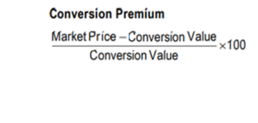

## Table of Contents

## What is the basic definition of conversion premium in finance?

Conversion premium in finance refers to the extra amount an investor pays for a convertible security, like a convertible bond, over its conversion value. The conversion value is what the security would be worth if it were converted into the underlying stock right away. The premium is essentially the difference between the market price of the convertible security and this conversion value.

This concept is important because it helps investors understand how much more they are paying for the potential benefits of a convertible security compared to just buying the stock directly. A high conversion premium might suggest that the market expects the stock to rise significantly, making the conversion feature more valuable. Conversely, a low or negative premium could indicate that the stock is not expected to perform well, or that the security is undervalued.

## How does conversion premium relate to convertible securities?

Conversion premium is an important idea when you're looking at convertible securities, like convertible bonds. These are bonds that you can turn into a set number of shares of the company's stock. The conversion premium is the extra money you pay for the bond compared to what those shares would be worth right now if you converted the bond into stock. It's like paying a little more for the chance to own the stock later.

This premium matters because it tells you how much more you're spending for the possibility of owning the stock in the future. If the conversion premium is high, it means people think the stock will go up a lot, so they're willing to pay more for the bond now. If the premium is low or even negative, it might mean that people don't expect the stock to do well, or that the bond is a good deal because it's cheaper than the stock it could become.

## What is the formula to calculate conversion premium?

The formula to calculate conversion premium is simple. You take the market price of the convertible security and subtract the conversion value. The conversion value is what the security would be worth if you turned it into stock right away. So, the formula looks like this: Conversion Premium = Market Price of Convertible Security - Conversion Value.

Let's break it down with an example. Imagine you have a convertible bond that you can turn into 100 shares of stock. If the stock is currently trading at $10 per share, the conversion value of the bond would be $1,000 (100 shares times $10 per share). If the market price of the bond is $1,100, then the conversion premium would be $100 ($1,100 - $1,000). This $100 is the extra amount you're paying for the bond over what the stock is worth right now.

## Can you explain the concept of conversion premium with a simple example?

Imagine you have a special kind of bond called a convertible bond. This bond lets you turn it into 100 shares of the company's stock whenever you want. Right now, each share of the stock is worth $10, so if you converted the bond, you'd get shares worth $1,000 in total. But, the bond itself is selling for $1,100 on the market. The extra $100 you're paying for the bond over the value of the stock is called the conversion premium.

This conversion premium is important because it shows how much more you're willing to pay for the bond compared to just buying the stock directly. In this case, you're paying an extra $100, which means you believe the stock might go up in value in the future. If the stock price stays at $10, you've paid more than necessary, but if it goes up to, say, $12 per share, then your bond would be worth $1,200, and that extra $100 you paid would seem like a good deal.

## What factors influence the conversion premium of a convertible bond?

The conversion premium of a convertible bond can be affected by several things. One big [factor](/wiki/factor-investing) is how the stock of the company is doing. If people think the stock price will go up a lot, they might be willing to pay more for the bond, making the conversion premium higher. Another thing that matters is how much time is left until the bond can be converted into stock. If there's a long time left, the premium might be higher because there's more time for the stock to grow in value.

Interest rates also play a role in the conversion premium. If interest rates go up, the value of the bond part of the convertible bond might go down, which can affect the premium. The overall health of the company and the economy can also change how much people are willing to pay for the bond. If the company is doing well and the economy is strong, the premium might be higher because people are more confident about the future.

Lastly, how risky the bond is can influence the conversion premium. If the bond is seen as risky, investors might want a higher premium to take that risk. On the other hand, if the bond is seen as safe, the premium might be lower because people are more willing to buy it without needing a big extra reward.

## How does the market's perception of a company affect its conversion premium?

The way people see a company can really change the conversion premium of its convertible bonds. If everyone thinks the company is doing great and its stock will go up a lot, they'll be more willing to pay extra for its convertible bonds. This extra amount is the conversion premium. So, if the company is seen as successful and growing, the conversion premium will be higher because people expect the stock to be worth more in the future.

On the other hand, if the market thinks the company is not doing well or might struggle, the conversion premium can go down. People won't want to pay as much for the bond if they think the stock won't increase much in value. So, the conversion premium reflects how confident people are about the company's future. If the company is seen as risky or not growing, the premium will be lower because people aren't as excited about the potential for the stock to rise.

## What are the advantages of a high conversion premium for issuers?

A high conversion premium can be good for the company that issues the convertible bonds. When the premium is high, it means people are willing to pay more for the bond than what the stock is worth right now. This is great for the company because they get more money from selling the bonds. It's like getting a loan with a bonus because people believe the company will do well in the future.

Also, a high conversion premium can help the company manage its debt better. If the stock price goes up a lot, people might choose to convert their bonds into stock instead of getting their money back when the bond matures. This means the company doesn't have to pay back the full amount of the bond, which can save them money and reduce their debt. So, a high conversion premium can make the company look good and help them financially in the long run.

## What risks do investors face with a low conversion premium?

When the conversion premium of a convertible bond is low, it means the bond isn't much more expensive than the stock it can be turned into. This can be risky for investors because it might mean the market doesn't think the stock will go up much in the future. If the stock price stays the same or goes down, the investor won't get much benefit from converting the bond into stock. They might have been better off just buying the stock directly instead of the bond.

Another risk is that a low conversion premium might show that the company is not doing well. If the market sees the company as risky or struggling, the bond might be priced low to attract investors. But this can mean there's a higher chance the company won't be able to pay back the bond if things get worse. So, investors could lose money if the company goes bankrupt or if the bond's value drops even more.

## How do changes in interest rates impact the conversion premium?

When interest rates go up, it can make the conversion premium of a convertible bond go down. This happens because higher interest rates mean that other investments, like regular bonds, start to look better. People might want to put their money in those other investments instead of convertible bonds, so the price of the convertible bond might drop. If the bond's price goes down but the stock's price stays the same, the conversion premium gets smaller because there's less of a difference between the bond's price and what the stock is worth.

On the other hand, if interest rates go down, the conversion premium can go up. Lower interest rates make other investments less attractive, so people might be more willing to pay more for convertible bonds. This can push the bond's price up, making the conversion premium bigger. When the bond's price is higher compared to the stock's price, the conversion premium increases because people are paying more for the chance to own the stock later.

## Can you discuss the historical trends in conversion premiums and their implications?

Over the years, conversion premiums have gone up and down based on what's happening in the market and the economy. During good times, when people are feeling confident about the future, conversion premiums tend to be higher. This is because investors are willing to pay more for the chance to turn their bonds into stock if they think the stock will go up a lot. For example, in the late 1990s during the tech boom, conversion premiums were pretty high because everyone was excited about tech stocks and expected them to keep growing.

On the other hand, during tough times or when the economy is shaky, conversion premiums often drop. This happened during the 2008 financial crisis when people were worried about companies and the stock market. Investors didn't want to pay much extra for convertible bonds because they weren't sure if the stocks would do well. Lower conversion premiums can mean the market is less confident about the future, and it can also make convertible bonds a better deal for investors looking for a bargain.

## How do advanced valuation models incorporate conversion premium in pricing convertible securities?

Advanced valuation models use conversion premium as a key part of figuring out the price of convertible securities. These models look at the conversion premium to understand how much more people are willing to pay for the bond than what the stock is worth right now. They use math to predict how the stock might change in the future and how that affects the bond's price. By including the conversion premium, these models can give a more accurate price for the bond, helping investors decide if it's a good deal.

These models also take into account other things like interest rates, how long until the bond can be converted, and how risky the company is. They use all this information together to come up with a fair price for the convertible bond. The conversion premium is important because it shows how much people believe in the company's future. If the premium is high, it means people are confident and expect the stock to go up, which can make the bond more expensive. If it's low, it might mean the market isn't as sure about the company, and the bond might be cheaper.

## What are the strategic considerations for companies when setting the conversion premium for new issues?

When a company wants to issue new convertible bonds, they need to think carefully about the conversion premium they set. A high conversion premium can make the bonds more attractive to investors who believe the company's stock will go up a lot. This can help the company raise more money because investors are willing to pay more for the bonds. But, if the premium is too high, it might scare away investors who think it's too risky or too expensive. So, the company has to balance making the bonds attractive with not pricing them so high that no one wants to buy them.

Another thing companies consider is how the conversion premium affects their future debt and stock. If the premium is low, more investors might convert their bonds into stock, which can dilute the value of existing shares. This might not be good for current shareholders. On the other hand, a higher premium might mean fewer people convert their bonds, helping the company manage its debt better. Companies also look at what's happening in the market and the economy. If things are going well, they might set a higher premium, but if things are uncertain, they might go for a lower one to make the bonds more appealing.

## What are Convertible Bonds and How Do They Work?

Convertible bonds are a distinctive class of investment securities, combining features of both debt and equity instruments. This hybrid nature allows investment in bonds that can be converted into a predetermined number of the issuer's common stock. Such convertibility provides investors with flexibility and the potential for capital gains if the issuer's stock price appreciates.

The structure of convertible bonds includes a fixed income component, offering regular interest payments akin to traditional bonds. These interest payments provide a predictable income stream, appealing to investors seeking stability. However, the unique conversion feature stands out as it allows the bondholder to participate in the equity upside. This means if the stock performs well, the bondholder can convert the bond into shares, benefiting from the stock's price increase.

At issuance, convertible bonds define specific terms for conversion, involving key parameters such as the conversion ratio and the conversion price. The conversion ratio indicates the number of shares the bondholder receives upon conversion. It is calculated using the formula:

$$
\text{Conversion Ratio} = \frac{\text{Par Value of Bond}}{\text{Conversion Price}}
$$

where the conversion price is the predetermined price at which the bond can be converted into shares. For instance, if a bond with a par value of $1,000 is converted at a price of $50 per share, the conversion ratio would be 20, providing the bondholder 20 shares upon conversion.

This blend of fixed income and potential equity growth positions convertible bonds as a versatile tool for investors, offering protective features against downside risks typically associated with direct equity investments and the opportunity to capture capital gains. Understanding these structural components is essential for evaluating how convertible bonds fit into an investment strategy.

## What is the Conversion Premium Concept and how can it be explained?

A conversion premium is a key metric in the evaluation of convertible bonds, representing the difference between the bond's market value and its conversion value. The conversion value is determined by multiplying the current stock price by the conversion ratio, which is the number of shares into which the bond can be converted. The conversion premium formula can be expressed as:

$$
\text{Conversion Premium (\%)} = \left( \frac{\text{Market Price of Convertible Bond} - \text{Conversion Value}}{\text{Conversion Value}} \right) \times 100
$$

This premium reflects the value investors place on the option to convert bonds into equity, providing insight into market expectations about the company's future performance. A higher premium suggests that investors are optimistic about the issuer's growth prospects, as they are willing to pay more for the potential future equity gains despite the bond's current market price exceeding its conversion value.

The concept of conversion premium is important for both the investor and the issuer of the convertible bond. For investors, it quantifies the cost of the embedded option to convert the bond into stock. A carefully evaluated premium can guide investors in anticipating when to convert bonds to equity, optimizing the timing to maximize potential returns. For issuers, understanding the conversion premium can aid in structuring convertible bonds that attract investment by balancing the interests of both bondholders and shareholders.

It is essential to recognize that the conversion premium involves several factors, including stock price [volatility](/wiki/volatility-trading-strategies), interest rates, and the issuer's creditworthiness. Any shifts in these underlying elements can influence the premium, thereby impacting investment strategies and return expectations. Therefore, investors must assess the conversion premium alongside other financial metrics to make informed decisions.

## References & Further Reading

[1]: ["Convertible Bonds: A Complete Guide to Investment and Corporate Financing Strategies"](https://www.amazon.com/Convertible-Securities-Investment-Corporate-Strategies/dp/1260462900) by Kevin B. Connolly

[2]: ["Credit Derivatives and Structured Credit Trading"](https://onlinelibrary.wiley.com/doi/book/10.1002/9781118390412) by O'Kane, D.

[3]: ["Algorithmic Trading and DMA: An Introduction to Direct Access Trading Strategies"](https://www.amazon.com/Algorithmic-Trading-DMA-introduction-strategies/dp/0956399207) by Barry Johnson

[4]: Damodaran, A. (2001). ["The Dark Side of Valuation: Valuing Old Tech, New Tech, and New Economy Companies"](https://archive.org/details/darksideofvaluat0000damo). Pearson Education.

[5]: ["High-Frequency Trading: A Practical Guide to Algorithmic Strategies and Trading Systems"](https://www.ahmetbeyefendi.com/wp-content/uploads/2020/07/High-Frequency-Trading-Irene-Aldridge.pdf) by Irene Aldridge