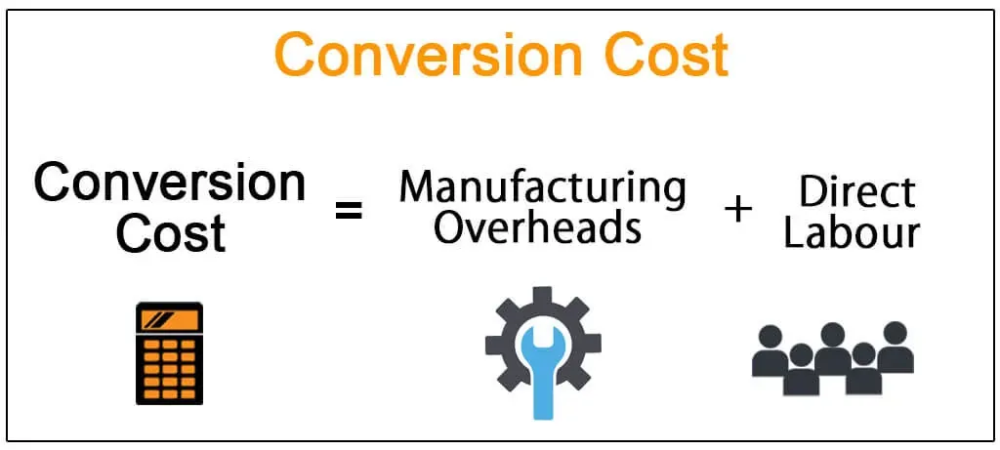

In the modern financial landscape, understanding the intricacies of conversion price calculation is essential for both investors and companies. As markets become increasingly complex, the ability to navigate and manipulate financial models and algorithmic trading systems is becoming a crucial skill. Conversion price stands as a cornerstone in this regard, providing a pivotal link between convertible securities and common stock. It represents the price per share at which a security, such as a convertible bond or preferred share, can be exchanged for common stock. This is not merely a static number; rather, it reflects a dynamic interplay of market conditions and corporate strategies.

Conversion price calculation serves an essential function in optimizing capital structures. It influences decisions on raising capital through convertible securities and dictates strategies for managing potential stock dilution and investor relations. This calculation can determine the attractiveness of investment opportunities, and thus, plays a crucial role in financial modeling.



Moreover, conversion price is critical in algorithmic trading. Algorithmic systems leverage this calculation to exploit market inefficiencies and make data-driven decisions. In a market where fractions of a second can determine profitability, understanding the factors impacting conversion price and integrating them into trading algorithms can offer a significant competitive edge.

The variables affecting conversion price range from macroeconomic conditions, such as interest rates and stock market trends, to microeconomic factors, like company performance metrics and investor sentiment. These elements underscore the broader implications of conversion price in financial modeling and trading strategies, revealing it as a complex yet indispensable aspect of modern finance.

## Table of Contents

## What is Conversion Price?

The conversion price is a key financial metric that represents the price per share at which a convertible security, such as bonds or preferred shares, can be converted into common stock. This financial concept is critical for understanding the mechanics and implications of convertible securities.

Convertible securities are hybrid financial instruments that combine features of both debt and equity, offering holders the right to convert their investments into a predetermined number of common shares. The conversion price plays a pivotal role in this conversion process, determining the number of shares an investor will receive upon exercising the conversion option.

In financial modeling, the conversion price serves as a crucial component in strategies aimed at raising capital through convertible securities. By setting a conversion price, companies can balance the trade-off between issuing debt and equity. If the conversion price is set strategically, it can make the security more attractive to investors, potentially lowering the cost of raising capital while providing the issuer with flexibility in managing its capital structure.

For investors holding convertible securities, understanding the conversion price is essential. It affects the potential upside of converting their securities into equity, especially if the market price of the common stock rises above the conversion price. This scenario could lead to substantial gains for the investor, as they would acquire stock at a price lower than the market value.

Similarly, for companies issuing convertible securities, comprehending the conversion price and its implications is vital for managing their capital efficiently. It influences how convertible securities impact the company's capital structure, particularly in terms of potential equity dilution. If the conversion occurs, it increases the number of shares outstanding, which can affect the company's earnings per share (EPS) and ultimately influence stock price performance.

In summary, the conversion price is essential in assessing the attractiveness and impact of convertible securities for both investors and issuing companies. Understanding this concept is crucial for making informed decisions related to [capital raising](/wiki/hedge-fund-capital-raising) and investment in convertible financial instruments.

## The Conversion Price Formula

The formula for calculating the conversion price is a fundamental aspect of convertible securities analysis. It is essential for assessing the potential advantages of converting these securities into common stock. The conversion price is determined by dividing the par value of the convertible security by the conversion ratio. This can be articulated mathematically as:

$$
\text{Conversion Price} = \frac{\text{Par Value}}{\text{Conversion Ratio}}
$$

Where:
- **Par Value** is the nominal or face value of the convertible security, such as a bond or preferred stock.
- **Conversion Ratio** is the number of common shares that the holder will receive upon conversion of each unit of the convertible security.

This formula serves as a guide for evaluating the desirability of the conversion terms offered by a convertible security. A lower conversion price typically implies a more favorable conversion, offering potential gains for investors if the common stock price exceeds the conversion price. Conversely, a higher conversion price indicates less attractive terms, as it requires the common stock price to rise further before conversion becomes profitable.

Understanding the conversion price is vital for investors as it influences their decision to convert securities based on the prevailing market conditions and intrinsic value estimates. For companies, the conversion price impacts capital structure decisions and the potential dilution of existing shares. By using the conversion price formula, stakeholders can gain insights into the equity conversion process and make informed decisions.

## Factors Influencing Conversion Price

Conversion price is susceptible to various influences rooted in the evolving market conditions. One of the primary factors is the prevailing stock price. When the stock price fluctuates, it affects the attractiveness of converting a security into common stock. For instance, if the stock price increases significantly, the conversion becomes more appealing, as investors can potentially gain from converting their securities at a lower conversion price relative to current market values. Conversely, if the stock price drops, the conversion might be less advantageous.

Interest rates also play a pivotal role. High interest rates could cause the present value of future cash flows from fixed-income securities to decline, affecting the desirability of the convertible security. Lower interest rates might make convertible securities more attractive compared to other fixed-income investments, potentially influencing the conversion decision.

Company performance metrics are another influential [factor](/wiki/factor-investing). Metrics such as earnings, revenue growth, and debt levels directly impact investor confidence in the company's financial health. Strong performance and robust earnings can increase investor confidence, making conversion more enticing. On the other hand, high debt levels might deter conversion if investors perceive a risk of financial instability.

Investor sentiment and future expectations are crucial in deciding conversion timing. Positive sentiment, driven by expected company growth or favorable market conditions, can increase the perceived value of converting securities. Conversely, negative sentiment, possibly induced by economic downturns or poor company forecasts, might deter conversion.

These factors interact dynamically, influencing decisions on the conversion price in complex ways. Market analysts and investors must consider these variables when assessing the conversion opportunity's costs and benefits. Therefore, a comprehensive understanding of these factors assists in making well-informed financial decisions.

## Conversion Price in Financial Modeling

Financial models that incorporate conversion price calculations are essential tools in analyzing convertible securities. These models enable financial analysts to predict various outcomes, particularly focusing on the potential dilution of company stock that might occur upon the conversion of bonds or preferred shares into common stock. One of the critical aspects assessed is the impact on Earnings Per Share (EPS), a key indicator of a company's profitability.

The conversion price determines how many shares a bondholder or a preferred shareholder receives when they convert their securities into common stock. Consequently, any change in the conversion price can lead to variations in the total number of outstanding shares, directly affecting EPS. Analysts simulate different scenarios within these financial models to understand potential impacts and prepare strategies to mitigate unfavorable dilution effects.

Moreover, the strategic application of conversion price calculations can significantly enhance the optimization of a company's capital structure. By setting appropriate conversion prices, companies can manage their mix of debt and equity more effectively, potentially reducing the cost of capital and increasing shareholder value. For instance, when a company's stock price is high relative to the conversion price, it might encourage conversions, leading to reduced debt levels without immediate cash outflows.

Python can be used to create models that simulate conversion scenarios and estimate their impact on key financial metrics. Here is a simple example demonstrating how one might calculate the impact of conversion on EPS using Python:

```python
def calculate_eps(net_income, shares_outstanding, additional_shares, interest_saved):
    # Adjusted Net Income considers savings from interest payments no longer owed
    adjusted_net_income = net_income + interest_saved
    # Calculate total shares outstanding after conversion
    total_shares = shares_outstanding + additional_shares
    # New EPS after conversion
    eps_after_conversion = adjusted_net_income / total_shares
    return eps_after_conversion

# Example variables
net_income = 1000000  # Net income in dollars
shares_outstanding = 500000  # Current shares outstanding
additional_shares = 100000  # Shares added upon conversion
interest_saved = 50000  # Interest saved from not having to pay on the convertible security

new_eps = calculate_eps(net_income, shares_outstanding, additional_shares, interest_saved)
print(f"EPS after conversion: ${new_eps:.2f}")
```

This Python function calculates the EPS after accounting for the conversion of securities. By adjusting for interest savings and the increase in outstanding shares, companies can gain insights into how conversion decisions will reflect on their financial statements.

Through these models, companies and investors can make informed decisions about when and how to convert securities, aligning strategic objectives to optimize financial outcomes.

## Application in Algo Trading

In [algorithmic trading](/wiki/algorithmic-trading), conversion price calculations are a critical component, especially when dealing with convertible bonds. These securities provide opportunities for generating alpha through the strategic conversion of bonds into equity, based on market conditions and predefined terms. By understanding and calculating the conversion price accurately, algo trading systems can perform real-time assessments of market conditions and make informed trading decisions that maximize profitability.

Algorithmic trading systems are designed to harness the potential of big data and advanced computing to process vast amounts of financial data quickly. Conversion price, as a pivotal parameter, allows algorithms to determine the optimal timing for conversions, adapting strategies dynamically in response to shifting market variables such as stock price [volatility](/wiki/volatility-trading-strategies), [interest rate](/wiki/interest-rate-trading-strategies) changes, or sudden news announcements. This adaptability is fundamental to exploiting market inefficiencies. 

For instance, an algorithm might continuously monitor the market for situations where the underlying stock price approaches the conversion price, signaling a favorable conversion opportunity. When such a condition is met, the algorithm can execute trades based on pre-set parameters, thereby capitalizing on the potential upward or downward movements of the stock.

To implement this in practice, consider a simplified Python pseudo-code for an algo trading scenario where the goal is to identify and act upon conversion opportunities for a convertible bond:

```python
def check_conversion_opportunity(stock_price, conversion_price, par_value, conversion_ratio):
    # Calculate current value of converted stock
    current_stock_value = stock_price * conversion_ratio

    # Compare with par value to determine if conversion is beneficial
    if current_stock_value > par_value: 
        return True  # Indicates a good opportunity
    return False  # Not favorable

# Example usage
stock_price = 150  # Current stock price in the market
conversion_price = 140  # Current conversion price
par_value = 1000  # Par value of the bond
conversion_ratio = 7  # Bond to stock conversion ratio

if check_conversion_opportunity(stock_price, conversion_price, par_value, conversion_ratio):
    # Execute conversion and trading strategy
    print("Conversion opportunity detected, executing trade.")
else:
    # Hold position
    print("No favorable conversion opportunity.")
```

The ongoing evaluation of conversion prices helps automated systems determine the appropriateness of conversion at any given moment. Adjusting trading positions in real time based on these calculations reduces the risk of missed opportunities and optimizes returns. Additionally, algorithmic systems use historical data to back-test strategies around conversion prices, refining these strategies to optimize future outcomes.

In summary, the integration of conversion price calculations into algorithmic trading enables systems to make data-driven, precise trading decisions. This capability underscores the importance of mastering conversion price dynamics, not only for risk management but also for maximizing profitability in convertible bond trading strategies.

## Managing Conversion Price Risks

Understanding potential dilution and managing investor relations are vital strategies when addressing conversion price risks associated with convertible securities. These risks stem from the fact that conversion of bonds or preferred shares into common stock can lead to an increase in the total share count, which may dilube existing shareholders' value. Preparing for these eventualities requires strategic provisions and clear communication.

Anti-dilution provisions serve as a defensive mechanism against sudden drops in stock price that might influence conversion decisions. These provisions adjust the conversion price or conversion ratio to mitigate the dilution effect on existing shareholders, preserving their equity value. For example, when a company issues additional shares at a price lower than the conversion price, anti-dilution clauses could adjust the conversion ratio favorably for the holder, offering more shares upon conversion. This adjustment can be done via a full-ratchet or weighted-average method, with each method having different impacts on shareholders. 

Effective communication with stakeholders is crucial for risk management relative to conversion price. Clear and continuous dialogue with investors helps clarify how conversions could affect future earnings and market valuations. Transparent communication is not only a good governance practice but also a strategy to maintain investor confidence. It is essential to convey how the conversion might impact earnings per share (EPS) and the overall value of investments, ensuring that investors understand the strategic purpose behind any convertible offering.

In summary, managing conversion price risks involves a combination of robust anti-dilution provisions and proactive investor communication, empowering both organizations and investors to make informed financial decisions and safeguarding interests against the complexities of convertible securities.

## Conclusion

Conversion price is a pivotal concept at the intersection of financial modeling and algorithmic trading due to its significant impact on investment strategies and capital management. For investors, mastering the conversion price formula and understanding its implications enable the identification of optimal conversion opportunities that can enhance portfolio performance. This strategic understanding assists in capitalizing on favorable market conditions and adapting to changes in company performance or investor sentiment.

For companies, effectively managing the conversion price is essential to optimize their capital structure. It aids in balancing debt and equity, managing potential stock dilution, and maintaining strong investor relations. Companies that adequately leverage their understanding of conversion pricing can make informed decisions about when and how to issue convertible securities, aligning with their broader financial objectives.

As computational finance continues to evolve, advancements in technology and data analysis are expected to refine our perception and application of conversion price dynamics in trading. Enhanced algorithmic trading strategies can harness real-time data and sophisticated models to exploit market inefficiencies related to convertible securities. This technological progress promises to bring increased precision and efficiency to the evaluation and execution of conversion strategies, benefiting both investors and issuers in navigating complex financial landscapes.

## References & Further Reading

[1]: Fabozzi, F. J. (2005). ["Fixed Income Analysis."](https://books.google.com/books/about/Fixed_Income_Analysis.html?id=lujLawVLS3YC) CFA Institute Investment Series.

[2]: Hull, J. C. (2018). ["Options, Futures, and Other Derivatives."](https://www.semanticscholar.org/paper/Options%2C-Futures%2C-and-Other-Derivatives-Hull/89bdee500c8623864fc9eb7a471546aa713acc44) Pearson.

[3]: Brigo, D., & Mercurio, F. (2006). ["Interest Rate Models - Theory and Practice: With Smile, Inflation and Credit."](https://link.springer.com/book/10.1007/978-3-540-34604-3) Springer Finance.

[4]: Dumortier, F., Rossi, M., & Von Känel, J. (2018). ["Convertible Securities: A Complete Primer."](https://link.springer.com/article/10.1007/s10884-008-9109-2) Springer.

[5]: Chincarini, L. B., & Kim, D. (2006). ["Quantitative Equity Portfolio Management: An Active Approach to Portfolio Construction and Management."](https://www.mhebooklibrary.com/doi/book/10.1036/9781264268931) McGraw-Hill.