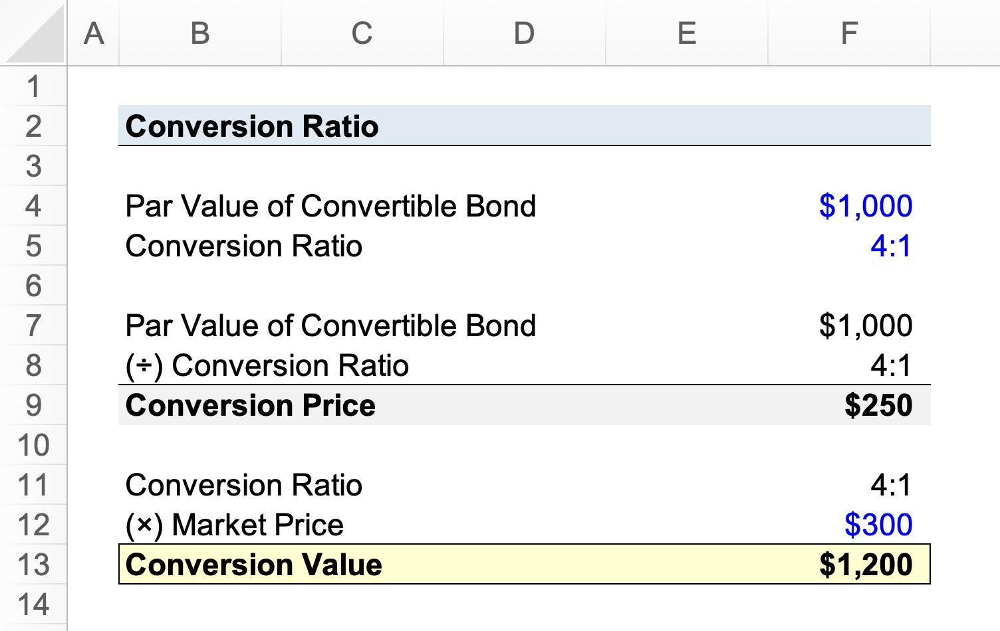

## Table of Contents

## What is conversion price in finance?

Conversion price in finance is the price at which a convertible security, like a bond or a preferred stock, can be turned into a set number of common stock shares. It's an important part of convertible securities because it helps investors know how many shares they will get if they decide to convert their security into stock.

When a company issues a convertible bond, for example, it sets a conversion price. If the market price of the company's stock goes above this conversion price, it might be a good idea for the bondholder to convert the bond into stock. This way, they can benefit from the rising stock price. The conversion price is set at the time the convertible security is issued and it helps both the company and the investor understand the value of the conversion option.

## Why is conversion price important for investors?

Conversion price is important for investors because it tells them how many shares of stock they can get if they decide to convert their bond or preferred stock into common stock. This is helpful because it lets investors know what their investment could be worth if they choose to convert. If the market price of the stock goes higher than the conversion price, investors can make more money by converting their security into stock.

Knowing the conversion price also helps investors decide if a convertible security is a good investment. If the conversion price is set too high compared to the current stock price, it might not be worth it to convert, and the security might not be as valuable. On the other hand, if the conversion price is set at a good level, it can make the security more attractive because there's a chance to make more money if the stock price goes up.

## How is the conversion price determined for a convertible bond?

When a company decides to issue a convertible bond, it sets the conversion price. This price is usually set higher than the current market price of the company's stock. The reason for this is to make the bond more attractive to investors. If the stock price goes up a lot, the bond can be converted into stock at a good price, which could make the investor more money.

The conversion price is important because it helps both the company and the investor. For the company, setting the conversion price helps them figure out how many new shares might be created if people convert their bonds. For the investor, knowing the conversion price helps them decide if the bond is a good investment. If the stock price goes above the conversion price, it might be a good time to convert the bond into stock and make more money.

## What factors influence the conversion price of a security?

The conversion price of a security is influenced by several factors. One big factor is the current market price of the company's stock. When a company decides to issue a convertible bond, they usually set the conversion price higher than the current stock price. This makes the bond more attractive to investors because if the stock price goes up a lot, they can convert their bond into stock at a good price and possibly make more money.

Another factor that influences the conversion price is the company's expectations for future growth. If a company thinks its stock price will go up a lot in the future, they might set the conversion price higher. This way, they can still make the bond attractive to investors but also limit the number of new shares that might be created if people convert their bonds. The company wants to balance making the bond attractive with not giving away too much of the company through new shares.

Lastly, market conditions and investor demand can also play a role. If there's a lot of demand for the company's bonds, they might be able to set a higher conversion price. But if the market is not so good, they might need to set a lower conversion price to make the bond more appealing. All these factors together help the company decide on the right conversion price for their convertible security.

## Can the conversion price change after issuance, and if so, how?

Yes, the conversion price can change after a convertible security is issued, but it usually depends on the terms set when the security was issued. Sometimes, companies include a feature called a "reset" or "ratchet" provision in the bond agreement. This means the conversion price can go down if the stock price drops below a certain level. This makes the bond more attractive to investors because they can convert it into more shares if the stock price falls.

Another way the conversion price can change is through corporate actions like stock splits or dividends. If a company does a stock split, the conversion price will be adjusted to reflect the new number of shares. For example, if there's a 2-for-1 stock split, the conversion price would be cut in half. This keeps the value of the convertible security the same, even though the number of shares changes. These adjustments are usually automatic and are set out in the bond agreement to protect the value of the investment for the bondholder.

## What is the formula for calculating the conversion price?

The conversion price for a convertible bond is calculated by dividing the par value of the bond by the conversion ratio. The par value is the face value of the bond, which is the amount the bondholder will get back when the bond matures. The conversion ratio is the number of shares of stock the bond can be converted into. For example, if a bond has a par value of $1,000 and a conversion ratio of 20, the conversion price would be $1,000 divided by 20, which equals $50 per share.

Sometimes, companies might adjust the conversion price after the bond is issued. This can happen if there's a reset provision in the bond agreement, which allows the conversion price to be lowered if the stock price falls below a certain level. Another reason for adjusting the conversion price is due to corporate actions like stock splits or dividends. If a company does a 2-for-1 stock split, the conversion price would be halved to keep the value of the convertible security the same. These adjustments are usually set out in the bond agreement to protect the bondholder's investment.

## How does the conversion ratio relate to the conversion price?

The conversion ratio and the conversion price are closely linked when it comes to convertible bonds. The conversion ratio tells you how many shares of stock you can get if you convert your bond. For example, if the conversion ratio is 20, you can get 20 shares of stock for each bond you convert. The conversion price, on the other hand, tells you the price per share at which you can convert your bond into stock. It's calculated by dividing the bond's par value by the conversion ratio. So, if a bond has a par value of $1,000 and a conversion ratio of 20, the conversion price would be $1,000 divided by 20, which equals $50 per share.

The conversion ratio and conversion price are important because they help investors understand the value of their convertible bond. If the market price of the stock goes above the conversion price, it might be a good idea for the bondholder to convert the bond into stock. This way, they can benefit from the rising stock price. The conversion ratio and price also help the company issuing the bond to figure out how many new shares might be created if people decide to convert their bonds. This balance is crucial for both the company and the investor to make informed decisions.

## What are the implications of a low conversion price for a company?

A low conversion price can be good for investors because it means they can convert their bond into more shares of stock. If the market price of the stock goes above the conversion price, investors might decide to convert their bond to make more money. This can make the bond more attractive to investors, which can help the company raise money more easily when they issue the bond.

But a low conversion price can also be bad for the company. If a lot of investors convert their bonds into stock, it can lead to more shares being created. This can dilute the value of the existing shares, which means each share is worth less. This can make the company's stock price go down and might not be good for the current shareholders. So, the company needs to be careful when setting the conversion price to balance the needs of new investors with the interests of existing shareholders.

## How do market conditions affect the conversion price?

Market conditions can have a big impact on the conversion price of a convertible bond. When the stock market is doing well and investors are feeling confident, a company might set a higher conversion price. This is because they think the stock price will keep going up, and they want to make the bond attractive to investors without giving away too many shares. On the other hand, if the market is not doing so well, the company might set a lower conversion price to make the bond more appealing. This way, investors can convert their bond into more shares if the stock price goes up, which could help them make more money.

Sometimes, after a convertible bond is issued, market conditions can change, and this can lead to adjustments in the conversion price. For example, if the stock price drops a lot, some bonds have a feature called a "reset" or "ratchet" provision that lets the conversion price go down. This makes the bond more valuable to investors because they can convert it into more shares. Also, if the company does things like stock splits or pays dividends, the conversion price might be adjusted to keep the value of the bond the same. These changes help protect the bondholder's investment and make sure the bond stays attractive no matter what happens in the market.

## What are the tax implications of converting at the conversion price?

When you convert a bond into stock at the conversion price, there can be tax implications. If the market value of the stock you get is higher than what you paid for the bond, you might have to pay taxes on the difference. This is because the IRS sees this as a gain, like making money from selling something for more than you bought it. The tax you pay depends on how long you held the bond. If you held it for less than a year, it's a short-term capital gain, and you pay regular income tax on it. If you held it for more than a year, it's a long-term capital gain, and you might pay a lower tax rate.

However, not all conversions lead to immediate taxes. Sometimes, the tax is deferred until you sell the stock you got from converting the bond. This means you don't have to pay taxes right away, but you will have to pay when you sell the stock if its value has gone up. It's important to check with a tax professional because tax rules can be complicated and might change. They can help you understand exactly what you need to do when converting your bond into stock.

## How can an investor use the conversion price to assess the value of a convertible security?

The conversion price is a key number that helps investors figure out if a convertible security is a good deal. It tells you how many shares of stock you can get if you convert your bond or preferred stock. If the market price of the stock is higher than the conversion price, it might be a good idea to convert because you can make more money. For example, if the conversion price is $50 per share and the stock is now worth $75, converting your bond into stock could be a smart move. This way, you can sell the stock at the higher price and make a profit.

But the conversion price also helps you see if the convertible security is worth buying in the first place. If the conversion price is set too high compared to the current stock price, it might not be worth it to convert, and the security might not be as valuable. On the other hand, if the conversion price is set at a good level, it can make the security more attractive. Investors look at the conversion price to see if there's a chance to make more money if the stock price goes up. By comparing the conversion price to the current stock price and thinking about where the stock might go in the future, investors can decide if the convertible security is a good investment.

## What advanced strategies can be employed using conversion price in financial markets?

Investors can use the conversion price to make smart moves in the financial markets. One strategy is called "hedging." If you own a convertible bond, you can buy or sell the company's stock to protect yourself from price changes. For example, if you think the stock price might go down, you can sell some stock short. This means you borrow stock and sell it, hoping to buy it back later at a lower price. If the stock price does go down, you can make money from the short sale, which can help cover any losses on your bond. By using the conversion price to figure out how many shares you might get, you can decide how much stock to buy or sell to hedge your investment.

Another strategy is called "arbitrage." This is when you try to make money from price differences. If the convertible bond's price is lower than what it should be based on the conversion price and the stock price, you can buy the bond and short the stock. If the stock price goes up, you can convert the bond into stock and use the stock to cover your short position. This way, you make money from the bond going up in value and the stock going down in value. By keeping an eye on the conversion price, you can spot these opportunities and make a profit from the difference between the bond and stock prices.

## What is the Conversion Price Formula?

The formula for calculating the conversion price is a fundamental aspect of convertible securities analysis. It is essential for assessing the potential advantages of converting these securities into common stock. The conversion price is determined by dividing the par value of the convertible security by the conversion ratio. This can be articulated mathematically as:

$$
\text{Conversion Price} = \frac{\text{Par Value}}{\text{Conversion Ratio}}
$$

Where:
- **Par Value** is the nominal or face value of the convertible security, such as a bond or preferred stock.
- **Conversion Ratio** is the number of common shares that the holder will receive upon conversion of each unit of the convertible security.

This formula serves as a guide for evaluating the desirability of the conversion terms offered by a convertible security. A lower conversion price typically implies a more favorable conversion, offering potential gains for investors if the common stock price exceeds the conversion price. Conversely, a higher conversion price indicates less attractive terms, as it requires the common stock price to rise further before conversion becomes profitable.

Understanding the conversion price is vital for investors as it influences their decision to convert securities based on the prevailing market conditions and intrinsic value estimates. For companies, the conversion price impacts capital structure decisions and the potential dilution of existing shares. By using the conversion price formula, stakeholders can gain insights into the equity conversion process and make informed decisions.

## References & Further Reading

[1]: Fabozzi, F. J. (2005). ["Fixed Income Analysis."](https://books.google.com/books/about/Fixed_Income_Analysis.html?id=lujLawVLS3YC) CFA Institute Investment Series.

[2]: Hull, J. C. (2018). ["Options, Futures, and Other Derivatives."](https://www.semanticscholar.org/paper/Options%2C-Futures%2C-and-Other-Derivatives-Hull/89bdee500c8623864fc9eb7a471546aa713acc44) Pearson.

[3]: Brigo, D., & Mercurio, F. (2006). ["Interest Rate Models - Theory and Practice: With Smile, Inflation and Credit."](https://link.springer.com/book/10.1007/978-3-540-34604-3) Springer Finance.

[4]: Dumortier, F., Rossi, M., & Von Känel, J. (2018). ["Convertible Securities: A Complete Primer."](https://link.springer.com/article/10.1007/s10884-008-9109-2) Springer.

[5]: Chincarini, L. B., & Kim, D. (2006). ["Quantitative Equity Portfolio Management: An Active Approach to Portfolio Construction and Management."](https://www.mhebooklibrary.com/doi/book/10.1036/9781264268931) McGraw-Hill.