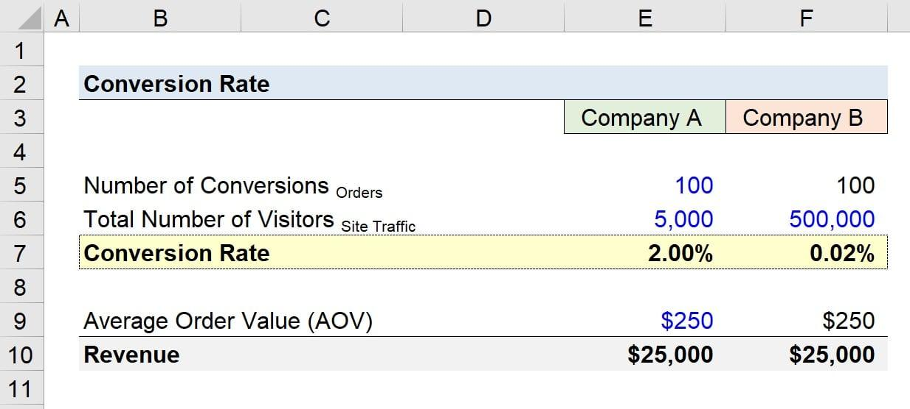

## Table of Contents

## What is conversion rate?

Conversion rate is a way to measure how well a website or business is doing at turning visitors into customers. It is usually shown as a percentage, and it tells you how many people out of everyone who visits your site actually do what you want them to do, like making a purchase, signing up for a newsletter, or filling out a form.

For example, if 100 people visit your website and 5 of them buy something, your conversion rate would be 5%. A good conversion rate can mean different things for different businesses, but the main goal is always to make this number as high as possible by making the website easy to use and giving visitors a good reason to take action.

## Why is conversion rate important for businesses?

Conversion rate is important for businesses because it shows how well they are doing at getting people to take the actions they want, like buying something or signing up for a service. If a business knows its conversion rate, it can figure out if its website or store is working well or if it needs to make changes to get more people to become customers. This can help the business make more money and grow.

Also, by looking at conversion rates, businesses can see which parts of their marketing or sales strategies are working and which ones are not. For example, if a business runs an ad and sees that more people are buying after seeing it, they know the ad is working. If the conversion rate goes down, they might need to change their approach. This way, businesses can spend their time and money on the things that bring in the most customers.

## How is conversion rate calculated?

Conversion rate is calculated by dividing the number of people who do what you want them to do by the total number of people who visit your website or store. For example, if you want people to buy a product, you would divide the number of people who bought it by the total number of visitors. Then, you multiply that number by 100 to turn it into a percentage. So, if 10 out of 200 visitors bought your product, your conversion rate would be (10 ÷ 200) × 100 = 5%.

Understanding this calculation helps businesses see how well they are doing at turning visitors into customers. It's important to keep track of this number over time because it can show if changes to your website or marketing strategies are working. If the conversion rate goes up after you make a change, that's a good sign. If it goes down, you might need to try something different to get more people to take action.

## What are common examples of conversions in e-commerce?

In e-commerce, a common example of a conversion is when someone buys something from your online store. This is the most important conversion for many businesses because it means they are making money. When someone visits your website and decides to buy a product, that's a conversion. For example, if you sell t-shirts and someone adds a t-shirt to their cart and then checks out, that's a conversion.

Another example of a conversion in e-commerce is when someone signs up for your newsletter or email list. This might not make you money right away, but it can help you reach out to customers later with special offers or new products. If someone visits your site and enters their email address to get updates from you, that's a conversion too. It helps you build a relationship with them and maybe sell to them in the future.

Other conversions can include when someone creates an account on your website or when they add items to their wishlist. These actions show that the person is interested in your products and might come back to buy something later. Each of these conversions helps you understand how people are interacting with your online store and can guide you in making it better.

## What factors can affect conversion rates?

Many things can change how many people do what you want them to do on your website. One big thing is how easy it is for people to use your site. If it's hard to find things or if the site is slow, people might leave without buying anything. The way you show your products and how much they cost can also make a difference. If people think your prices are too high or if they can't see the value in what you're selling, they won't buy. Also, if you make people trust you by having good reviews or a safe way to pay, more people might decide to buy from you.

Another thing that can affect conversion rates is how you talk to your visitors. If your website's words and pictures match what your visitors like and need, they're more likely to take action. For example, if you know your visitors care a lot about the environment, talking about how your products help the planet can make them want to buy more. Also, how you reach out to people through ads or emails can change things. If your ads or emails are interesting and make people want to click on them, more people will visit your site and maybe buy something.

## How can businesses improve their conversion rates?

Businesses can improve their conversion rates by making their website easier to use. If people can find what they want quickly and the site works well on phones and computers, more people will buy things. It's also important to make sure the website loads fast and the checkout process is simple. If it's hard to buy something, people might leave without finishing their purchase. Testing different versions of the website to see what works best can also help. This is called A/B testing, and it can show which buttons or words make more people buy.

Another way to boost conversion rates is by making the website more appealing to visitors. This can be done by using clear and attractive pictures of products, writing easy-to-understand descriptions, and showing good reviews from other customers. Offering special deals or discounts can also encourage people to buy. It's also important to build trust with visitors by having a safe way to pay and showing that the website is secure. If people feel safe and see value in what you're selling, they're more likely to become customers.

Lastly, businesses can improve conversion rates by reaching out to people in the right way. This means using ads and emails that catch people's attention and make them want to visit the website. Knowing who your customers are and what they like can help you create messages that speak directly to them. For example, if your customers care about the environment, talking about how your products help the planet can make them more likely to buy. By understanding your audience and communicating well, you can turn more visitors into customers.

## What is a good conversion rate benchmark for different industries?

A good conversion rate can be different for each type of business. In e-commerce, a good conversion rate is usually around 2% to 3%. This means that out of every 100 people who visit an online store, 2 to 3 of them will buy something. For businesses that sell things like clothes or electronics, this rate can be a bit higher, maybe around 3% to 4%. But for businesses that sell more expensive things, like furniture or cars, the conversion rate might be lower, around 1% to 2%, because people take more time to decide on big purchases.

In other industries, like software as a service (SaaS), a good conversion rate might be around 5% to 10%. This is because people who visit these websites are often already interested in the product and might sign up for a free trial or a newsletter. For lead generation websites, where the goal is to get people to fill out a form or request more information, a good conversion rate can be around 2% to 5%. Knowing these benchmarks can help businesses see if they are doing well or if they need to make changes to get more people to take action.

## How does conversion rate optimization (CRO) work?

Conversion rate optimization, or CRO, is about making changes to your website to get more people to do what you want them to do, like buying something or signing up for a newsletter. It starts with looking at your website to see where people are leaving without doing what you want them to do. You might find that your website is hard to use, or maybe your product descriptions are not clear enough. Once you know where the problems are, you can start testing different ways to fix them. This could mean changing the colors of buttons, making the checkout process easier, or writing better product descriptions.

After you make changes, you keep an eye on your conversion rate to see if it goes up. If it does, that means your changes are working and more people are buying or signing up. If it doesn't go up, you might need to try something different. This process of testing and changing things is called A/B testing, and it helps you figure out what works best for your website. Over time, by keeping at it and making small improvements, you can make your website better and get more people to take action.

## What tools can be used to track and analyze conversion rates?

There are several tools that businesses can use to keep track of and understand their conversion rates. One popular tool is Google Analytics. It's free and can show you how many people visit your website, how many of them do what you want them to do, and where they come from. Another tool is Hotjar, which helps you see where people click on your website and how they move through it. This can tell you if there are parts of your website that are confusing or hard to use. There are also tools like Optimizely and VWO (Visual Website Optimizer) that let you test different versions of your website to see which one gets more people to take action.

Using these tools can help businesses learn a lot about their website and how to make it better. For example, Google Analytics can show you that a lot of people leave your website without buying anything on a certain page. With Hotjar, you might see that people are clicking on a button that doesn't work, or they're getting lost trying to find the checkout. By testing different versions of your website with Optimizely or VWO, you can find out if changing the color of a button or making the checkout process simpler can get more people to buy. All of these tools together can help you make your website better and get more people to do what you want them to do.

## Can you explain the concept of micro-conversions and their importance?

Micro-conversions are small actions that people take on a website that are steps towards a bigger goal. For example, if you want people to buy something from your online store, a micro-conversion might be when someone adds a product to their cart or signs up for your newsletter. These little actions show that people are interested in what you're selling and might come back to buy something later. They are important because they help you see how people are interacting with your website and can guide you in making it better.

Understanding micro-conversions is key because they can tell you where people might be getting stuck or losing interest. If you see that a lot of people are adding things to their cart but not buying, you might need to make the checkout process easier. Or if many people are signing up for your newsletter, you know that's a good way to keep in touch with them and maybe sell to them later. By keeping track of these small actions, you can make changes to your website that lead to more people doing what you want them to do in the end.

## How do A/B testing and multivariate testing impact conversion rates?

A/B testing and multivariate testing are ways to find out what changes to your website can make more people do what you want them to do. In A/B testing, you show different versions of a page to different people and see which one gets more people to take action. For example, you might test two different headlines to see which one makes more people click on a button. If one version does better, you keep it and try to make more changes to get even better results. This way, you can slowly make your website better and get more people to buy things or sign up for your newsletter.

Multivariate testing is like A/B testing, but it lets you test more things at the same time. Instead of just changing one thing, like a headline, you can change several things on a page and see which mix of changes works best. This can be more complicated, but it can also give you a lot of information about what really makes people take action. By using these testing methods, you can learn what your visitors like and make your website better, which can lead to more people becoming customers and a higher conversion rate.

## What advanced strategies can be employed to optimize conversion rates for expert marketers?

Expert marketers can use advanced strategies like personalization to make their websites more appealing to visitors. Personalization means showing different content or offers to different people based on what they like or have done before. For example, if someone has looked at sports shoes on your website, you might show them more sports shoes or related products when they come back. This can make them feel like your website understands them and is more likely to get them to buy something. Another way to personalize is by using data to send emails with special offers that match what each person is interested in. This can make more people click on your emails and visit your website, which can lead to more sales.

Another advanced strategy is using advanced analytics to understand how people behave on your website. Tools like heatmaps can show where people click and how they move through your site, which can help you find out where they might be getting stuck or losing interest. You can also use [machine learning](/wiki/machine-learning) to predict what people might do next and show them the right content at the right time. For example, if the data shows that people who look at certain products are more likely to buy if they see a discount, you can show them a discount right away. By understanding your visitors better and making smart changes based on data, you can make your website work better and get more people to do what you want them to do.

## What is the key to understanding conversion rates?

Conversion rate is a crucial key performance indicator (KPI) in digital marketing, as it measures the effectiveness of a marketing campaign by calculating the percentage of visitors who complete a desired action. This action varies depending on the organization's objectives and might include making a purchase, signing up for a newsletter, or downloading a whitepaper.

The conversion rate is calculated using the formula:

$$
\text{Conversion Rate (\%)} = \left(\frac{\text{Number of Conversions}}{\text{Total Number of Visitors}}\right) \times 100
$$

For example, if an e-commerce website receives 1,000 visitors in a day, and 50 of them make a purchase, the conversion rate would be:

$$
\text{Conversion Rate (\%)} = \left(\frac{50}{1000}\right) \times 100 = 5\%
$$

A high conversion rate is indicative of successful marketing and web design strategies, while a low conversion rate suggests that there may be barriers preventing visitors from converting.

Several factors influence conversion rates, including:

1. **Website Design**: A user-friendly interface with intuitive navigation can significantly enhance conversion rates. A well-designed website reduces the friction that visitors encounter as they attempt to complete their desired actions.

2. **User Experience (UX)**: Beyond mere design, the overall user experience encompasses page load times, mobile responsiveness, and the clarity of information presented. Fast-loading pages and mobile-optimized design ensure that visitors can seamlessly navigate the website across different devices, improving the likelihood of conversions.

3. **Quality of Traffic**: The source and quality of incoming traffic are critical. Targeted traffic, where visitors have a genuine interest in the products or services offered, tends to convert at a higher rate. This is where precise audience targeting in advertising campaigns becomes vital. Understanding user intent and tailoring content to meet these expectations can dramatically improve conversion rates.

Businesses often employ A/B testing and data analytics to identify optimal strategies that will lead to improved conversion rates. Adjustments in design, content, or targeted campaigns are continually tested and refined based on empirical evidence of user behavior, leading to more effective marketing efforts and enhanced performance metrics.

## What are some examples of conversion rates?

Conversion rates are pivotal across various industries, highlighting the importance of measuring and optimizing customer interactions. By examining examples from different sectors, businesses can gain insights into effective strategies that enhance their conversion metrics.

### E-commerce Case Study
In the e-commerce sector, optimization of conversion rates is often achieved through meticulous A/B testing and user experience innovations. A notable case study involves a leading online retailer that sought to refine its shopping cart process. By streamlining the checkout flow, reducing unnecessary form fields, and implementing a progress indicator, the company improved its conversion rate significantly.

To illustrate, the retailer initially had a conversion rate of 3.5%. After implementing the changes, they observed an increase to 4.8%. The formula used to calculate the conversion rate is:

$$
\text{Conversion Rate} = \left( \frac{\text{Number of Conversions}}{\text{Total Visitors}} \right) \times 100
$$

This optimization was guided by data analytics, showing that users were abandoning carts due to complexity and perceived time consumption. By removing these barriers, the retailer not only increased conversions but also improved overall customer satisfaction.

### B2B Lead Generation Example
In the B2B sector, conversion rates often pertain to lead generation and the subsequent nurturing process. A successful example involves a software-as-a-service (SaaS) provider that implemented a personalized email marketing campaign targeting potential clients.

Initially, the B2B company relied on a generic email strategy, yielding a conversion rate of 2%. By segmenting their audience based on industry, company size, and previous interaction data, they tailored the content of their emails to address specific pain points and needs of different customer segments. This personalization effort increased their email conversion rate to 3.5%.

Moreover, the company incorporated a lead scoring system that prioritized prospects based on engagement level and likelihood to convert. This allowed their sales team to focus efforts on high-potential leads, further driving improvements in the conversion pipeline.

In both examples, the emphasis on understanding audience behavior and barriers to conversion proved critical. By leveraging data-driven strategies, companies can adapt their approaches to enhance engagement and increase conversion rates, ultimately driving business success.

## What are the key marketing metrics related to conversion?

In digital marketing, several key metrics complement conversion rates to provide a holistic view of marketing performance. Understanding the interaction between these metrics is crucial for optimizing strategies and achieving better outcomes.

### Cost Per Acquisition (CPA)

Cost Per Acquisition (CPA) measures the average cost incurred to acquire a customer. It is calculated by dividing the total cost of a marketing campaign by the number of conversions (acquisitions) generated. The formula for CPA is as follows:

$$
CPA = \frac{\text{Total Cost of Campaign}}{\text{Number of Conversions}}
$$

A lower CPA indicates a more efficient campaign, where less money is spent on acquiring each customer. This metric is directly related to conversion rates; enhancing conversion rates often leads to reduced CPA, as more conversions can be achieved with the same or lower budget. To improve CPA, businesses can focus on targeting high-quality leads and refining their marketing strategies to ensure they are cost-effective.

### Click-Through Rate (CTR)

Click-Through Rate (CTR) evaluates the effectiveness of an advertisement in driving traffic to a website or landing page. It is defined as the number of clicks an ad receives divided by the number of impressions (times the ad is shown), expressed as a percentage:

$$
CTR = \left( \frac{\text{Number of Clicks}}{\text{Number of Impressions}} \right) \times 100
$$

CTR provides insights into the quality of the ad copy, imagery, and the relevance of the ad to the target audience. A higher CTR generally indicates a successful ad, as more people are motivated to click and potentially convert. Improving CTR can be achieved through A/B testing different ad elements, using engaging visuals, and crafting compelling call-to-actions.

### Return on Investment (ROI)

Return on Investment (ROI) assesses the profitability of marketing efforts. It is calculated by subtracting the cost of the marketing campaign from the revenue generated by the campaign and then dividing this by the campaign cost:

$$
ROI = \left( \frac{\text{Revenue from Campaign} - \text{Cost of Campaign}}{\text{Cost of Campaign}} \right) \times 100
$$

A positive ROI indicates that the campaign generates more revenue than it costs. ROI is closely linked to conversion rates, as higher conversion rates usually contribute to greater revenue without proportionally increasing costs. To enhance ROI, marketers can focus on strategies that boost conversion rates, such as optimizing their sales funnel and ensuring alignment between marketing messages and customer needs.

### Interaction of Metrics

These metrics, together with conversion rates, construct a comprehensive picture of marketing performance. While CPA focuses on cost-efficiency, CTR indicates engagement levels, and ROI measures overall profitability. By analyzing these metrics in conjunction, businesses can identify bottlenecks in their marketing strategy and allocate resources more effectively.

### Tips for Improvement

To track and improve these metrics, businesses can utilize analytics tools such as Google Analytics, which provides detailed insights into website traffic and user behavior. Regularly monitoring these metrics allows for timely adjustments to marketing strategies. Additionally, implementing machine learning algorithms can help predict trends and optimize campaigns in real-time, ensuring that marketing efforts are both targeted and efficient. Employing a data-driven approach and continually testing various aspects of marketing campaigns are essential practices for achieving better marketing success.

## What are some strategies to improve conversion rates?

Improving conversion rates is essential for maximizing the effectiveness of digital marketing efforts. There are several strategies that can be employed to enhance these rates, and leveraging data-driven methodologies can significantly boost the outcomes.

One of the primary techniques is A/B testing, a method used to compare two versions of a webpage or application to determine which one performs better regarding user actions. By systematically testing variations of elements like headlines, images, and text, businesses can identify which designs lead to higher conversions. For example, by altering the color of a call-to-action ([CTA](/wiki/cta-strategy)) button or changing the placement of a form, companies can see measurable differences in conversion rates. This approach relies on statistical analysis to assess the effectiveness of each variant, with the following calculation often used to measure significance:

$$
\text{Conversion Rate} = \left( \frac{\text{Number of Conversions}}{\text{Total Visitors}} \right) \times 100
$$

In addition to A/B testing, optimizing landing pages is crucial. A well-designed landing page should be clear, concise, and aligned with user expectations. It requires eliminating any distractions and ensuring that the content is directly related to the advertisement or link that led the user there. Effective landing pages facilitate easy navigation and employ persuasive elements that encourage users to take the desired action.

Enhancing CTA elements is another vital strategy. CTAs should be compelling and placed prominently within the webpage to draw users' attention. Verbs that convey urgency, like "Buy Now" or "Sign Up Today," can stimulate immediate action. Ensuring that CTAs are mobile-friendly is also important, given the significant amount of traffic from mobile devices.

Personalization and targeted marketing play a significant role in improving conversion rates. Personalized marketing strategies address the specific needs and preferences of individual users, leading to a more engaging user experience. By segmenting audiences and tailoring content to suit different user groups, businesses can increase the relevance of their marketing efforts, thereby improving the likelihood of conversion.

Utilizing data analytics and machine learning can further optimize conversion rates by enabling more informed marketing decisions. Data analytics provide insights into user behavior, preferences, and trends, allowing businesses to fine-tune their marketing strategies. Machine learning algorithms can analyze large datasets to predict patterns and outcomes, helping marketers to anticipate user needs and tailor their approaches accordingly.

Python can be used effectively in these processes, providing various libraries such as scikit-learn for machine learning and pandas for data manipulation. A sample Python code snippet for analyzing conversion data might look like this:

```python
import pandas as pd
from sklearn.model_selection import train_test_split
from sklearn.ensemble import RandomForestClassifier
from sklearn.metrics import accuracy_score

# Load dataset
data = pd.read_csv('conversion_data.csv')

# Preprocess data
X = data.drop('converted', axis=1)
y = data['converted']

# Split data into training and test sets
X_train, X_test, y_train, y_test = train_test_split(X, y, test_size=0.2, random_state=42)

# Train a model
model = RandomForestClassifier(n_estimators=100, random_state=42)
model.fit(X_train, y_train)

# Make predictions
predictions = model.predict(X_test)

# Evaluate model performance
accuracy = accuracy_score(y_test, predictions)
print(f'Accuracy: {accuracy * 100:.2f}%')
```

In summary, improving conversion rates involves a mix of user-centric design, strategic testing, effective personalization, and intelligent data utilization. By focusing on these aspects, marketers can enhance the efficacy of their campaigns and achieve better outcomes.

## References & Further Reading

[1]: Bergstra, J., Bardenet, R., Bengio, Y., & Kégl, B. (2011). ["Algorithms for Hyper-Parameter Optimization."](https://papers.nips.cc/paper/4443-algorithms-for-hyper-parameter-optimization) Advances in Neural Information Processing Systems 24.

[2]: ["Advances in Financial Machine Learning"](https://www.amazon.com/Advances-Financial-Machine-Learning-Marcos/dp/1119482089) by Marcos Lopez de Prado

[3]: ["Evidence-Based Technical Analysis: Applying the Scientific Method and Statistical Inference to Trading Signals"](https://www.amazon.com/Evidence-Based-Technical-Analysis-Scientific-Statistical/dp/0470008741) by David Aronson

[4]: ["Machine Learning for Algorithmic Trading"](https://github.com/stefan-jansen/machine-learning-for-trading) by Stefan Jansen

[5]: ["Quantitative Trading: How to Build Your Own Algorithmic Trading Business"](https://www.amazon.com/Quantitative-Trading-Build-Algorithmic-Business/dp/1119800064) by Ernest P. Chan