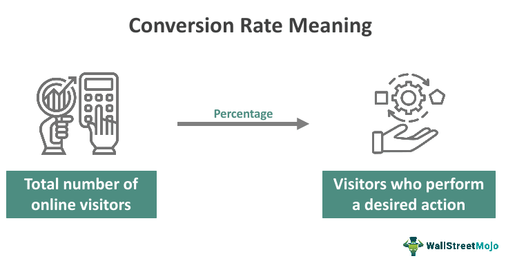

In today's digital age, understanding and effectively utilizing marketing metrics is essential for any business looking to thrive online. The digital landscape is saturated with data, and companies must navigate this ocean of information to make informed decisions that drive growth and efficiency. One of the most crucial metrics in assessing online performance is the conversion rate. This metric measures how effectively marketing efforts turn potential leads into tangible customers, serving as an indicator of the success of marketing strategies. Conversion rate is calculated as:

$$
\text{Conversion Rate} = \left( \frac{\text{Number of Conversions}}{\text{Total Visitors}} \right) \times 100
$$



where conversions refer to any desired action taken by visitors, such as purchasing a product, signing up for a service, or filling out a contact form.

This article explores the significance of conversion rates, demonstrating how they are indispensable tools for measuring digital marketing success. By examining real-world examples, we can understand how different industries approach conversion rate optimization, adapting strategies that cater to diverse audiences and business goals. Additionally, the article investigates the impact of advanced technological approaches, such as algorithmic trading, on enhancing conversion metrics. Algorithmic trading uses complex algorithms and data analytics to make strategic decisions, potentially boosting conversion rates by optimizing marketing strategies and targeting.

Understanding conversion rates and the factors influencing them—such as website design, user experience, and quality of traffic—enables businesses to adjust their tactics and improve their bottom line. As digital marketing continues to evolve, it is imperative for businesses to continually assess and optimize their conversion strategies to maintain a competitive edge. This overview sets the stage for a deeper investigation into the mechanisms and strategies that drive successful conversions in the digital marketplace.

## Table of Contents

## Understanding Conversion Rates

Conversion rate is a crucial key performance indicator (KPI) in digital marketing, as it measures the effectiveness of a marketing campaign by calculating the percentage of visitors who complete a desired action. This action varies depending on the organization's objectives and might include making a purchase, signing up for a newsletter, or downloading a whitepaper.

The conversion rate is calculated using the formula:

$$
\text{Conversion Rate (\%)} = \left(\frac{\text{Number of Conversions}}{\text{Total Number of Visitors}}\right) \times 100
$$

For example, if an e-commerce website receives 1,000 visitors in a day, and 50 of them make a purchase, the conversion rate would be:

$$
\text{Conversion Rate (\%)} = \left(\frac{50}{1000}\right) \times 100 = 5\%
$$

A high conversion rate is indicative of successful marketing and web design strategies, while a low conversion rate suggests that there may be barriers preventing visitors from converting.

Several factors influence conversion rates, including:

1. **Website Design**: A user-friendly interface with intuitive navigation can significantly enhance conversion rates. A well-designed website reduces the friction that visitors encounter as they attempt to complete their desired actions.

2. **User Experience (UX)**: Beyond mere design, the overall user experience encompasses page load times, mobile responsiveness, and the clarity of information presented. Fast-loading pages and mobile-optimized design ensure that visitors can seamlessly navigate the website across different devices, improving the likelihood of conversions.

3. **Quality of Traffic**: The source and quality of incoming traffic are critical. Targeted traffic, where visitors have a genuine interest in the products or services offered, tends to convert at a higher rate. This is where precise audience targeting in advertising campaigns becomes vital. Understanding user intent and tailoring content to meet these expectations can dramatically improve conversion rates.

Businesses often employ A/B testing and data analytics to identify optimal strategies that will lead to improved conversion rates. Adjustments in design, content, or targeted campaigns are continually tested and refined based on empirical evidence of user behavior, leading to more effective marketing efforts and enhanced performance metrics.

## Examples of Conversion Rates

Conversion rates are pivotal across various industries, highlighting the importance of measuring and optimizing customer interactions. By examining examples from different sectors, businesses can gain insights into effective strategies that enhance their conversion metrics.

### E-commerce Case Study
In the e-commerce sector, optimization of conversion rates is often achieved through meticulous A/B testing and user experience innovations. A notable case study involves a leading online retailer that sought to refine its shopping cart process. By streamlining the checkout flow, reducing unnecessary form fields, and implementing a progress indicator, the company improved its conversion rate significantly.

To illustrate, the retailer initially had a conversion rate of 3.5%. After implementing the changes, they observed an increase to 4.8%. The formula used to calculate the conversion rate is:

$$
\text{Conversion Rate} = \left( \frac{\text{Number of Conversions}}{\text{Total Visitors}} \right) \times 100
$$

This optimization was guided by data analytics, showing that users were abandoning carts due to complexity and perceived time consumption. By removing these barriers, the retailer not only increased conversions but also improved overall customer satisfaction.

### B2B Lead Generation Example
In the B2B sector, conversion rates often pertain to lead generation and the subsequent nurturing process. A successful example involves a software-as-a-service (SaaS) provider that implemented a personalized email marketing campaign targeting potential clients.

Initially, the B2B company relied on a generic email strategy, yielding a conversion rate of 2%. By segmenting their audience based on industry, company size, and previous interaction data, they tailored the content of their emails to address specific pain points and needs of different customer segments. This personalization effort increased their email conversion rate to 3.5%.

Moreover, the company incorporated a lead scoring system that prioritized prospects based on engagement level and likelihood to convert. This allowed their sales team to focus efforts on high-potential leads, further driving improvements in the conversion pipeline.

In both examples, the emphasis on understanding audience behavior and barriers to conversion proved critical. By leveraging data-driven strategies, companies can adapt their approaches to enhance engagement and increase conversion rates, ultimately driving business success.

## Conversion Rate in Algorithmic Trading

Algorithmic trading refers to the use of computer algorithms to automate trading decisions in financial markets. This approach leverages mathematical models and complex algorithms to execute trades at speeds and frequencies that are impossible for human traders. One key area where [algorithmic trading](/wiki/algorithmic-trading) has a significant impact is on conversion rates, which in the context of trading, refers to the efficiency and effectiveness with which trading opportunities are converted into successful transactions.

Algorithmic trading enhances conversion metrics by enabling traders to process large volumes of data quickly and to implement strategies that are responsive to market conditions. These algorithms can analyze market data to identify trends and patterns, make predictions about future market movements, and execute trades at optimal times. This capability is crucial in maximizing the conversion of potential market movements into profitable trades.

For example, high-frequency trading ([HFT](/wiki/high-frequency-trading-strategies)) is a subset of algorithmic trading that executes numerous trades within microseconds. These high-speed trades capitalize on minute price discrepancies in the market, thereby improving the rate of conversion from potential opportunities to realized profits. HFT firms often use sophisticated algorithms to continuously assess the market and adjust their strategies dynamically, ensuring high conversion efficiency.

Moreover, algorithmic trading allows for [backtesting](/wiki/backtesting), a process where trading strategies are tested on historical data to assess their potential effectiveness. Backtesting provides traders with insights into which strategies are likely to yield the best conversion rates under various market conditions, allowing for fine-tuning and optimization of strategies before actual deployment.

A practical example of algorithmic trading improving conversion rates can be seen in the use of [machine learning](/wiki/machine-learning) algorithms. These algorithms can incorporate large datasets, including historical trading data, macroeconomic indicators, and sentiment analysis from news and social media, to forecast market trends. The predictions help traders refine their strategies, thereby increasing the likelihood that trades will convert into profits.

Consider a machine learning model trained to spot [arbitrage](/wiki/arbitrage) opportunities—instances where an asset is priced differently in two separate markets. By quickly identifying and executing trades to exploit these differences, the algorithm effectively converts observations into profitable transactions with high accuracy.

```python
# Example of a simple model using a library like scikit-learn to predict stock price movements
from sklearn.model_selection import train_test_split
from sklearn.ensemble import RandomForestClassifier
import numpy as np

# Sample input data representing features of stock price movement
X = np.random.rand(1000, 10)  # 1000 samples, 10 features
# Sample output data representing direction (0 = price down, 1 = price up)
y = np.random.randint(2, size=1000)

# Split the data into training and test sets
X_train, X_test, y_train, y_test = train_test_split(X, y, test_size=0.2, random_state=42)

# Create and train a Random Forest model
model = RandomForestClassifier(n_estimators=100, max_depth=5, random_state=42)
model.fit(X_train, y_train)

# Predicting using the test data
predictions = model.predict(X_test)
```

In this Python example, a Random Forest model could be used to predict future stock price movements based on historical data, aiding in strategic decision-making and improving conversion rates in trading operations.

Through optimizing trading strategies and employing technology to mitigate human limitations, algorithmic trading significantly boosts conversion metrics in financial markets, leading to increased profitability and operational efficiency.

## Key Marketing Metrics Related to Conversion

In digital marketing, several key metrics complement conversion rates to provide a holistic view of marketing performance. Understanding the interaction between these metrics is crucial for optimizing strategies and achieving better outcomes.

### Cost Per Acquisition (CPA)

Cost Per Acquisition (CPA) measures the average cost incurred to acquire a customer. It is calculated by dividing the total cost of a marketing campaign by the number of conversions (acquisitions) generated. The formula for CPA is as follows:

$$
CPA = \frac{\text{Total Cost of Campaign}}{\text{Number of Conversions}}
$$

A lower CPA indicates a more efficient campaign, where less money is spent on acquiring each customer. This metric is directly related to conversion rates; enhancing conversion rates often leads to reduced CPA, as more conversions can be achieved with the same or lower budget. To improve CPA, businesses can focus on targeting high-quality leads and refining their marketing strategies to ensure they are cost-effective.

### Click-Through Rate (CTR)

Click-Through Rate (CTR) evaluates the effectiveness of an advertisement in driving traffic to a website or landing page. It is defined as the number of clicks an ad receives divided by the number of impressions (times the ad is shown), expressed as a percentage:

$$
CTR = \left( \frac{\text{Number of Clicks}}{\text{Number of Impressions}} \right) \times 100
$$

CTR provides insights into the quality of the ad copy, imagery, and the relevance of the ad to the target audience. A higher CTR generally indicates a successful ad, as more people are motivated to click and potentially convert. Improving CTR can be achieved through A/B testing different ad elements, using engaging visuals, and crafting compelling call-to-actions.

### Return on Investment (ROI)

Return on Investment (ROI) assesses the profitability of marketing efforts. It is calculated by subtracting the cost of the marketing campaign from the revenue generated by the campaign and then dividing this by the campaign cost:

$$
ROI = \left( \frac{\text{Revenue from Campaign} - \text{Cost of Campaign}}{\text{Cost of Campaign}} \right) \times 100
$$

A positive ROI indicates that the campaign generates more revenue than it costs. ROI is closely linked to conversion rates, as higher conversion rates usually contribute to greater revenue without proportionally increasing costs. To enhance ROI, marketers can focus on strategies that boost conversion rates, such as optimizing their sales funnel and ensuring alignment between marketing messages and customer needs.

### Interaction of Metrics

These metrics, together with conversion rates, construct a comprehensive picture of marketing performance. While CPA focuses on cost-efficiency, CTR indicates engagement levels, and ROI measures overall profitability. By analyzing these metrics in conjunction, businesses can identify bottlenecks in their marketing strategy and allocate resources more effectively.

### Tips for Improvement

To track and improve these metrics, businesses can utilize analytics tools such as Google Analytics, which provides detailed insights into website traffic and user behavior. Regularly monitoring these metrics allows for timely adjustments to marketing strategies. Additionally, implementing machine learning algorithms can help predict trends and optimize campaigns in real-time, ensuring that marketing efforts are both targeted and efficient. Employing a data-driven approach and continually testing various aspects of marketing campaigns are essential practices for achieving better marketing success.

## Strategies to Improve Conversion Rates

Improving conversion rates is essential for maximizing the effectiveness of digital marketing efforts. There are several strategies that can be employed to enhance these rates, and leveraging data-driven methodologies can significantly boost the outcomes.

One of the primary techniques is A/B testing, a method used to compare two versions of a webpage or application to determine which one performs better regarding user actions. By systematically testing variations of elements like headlines, images, and text, businesses can identify which designs lead to higher conversions. For example, by altering the color of a call-to-action ([CTA](/wiki/cta-strategy)) button or changing the placement of a form, companies can see measurable differences in conversion rates. This approach relies on statistical analysis to assess the effectiveness of each variant, with the following calculation often used to measure significance:

$$
\text{Conversion Rate} = \left( \frac{\text{Number of Conversions}}{\text{Total Visitors}} \right) \times 100
$$

In addition to A/B testing, optimizing landing pages is crucial. A well-designed landing page should be clear, concise, and aligned with user expectations. It requires eliminating any distractions and ensuring that the content is directly related to the advertisement or link that led the user there. Effective landing pages facilitate easy navigation and employ persuasive elements that encourage users to take the desired action.

Enhancing CTA elements is another vital strategy. CTAs should be compelling and placed prominently within the webpage to draw users' attention. Verbs that convey urgency, like "Buy Now" or "Sign Up Today," can stimulate immediate action. Ensuring that CTAs are mobile-friendly is also important, given the significant amount of traffic from mobile devices.

Personalization and targeted marketing play a significant role in improving conversion rates. Personalized marketing strategies address the specific needs and preferences of individual users, leading to a more engaging user experience. By segmenting audiences and tailoring content to suit different user groups, businesses can increase the relevance of their marketing efforts, thereby improving the likelihood of conversion.

Utilizing data analytics and machine learning can further optimize conversion rates by enabling more informed marketing decisions. Data analytics provide insights into user behavior, preferences, and trends, allowing businesses to fine-tune their marketing strategies. Machine learning algorithms can analyze large datasets to predict patterns and outcomes, helping marketers to anticipate user needs and tailor their approaches accordingly.

Python can be used effectively in these processes, providing various libraries such as scikit-learn for machine learning and pandas for data manipulation. A sample Python code snippet for analyzing conversion data might look like this:

```python
import pandas as pd
from sklearn.model_selection import train_test_split
from sklearn.ensemble import RandomForestClassifier
from sklearn.metrics import accuracy_score

# Load dataset
data = pd.read_csv('conversion_data.csv')

# Preprocess data
X = data.drop('converted', axis=1)
y = data['converted']

# Split data into training and test sets
X_train, X_test, y_train, y_test = train_test_split(X, y, test_size=0.2, random_state=42)

# Train a model
model = RandomForestClassifier(n_estimators=100, random_state=42)
model.fit(X_train, y_train)

# Make predictions
predictions = model.predict(X_test)

# Evaluate model performance
accuracy = accuracy_score(y_test, predictions)
print(f'Accuracy: {accuracy * 100:.2f}%')
```

In summary, improving conversion rates involves a mix of user-centric design, strategic testing, effective personalization, and intelligent data utilization. By focusing on these aspects, marketers can enhance the efficacy of their campaigns and achieve better outcomes.

## Conclusion

Tracking and optimizing conversion rates are pivotal elements of a successful digital marketing strategy. By closely monitoring these rates, businesses can understand how efficiently their online efforts are translating into customer actions. An improved conversion rate indicates that a greater percentage of visitors are completing desired actions, such as making purchases or signing up for newsletters, thus directly influencing a company's revenue and growth prospects.

Algorithmic trading, historically rooted in financial markets, offers insightful methodologies for enhancing conversion metrics in digital marketing. Algorithms, with their capacity for rapid and precise analysis, can identify patterns and predict outcomes that human analysis might miss. By leveraging these strengths, marketers can deploy algorithmic approaches to refine targeting strategies and optimize user engagement, thereby improving conversion rates.

For instance, algorithms can be used to analyze user behavior data, identifying key factors that lead to conversions. Such insights can then inform the design of marketing campaigns tailored to the nuances of consumer behavior, thereby enhancing the likelihood of conversion. Furthermore, algorithms can test multiple hypotheses simultaneously, conducting A/B testing at scale to identify the most effective strategies quickly and efficiently.

To achieve ongoing improvements in conversion rates, it is essential for marketers to implement the strategies discussed, such as optimizing landing pages and personalizing content based on user data. Utilizing data analytics and machine learning will also support informed decision-making and maintain strategic agility.

In conclusion, businesses are encouraged to employ a systematic approach to track conversion rates and implement algorithm-driven strategies. By doing so, they can ensure a robust understanding of their digital marketing effectiveness and maintain a competitive edge in the dynamic online marketplace. Constant evaluation and adaptation, guided by solid data insights, will lead to sustained improvements in marketing performance.

## References & Further Reading

[1]: Bergstra, J., Bardenet, R., Bengio, Y., & Kégl, B. (2011). ["Algorithms for Hyper-Parameter Optimization."](https://papers.nips.cc/paper/4443-algorithms-for-hyper-parameter-optimization) Advances in Neural Information Processing Systems 24.

[2]: ["Advances in Financial Machine Learning"](https://www.amazon.com/Advances-Financial-Machine-Learning-Marcos/dp/1119482089) by Marcos Lopez de Prado

[3]: ["Evidence-Based Technical Analysis: Applying the Scientific Method and Statistical Inference to Trading Signals"](https://www.amazon.com/Evidence-Based-Technical-Analysis-Scientific-Statistical/dp/0470008741) by David Aronson

[4]: ["Machine Learning for Algorithmic Trading"](https://github.com/stefan-jansen/machine-learning-for-trading) by Stefan Jansen

[5]: ["Quantitative Trading: How to Build Your Own Algorithmic Trading Business"](https://www.amazon.com/Quantitative-Trading-Build-Algorithmic-Business/dp/1119800064) by Ernest P. Chan