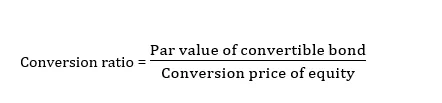

The financial world is a multifaceted domain that requires a deep understanding of various concepts to navigate successfully. Within this arena, the comprehension of conversion ratios, conversion examples, and conversion rate calculations becomes imperative for both casual investors and professional traders. These concepts are foundational elements that contribute significantly to informed decision-making and strategy formation in trading activities.

Conversion ratios, for instance, indicate how many common shares can be acquired from the conversion of a convertible security. This ratio is critical during the issuance of convertible bonds or stocks and plays an essential role in determining the security's relative price. Understanding how to compute and interpret these ratios allows investors to assess the potential equity yield of their convertible securities at any given time.



Furthermore, the process of calculating conversion rates—expressed as percentages representing specific completed actions, such as the conversion of securities or sales—provides insights into the effectiveness of an investment or trading strategy. By calculating and analyzing these rates, traders can evaluate how often these conversions yield desired outcomes, thereby optimizing their overall strategies.

In the context of algo trading, such calculations are invaluable. Algorithmic trading leverages computer programs to automate trading strategies based on pre-defined criteria, often incorporating conversion ratios and rates. This technology-driven approach aims to minimize human error and enhance the speed and accuracy of trade executions, ultimately improving returns. Understanding conversion metrics enriches the capabilities of algorithmic systems by enabling more precise strategy development, monitoring, and adjustment.

This article explores these calculations and exemplifies their practical applications, particularly within algorithmic trading, highlighting the intersection of traditional finance principles and modern technology.

## Table of Contents

## What is Conversion Ratio?

Conversion ratio is a key metric in finance, primarily associated with convertible securities such as bonds or preferred stocks. It specifies the number of common shares that an investor receives upon converting a convertible security. This ratio is determined at the time of issuance and is integral in assessing the relative value of the security. A higher conversion ratio often indicates a more favorable conversion for the investor, as they receive more shares per security.

The conversion ratio can be mathematically expressed using the formula:

$$
\text{Conversion Ratio} = \frac{\text{Par Value of Convertible Bond}}{\text{Conversion Price of Equity}}
$$

This formula reflects how many shares an investor will obtain, based on the par value of the bond and the predetermined conversion price. The conversion price defines the price at which the bond can be converted into shares, while the par value is the bond's face value.

The conversion ratio has significant implications for both investors and issuers. For investors, it helps in evaluating potential returns and gauging whether the conversion option is advantageous based on current stock prices. For issuers, setting an appropriate conversion ratio is crucial for maintaining an attractive yet financially viable security offering. Such dynamics mean that the conversion ratio serves as a vital tool for decision-making in financial markets involving convertible securities.

## Examples of Conversion Ratios

A conversion ratio represents the number of common shares that can be obtained from a convertible security. To understand this concept, consider a convertible bond. Suppose a company issues a bond with a par value of $1,000 and sets a conversion price of $40 per share. The conversion ratio can be calculated using the formula:

$$
\text{Conversion Ratio} = \frac{\text{Par Value of Convertible Bond}}{\text{Conversion Price of Equity}}
$$

For this example, the conversion ratio would be:

$$
\text{Conversion Ratio} = \frac{1000}{40} = 25
$$

This ratio means that an investor holding the bond has the option to convert it into 25 shares of the company’s stock whenever it becomes financially beneficial.

Another example involves convertible preferred stock. Assume that an investor holds preferred shares with a conversion ratio of 5. This implies that each preferred share can be converted into 5 common shares. The significance of this conversion option depends on the market price of the common shares relative to the conversion terms. The strategic decisions made by investors regarding conversions rely heavily on the conversion ratio, as it determines the value received upon conversion.

Understanding these examples helps investors evaluate when and how to exercise their conversion options, based on market conditions and their own investment strategies.

## Conversion Rate Calculation

Conversion rate in finance is a critical metric that measures the effectiveness of a particular action, such as the conversion of securities or sales transactions. This rate is expressed as a percentage and is calculated by dividing the number of completed actions by the total number of opportunities, then multiplying the quotient by 100.

Mathematically, the conversion rate can be expressed by the formula:

$$
\text{Conversion Rate (\%)} = \left( \frac{\text{Number of Completed Actions}}{\text{Total Number of Opportunities}} \right) \times 100
$$

For example, if a financial institution offers convertible securities, and 200 out of a possible 1,000 investors decide to convert, the conversion rate would be:

$$
\text{Conversion Rate (\%)} = \left( \frac{200}{1000} \right) \times 100 = 20\%
$$

The conversion rate provides insight into the attractiveness or performance of a financial instrument or marketing strategy. High conversion rates typically signal that the offering is appealing or that the strategy is effective, whereas low rates suggest the opposite.

In a Python programming environment, this calculation can be automated using the following simple function:

```python
def calculate_conversion_rate(completed_actions, total_opportunities):
    if total_opportunities == 0:
        return 0
    return (completed_actions / total_opportunities) * 100

# Example usage:
completed_actions = 200
total_opportunities = 1000
conversion_rate = calculate_conversion_rate(completed_actions, total_opportunities)
print(f"Conversion Rate: {conversion_rate}%")
```

This function takes the number of completed actions and total opportunities as arguments and returns the conversion rate as a percentage, which is useful for financial analysts or traders who need to compute and analyze conversion rates quickly in real-time scenarios.

## Understanding Algo Trading

Algorithmic trading, often referred to as algo trading, is the process of using computer programs to execute trading strategies in financial markets. This approach is designed to operate within pre-set parameters determined by traders or quants (quantitative analysts). The central idea behind [algorithmic trading](/wiki/algorithmic-trading) is to automate the trading process, thereby mitigating human error and expediting the execution of trades.

One of the significant advantages of algorithmic trading is its ability to harness conversion ratios and conversion rates to optimize trading outcomes. For instance, an algorithm could be programmed to monitor specific conversion ratios of convertible securities. When the ratio reaches a predetermined favorable level, the algorithm can automatically execute trades to capitalize on the opportunity.

Incorporating conversion ratios is particularly useful in convertible [arbitrage](/wiki/arbitrage) strategies, where traders profit from the price discrepancies between convertible securities and the underlying stocks. Algorithms can process vast amounts of data quickly and efficiently, adjusting strategies in real-time as market conditions change.

The implementation of algorithmic trading minimizes the impact of emotional biases and inconsistent decision-making that can plague human traders. Moreover, algorithms can operate at a speed and frequency that is unattainable for humans, enabling them to execute thousands of trades in the time it might take a human to make a single decision.

Here's a simple Python script that demonstrates the basics of algorithmic trading using a predetermined conversion ratio:

```python
class AlgoTrading:
    def __init__(self, conversion_ratio, current_price, target_ratio):
        self.conversion_ratio = conversion_ratio
        self.current_price = current_price
        self.target_ratio = target_ratio

    def should_trade(self):
        return self.conversion_ratio >= self.target_ratio

    def execute_trade(self):
        if self.should_trade():
            print(f"Executing trade at conversion ratio: {self.conversion_ratio} with current price: {self.current_price}")
        else:
            print("No trade executed")

# Example usage
trader = AlgoTrading(conversion_ratio=25, current_price=40, target_ratio=24)
trader.execute_trade()
```

In this example, the `AlgoTrading` class automates the decision to trade based on whether the current conversion ratio meets or exceeds a target threshold. If conditions are favorable, the trade is executed automatically.

The growing reliance on algorithmic trading in financial markets is emblematic of the intersection between traditional finance and technology. This convergence has enabled traders to develop more sophisticated strategies, providing them with a competitive edge in a data-driven market environment.

## Real-World Application of Conversion Calculations in Algo Trading

Algorithmic traders actively utilize conversion calculations to optimize their trading strategies and enhance potential outcomes. A fundamental aspect involves using conversion ratios to make informed decisions on convertible securities such as bonds and preferred stocks. When a conversion ratio indicates a favorable pricing condition, traders may set up algorithms that trigger the conversion of bonds automatically. For instance, if a convertible bond exhibits a conversion ratio that suggests the conversion will yield profitable equity shares, an algorithm can be employed to execute the conversion at the optimal time, thus maximizing investor returns.

Traders also rely on conversion rates to assess the performance of their algorithmic strategies. Conversion rates, expressed as a percentage, reflect the number of successful conversions relative to the total opportunities. By analyzing these rates, traders can determine the efficacy of their trading algorithms. For example, if an algorithm is designed to convert securities when specific market conditions are met, a high conversion rate would indicate that the algorithm is effectively identifying and acting upon those opportunities.

Adjusting and optimizing algorithms based on conversion rate analysis is crucial for improving strategy performance. For instance, if a trader observes that an algorithm has a lower-than-expected conversion rate, they might tweak certain parameters or criteria within the algorithm to align more closely with favorable market conditions. This iterative process allows traders to fine-tune their strategies for better results. 

Here is an example of how Python can be used to implement a basic conversion mechanism within an algorithm:

```python
# Define the conversion ratio and bond parameters
par_value = 1000
conversion_price = 40
conversion_ratio = par_value / conversion_price  # Conversion Ratio

# Define the market conditions
current_stock_price = 45  # hypothetical current stock price

# Algorithmic decision to convert
def should_convert(par_value, conversion_price, current_stock_price):
    conversion_ratio = par_value / conversion_price
    conversion_value = conversion_ratio * current_stock_price
    if conversion_value > par_value:
        return True
    else:
        return False

# Evaluate conversion decision
if should_convert(par_value, conversion_price, current_stock_price):
    print("Convert the bond to stocks.")
else:
    print("Do not convert the bond.")
```

This script demonstrates a basic decision-making process where a conversion is triggered if the conversion value exceeds the par value of the bond. Traders can expand and customize this logic to incorporate more sophisticated market analyses and risk assessments, thereby leveraging algo trading for improved returns.

## Conclusion

Understanding conversion ratios, examples, and calculations provide significant advantages to traders, particularly in algorithmic trading. By grasping these concepts, traders can make more informed investment decisions, strategically execute complex strategies, and potentially achieve higher returns. Conversion ratios allow traders to determine the intrinsic value of convertible securities, helping them anticipate the effects of market fluctuations on their investments with greater precision. This knowledge is crucial for identifying favorable trading opportunities and optimizing timing.

Moreover, integrating conversion calculations into algorithmic trading systems exemplifies the synergy between traditional finance principles and contemporary technological advancements. Algorithms designed to react promptly to shifts in conversion ratios can capitalize on arbitrage opportunities, automatically executing trades under pre-set conditions when optimal conversion prices are identified. In this context, traders are equipped to minimize human error and emotional bias, ensuring more consistent and reliable trading outcomes.

By leveraging the computational power and speed offered by modern technology, algorithmic trading involving conversion calculations, enhances the efficiency and effectiveness of financial strategies. This convergence facilitates real-time decision-making processes and provides traders with a competitive edge in rapidly changing markets, ultimately contributing to more sustainable and robust trading performance.

## References & Further Reading

[1]: ["Fundamentals of Futures and Options Markets"](https://www.pearson.com/en-us/subject-catalog/p/fundamentals-of-futures-and-options-markets/P200000005937/9780137504763) by John C. Hull

[2]: Ammann, M. (2001). ["Convertible Bonds: Valuation and Optimal Strategies for Investors."](https://www.semanticscholar.org/paper/Simulation-Based-Pricing-of-Convertible-Bonds-Ammann-Kind/93af45b255a01546c80ef61ead1955f6d929e7be) Springer.

[3]: ["Algorithmic Trading and DMA: An introduction to direct access trading strategies"](https://www.amazon.com/Algorithmic-Trading-DMA-introduction-strategies/dp/0956399207) by Barry Johnson

[4]: ["Trading and Exchanges: Market Microstructure for Practitioners"](https://www.amazon.com/Trading-Exchanges-Market-Microstructure-Practitioners/dp/0195144708) by Larry Harris

[5]: ["Options, Futures, and Other Derivatives"](https://www.amazon.com/Options-Futures-Other-Derivatives-9th/dp/0133456315) by John C. Hull