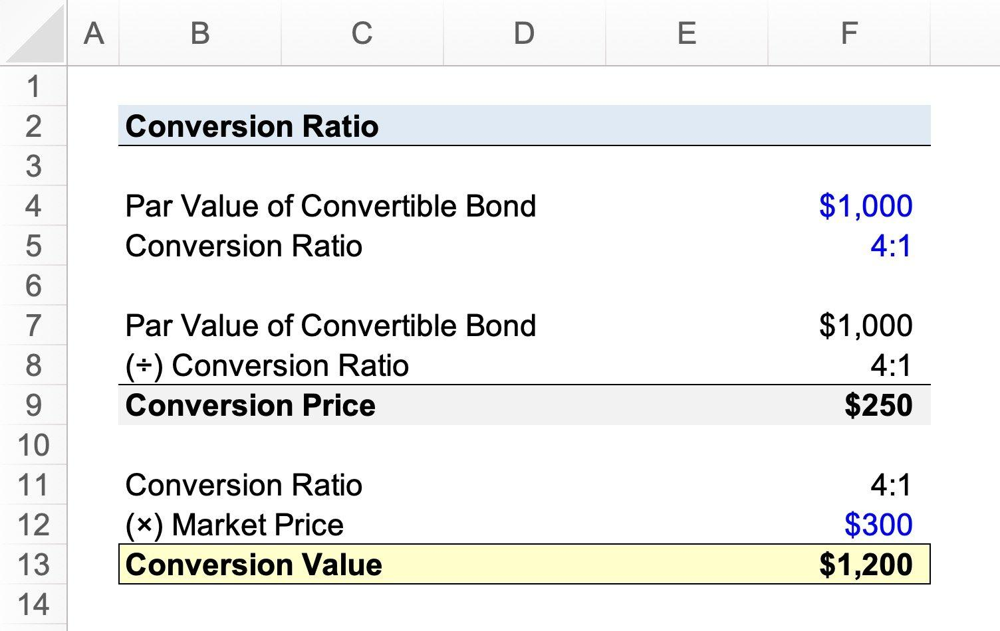

## Table of Contents

## What is a conversion ratio?

A conversion ratio is a number that tells you how many of one thing you get for another thing. It's often used in finance, like when a company issues bonds that can be turned into shares of stock. For example, if a bond has a conversion ratio of 50, it means that for each bond you own, you can get 50 shares of the company's stock.

In everyday life, conversion ratios can help with things like cooking or measuring. If a recipe says you need 2 cups of flour for every 3 eggs, the conversion ratio of flour to eggs is 2:3. This helps you figure out how much of each ingredient you need if you want to make more or less of the recipe. Understanding conversion ratios makes it easier to switch between different units or items.

## Why is the conversion ratio important in business?

The conversion ratio is important in business because it helps companies and investors understand how to turn one thing into another, like bonds into stocks. When a company issues convertible bonds, the conversion ratio tells everyone how many shares of stock they can get for each bond. This is useful for investors because it helps them decide if buying the bonds is a good deal. If the conversion ratio is high, they might get a lot of stock for their bonds, which could be a good investment if the stock price goes up.

The conversion ratio also helps businesses plan their finances. If a company knows how many shares will be created from convertible bonds, they can better predict their future stock situation. This is important for managing the company's ownership and making sure they don't end up with too many shares, which could lower the value of each share. So, the conversion ratio is a key piece of information that helps both investors and the company make smart decisions.

## How do you calculate a basic conversion ratio?

To calculate a basic conversion ratio, you need to know how many of one thing you get for another. For example, if you have a recipe that says you need 2 cups of flour for every 3 eggs, the conversion ratio of flour to eggs is 2:3. This means for every 3 eggs you use, you need 2 cups of flour. To find the ratio, you just put the amount of the first thing over the amount of the second thing.

In business, calculating the conversion ratio for convertible bonds is similar. If a bond can be turned into stock, and the bond's conversion ratio is 50, this means you get 50 shares of stock for each bond. To find this ratio, the company decides how many shares they want to give for each bond and sets that number as the conversion ratio. This helps investors know how many shares they will get if they decide to convert their bonds into stock.

## Can you provide a simple example of a conversion ratio calculation?

Let's say you have a recipe that needs 2 cups of flour for every 3 eggs. To find the conversion ratio of flour to eggs, you just put the amount of flour over the amount of eggs. So, the conversion ratio is 2 cups of flour for every 3 eggs, or 2:3.

In business, if a company has convertible bonds and says that each bond can be turned into 50 shares of stock, the conversion ratio is 50. This means for each bond you own, you get 50 shares of stock. The company decides on this number to help investors know how many shares they will get if they convert their bonds.

## What are common mistakes to avoid when calculating conversion ratios?

When calculating conversion ratios, a common mistake is mixing up the order of the numbers. If you have a recipe that needs 2 cups of flour for every 3 eggs, the conversion ratio is 2:3, not 3:2. Getting the order wrong can lead to using too much or too little of an ingredient. In business, if a bond converts to 50 shares of stock, the ratio is 50:1, not 1:50. Mixing up the order can make investors think they are getting a different amount of stock than they really are.

Another mistake to avoid is not simplifying the ratio. If you have a recipe that needs 4 cups of flour for every 6 eggs, the ratio is 4:6, but you can simplify it to 2:3 by dividing both numbers by 2. Not simplifying can make the ratio harder to understand and use. In business, if a bond converts to 100 shares of stock, the ratio is 100:1, but you can simplify it to 1:0.01 by dividing both numbers by 100. Not simplifying can make the ratio confusing and harder to work with.

## How does the conversion ratio apply to different industries?

In the finance industry, the conversion ratio is important when companies issue convertible bonds. These bonds can be turned into shares of stock, and the conversion ratio tells investors how many shares they get for each bond. If a bond has a conversion ratio of 50, it means that for every bond an investor owns, they can get 50 shares of stock. This helps investors decide if buying the bonds is a good investment, especially if they think the stock price will go up. Companies also use the conversion ratio to plan their finances and manage the number of shares they have.

In the food and cooking industry, conversion ratios help with recipes and measuring ingredients. For example, if a recipe says you need 2 cups of flour for every 3 eggs, the conversion ratio is 2:3. This means that for every 3 eggs you use, you need 2 cups of flour. Knowing this ratio helps cooks adjust the recipe if they want to make more or less of the dish. It also makes it easier to switch between different units of measurement, like cups to grams, which is helpful when following recipes from different countries.

## What advanced metrics can be used alongside the conversion ratio?

In finance, alongside the conversion ratio, you can use the conversion premium to understand how much more you are paying for the stock through the bond compared to buying the stock directly. If a bond's conversion ratio is 50 and the stock price is $20, the conversion value is $1,000 (50 shares times $20 per share). If the bond costs $1,100, the conversion premium is $100, or 10%. This helps investors see if the bond is a good deal. Another useful metric is the dilution effect, which shows how the conversion of bonds into stock can change the ownership of the company. If too many bonds are converted, it can lower the value of each share, so companies need to keep an eye on this.

In the food and cooking industry, you can use the yield percentage alongside the conversion ratio to understand how much of an ingredient you will end up with after cooking or processing. For example, if you start with 100 grams of raw meat and end up with 70 grams after cooking, the yield percentage is 70%. This helps cooks adjust their recipes to get the right amount of food. Another helpful metric is the cost per serving, which tells you how much each portion of a dish costs to make. If a recipe uses 2 cups of flour and 3 eggs, and the conversion ratio is 2:3, knowing the cost per serving helps you see if the dish is affordable to make.

## How can conversion ratios be used to improve marketing strategies?

Conversion ratios can help businesses make their marketing strategies better by showing how well their ads turn into sales. If a company knows that for every 100 people who see their ad, 5 buy their product, they can use this ratio to see if their ads are working. If the ratio is low, they might need to change their ads or try different ways to reach people. By keeping an eye on the conversion ratio, businesses can spend their money on the ads that work best and stop wasting money on ads that don't.

Using conversion ratios also helps businesses understand their customers better. If they see that certain types of ads or offers lead to more sales, they can focus on those. For example, if a special discount code gets a lot of people to buy, the company can use more discount codes in their marketing. This way, they can make their ads more appealing to their customers and get more people to buy their products. By using conversion ratios, businesses can make smarter choices about how to market their products and reach more customers.

## What tools or software can help track and analyze conversion ratios?

There are many tools and software that can help businesses keep track of and understand their conversion ratios. One popular tool is Google Analytics. It's free and easy to use. It helps businesses see how many people visit their website, where they come from, and how many of them end up buying something. This way, businesses can see their conversion ratio and figure out if their website is working well to turn visitors into customers.

Another tool is HubSpot, which is great for businesses that want to do more with their marketing. HubSpot can track how many people respond to emails, fill out forms, or buy products after seeing an ad. It also helps businesses see which marketing efforts are working best and which ones need to be changed. By using HubSpot, businesses can keep an eye on their conversion ratios and make their marketing strategies better over time.

## How do seasonal trends affect conversion ratios and how can businesses adjust?

Seasonal trends can change how well businesses do at turning ads into sales. During busy times like holidays, more people might see ads and buy things, so the conversion ratio might go up. But during slow times, like after the holidays, fewer people might buy, so the conversion ratio could go down. Businesses need to watch these trends to know when to spend more on ads and when to spend less.

To adjust to these seasonal changes, businesses can change their marketing plans. During busy times, they might want to spend more money on ads and offer special deals to get more sales. During slow times, they might want to focus on keeping the customers they already have or try new ways to reach people. By understanding how seasonal trends affect their conversion ratios, businesses can make smarter choices about when and how to market their products.

## What case studies demonstrate successful use of conversion ratio optimization?

One good example of using conversion ratios well is from Amazon. They noticed that during the holiday season, their conversion ratio went up because more people were buying gifts. To make the most of this, Amazon started sending special holiday deals and reminders to people. This made even more people buy things, and their conversion ratio got even better. By watching their conversion ratios and changing their ads to fit the time of year, Amazon was able to sell more during the busy holiday season.

Another example is from a small bakery that wanted to sell more cakes. They saw that their conversion ratio was low because not many people were buying cakes after seeing their ads. So, they tried a new ad that showed a special discount on cakes. This new ad worked well, and more people started buying cakes. The bakery kept using this kind of ad and their conversion ratio went up. By paying attention to their conversion ratios and trying new things, the bakery was able to sell more cakes and make more money.

## How can statistical methods enhance the accuracy of conversion ratio calculations?

Statistical methods can make conversion ratio calculations more accurate by helping businesses understand the data better. For example, using a method called regression analysis, businesses can see how different things, like the time of year or the type of ad, affect the conversion ratio. This helps them know which factors are most important for turning ads into sales. By using [statistics](/wiki/bayesian-statistics), businesses can make sure they are looking at all the right information and not just guessing.

Another way statistics can help is by using something called confidence intervals. This tells businesses how sure they can be about their conversion ratio numbers. If a business sees a conversion ratio of 5%, a confidence interval can show that the real number might be between 4% and 6%. This helps businesses know if a change in the conversion ratio is a real change or just a random difference. By using these statistical methods, businesses can make better decisions and be more confident in their marketing plans.

## What is Conversion Ratio?

Conversion ratio is a key metric in finance, primarily associated with convertible securities such as bonds or preferred stocks. It specifies the number of common shares that an investor receives upon converting a convertible security. This ratio is determined at the time of issuance and is integral in assessing the relative value of the security. A higher conversion ratio often indicates a more favorable conversion for the investor, as they receive more shares per security.

The conversion ratio can be mathematically expressed using the formula:

$$
\text{Conversion Ratio} = \frac{\text{Par Value of Convertible Bond}}{\text{Conversion Price of Equity}}
$$

This formula reflects how many shares an investor will obtain, based on the par value of the bond and the predetermined conversion price. The conversion price defines the price at which the bond can be converted into shares, while the par value is the bond's face value.

The conversion ratio has significant implications for both investors and issuers. For investors, it helps in evaluating potential returns and gauging whether the conversion option is advantageous based on current stock prices. For issuers, setting an appropriate conversion ratio is crucial for maintaining an attractive yet financially viable security offering. Such dynamics mean that the conversion ratio serves as a vital tool for decision-making in financial markets involving convertible securities.

## What are some examples of conversion ratios?

A conversion ratio represents the number of common shares that can be obtained from a convertible security. To understand this concept, consider a convertible bond. Suppose a company issues a bond with a par value of $1,000 and sets a conversion price of $40 per share. The conversion ratio can be calculated using the formula:

$$
\text{Conversion Ratio} = \frac{\text{Par Value of Convertible Bond}}{\text{Conversion Price of Equity}}
$$

For this example, the conversion ratio would be:

$$
\text{Conversion Ratio} = \frac{1000}{40} = 25
$$

This ratio means that an investor holding the bond has the option to convert it into 25 shares of the company’s stock whenever it becomes financially beneficial.

Another example involves convertible preferred stock. Assume that an investor holds preferred shares with a conversion ratio of 5. This implies that each preferred share can be converted into 5 common shares. The significance of this conversion option depends on the market price of the common shares relative to the conversion terms. The strategic decisions made by investors regarding conversions rely heavily on the conversion ratio, as it determines the value received upon conversion.

Understanding these examples helps investors evaluate when and how to exercise their conversion options, based on market conditions and their own investment strategies.

## How do you calculate the conversion rate?

Conversion rate in finance is a critical metric that measures the effectiveness of a particular action, such as the conversion of securities or sales transactions. This rate is expressed as a percentage and is calculated by dividing the number of completed actions by the total number of opportunities, then multiplying the quotient by 100.

Mathematically, the conversion rate can be expressed by the formula:

$$
\text{Conversion Rate (\%)} = \left( \frac{\text{Number of Completed Actions}}{\text{Total Number of Opportunities}} \right) \times 100
$$

For example, if a financial institution offers convertible securities, and 200 out of a possible 1,000 investors decide to convert, the conversion rate would be:

$$
\text{Conversion Rate (\%)} = \left( \frac{200}{1000} \right) \times 100 = 20\%
$$

The conversion rate provides insight into the attractiveness or performance of a financial instrument or marketing strategy. High conversion rates typically signal that the offering is appealing or that the strategy is effective, whereas low rates suggest the opposite.

In a Python programming environment, this calculation can be automated using the following simple function:

```python
def calculate_conversion_rate(completed_actions, total_opportunities):
    if total_opportunities == 0:
        return 0
    return (completed_actions / total_opportunities) * 100

# Example usage:
completed_actions = 200
total_opportunities = 1000
conversion_rate = calculate_conversion_rate(completed_actions, total_opportunities)
print(f"Conversion Rate: {conversion_rate}%")
```

This function takes the number of completed actions and total opportunities as arguments and returns the conversion rate as a percentage, which is useful for financial analysts or traders who need to compute and analyze conversion rates quickly in real-time scenarios.

## References & Further Reading

[1]: ["Fundamentals of Futures and Options Markets"](https://www.pearson.com/en-us/subject-catalog/p/fundamentals-of-futures-and-options-markets/P200000005937/9780137504763) by John C. Hull

[2]: Ammann, M. (2001). ["Convertible Bonds: Valuation and Optimal Strategies for Investors."](https://www.semanticscholar.org/paper/Simulation-Based-Pricing-of-Convertible-Bonds-Ammann-Kind/93af45b255a01546c80ef61ead1955f6d929e7be) Springer.

[3]: ["Algorithmic Trading and DMA: An introduction to direct access trading strategies"](https://www.amazon.com/Algorithmic-Trading-DMA-introduction-strategies/dp/0956399207) by Barry Johnson

[4]: ["Trading and Exchanges: Market Microstructure for Practitioners"](https://www.amazon.com/Trading-Exchanges-Market-Microstructure-Practitioners/dp/0195144708) by Larry Harris

[5]: ["Options, Futures, and Other Derivatives"](https://www.amazon.com/Options-Futures-Other-Derivatives-9th/dp/0133456315) by John C. Hull