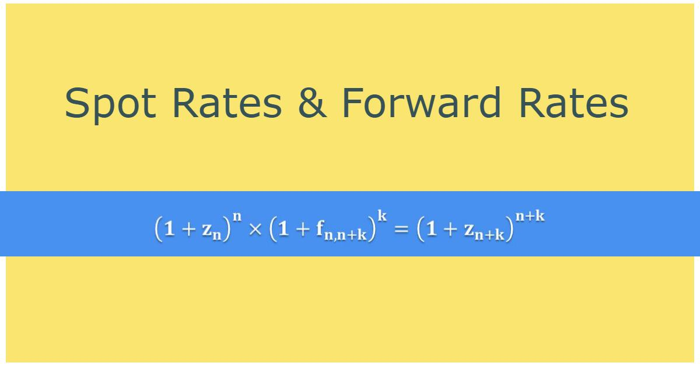

The world of foreign exchange, often referred to as forex, is abundant with both opportunities and complexities for traders and investors alike. An essential part of forex trading involves understanding forward and spot rates, which serve as fundamental indicators of currency value in the market. Forward rates are the prices at which two parties agree to exchange currencies on a future date, while spot rates represent the current exchange rates applicable to immediate currency transactions.

Navigating these concepts is crucial for traders aiming to effectively manage risk and capitalize on currency value fluctuations. However, the intricacies don't stop there. Algorithmic trading has emerged as a revolutionary force in handling forward and spot rates. By employing sophisticated computer algorithms, traders can automate trading decisions based on predefined criteria, enhancing both the precision and timing of transactions. This technological advancement has redefined efficiency and accuracy in the forex market, presenting new strategies for hedging and leveraging currency exchanges.



In this article, we aim to clarify the mechanics and distinctions of forward and spot rates, while examining how algorithmic trading is transforming forex markets. We will outline various trading strategies and considerations essential for navigating these financial instruments effectively. Understanding these components is critical, as it empowers traders to exploit the full potential of forex trading amidst the rapid pace of technological evolution. Join us as we explore the interplay between traditional currency trading methods and the cutting-edge applications of algorithmic trading, which continue to shape today's dynamic forex landscape.

## Table of Contents

## What Are Forward and Spot Rates?

Forward rates and spot rates are fundamental concepts in the foreign exchange (forex) market, each serving crucial roles in the trading of currencies. A forward rate is the agreed-upon price set in a forex contract for exchanging one currency for another at a future date. It represents a binding agreement between two parties to conduct the currency transaction at a specified time in the future, offering certainty about the terms of the exchange irrespective of future market conditions.

On the other hand, a spot rate is the current exchange rate at which a currency pair can be bought or sold immediately in the financial markets. It reflects the real-time conditions of the forex market and is subject to rapid fluctuations due to trading activities, economic news, and geopolitical events.

Both forward and spot rates are vital indicators in the forex market, as they serve distinct purposes. Forward rates are primarily employed for hedging and predicting future currency value movements. Businesses and investors utilize forward contracts to secure a currency price, thereby insulating themselves from adverse movements in the forex market. This is especially beneficial for corporations with foreign exchange exposure due to international trade, as it allows them to manage risks and budget expenses more effectively.

Spot rates, by contrast, are utilized for immediate currency exchanges, whether for speculative trading or fulfilling immediate payment requirements. Traders might engage in spot transactions to benefit from short-term price movements, given their responsiveness to current market conditions.

Understanding these rates is essential for anyone involved in [forex](/wiki/forex-system) trading or investment. Traders and investors must grasp how forward rates can be influenced by factors such as [interest rate](/wiki/interest-rate-trading-strategies) differentials, market expectations, and [liquidity](/wiki/liquidity-risk-premium) conditions. Similarly, a clear understanding of spot rates requires staying informed about market trends, economic indicators, and global news that might cause abrupt shifts in currency values.

In summary, both forward and spot rates are indispensable for mitigating risk and capitalizing on currency fluctuations. They empower market participants to tailor their trading and investment strategies according to their risk appetite and financial objectives, thereby enabling more informed decision-making in the volatile world of foreign exchange.

## Key Differences Between Forward and Spot Rates

Spot rates represent the current exchange rate at which a currency pair can be traded in the financial markets, offering a real-time reflection of supply and demand. These rates are used for immediate transactions, with delivery typically occurring within two business days. On the other hand, forward rates pertain to agreements set at present to exchange a specified amount of currencies at a predetermined rate on a future date. 

One of the primary distinctions between these rates is their relationship with market conditions. Spot rates are tightly linked to the prevailing market dynamics, capturing the immediate impact of economic indicators, geopolitical events, and market sentiment. In contrast, forward rates incorporate expectations of future market conditions. They are influenced not only by the current spot rate but also by the interest rate differential between the two currencies involved. This differentiation makes forward rates crucial for traders looking to hedge against potential currency fluctuations and anticipate future trends.

Volatility and certainty present another axis of differentiation. Spot rates, dictated by present market forces, can exhibit significant [volatility](/wiki/volatility-trading-strategies), responding swiftly to new information. Forward rates, although not immune to market shifts, offer a sense of certainty over a longer duration as they are agreed upon terms for a future date. This characteristic impacts their application in forex strategies; forward rates are more predictable and thus favored for long-term planning and risk management, whereas the inherent volatility of spot rates makes them suitable for traders seeking to capitalize on short-term price movements.

The disparate time frames further distinguish these rates. Spot transactions cater to the needs of immediate transfers, aligning with the urgent trading requirements of many investors. Forward contracts, however, are structured to accommodate future financial commitments, allowing businesses and traders to lock in exchange rates, thereby mitigating potential risks associated with adverse currency movements.

To illustrate with a simple Python example, consider calculating the forward rate based on a given spot rate of a currency pair, the domestic interest rate ($r_d$), and the foreign interest rate ($r_f$) over a time period $T$:

```python
def calculate_forward_rate(spot_rate, domestic_rate, foreign_rate, time_period):
    forward_rate = spot_rate * ((1 + domestic_rate * time_period) / (1 + foreign_rate * time_period))
    return forward_rate

# Example calculation
spot_rate = 1.10  # Example spot rate for EUR/USD
domestic_rate = 0.02  # Domestic interest rate (2%)
foreign_rate = 0.01  # Foreign interest rate (1%)
time_period = 1  # Time in years

forward_rate = calculate_forward_rate(spot_rate, domestic_rate, foreign_rate, time_period)
print(f"The forward rate is: {forward_rate:.4f}")
```

In this example, the calculation helps illustrate how a forward rate might be determined using present interest rates and spot rate data, reflecting how traders and businesses might leverage such formulas to plan future financial transactions.

## The Role of Algorithmic Trading in Forex

Algorithmic trading employs computer algorithms to automatically execute trades based on pre-defined criteria, revolutionizing the way forex markets operate. This approach leverages high-speed data processing and sophisticated algorithms to make quick, informed trading decisions, optimizing both the efficiency and accuracy of trades. 

In the dynamic environment of forex markets, [algorithmic trading](/wiki/algorithmic-trading) is instrumental in swiftly analyzing vast amounts of market data to determine the best [course](/wiki/best-algorithmic-trading-courses) of action, whether it involves forward or spot trading. Such algorithms evaluate various market indicators, including price trends, [volume](/wiki/volume-trading-strategy), and historical data, to execute trades at optimal moments, all in milliseconds—much faster than human traders can achieve. This speed and automation are crucial given the high volatility and 24/5 operation of forex markets.

One of the most significant advantages of algorithmic trading is its ability to identify [arbitrage](/wiki/arbitrage) opportunities. By rapidly scanning different currency pairs and markets, algorithms can exploit price discrepancies, executing trades across different platforms or financial instruments without human intervention. This capability not only maximizes returns but also minimizes the risk associated with manual trading errors, where emotions or oversight could adversely affect decisions.

Moreover, algorithmic trading significantly reduces the likelihood of human errors, which can occur due to fatigue or emotional responses to market fluctuations. By relying on pre-defined rules and criteria, algorithmic systems maintain objectivity and consistency, providing a competitive edge to traders in the fast-paced forex environment. This systematized approach not only enhances trading outcomes but also allows traders to manage larger volumes and diverse portfolios more effectively.

Overall, algorithmic trading in forex offers traders enhanced efficiency and precision, necessary for navigating the complexities of this highly competitive industry. With its capability to process information rapidly and accurately, algorithmic trading continues to redefine the possibilities within forex markets.

## Converting Spot Rates to Forward Rates: The Formula

The conversion from spot rates to forward rates is based on a fundamental formula that incorporates the current spot rate, the interest rates of the currencies involved, and the time period until the contract's maturity. This formula serves as a predictive tool for traders and investors looking to forecast future currency values and make informed trading decisions.

### The Formula

The forward rate ($F$) can be calculated using the following formula:

$$
F = S \times \left(\frac{1 + i_d \times \frac{t}{365}}{1 + i_f \times \frac{t}{365}}\right)
$$

Where:
- $F$ is the forward rate.
- $S$ is the current spot rate.
- $i_d$ is the domestic interest rate.
- $i_f$ is the foreign interest rate.
- $t$ is the number of days until the forward contract matures.

### Mathematical Aspects

1. **Spot Rate ($S$)**: This is the exchange rate at which a currency pair can be exchanged currently in the open market.

2. **Interest Rates**: The domestic ($i_d$) and foreign ($i_f$) interest rates are annualized rates that influence the forward rate. These differ based on monetary policies and economic conditions of respective countries.

3. **Time Frame ($t$)**: Time to maturity is typically expressed in days, affecting the compounding effect of interest rates on the currency's future value.

### Real-world Application

Consider you are dealing with a currency pair, USD/EUR, where the current spot rate is 1.2000. The annual interest rate in the U.S. is 2%, and the Eurozone's rate is 1%. You want to calculate the 6-month forward rate.

1. Plug the values into the formula:
   - $S = 1.2000$
   - $i_d = 0.02$
   - $i_f = 0.01$
   - $t = 180$ (for half a year)

2. Compute the forward rate:

```python
S = 1.2000
i_d = 0.02
i_f = 0.01
t = 180

F = S * ((1 + i_d * (t/365)) / (1 + i_f * (t/365)))
print(F)
```

This results in a forward rate of approximately 1.2045, indicating that, given the current interest landscape, USD is expected to slightly appreciate against the EUR in 6 months.

### Importance of the Formula

Understanding the conversion from spot to forward rates is crucial for those using forward contracts as hedges against potential market changes. This formula allows for the prediction of currency movements based on economic conditions, enabling traders to strategize effectively and manage risks proactively. By accurately calculating forward rates, traders can ensure they remain well-positioned to mitigate risks associated with currency value fluctuations.

## Algorithmic Trading Strategies Using Forward and Spot Rates

Algorithmic trading strategies in forex utilize the precision and speed of computerized systems to take advantage of market inefficiencies when trading forward and spot rates. One common strategy is arbitrage, which involves exploiting the price discrepancies between different markets or pricing errors. For example, if a currency's spot rate differs on two platforms, algorithms can execute simultaneous buy and sell orders to secure a profit from this disparity.

Trend following is another strategy where algorithms detect and capitalize on sustained price movements over time. By analyzing historical data to ascertain a particular direction in price changes, traders can program algorithms to enter trades when certain conditions align, such as moving average crossovers.

Mean reversion strategies are based on the idea that currency rates will eventually revert to their historical averages after deviating. Algorithms monitor for conditions where the price moves away from its average, then place trades anticipating a return to the mean.

The efficacy of these strategies largely depends on the rapid processing of large datasets. Advanced algorithms are equipped with [machine learning](/wiki/machine-learning) capabilities to refine their predictions and trading decisions dynamically. Python, a favored programming language for algorithmic trading, offers several libraries like Pandas for data manipulation, NumPy for numerical operations, and Scikit-learn for machine learning which aid in constructing these models efficiently. 

Here's a basic Python example for a mean reversion strategy:

```python
import numpy as np
import pandas as pd

# Simulate currency rate data
np.random.seed(42)
data = np.random.normal(1.0, 0.01, 1000)  # Random rates around 1.0
rates = pd.Series(data).cumsum()

# Calculate moving average
window_size = 50
moving_avg = rates.rolling(window=window_size).mean()

# Generate buy/sell signals
buy_signals = (rates < moving_avg)  # Buy when rate is below moving average
sell_signals = (rates > moving_avg)  # Sell when rate is above moving average

# Simulate trading
positions = buy_signals.astype(int) - sell_signals.astype(int)
```

In this example, random currency rate data is generated and a simple moving average is calculated. The program then identifies when rates are trading below or above this average to create buy or sell signals.

Finally, successful implementation of algorithmic trading strategies utilizing forward and spot rates demands high-speed execution systems to capitalize on fleeting opportunities which can exist for mere fractions of seconds. This precision, coupled with a deep understanding of forex market mechanics, enables traders to construct robust and profitable algorithmic approaches in the competitive forex arena.

## Common Challenges in Using Algorithmic Trading for Forex

Algorithmic trading has significantly transformed the forex market, offering speed, precision, and the capacity to handle large volumes of trades. However, these advantages come with their own set of challenges that traders must address to ensure successful implementations.

One of the primary challenges is the necessity for substantial technical expertise and infrastructure. Developing and maintaining an efficient algorithmic trading system requires a deep understanding of programming, data analysis, and financial markets. Traders and firms need access to cutting-edge technology and high-speed internet connections to ensure their systems can keep pace with market changes.

The risk of system failures presents another dilemma. Algorithmic systems depend heavily on robust software and hardware; any disruptions can cause significant financial losses. Market unpredictability adds another layer of risk. Since forex markets can be incredibly volatile, algorithms based on historical patterns might not always predict future trends accurately, potentially leading to poor trading decisions.

Increased competition is also a notable challenge. As more traders and firms adopt algorithmic trading, the market becomes more crowded, reducing the window of opportunity for certain strategies. This competition can erode potential profits as advanced algorithms shave profit margins in high-frequency trading.

Regulatory compliance is a critical [factor](/wiki/factor-investing). Traders must navigate complex legal environments that govern forex markets. This includes understanding and adhering to regulations on trade reporting, data handling, and risk management. Failure to comply can result in hefty fines or even the suspension of trading activities.

To mitigate these challenges, traders can adopt various strategies. Regular testing and updating of trading algorithms can help adapt to market changes and unforeseen conditions. Implementing risk management protocols and setting strict trading limits can curb potential losses from unexpected system glitches or market swings.

Partnering with technology providers can alleviate some of the infrastructure and expertise burdens. By outsourcing parts of the algorithmic trading process, traders can leverage the expertise of specialized firms, allowing them to focus on strategy development and execution.

Staying informed about regulatory developments is crucial. Traders should regularly review compliance protocols and seek legal advice to ensure they are following all relevant regulations.

In summary, while algorithmic trading in forex offers compelling advantages, it requires careful navigation of technical, competitive, and regulatory challenges. By adopting prudent strategies and leveraging external expertise, traders can develop resilient and profitable trading systems in this complex landscape.

## Conclusion

Understanding and leveraging forward and spot rates in forex is essential for contemporary traders and investors, particularly with the increasing prevalence of algorithmic trading. The ability to accurately interpret these rates enables participants to manage risks effectively and optimize their trading strategies.

Algorithmic trading, with its precision and speed, offers traders substantial potential to capitalize on opportunities in the global forex market. By employing algorithms, traders can analyze large datasets, detect market patterns, and execute trades automatically, minimizing the impact of human error and capturing arbitrage opportunities promptly.

However, thriving in this domain demands more than just technical prowess. A deep understanding of market fundamentals, such as interest rate differentials and economic indicators, is crucial for maintaining an edge. Moreover, as market conditions and technologies continually evolve, traders must adapt by integrating the latest innovations and regularly updating their algorithms to remain competitive.

Staying informed and agile is pivotal in navigating the fast-paced forex environment. Traders who are proactive about learning and implementing technological advancements will likely achieve sustained success. By maintaining a balance between cutting-edge tools and foundational knowledge, market participants can effectively navigate forex markets, unlocking new avenues for growth and profitability.

## References & Further Reading

[1]: Du, D., & Kapadia, N. (2012). ["The Pricing of Volatility and Jumps in Spot and Forward Exchange Markets."](https://optionmetrics.com/research/j-du-n-kapadia-tail-and-volatility-indices-from-option-prices/) The Journal of Finance, 67(2), 483-529.

[2]: Dempster, M. A. H., & Leemans, V. (2006). ["An automated FX trading system using adaptive reinforcement learning."](https://www.sciencedirect.com/science/article/pii/S0957417405003015) Expert Systems with Applications, 30(3), 543-552.

[3]: "Algorithmic Trading: Winning Strategies and Their Rationale" by Ernest P. Chan [Link](https://onlinelibrary.wiley.com/doi/pdf/10.1002/9781118676998.fmatter)

[4]: Cuthbertson, K., & Nitzsche, D. (2004). "Quantitative Financial Economics: Stocks, Bonds and Foreign Exchange." [Link](https://books.google.com/books/about/Quantitative_Financial_Economics.html?id=iEQetzC6qZ0C)

[5]: "Machine Learning for Asset Managers" by Marcos Lopez de Prado [Link](https://www.cambridge.org/core/books/machine-learning-for-asset-managers/6D9211305EA2E425D33A9F38D0AE3545)

[6]: Hull, J. C. (2018). "Options, Futures, and Other Derivatives." Pearson. [Link](https://www.semanticscholar.org/paper/Options%2C-Futures%2C-and-Other-Derivatives-Hull/89bdee500c8623864fc9eb7a471546aa713acc44)

[7]: Treleaven, P., Galas, M., & Lalchand, V. (2013). ["Algorithmic Trading Review."](https://www.researchgate.net/publication/262239006_Algorithmic_Trading_Review) Communications of the ACM, 56(11), 76-85.