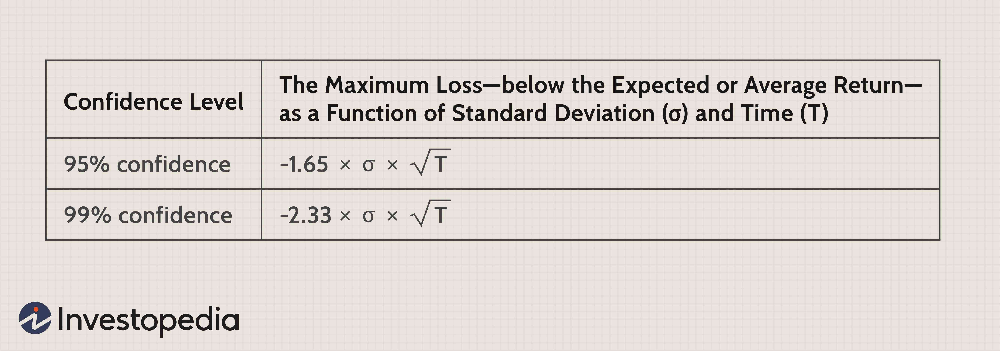

## Table of Contents

## What is conversion value?

Conversion value is a way to measure how much a customer is worth to a business. It looks at how much money a business makes from a customer when they take a specific action, like buying something or signing up for a service. This helps businesses understand which actions are most valuable and how to encourage more of those actions.

For example, if a customer buys a product that costs $50, the conversion value of that purchase is $50. If a business knows that certain actions lead to higher conversion values, they can focus on getting more customers to take those actions. This can help the business make more money and grow.

## Why is conversion value important in marketing?

Conversion value is important in marketing because it helps businesses understand which actions by customers are most valuable. When a business knows the conversion value of different actions, like buying a product or signing up for a newsletter, they can focus on encouraging the actions that bring in the most money. This helps the business use its marketing budget more effectively, making sure they spend money on the things that will bring the best results.

By tracking conversion value, businesses can also see which marketing strategies are working well and which ones need to be changed. For example, if a business finds that customers who come from social media ads have a higher conversion value than those from email campaigns, they might decide to spend more on social media ads. This way, the business can keep improving its marketing efforts and make more money over time.

## How is conversion value calculated?

Conversion value is calculated by figuring out how much money a business makes when a customer does a specific action. For example, if a customer buys a product that costs $50, the conversion value of that purchase is $50. If a customer signs up for a subscription that costs $10 a month, the conversion value could be $10 for that month, or more if you consider the total value over the expected length of the subscription.

To calculate the conversion value, you need to track the actions customers take and the money those actions bring in. If a business runs an ad campaign and 100 people buy a $50 product because of it, the total conversion value from that campaign is $5,000. By keeping an eye on these numbers, businesses can see which actions and campaigns are most valuable and adjust their strategies to focus on what works best.

## What are some common metrics used to measure conversion value?

Some common metrics used to measure conversion value are the total revenue from sales, the average order value, and the customer lifetime value. Total revenue from sales is simply the amount of money made from all the sales during a certain time. Average order value shows how much money people spend on average when they buy something. Customer lifetime value looks at how much money a customer will bring in over their whole relationship with the business.

Another important metric is the conversion rate, which is the percentage of people who take a specific action, like buying a product or signing up for a newsletter. By knowing the conversion rate and the value of each conversion, a business can figure out the total conversion value. For example, if 10% of visitors to a website buy a $50 product, and 1,000 people visit the site, the conversion value would be $5,000. These metrics help businesses understand which actions are most valuable and how to make the most of their marketing efforts.

## Can conversion value vary across different industries?

Yes, conversion value can vary a lot across different industries. In some industries, like retail, the conversion value might be the price of the product someone buys. For example, if someone buys a shirt for $20, the conversion value is $20. In other industries, like software, the conversion value might be the cost of a subscription, which could be $10 a month or $100 a year.

In industries like real estate, the conversion value can be much higher because the products, like houses, are more expensive. If someone buys a house for $300,000, the conversion value of that sale is $300,000. On the other hand, in industries like online services, the conversion value might be lower but can add up over time. For example, if someone signs up for a $5 monthly service, the conversion value is $5 each month, but it can grow if the person stays subscribed for a long time.

## How does conversion value impact business strategy?

Conversion value helps businesses decide what to focus on to make more money. When a business knows which actions, like buying a product or signing up for a service, bring in the most money, they can spend their time and money on getting more people to do those things. This can mean changing their marketing to focus on ads that work better or making their website easier to use so more people buy things. By knowing the conversion value, a business can make smart choices about where to spend their money and how to grow.

For example, if a business finds out that people who come from social media ads spend more money than people who come from email campaigns, they might decide to spend more on social media ads. This way, they can get more customers to take the actions that bring in the most money. By always looking at the conversion value, a business can keep improving its strategies and make sure they are doing what works best to make more money and grow.

## What are the differences between conversion value and conversion rate?

Conversion value and conversion rate are both important for businesses, but they measure different things. Conversion value is about how much money a business makes when a customer does something, like buying a product or signing up for a service. If someone buys a $50 product, the conversion value of that action is $50. It helps businesses see which actions are most valuable and how to make more money.

Conversion rate, on the other hand, is about how many people do a certain action. It's a percentage that shows how many out of all the people who visit a website or see an ad actually do what the business wants them to do, like making a purchase. For example, if 100 people visit a website and 10 of them buy something, the conversion rate is 10%. While conversion value focuses on the money made from each action, conversion rate focuses on how often people take that action. Both are important for a business to understand and use to make better decisions.

## How can businesses optimize for higher conversion values?

Businesses can optimize for higher conversion values by focusing on actions that bring in more money. They can do this by looking at which products or services make the most money and then making it easier for customers to buy those things. For example, if a business finds out that people who buy a certain product spend more money, they might put that product on the front page of their website or make special deals to get more people to buy it. They can also use ads that show up to people who are most likely to spend a lot of money, making sure their marketing money is spent in the best way.

Another way to optimize for higher conversion values is by making the buying process easier and more enjoyable for customers. If a website is hard to use, people might leave without buying anything. But if it's easy to use, more people will buy things, which can increase the conversion value. Businesses can also offer good customer service and follow up with customers after they buy something to make sure they are happy and might buy more things in the future. By always looking at what works and what doesn't, businesses can keep making changes to get higher conversion values and make more money.

## What role does customer lifetime value play in understanding conversion value?

Customer lifetime value (CLV) is how much money a business can expect to make from a customer over time. It's important because it helps businesses see the big picture of how much a customer is worth, not just what they spend on one purchase. When a business knows the CLV, they can understand the conversion value better. For example, if a customer buys a $10 product, the conversion value of that purchase is $10. But if that customer keeps coming back and spends $100 over a year, the CLV is $100, which makes the overall conversion value higher.

By looking at CLV, businesses can make better decisions about how to spend their money on marketing and how to treat their customers. If a business knows that customers who buy a certain product are likely to spend a lot more money over time, they might focus on selling that product more. This can help increase the conversion value not just for one sale, but for all the future sales from that customer. Understanding CLV helps businesses see the long-term value of their customers and make smarter choices to grow their business.

## How do advanced analytics tools enhance the measurement of conversion value?

Advanced analytics tools help businesses measure conversion value better by giving them a lot of detailed information. These tools can track what customers do on a website, like which pages they visit and what they click on. They can also see how customers act after they see an ad or get an email. By looking at all this information, businesses can figure out which actions lead to the most money and focus on those actions. For example, if the tools show that people who watch a certain video on the website are more likely to buy something, the business can make sure more people see that video.

These tools also help businesses see patterns and make predictions. They can use special math to guess how much money a customer might spend in the future, which is called customer lifetime value. By knowing this, businesses can see the bigger picture of how much a customer is worth, not just what they spend on one purchase. This helps them understand the true conversion value of different actions. With all this information, businesses can make smarter choices about where to spend their money and how to make their customers happier, which can lead to more sales and more money over time.

## What are the challenges in accurately tracking conversion value?

Tracking conversion value can be hard because there are many things that can make the numbers not right. One big problem is that it can be tough to know which action made someone buy something. For example, a person might see an ad on social media, then later see another ad on a website, and finally decide to buy something after getting an email. It's hard to say which of those things was the most important in making the sale happen. Also, if a business has a lot of different ways to sell things, like in a store, on a website, and through an app, it can be tricky to keep track of all the sales and figure out the conversion value for each way.

Another challenge is that people don't always do what businesses expect. Someone might sign up for a newsletter but not buy anything for a long time, or they might buy something but then return it. These things can make it hard to know the real conversion value. Plus, businesses need good tools and people who know how to use them to track everything right. If the tools don't work well or if the people using them make mistakes, the numbers can be wrong. It's important for businesses to keep working on these problems so they can understand the conversion value better and make good choices.

## How can machine learning be applied to predict and improve conversion values?

Machine learning can help businesses guess and make better conversion values by looking at a lot of data and finding patterns. For example, machine learning can look at what customers do on a website, like which pages they visit and what they click on, and then guess which customers are more likely to buy something. It can also look at things like how much a customer has spent before, what they bought, and how they found the website. By using this information, machine learning can help businesses show the right ads or make special deals for the customers who are most likely to spend a lot of money, which can make the conversion value go up.

Another way machine learning helps is by making the buying process easier for customers. It can look at what makes people leave a website without buying anything and then suggest changes to make the website easier to use. For example, if machine learning sees that a lot of people leave when they get to the checkout page, it might suggest making that page simpler. By making these changes, more people might buy things, which can increase the conversion value. Machine learning keeps learning from new data, so it can keep making the website and the business better over time.

## What is the importance of understanding business metrics in digital marketing?

Business metrics are vital quantifiable measures utilized to evaluate the success and efficiency of marketing strategies in the digital landscape. These metrics offer invaluable insights into critical areas such as website traffic, lead generation, and customer engagement.

Website traffic metrics assess the [volume](/wiki/volume-trading-strategy) and quality of visitors to a site, providing data on page views, unique visits, and session duration. Tools like Google Analytics are frequently employed to monitor these metrics, helping businesses understand user behavior and identify popular content or entry points on their website.

Lead generation metrics gauge the effectiveness of marketing efforts in attracting and converting potential customers. Important data points include the number of new leads, cost per lead, and lead conversion rate. These metrics are crucial for determining the efficiency of marketing campaigns and optimizing strategies for improved performance.

Customer engagement metrics examine how users interact with content, products, or services, measuring factors such as click-through rates, social media interactions, and email open rates. High engagement levels typically indicate that a brand's messaging resonates well with its audience and can lead to increased loyalty and retention.

Conversion rates, a key metric, reveal the percentage of visitors completing a desired action, such as making a purchase or signing up for a newsletter. This metric is pivotal in understanding how well marketing efforts convert prospects into customers. It's calculated as:

$$
\text{Conversion Rate} = \left(\frac{\text{Number of Conversions}}{\text{Total Visitors}}\right) \times 100
$$

Customer lifetime value (CLV) measures the total revenue a business can expect from a single customer account throughout their relationship. This metric is essential for businesses to estimate long-term profitability and tailor their strategies to increase customer retention. CLV is generally calculated using:

$$
\text{CLV} = \text{Average Purchase Value} \times \text{Average Purchase Frequency Rate} \times \text{Customer Lifespan}
$$

Return on investment (ROI) is another critical metric that determines the profitability of marketing strategies. It assesses the gain or loss generated relative to the cost of campaigns. The formula for ROI is:

$$
\text{ROI} = \left(\frac{\text{Net Profit}}{\text{Marketing Costs}}\right) \times 100
$$

By mastering and continuously analyzing these metrics, businesses can refine their digital marketing strategies to achieve superior outcomes. Tracking these metrics is essential for staying competitive in the digital-first world, as it allows businesses to make informed decisions, allocate resources effectively, and drive strategic growth.

## What is the Role of Conversion Value in Marketing Strategies?

Conversion value is a crucial metric in evaluating the worth of digital marketing efforts. It signifies the monetary benefit obtained by a business when a consumer performs a desired action, such as making a purchase, subscribing to a newsletter, or downloading an app. By comprehending conversion value, marketers are better positioned to assess and refine their campaigns, ultimately driving efficiency and effectiveness in digital marketing strategies.

To calculate conversion value, marketers need to consider several key factors. Average Order Value (AOV) is a fundamental component, representing the average monetary amount spent each time a customer places an order. Cost Per Acquisition (CPA) is another critical metric, detailing the cost incurred to acquire a customer via marketing campaigns. The final conversion rate is equally important, quantifying the percentage of visitors who complete a desired action out of the total number of visitors.

An effective approach to quantify conversion value can be expressed using the formula:

$$
\text{Conversion Value} = \text{Average Order Value} \times \text{Conversion Rate}
$$

For more granular analysis, incorporating CPA gives a clearer profitability picture:

$$
\text{Net Conversion Value} = (\text{Average Order Value} \times \text{Conversion Rate}) - \text{Cost Per Acquisition}
$$

Optimization of conversion value is essential for ensuring better resource allocation and achieving higher profitability. By aligning marketing strategies with these calculations, businesses can prioritize channels, allocate budgets more efficiently, and focus on initiatives that offer the greatest financial return. Optimizing conversion involves A/B testing, personalized marketing, and enhancing the user experience to increase conversion rates.

Ultimately, mastering conversion value enables businesses to make informed decisions that enhance return on investment and foster sustainable growth. By systematically evaluating and improving their strategies, businesses can leverage conversion value not only as a performance metric but also as a strategic tool for marketing success.

## References & Further Reading

[1]: Bergstra, J., Bardenet, R., Bengio, Y., & Kégl, B. (2011). ["Algorithms for Hyper-Parameter Optimization."](https://dl.acm.org/doi/10.5555/2986459.2986743) Advances in Neural Information Processing Systems 24.

[2]: ["Advances in Financial Machine Learning"](https://www.amazon.com/Advances-Financial-Machine-Learning-Marcos/dp/1119482089) by Marcos Lopez de Prado

[3]: ["Evidence-Based Technical Analysis: Applying the Scientific Method and Statistical Inference to Trading Signals"](https://www.amazon.com/Evidence-Based-Technical-Analysis-Scientific-Statistical/dp/0470008741) by David Aronson

[4]: ["Machine Learning for Algorithmic Trading"](https://github.com/stefan-jansen/machine-learning-for-trading) by Stefan Jansen

[5]: ["Quantitative Trading: How to Build Your Own Algorithmic Trading Business"](https://www.amazon.com/Quantitative-Trading-Build-Algorithmic-Business/dp/1119800064) by Ernest P. Chan