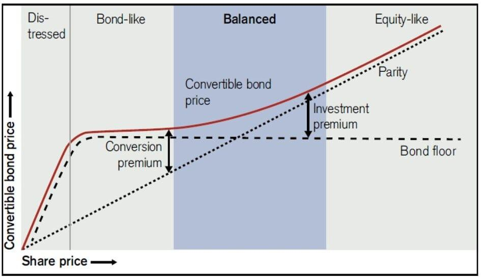

## Table of Contents

## What is convertible arbitrage?

Convertible arbitrage is a trading strategy that involves buying a convertible security, like a convertible bond or preferred stock, and simultaneously selling short the underlying common stock. The goal is to profit from the price difference between the convertible security and the stock. This strategy is often used by hedge funds and other institutional investors who aim to exploit pricing inefficiencies in the market.

The key idea behind convertible arbitrage is that the convertible security can be converted into a certain number of shares of the underlying stock at a set price. If the stock price rises, the value of the convertible security should increase as well. By short selling the stock, the investor can hedge against potential losses if the stock price falls. The strategy relies on the belief that the convertible security is undervalued relative to the stock, and that over time, the prices will converge, allowing the investor to make a profit.

## How does convertible arbitrage work?

Convertible arbitrage is a way to make money by taking advantage of price differences between a convertible security and the stock it can be turned into. Imagine you buy a convertible bond, which can be swapped for shares of a company's stock. At the same time, you sell short those same shares. This means you borrow the shares and sell them, hoping to buy them back later at a lower price to return to the lender. The idea is that the bond might be cheaper than what it's worth if you consider it can turn into stock.

The strategy works because the convertible bond and the stock should have a relationship in price. If the stock goes up, the bond should go up too because it can be converted into that stock. By short selling the stock, you protect yourself if the stock price drops. The goal is to make a profit from the difference in price between the bond and the stock. If the bond is undervalued compared to the stock, over time, the prices should get closer together, and you can make money from that movement.

## What are the key components of a convertible security?

A convertible security is a type of investment that can be changed into a certain number of shares of a company's stock. This can be done at a specific price, known as the conversion price. The most common types of convertible securities are convertible bonds and convertible preferred stocks. A convertible bond is a bond that can be turned into stock, while a convertible preferred stock is a type of stock that can be exchanged for common stock.

The key parts of a convertible security include the conversion ratio, which tells you how many shares you get for each unit of the security, and the conversion price, which is the price at which the security can be converted into stock. Another important part is the conversion premium, which is how much more you pay for the convertible security compared to just buying the stock directly. These elements help investors decide if the convertible security is a good deal and when it might be best to convert it into stock.

## What are the main strategies used in convertible arbitrage?

Convertible [arbitrage](/wiki/arbitrage) involves buying a convertible security, like a bond or preferred stock, and selling short the underlying common stock. The main idea is to make money from the difference in price between the convertible security and the stock. One common strategy is called delta-neutral hedging. This means that the investor tries to balance the positions so that small changes in the stock price don't affect the overall value of the investment. They do this by adjusting the number of shares they short sell based on how the stock and the convertible security move in relation to each other.

Another strategy used in convertible arbitrage is gamma trading. This involves making small adjustments to the position as the stock price changes. When the stock price goes up, the investor might sell more shares short, and when it goes down, they might buy back some of the shares they sold short. This helps them take advantage of the price movements and make more profit. Both delta-neutral hedging and gamma trading require close monitoring of the market and quick adjustments to the positions to be successful.

## What are the risks associated with convertible arbitrage?

Convertible arbitrage can be risky because it involves buying a convertible security and selling short the underlying stock. One big risk is that the stock price might move in a way that the investor didn't expect. If the stock price goes up a lot, the short position can lose money quickly. On the other hand, if the stock price drops a lot, the convertible security might not be worth as much as the investor hoped. This means the investor could lose money on both sides of the trade.

Another risk is that the market might not behave as expected. Sometimes, the price difference between the convertible security and the stock doesn't close like the investor thought it would. This can happen if there are big changes in the market or if the company's situation changes. Also, convertible arbitrage often involves borrowing money to make the trades, which adds more risk. If the investment doesn't go well, the investor might owe more money than they can pay back.

## How do market conditions affect convertible arbitrage strategies?

Market conditions play a big role in how well convertible arbitrage strategies work. When the market is calm and predictable, it's easier for investors to make money from the small price differences between convertible securities and stocks. In these conditions, the prices tend to move in ways that are easier to predict, which makes it simpler to balance the positions and make a profit. But if the market is very volatile, with big ups and downs, it can be hard to keep the positions balanced. The quick changes in stock prices can cause big losses on the short side of the trade, making it riskier to use convertible arbitrage.

Another thing that affects convertible arbitrage is the overall mood of the market. When investors feel good about the market and are buying a lot, the demand for convertible securities might go up, which can change the price differences that arbitrageurs are trying to take advantage of. On the other hand, if investors are worried and selling off their investments, the prices of convertible securities and stocks can move in unexpected ways, making it harder to make money from arbitrage. So, understanding and keeping an eye on market conditions is really important for anyone using convertible arbitrage strategies.

## What role does delta hedging play in convertible arbitrage?

Delta hedging is a key part of convertible arbitrage. It helps balance the risk between the convertible security and the stock that's been sold short. When you do convertible arbitrage, you buy a convertible bond or preferred stock and at the same time, you sell short the company's stock. The idea is to make money from the difference in price between these two things. Delta hedging means you keep adjusting how many shares you've sold short, so that small changes in the stock price don't mess up your overall investment. The "delta" is a number that shows how much the price of the convertible security changes when the stock price changes. By keeping the delta close to zero, you're trying to make sure that the ups and downs in the stock price don't hurt your investment too much.

This balancing act is important because it helps protect your investment from big losses. If the stock price goes up a lot, you might lose money on the shares you've sold short. But if you've been delta hedging correctly, the increase in the value of your convertible security should help cover those losses. On the other hand, if the stock price goes down, the value of your convertible security might not go up as much as you hoped, but your short position could make money. Delta hedging lets you keep tweaking your position to stay safe from these ups and downs, making convertible arbitrage a bit less risky.

## How is gamma trading utilized in convertible arbitrage?

Gamma trading is a way to make money in convertible arbitrage by making small changes to the investment as the stock price moves. When you do convertible arbitrage, you buy a convertible security and sell short the stock. Gamma trading means you keep adjusting how many shares you've sold short, based on how the stock price is changing. If the stock price goes up, you might sell more shares short. If it goes down, you might buy back some of the shares you sold short. This helps you take advantage of the price movements and make more profit.

The idea behind gamma trading is to use the changes in the stock price to your advantage. The "gamma" is a number that shows how much the delta (the relationship between the convertible security and the stock) changes when the stock price changes. By keeping an eye on the gamma and making quick adjustments, you can make more money from the small ups and downs in the stock price. This strategy needs you to watch the market closely and be ready to make changes fast, but it can help you make more from your convertible arbitrage investment.

## What are the typical performance metrics for evaluating convertible arbitrage?

When people want to see how well convertible arbitrage is doing, they look at a few main things. One big thing is the return on investment, which is how much money the strategy makes compared to how much money was put into it. Another thing they look at is the Sharpe ratio, which tells you how much extra return you're getting for the risk you're taking. If the Sharpe ratio is high, it means the strategy is doing a good job of making money without taking too much risk. They also look at the [volatility](/wiki/volatility-trading-strategies), which is how much the returns go up and down. If the returns are very steady, that's a good sign.

Another important thing to look at is the drawdown, which is the biggest drop in value the investment has seen. A smaller drawdown means the strategy is less risky. People also pay attention to the alpha, which shows how much better the strategy is doing compared to the market. If the alpha is positive, it means the strategy is beating the market. All these things together help people figure out if convertible arbitrage is working well and if it's worth the risk.

## How do regulatory changes impact convertible arbitrage?

Regulatory changes can have a big effect on convertible arbitrage. When rules about trading or borrowing money change, it can make it harder or easier to use this strategy. For example, if new rules make it tougher to sell stocks short, that can make convertible arbitrage riskier because one part of the strategy is selling short the stock. Also, if there are new rules about how much money you can borrow to make trades, that can change how much you can invest in convertible arbitrage. So, keeping up with regulatory changes is important for anyone doing convertible arbitrage.

These changes can also affect how much money you can make from convertible arbitrage. If the rules make the market more stable, that might help because convertible arbitrage works best in calm markets. But if new rules make the market more unpredictable, it can be harder to make money. Sometimes, regulatory changes can even create new opportunities for arbitrage if they cause price differences between convertible securities and stocks. So, understanding how new rules might change the market is key to doing well with convertible arbitrage.

## What advanced techniques can be used to enhance returns in convertible arbitrage?

One way to make more money from convertible arbitrage is by using something called dynamic hedging. This means you keep changing how many shares you've sold short, depending on how the stock price is moving. If the stock price goes up, you might sell more shares short, and if it goes down, you might buy back some of the shares you sold short. This helps you take advantage of the small ups and downs in the stock price, making your investment more profitable. It requires watching the market closely and making quick changes, but it can help you earn more from your convertible arbitrage strategy.

Another advanced technique is to use options in your convertible arbitrage strategy. Options are contracts that give you the right to buy or sell a stock at a certain price. By adding options to your strategy, you can protect yourself from big losses if the stock price moves in a way you didn't expect. For example, you can buy put options to protect against the stock price dropping too much. This can make your convertible arbitrage safer and potentially more profitable. Using options takes some extra work and understanding, but it can be a good way to improve your returns.

## How can one build a diversified portfolio using convertible arbitrage strategies?

Building a diversified portfolio using convertible arbitrage strategies involves spreading your investments across different companies and industries. This helps reduce the risk that comes with focusing too much on one stock or sector. You can start by choosing convertible securities from different companies in various sectors like technology, healthcare, and finance. This way, if one sector does poorly, the others might do better, balancing out your overall returns. It's also a good idea to look at companies of different sizes, from big corporations to smaller firms, to spread your risk even more.

Another way to diversify your convertible arbitrage portfolio is to use different strategies within the arbitrage itself. For example, you can use delta-neutral hedging for some of your investments and gamma trading for others. Delta-neutral hedging helps keep your investment balanced against small changes in the stock price, while gamma trading lets you take advantage of bigger price movements. By mixing these strategies, you can better handle different market conditions. Plus, you can adjust your positions over time as the market changes, making sure your portfolio stays diversified and strong.

## What is the Role of Delta-Neutral Strategies?

Delta-neutral strategies play a pivotal role in convertible arbitrage by aiming to eliminate directional market risk associated with the underlying stock movements. This approach intends to balance the portfolio such that the net delta, or the sensitivity of the portfolio to a small change in the price of the underlying stock, is close to zero. Here's a deeper look into how these strategies function and their significance.

### Delta-Neutral and Market-Neutral Ratios

The concept of delta-neutral revolves around neutralizing the delta, which measures how much the price of a derivative, like a convertible bond, is expected to move per one-unit change in the price of the underlying security. By constructing a portfolio that has a cumulative delta of zero, an investor effectively shields the investment from minor price swings in the underlying stock. This is achieved by adjusting positions such that any gain or loss in the convertible bond is offset by an equal and opposite movement in the stock position.

### Importance of Maintaining a Market-Neutral Position

Dynamic delta hedging is essential for maintaining a market-neutral stance, thereby mitigating the risk of adverse price movements. Since the delta of a convertible bond changes with varying market conditions, such as changes in stock price volatility or time decay, it's crucial to regularly adjust the number of shares shorted or owned to keep the portfolio market-neutral. This involves continuously recalculating the delta and subsequently executing trades that rebalance the portfolio to a delta of zero.

### Rebalancing Transactions and Return Contributions

Rebalancing transactions are integral to convertible arbitrage strategy and can significantly contribute to its returns. These trades are not merely defensive maneuvers; they inherently add value to the arbitrage strategy. By frequently adjusting the portfolio's delta through buying or selling of shorted stock, arbitrageurs can capture profits from the changing deltas of the convertible bonds, which include the benefits of time decay and changes in implied volatility.

Here's a simple formula representation:

$$
\Delta_{\text{Portfolio}} = \Delta_{\text{Convertible Bond}} \times \text{Number of Bonds} + \Delta_{\text{Stock}} \times \text{Number of Shares}
$$

Setting $\Delta_{\text{Portfolio}} = 0$ enables the strategy to be truly delta-neutral, and this equation must be recalibrated continuously. Dynamic hedging is not just about responding reactively but anticipating changes that could affect the delta to strategically position the portfolio.

By focusing on maintaining a precise balance in their holdings through dynamic hedging strategies, convertible arbitrageurs can enhance strategy resilience, thus leading to steadier returns despite the inherent market volatilities.

## References & Further Reading

[1]: Ammann, M., Kind, A., & Wilde, C. (2003). ["Are convertible bonds underpriced? An analysis of the French market."](https://www.sciencedirect.com/science/article/pii/S0378426601002564)00213-X) European Economic Review, 47(7), 1153-1171.

[2]: Calamos, N. P. (2003). ["Convertible Arbitrage: Insights and Techniques."](https://www.amazon.com/Convertible-Arbitrage-Insights-Techniques-Successful/dp/0471423610) John Wiley & Sons.

[3]: Lhabitant, F. S. (2002). ["Hedge Funds: Myths and Limits."](https://archive.org/details/hedgefundsmythsl0000lhab) John Wiley & Sons.

[4]: Lewis, C. M., Rogalski, R. J., & Seward, J. K. (2001). Convertible debt issuance, capital structure change, and financing-related information. Journal of Financial Economics, 56(2), 269-290.

[5]: Agarwal, V., Fung, W., Loon, Y. C., & Naik, N. Y. (2007). ["Risk and Return in Convertible Arbitrage: Evidence from the Convertible Bond Market."](https://www.econstor.eu/bitstream/10419/57723/1/699917603.pdf) The Journal of Finance, 62(3), 1369-1403.

[6]: McDonald, R. L. (2006). ["Derivatives Markets (2nd Edition)."](https://archive.org/details/derivativesmarke0000mcdo_e5u9) Addison Wesley.

[7]: Fabozzi, F. J., Modigliani, F., Jones, F. J., & Ferri, M. G. (2009). Foundations of Financial Markets and Institutions (4th Edition). Pearson.