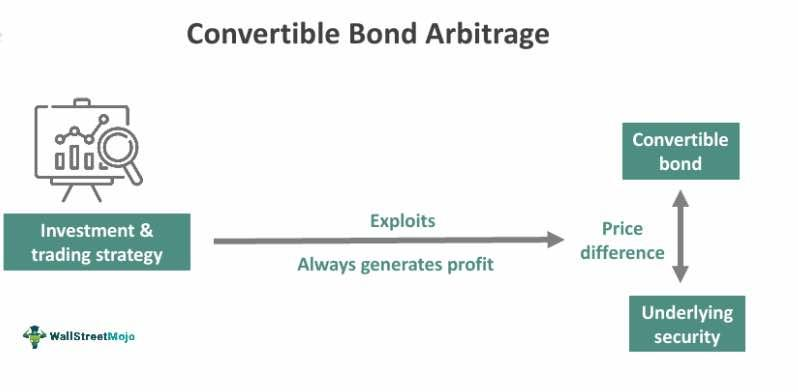

In finance, arbitrage strategies are essential for capitalizing on market inefficiencies, offering investors the potential for profit with minimal risk. Convertible bond arbitrage stands out as a sophisticated strategy blending the characteristics of equity and debt markets. This dual nature stems from convertible bonds themselves, which combine the fixed income aspect of bonds with an embedded option to convert into equity. Consequently, this strategy offers unique opportunities to hedge funds and experienced investors seeking to exploit pricing inefficiencies between convertible bonds and their underlying stocks.

Convertible bonds present myriad strategic possibilities due to their hybrid nature. They offer the security of bond-like steady returns while providing the potential upside of stock market gains through conversion options. Investors and hedge funds leverage these features to orchestrate trades that are positioned to profit regardless of general market direction—a market-neutral stance that is particularly attractive during turbulent times. 

The strategy involves purchasing convertible securities while simultaneously short selling the underlying stock of the same issuer. This dual transaction aims to capitalize on discrepancies in pricing, which arise due to market volatility, fluctuations in credit spreads, or changes in interest rates. Success in this domain necessitates a thorough understanding of the bond's pricing and the ability to dynamically adjust hedges to maintain a delta-neutral position, which minimizes sensitivity to market movements.

Algorithmic trading plays a pivotal role in enhancing the efficiency and precision of convertible bond arbitrage strategies. Through automation, algorithms can swiftly detect arbitrage opportunities, optimize hedge ratios, and facilitate timely rebalancing, thus reducing human error and operational latency. The result is an optimized process that enhances the strategy's potential for consistent returns.

In summary, convertible bond arbitrage exemplifies a unique confluence of debt and equity investment opportunities that, when paired with technological advancements like algorithmic trading, offers sophisticated investors the tools to potentially achieve substantial gains. Readers will uncover the intricacies of this strategy, understanding not only its mechanisms but also the potential risks and rewards associated with its implementation in ever-evolving financial markets.

## Table of Contents

## What is Convertible Bond Arbitrage?

Convertible bond arbitrage is a sophisticated investment strategy employed by hedge funds and experienced investors to exploit pricing inefficiencies between a company's convertible bonds and its common stock. This market-neutral strategy is designed to generate consistent returns by capitalizing on mispricings, particularly in volatile market environments.

Convertible bonds are unique financial instruments that combine features of both debt and equity. They offer the fixed income benefits of traditional bonds, such as regular coupon payments, while also providing the option to convert the bond into a specified number of the issuer's common shares. This hybrid nature creates opportunities for [arbitrage](/wiki/arbitrage).

The core of the convertible bond arbitrage strategy involves purchasing convertible bonds and simultaneously short selling the corresponding common stock of the same issuer. The rationale behind this approach is to profit from the mispricing between the convertible bond and the stock. By taking a long position in the convertible bond, investors position themselves to benefit from bond price appreciation and the potential equity conversion if the stock rises significantly. Conversely, the short position in the stock acts as a hedge against market downturns, insulating the strategy from potential declines in stock price.

A key aspect of successful convertible bond arbitrage is the dynamic hedge used to maintain market neutrality. This involves continuously adjusting the hedge ratio to offset changes in the bond's delta, which measures the sensitivity of the bond's price to movements in the underlying stock price. The hedge ratio is calculated to ensure that the portfolio remains delta-neutral, meaning that its overall exposure to stock price movements is minimized. This requires constant monitoring and rebalancing to mitigate the impact of market [volatility](/wiki/volatility-trading-strategies).

$$
\text{Hedge Ratio} = \frac{\Delta_{\text{Convertible}}\times \text{Number of Convertible Bonds}}{\Delta_{\text{Stock}}\times \text{Number of Shares}}
$$

In practice, investors and hedge funds deploy convertible bond arbitrage strategies by analyzing a wide array of market factors, including interest rates, credit spreads, and stock volatility. These elements can influence the pricing of convertible bonds and their underlying stocks, presenting opportunities for arbitrage. The strategy's effectiveness is heightened during periods of market volatility, where discrepancies between bond and stock valuations are more pronounced.

While convertible bond arbitrage can provide consistent returns across different market conditions, it requires a robust understanding of the underlying financial mechanisms and a vigilant approach to risk management. By efficiently managing the dynamics between convertible bonds and stocks, investors can unlock valuable opportunities for profit realization.

## Mechanics of the Strategy

Convertible bond arbitrage is a strategy that hinges upon the simultaneous trading of convertible bonds and the associated underlying stocks. At its core, this process involves purchasing convertible bonds—a type of debt security that grants the holder the option to convert into a predetermined number of the issuer's shares—and short selling the issuer's common stock. This duo aims to exploit pricing inefficiencies between the convertible security and its underlying equity, thereby capitalizing on the varying movements in the market value of these instruments.

The long position in convertible bonds offers investors potential price appreciation benefits. These arise from the embedded option to convert the bonds into equity if the share price exceeds the conversion threshold. Consequently, the amount by which the convertible bond's value may increase is influenced by factors such as the issuer's credit quality, current interest rates, and market volatility.

Conversely, the short position in the underlying stock acts as a hedge against equity risk. By short selling the stock, the investor creates a market-neutral stance, designed to shield the portfolio from broad market movements. This strategy mitigates the risk of adverse market changes that could impact the value of the holdings.

A critical aspect of successful execution is maintaining a delta-neutral position. Delta ($\Delta$) represents the sensitivity of the convertible bond's price to changes in the price of the underlying stock. To achieve delta neutrality, the investor adjusts the quantity of stock being shorted in response to fluctuations in the stock price. This ensures that the portfolio remains insulated from directional market movements.

$$
\text{Delta Neutrality Condition:} \quad \Delta_{\text{bond}} \times \text{Quantity of Bonds} + \Delta_{\text{stock}} \times \text{Quantity of Stock} = 0
$$

Maintaining this neutral position mandates continuous market monitoring and frequent rebalancing to counteract shifts in the underlying stock's delta value. Key success factors include accurately determining the hedge ratio—a measure of how much of the stock needs to be shorted per unit of convertible bond held—and executing timely adjustments in alignment with changing market conditions.

Effective management of these components demands not only a precise understanding of the market dynamics and the instruments involved but also a readiness to adapt to the rapid changes characteristic of financial markets.

## Risks and Challenges

Convertible bond arbitrage, while potentially lucrative, involves several risks and challenges that investors must carefully manage. One of the primary risks is the unpredictable nature of market inefficiencies that provide the foundation for arbitrage opportunities. The assumption that these inefficiencies will correct over time may not always hold true, leading to potential losses if the anticipated convergence does not occur.

Interest rate fluctuations can significantly impact the performance of convertible bond arbitrage strategies. Higher interest rates can decrease the value of bonds due to increased discount rates, while rising interest rates may also affect the pricing of the underlying stock, complicating hedging efforts. Additionally, changes in credit risk can alter bond valuations, as the perceived risk of default influences investor demand and pricing.

Shifts in stock prices present another challenge. As the value of the underlying equity changes, so does the conversion value of the convertible bonds. This price movement necessitates adjustments to the short position in the associated stock to maintain a delta-neutral position. A delta-neutral position aims to ensure that the portfolio's overall sensitivity to small price changes in the underlying asset is minimized. However, recalibrating this position can incur transaction costs, which may erode overall returns.

Historical challenges have highlighted systemic risks and [liquidity](/wiki/liquidity-risk-premium) constraints that can affect strategy execution, particularly during market downturns. During such periods, liquidity can dry up, making it difficult to execute trades at desired prices or to [exit](/wiki/exit-strategy) positions swiftly. This lack of market liquidity can exacerbate losses if investors cannot adjust their hedges in response to rapid market movements.

Furthermore, maintaining a delta-neutral position is a dynamic process that requires frequent monitoring and adjustments. The hedge ratio, which determines the proportion of the stock to be shorted relative to the bonds held, must be regularly re-evaluated as market conditions change. This rebalancing not only involves operational complexity but also incurs additional transaction costs, which can impact net profitability.

In conclusion, while convertible bond arbitrage offers the allure of potentially attractive returns, managing these risks effectively requires a deep understanding of market dynamics, precision in execution, and a proactive approach to risk management. Investors must be prepared to navigate these challenges to maximize the strategy's potential benefits.

## Algorithmic Trading in Convertible Bond Arbitrage

Algorithmic trading is integral to optimizing convertible bond arbitrage strategies, significantly enhancing execution efficiency. The primary advantage of employing algorithms is their ability to rapidly identify and act upon arbitrage opportunities, which arise from pricing discrepancies between convertible bonds and their underlying securities. These algorithms deploy complex mathematical models to evaluate potential trades, aiming to achieve a balance between risk and reward.

One crucial function of algorithms in this context is optimizing hedge ratios. Hedge ratios represent the proportion of a position in one financial instrument to that of another, which offsets the risk associated with price movements. Algorithms can quickly adjust these ratios in response to fluctuating market conditions, thereby maintaining a delta-neutral position. This approach minimizes exposure to market volatility and price movements of the underlying stock. 

Timely rebalancing of positions is another significant contribution of [algorithmic trading](/wiki/algorithmic-trading). The dynamic nature of financial markets means that price disparities can change rapidly, necessitating swift adjustments to maintain an effective hedge. Algorithms can execute these adjustments with high speed and precision, often outpacing human capabilities. This rapid execution not only reduces the risk of adverse price movements impacting the arbitrage strategy but also enhances the opportunity to capture profits.

Automation significantly reduces the scope for human error, which can be prevalent in manual trading strategies. It streamlines the execution process, ensuring consistency and speed. Automated systems monitor multiple securities and execute trades based on pre-defined parameters or real-time analytics. This level of efficiency is critical in a strategy that relies on minor price differences, where delays can erode potential profits.

Advanced modeling techniques further empower algorithmic trading systems. These models can incorporate diverse data sources and variables, such as interest rates, credit spreads, and market volatility, improving risk management and strategic decision-making. Machine learning and statistical models enable these systems to adapt and evolve, learning from historical data to improve future performance. Such adaptability is crucial in navigating the complexities and uncertainties of the financial markets, allowing for strategic adjustments based on predictive insights.

The intersection of quantitative finance and technology is epitomized by algorithmic trading in convertible bond arbitrage, where precision and efficiency are paramount. As algorithms become more sophisticated and data analytics capabilities continue to advance, the potential for enhanced profitability from arbitrage strategies grows, underscoring the essential role of technology in modern finance.

## Conclusion

Convertible bond arbitrage represents a distinct synergy between debt and equity investments, offering investors opportunities to benefit from mispricings in the financial markets. At the core of this strategy is the accurate identification of these mispricings and the implementation of effective hedging techniques. By purchasing convertible bonds and simultaneously short selling the underlying equities, investors seek to exploit price discrepancies. This creates a market-neutral stance that can yield profits irrespective of broader market movements. 

Algorithmic trading plays a pivotal role in enhancing the execution of convertible bond arbitrage. Sophisticated algorithms enable the swift identification of arbitrage opportunities and facilitate the precise optimization of hedge ratios, thus optimizing the efficiency of these operations. Automation in trading not only reduces human error but also significantly speeds up the execution process, potentially leading to increased returns.

Despite its promising prospects, the strategy entails substantial requirements. Profiting from convertible bond arbitrage necessitates a profound understanding of both market mechanics and the unique attributes of convertible securities. This expertise is critical in adapting the strategy to fluid market conditions, such as fluctuating interest rates or evolving credit risks. Furthermore, maintaining a dynamic and delta-neutral position requires continual monitoring and adjustments, which can lead to transaction costs and necessitate advanced risk management skills.

Ultimately, convertible bond arbitrage underscores the evolving landscape of [hedge fund](/wiki/hedge-fund-trading-strategies) strategies. Its appeal endures, bolstered by its potential to generate returns independent of market direction—a characteristic highly valued in today's volatile financial environment. This strategy not only exemplifies the intersection of quantitative finance and technology but also highlights the need for ongoing adaptation to the ever-changing market dynamics, ensuring its lasting relevance for sophisticated investors.

## References & Further Reading

[1]: Ammann, M., Kind, A., & Wilde, C. (2003). ["Are Convertible Bonds Underpriced? An Analysis of the French Market."](https://www.sciencedirect.com/science/article/pii/S0378426601002564) Journal of Banking & Finance.

[2]: Lhabitant, F.-S. (2002). ["Hedge Funds: Myths and Limits."](https://archive.org/details/hedgefundsmythsl0000lhab) John Wiley & Sons.

[3]: McMillan, L. G. (2002). ["Options as a Strategic Investment."](https://www.amazon.com/Options-Strategic-Investment-Lawrence-McMillan/dp/0735201978) New York Institute of Finance.

[4]: Fabozzi, F. J. (2005). ["The Handbook of Fixed Income Securities."](https://www.amazon.com/Handbook-Fixed-Income-Securities-Ninth/dp/1260473899) McGraw-Hill.

[5]: Chan, N., & Heneghan, J. (2002). ["Convertible Arbitrage: What's the Catch?"](https://doi.org/10.2139/ssrn.466842) SSRN Electronic Journal.