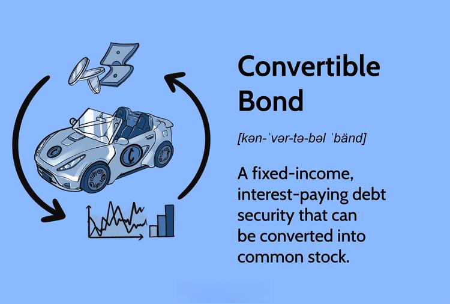

Convertible bond investments have become an important aspect of modern finance, as investors look for ways to balance risk and potential returns. Convertible bonds, which possess the characteristics of both bonds and equities, offer diversification and flexibility. Algorithmic trading, characterized by the use of computer algorithms to automate trading decisions, has gained prominence as a critical tool in financial markets. This intersection of finance and technology optimizes investment outcomes, enhancing the potential gains from convertible bonds while minimizing risks.

Convertible bonds combine fixed-income features with the opportunity for equity conversion, making them attractive for both stability and growth. The increasing interest in these financial instruments signifies a shift towards more sophisticated investment approaches. Algorithmic trading has revolutionized this area by improving the precision and speed of executing transactions, which is crucial for capturing the best possible entry and exit points in volatile markets.

The integration of algorithmic trading into convertible bond investment strategies provides numerous advantages. Automated systems allow investors to remove emotional biases from trading decisions, leading to improved consistency and discipline. Furthermore, algorithms are designed to exploit market inefficiencies, offering the possibility of enhanced portfolio returns. By continuously analyzing vast data, algorithmic trading enables investors to adapt swiftly to market changes, optimizing the timing and execution of trades.

In summary, the convergence of convertible bonds and algorithmic trading is reshaping traditional investment strategies, providing a potent combination of risk management and growth potential. This article aims to explore this dynamic relationship, detailing the key benefits and future outlook of these financial tools in a rapidly evolving market landscape.

## Table of Contents

## What are Convertible Bonds?

Convertible bonds are hybrid financial instruments that possess characteristics of both fixed-income securities and equity assets. These bonds provide investors the option to convert their bond holdings into a predetermined number of shares of the issuing company's stock, typically at specific times during the bond's life and usually at the discretion of the bondholder.

The dual nature of convertible bonds allows them to function as fixed-income securities while offering the potential for equity participation. As fixed-income securities, they pay interest like regular bonds, providing a steady income stream. However, unlike traditional bonds, convertibles offer the added advantage of converting into common stock, allowing investors to benefit from potential equity appreciation if the issuing company's stock performs well.

Convertible bonds provide significant flexibility and stability to investors. The interest payments offer a cushion against market [volatility](/wiki/volatility-trading-strategies), while the conversion feature provides an opportunity for capital gains if the issuer's stock price rises above the conversion price. In this way, convertible bonds can serve as a hedge against downside risk while allowing participation in upside potential.

### Lifecycle and Conversion Options

Convertible bonds typically follow a defined lifecycle that begins with their issuance, during which terms such as [interest rate](/wiki/interest-rate-trading-strategies), maturity date, and conversion ratio (the number of shares the bondholder can receive upon conversion) are established. Investors can then hold the bonds to maturity or choose to convert them into equity shares at specific conversion periods. The conversion price is pre-determined and is usually set above the current stock price at the time of issue.

The conversion option is a significant aspect of convertible bonds, allowing the bondholder to convert the debt into equity and possibly obtain a more favorable return than would be achieved from simply holding the bond to maturity. The decision to convert typically depends on the comparison between the conversion value (i.e., the market value of shares if converted) and the bond's current market value.

### Intrinsic Value and Potential Upside

The intrinsic value of a convertible bond is derived from its conversion option, providing an upside compared to conventional bonds. This potential for stock appreciation, combined with regular interest payments, differentiates convertibles from non-convertible bonds. If the market price of the company's stock exceeds the conversion price, the convertible bondholder can realize capital gains through conversion, enhancing the overall return.

In conclusion, convertible bonds offer a unique blend of income and growth potential, making them an attractive option for investors seeking both security and upside. While they may offer lower yields than traditional bonds due to their conversion feature, the potential to participate in equity gains presents a compelling investment strategy under certain market conditions.

## Basics of Algorithmic Trading

Algorithmic trading refers to the use of automated, pre-programmed trading instructions to execute orders in financial markets. It leverages mathematical models and algorithms to make transaction decisions, aiming to optimize the outcome by considering various market variables. This method has become increasingly prevalent in modern finance due to its ability to process large datasets and execute trades at speeds and frequencies beyond human capabilities.

### The Technology Behind Algorithmic Trading

The backbone of [algorithmic trading](/wiki/algorithmic-trading) is a combination of sophisticated software, data feeds, and execution systems. Software platforms are employed to develop, test, and deploy trading algorithms. These programs can be tailored to specific markets and asset types, such as convertible bonds, ensuring precision in trade execution based on real-time conditions.

Data feeds provide continuous streams of market data, including price quotes, volumes, and market depth, facilitating the formulation and adjustment of trading strategies. Execution systems allow for the seamless entry and [exit](/wiki/exit-strategy) of trades, often integrated with brokerage services to ensure minimal delay and cost in order execution.

### Advantages of Using Algorithmic Trading

Algorithmic trading offers numerous advantages for executing investment strategies. Speed and efficiency are paramount, as algorithms can analyze market data and execute trades in milliseconds. This rapid processing minimizes latency and capitalizes on fleeting market opportunities, which manual trading methods cannot achieve.

Moreover, algorithmic trading reduces the emotional and cognitive biases that plague human decision-making, ensuring that strategies are executed as planned. This discipline leads to more consistent performance and adherence to risk management protocols.

Another advantage is scalability. An algorithm can manage multiple trading accounts and strategies simultaneously, an impossible task for a human trader alone. This feature is particularly beneficial when handling complex financial instruments such as convertible bonds, which may require simultaneous management of both the bond and its underlying equity.

### Common Algorithmic Trading Strategies for Convertible Bonds

Several common algorithmic trading strategies can be applied to convertible bond investments:

1. **Statistical Arbitrage**: Exploits pricing inefficiencies between convertible bonds and their underlying stocks.

2. **Market Making**: Involves placing both buy and sell limit orders to profit from the bid-ask spread, enhancing liquidity and narrowing spreads.

3. **Trend Following**: Automated algorithms identify and execute trades in the direction of prevailing market trends, based on historical data analysis.

4. **Pair Trading**: Focuses on finding correlations between convertible bonds and other securities, executing long and short positions to benefit from deviations.

### Impact on Market Liquidity and Efficiency

Algorithmic trading significantly impacts market [liquidity](/wiki/liquidity-risk-premium) and efficiency. By providing constant buy and sell orders, algorithms increase market participation, thus enhancing liquidity. This added liquidity reduces transaction costs for all market participants through tighter bid-ask spreads.

Additionally, algorithmic trading contributes to market efficiency by quickly incorporating new information into prices. Its ability to execute numerous trades in short periods aids in the rapid adjustment of prices to reflect the latest market conditions, contributing to an overall smoother functioning of financial markets.

In summary, algorithmic trading has revolutionized the landscape of modern finance, providing enhanced speed, discipline, and efficiency in executing investment strategies. Its integration into markets, particularly for complex instruments like convertible bonds, showcases its indispensable role in contemporary trading practices.

## Benefits of Investing in Convertible Bonds

Convertible bonds offer a unique investment opportunity by combining features of both debt and equity, providing investors with the potential for higher returns while mitigating risk. These financial instruments have gained traction due to their flexibility and strategic position in a diversified portfolio.

One of the primary benefits of investing in convertible bonds is the potential for higher returns. This arises from their equity-like features, as convertible bonds can be converted into a predetermined number of shares. If the underlying company's stock appreciates, investors can benefit from the increase in equity value, thus enjoying equity-like returns while initially holding a fixed-income security.

Additionally, convertible bonds present a lower risk compared to direct stock investments. As fixed-income securities, they offer periodic interest payments and the principal amount upon maturity. This fixed-income characteristic provides a safety net for investors, allowing them to earn returns even if the stock performance is unfavorable. Thus, convertible bonds can shield investors from the full volatility of equity markets.

The hedging benefits of convertible bonds are another advantage, which stems from their dual nature. The bond component provides a level of investment stability, while the potential conversion to equity offers growth prospects. This characteristic allows investors to hedge against market downturns or volatility, thereby making convertible bonds a valuable component in risk management strategies.

Successful examples of convertible bond investments illustrate their benefits. Companies in growth sectors like technology and pharmaceuticals often issue convertible bonds to attract investment while conserving cash flow. Investors in such bonds can experience substantial returns, particularly during the period of significant company growth.

Finally, convertible bonds play an essential role in a diversified investment portfolio. Their mixed attributes—part bond, part equity—enable them to fit into both fixed-income and equity allocations. This makes them an attractive option for investors aiming to balance risk and return, helping to hedge against market fluctuations while capturing equity upside.

By integrating convertible bonds into an investment strategy, particularly with the aid of algorithmic trading systems that can optimize execution, investors can enhance their portfolio's overall performance and resilience against market volatility.

## How Algorithmic Trading Enhances Convertible Bond Investments

Algorithmic trading significantly enhances the execution of convertible bond strategies by leveraging speed and accuracy, which are crucial in today’s fast-paced financial markets. Convertible bonds, due to their dual nature as fixed-income and equity instruments, require precise timing in execution to maximize their benefits. Algorithmic trading systems, driven by pre-defined criteria and quantitative models, allow investors to capitalize on these complex strategies with improved timing and execution.

One of the primary advantages of algorithmic trading is the improvement in speed and accuracy. Automated trading systems can process vast amounts of data in real-time, executing trades within fractions of a second. This rapid execution minimizes the risk of slippage—the difference between the expected price of a trade and the actual price. By ensuring trades occur at optimal times, algorithmic systems reduce the cost and risk associated with manual trading and provide more consistent results over time.

In addition to speed, these systems enhance strategy discipline by removing emotional factors from trading decisions. Human decision-making can often be influenced by emotional biases, which might lead to inconsistent or suboptimal trading behaviors, such as holding onto a losing position due to reluctance to accept a loss. Algorithmic trading, however, strictly adheres to the rules and parameters set within its programming, ensuring that decisions are driven by data and statistical analysis rather than emotions. This discipline is particularly beneficial in volatile markets, where irrational decision-making can lead to significant financial losses.

Moreover, algorithmic trading can be tailored to identify and exploit market anomalies specific to convertible bonds. Customized algorithms can be developed to detect patterns and opportunities that are not easily recognizable by human traders. For example, algorithms might be programmed to identify price discrepancies between the convertible bond and its underlying equity, optimize conversion timings, or detect [arbitrage](/wiki/arbitrage) opportunities. These tailored strategies allow investors to take advantage of unique opportunities in the convertible bond market that they might otherwise miss.

Real-world case studies underline the synergistic relationship between algorithmic trading and convertible bond investments. For instance, a portfolio managed using an algorithmic trading system that dynamically adjusts its positions based on market conditions and volatility indices may achieve superior returns compared to a manually managed portfolio. These case studies often highlight substantial gains in terms of both returns and risk mitigation, demonstrating the tangible benefits of integrating technology into investment strategies.

In summary, algorithmic trading enhances convertible bond investments by improving execution timing and speed, maintaining strategy discipline, and customizing approaches to leverage specific market anomalies. This technological integration provides investors with a competitive edge, enabling them to achieve better returns while managing risk more effectively.

## Risks and Considerations

Convertible bond investments, while offering attractive features, come with certain inherent risks that investors must carefully evaluate. Understanding these risks can help in making informed decisions and optimizing investment outcomes.

Convertible bonds, by nature, expose investors to various forms of risk. One primary concern is the credit risk, which is the possibility of the issuing company defaulting on its obligations. This risk is exacerbated during periods of economic downturns where companies may face financial distress, impacting their ability to honor bond commitments. Additionally, interest rate fluctuations can adversely affect the bond's price, introducing interest rate risk. When rates rise, traditional bond values typically decrease, although the equity conversion feature in convertible bonds may offset this risk partially.

The use of algorithmic trading in convertible bond markets brings a different set of challenges. Technical errors, such as software bugs or system failures, can lead to significant financial losses. Moreover, algorithmic trading systems are highly dependent on market data accuracy; any discrepancies or delays can result in misguided trading decisions. Market volatility poses another challenge, as sudden price swings can impact the effectiveness of pre-determined trading algorithms.

Regulatory considerations also play a crucial role in algorithmic trading for convertible bonds. With varying regulations across different jurisdictions, traders must remain compliant with international and local laws that govern financial transactions and technology use in trading. The advent of algorithmic trading has led regulators to implement stringent measures to prevent market manipulation and ensure fair trading practices, necessitating traders to align their operations with these rules.

To mitigate these risks, investors can employ several strategies. Diversification is key; spreading investments across different asset classes can reduce exposure to company-specific risks. Additionally, enhancing algorithmic models to incorporate risk management parameters can help in adjusting strategies based on market conditions and volatility predictions.

It is essential to comprehend the limitations and scope of algorithmic trading in the current financial landscape. While such trading can enhance the speed and efficiency of transactions, it is not infallible. Algorithms lack the ability to adapt to unforeseen market events swiftly without human intervention. Investors should maintain a balanced approach, integrating algorithmic trading with traditional analysis techniques and regularly revising their strategies to incorporate new market insights and technology advancements.

In conclusion, while convertible bonds provide unique investment opportunities, they come with distinct risks that require careful consideration. Similarly, algorithmic trading, despite its advantages, presents challenges that necessitate proactive risk management and adherence to regulatory requirements. Balancing these aspects can lead to more robust investment strategies and improved financial outcomes.

## Future Trends and Outlook

As financial markets continue to evolve, the growth of convertible bond markets and algorithmic trading is expected to accelerate. Convertible bonds offer unique advantages, such as the potential for higher returns and lower risk compared to direct stock investments. This appeal is likely to drive increased interest and expansion in convertible bond markets. Algorithmic trading, which streamlines the execution of investment strategies through automation, is similarly poised for significant growth.

Technological advancements are anticipated to further enhance the capabilities of financial algorithms, driving efficiency and innovation in trading strategies. Improvements in [machine learning](/wiki/machine-learning), [artificial intelligence](/wiki/ai-artificial-intelligence), and big data analytics are expected to refine algorithmic models, allowing them to better predict market trends and execute trades with increased precision. For instance, enhanced natural language processing (NLP) techniques might enable algorithms to analyze news sentiment more accurately, thus aiding in real-time decision-making.

The regulatory environment is a crucial [factor](/wiki/factor-investing) that will shape the future of both convertible bond markets and algorithmic trading. As regulatory bodies develop guidelines to ensure market stability and protect investors, trading strategies will need to adapt accordingly. Striking a balance between fostering innovation and ensuring compliance will be essential for market participants.

Emerging opportunities in hybrid financial products and innovative trading solutions present exciting prospects. As financial technology continues to progress, new products that combine features of traditional securities with the flexibility of digital assets may become more prevalent. These hybrid products could offer novel ways of managing risk and enhancing returns.

The interaction between technology and finance creates a synergistic relationship essential for the future landscape of investments. As technology propels the development of new strategies, tools, and products, investors stand to benefit from more informed and efficient investment processes. This dynamic shift will likely require continuous learning and adaptation, emphasizing the importance of staying informed about technological and regulatory changes to maximize investment success.

## Conclusion

Algorithmic trading has brought a transformative edge to convertible bond investments, presenting a range of benefits that amplify investment strategies. One of the primary advantages lies in the ability of algorithms to enhance the timing and execution of trades. These systems provide accuracy and speed, reducing latency and ensuring that opportunities for profit are captured promptly. Algorithms minimize human error and emotional decision-making, promoting strategy discipline and consistency.

The integration of algorithmic trading with convertible bond investments underscores the necessity for a balanced approach to risk and reward. Convertible bonds inherently offer a blend of fixed-income security and equity potential, which algorithmic trading can further optimize by identifying market anomalies and devising strategies to exploit these situations. The potential for higher returns is thus augmented by the precision and objectivity of algorithmic systems.

Advancements in technology should be embraced as they promise smarter investment decisions. By adopting algorithmic trading, investors open the door to refined strategies that can adapt to dynamic market conditions. This approach not only optimizes performance but also enhances the overall efficiency of managing investment portfolios.

As the financial landscape evolves, the exploration of convertible bond investments through algorithmic trading is both a strategic and necessary development. Investors are encouraged to leverage these technological tools to capture opportunities for growth and stability that may otherwise be overlooked in conventional investment methods.

Ultimately, the key to maximizing investment success lies in continuous learning and adaptation. The financial markets are ever-changing, and staying informed about technological advancements and emerging investment strategies is crucial. By consistently updating knowledge and methodologies, investors will better position themselves to navigate and capitalize on future opportunities within the convertible bond market.

## References & Further Reading

[1]: ["Convertibles: Investment Strategies and Analysis"](https://www.investopedia.com/terms/c/convertibles.asp) by Anthony Butler

[2]: ["Convertible Securities: A Complete Guide to Investment and Corporate Financing Strategies"](https://www.mhebooklibrary.com/doi/book/10.1036/9781260462913) by Tracy V. Maitland and Thomas Noddings

[3]: ["Algorithmic Trading: Winning Strategies and Their Rationale"](https://www.amazon.com/Algorithmic-Trading-Winning-Strategies-Rationale-ebook/dp/B00CY5HC0U) by Ernie Chan

[4]: ["Quantitative Equity Portfolio Management: Modern Techniques and Applications"](https://www.taylorfrancis.com/books/mono/10.1201/9781420010794/quantitative-equity-portfolio-management-edward-qian-eric-sorensen-ronald-hua) by Ludwig B. Chincarini and Daehwan Kim

[5]: ["Algorithmic and High-Frequency Trading"](https://www.cambridge.org/us/universitypress/subjects/mathematics/mathematical-finance/algorithmic-and-high-frequency-trading) by Álvaro Cartea, Sebastian Jaimungal, and José Penalva