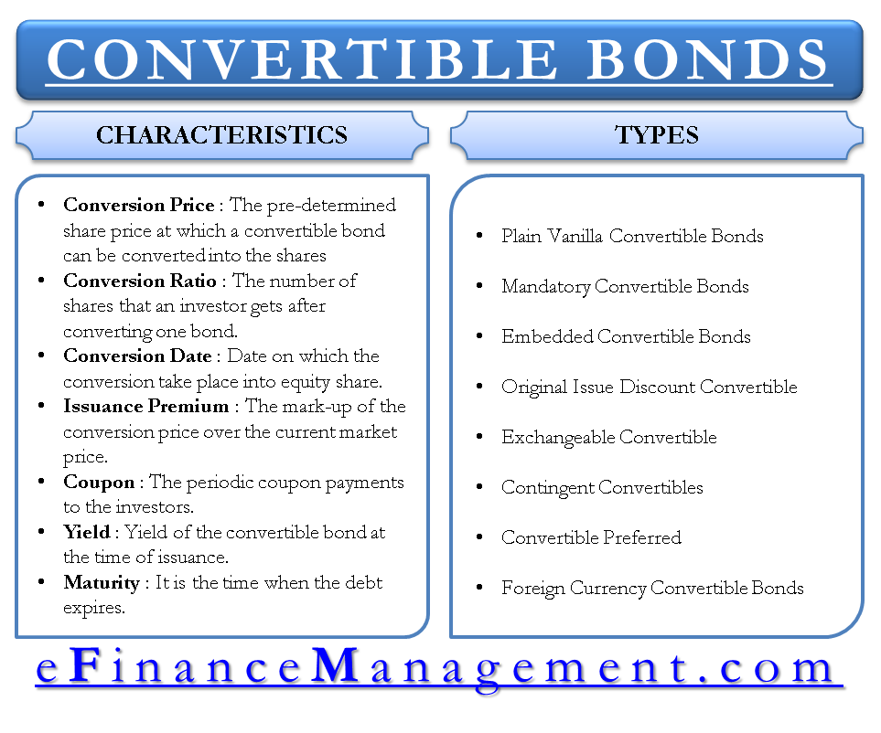

Convertible bonds represent a unique investment vehicle that combines characteristics of both debt and equity instruments. These financial instruments offer the fixed income security of traditional bonds while providing the flexibility of converting into a predetermined number of equity shares, making them versatile tools in corporate finance. Convertible bonds are particularly advantageous during periods of market volatility, as they allow investors to benefit from the stability of bonds with the potential upside of equity.

The dual nature of convertible bonds enables companies to raise capital efficiently while minimizing immediate equity dilution, thus appealing to both issuers and investors. From the perspective of corporate finance, these bonds contribute to capital structure flexibility by allowing issuers to manage their debt and equity exposures strategically. For investors, convertible bonds offer a diversified exposure to both markets, providing a fixed-income stream coupled with the potential for capital appreciation.



In recent years, the financial markets have witnessed a growing trend of algorithmic trading, dramatically impacting the trade and leverage of convertible bonds. Algorithmic trading has enhanced the efficiency and transparency of the convertible bond markets, facilitating better pricing and liquidity conditions. However, it has also introduced complexities that require sophisticated strategies and systems to navigate successfully. 

The exploration of convertible bonds encompasses not only their role and implications in corporate finance but also the broader investment landscape shaped by evolving trading technologies. Through a careful analysis of both their benefits and drawbacks, we can better understand the potential these hybrid instruments offer for capital structure optimization and investment diversification.

## Table of Contents

## What are Convertible Bonds?

Convertible bonds are financial instruments that corporations issue to raise capital, featuring a hybrid nature combining elements of both debt and equity. At their core, these bonds are akin to traditional corporate debt, offering investors periodic fixed interest payments over a stipulated period. However, the unique feature of convertible bonds is the option they provide bondholders to convert the bonds into a predetermined number of the issuer's shares.

This convertible feature introduces a strategic advantage, particularly attractive during times of market volatility. Investors have the opportunity to benefit from capital appreciation if the company’s stock performs well. The conversion option becomes more valuable as the company's stock price appreciates, allowing investors to exchange their fixed income securities for potentially higher-value equity.

From a mathematical perspective, the value of a convertible bond can be considered a combination of the bond's intrinsic value and the value of the option to convert into shares. This is often expressed as:

$$
\text{Convertible Bond Value} = \text{Straight Bond Value} + \text{Conversion Option Value}
$$

Where:
- **Straight Bond Value** refers to the present value of the bond if it were non-convertible, calculated using the expected interest payments and principal repayment.
- **Conversion Option Value** is the additional premium attributed to the right of conversion into shares.

For investors, this represents a mechanism to participate in the equity market's potential upside while simultaneously receiving fixed income, offering a hedge against potential market downturns. Additionally, during periods of market instability, the fixed income aspect provides a layer of downside protection, as convertibles are generally less risky compared to equities alone, enabling them to act as a stabilizing asset in a diversified portfolio. 

Overall, convertible bonds serve as a strategic tool both for issuers, seeking lower-cost capital solutions, and for investors, aiming to balance capital growth with income stability.

## Pros of Convertible Bonds for Corporate Finance

Convertible bonds offer several advantages to corporate finance, primarily by allowing companies to raise capital at lower interest rates than those associated with traditional bonds. This reduced cost is a consequence of the embedded option for the bondholder to convert the bonds into equity, which adds value to the investor and allows issuers to compensate with lower interest payments. By facilitating fundraising at a reduced interest burden, companies can optimize their cost of capital and improve cash flow management.

Moreover, convertible bonds provide companies with the opportunity to delay the dilution of common equity. Unlike the immediate issuance of equity, convertibles postpone the potential impact on existing shareholders until the point of conversion. This delay can be particularly beneficial in maintaining shareholder value, especially for companies that anticipate higher future stock prices. Thus, convertible bonds serve as an instrumental tool in strategic equity management.

Additionally, convertible bonds offer flexibility in managing both debt and equity positions, proving advantageous for corporate financial strategy. This flexibility allows companies to tailor their capital structures more precisely, balancing between debt and equity in a manner that aligns with their long-term financial goals. For instance, a company can issue convertible bonds during times of market uncertainty, bridging the gap between immediate capital requirements and future equity adjustments.

In summary, convertible bonds provide a compelling mechanism for companies seeking to optimize their capital structure, minimize costs, and manage equity dilution. This blend of features highlights the strategic utility of convertible bonds in corporate finance.

## Cons of Convertible Bonds for Corporate Finance

Issuance of convertible bonds can lead to potential dilution of equity if conversion happens. When investors exercise their right to convert bonds into equity, the company's total number of outstanding shares increases, which can dilute the existing shareholders' equity. For companies, this potential dilution must be weighed against the benefits of issuing convertible bonds, such as lower interest rates. The formula for dilution can be expressed as:

$$
\text{Dilution Effect} = \frac{\text{New Shares Issued}}{\text{Existing Shares} + \text{New Shares Issued}}
$$

Companies might face changes in voting control if a large portion of convertible bonds is converted. This shift can occur because the newly converted shares typically [carry](/wiki/carry-trading) voting rights, potentially altering the power dynamics among shareholders. This scenario poses a strategic risk for companies where control or influence by particular shareholders is crucial. 

Further, the market might interpret frequent issuance of convertible bonds as a signal of financial instability. Investors could perceive this practice as an indication that the company is unable to secure funding through traditional debt or equity markets, perhaps due to perceived risks associated with its financial health or business prospects. This perception can lead to increased [volatility](/wiki/volatility-trading-strategies) in the company's stock price and affect its reputation in financial markets.

Taken together, these factors emphasize the necessity for companies to strategically assess the timing and frequency of convertible bond issuance, along with a comprehensive evaluation of the implications for control, shareholder value, and market perception.

## Pros of Convertible Bonds for Investors

Convertible bonds provide several advantages to investors, combining attributes of both fixed-income and equity investments. These hybrid instruments offer a fixed income stream through interest payments, typically at lower rates compared to conventional corporate bonds. This feature ensures a steady cash flow, appealing to investors seeking reliable income. Moreover, the embedded option to convert bonds into equity allows investors to benefit from potential stock price appreciation. Should the issuing company's shares increase in value, investors can convert their bonds into stocks, capitalizing on the market upturn without initially owning the equity.

Convertible bonds serve as an effective portfolio diversification tool. By holding convertible bonds, investors gain exposure to both fixed-income markets and potential equity gains, balancing risk and return. This diversification can help mitigate portfolio volatility and enhance returns, particularly in uncertain market conditions. Given their dual nature, convertible bonds can adjust to various market scenarios, providing a buffer against extreme market fluctuations.

Furthermore, convertible bonds offer downside protection, reducing risk compared to holding stocks alone. Even if the issuing company's stock performance is poor, investors still receive interest payments, safeguarding part of their investment. This protective feature is intrinsic to the bond component, which ensures that even without conversion to equity, the principal and interest obligations remain intact. Such characteristics make convertible bonds an attractive option for investors who desire both stability and the opportunity for enhanced returns.

## Cons of Convertible Bonds for Investors

Convertible bonds, while offering a unique blend of fixed income and equity potential, carry certain drawbacks for investors. One significant disadvantage is that the conversion feature may become unattractive if the issuer’s stock underperforms. In such cases, the bondholder may refrain from converting the bond to shares, missing out on potential gains from stock appreciation. For instance, if a convertible bond has a conversion price set higher than the current market price of the underlying stock, investors may opt to retain the bond rather than convert, thereby foregoing any equity benefits.

Interest rate volatility is another [factor](/wiki/factor-investing) that can adversely affect the market price of convertible bonds. As with other fixed-income securities, the price of convertible bonds inversely correlates with [interest rate](/wiki/interest-rate-trading-strategies) movements. When interest rates rise, the value of existing bonds typically declines, as newer securities offer higher yields. This inverse relationship can erode the bond's market price, potentially resulting in capital losses for investors.

Liquidity also presents a challenge for convertible bond investors. Compared to more actively traded fixed-income and equity instruments, convertibles often experience lower [liquidity](/wiki/liquidity-risk-premium) levels. This can be attributed to their hybrid nature and the complexity involved in pricing them accurately. The less active market for convertibles may lead to wider bid-ask spreads and higher transaction costs, making it more difficult for investors to buy or sell these securities at favorable prices.

In summary, while convertible bonds offer certain benefits by integrating characteristics of both debt and equity, they are not without their drawbacks. Investors must carefully consider the risks associated with stock performance, interest rate fluctuations, and liquidity constraints when contemplating an investment in convertible bonds.

## Impact of Algorithmic Trading on Convertible Bonds

Algorithmic trading has revolutionized the landscape of convertible bond markets by enhancing both efficiency and transparency in trading operations. Convertible bonds, which inherently possess complexities due to their hybrid nature involving both debt and equity characteristics, benefit from [algorithmic trading](/wiki/algorithmic-trading) in several ways.

One of the primary benefits of algorithmic trading in convertible bond markets is the improvement in pricing accuracy. Algorithms efficiently process vast amounts of market data to facilitate the execution of trades at optimal prices. This capability helps reduce bid-ask spreads, thus minimizing transaction costs for traders. By leveraging algorithms, market participants can execute trades at speeds and at precision levels unattainable by human traders. This improvement in trading performance is especially critical for convertible bonds, where pricing can be influenced by both bond and stock market dynamics.

Enhanced liquidity is another significant benefit of algorithmic trading. By automating the matching of buy and sell orders, algorithms help increase the [volume](/wiki/volume-trading-strategy) and frequency of trades in the market. A more liquid market environment benefits investors by providing greater ease in entering and exiting positions without significantly affecting market prices. Improved liquidity conditions also contribute to a more robust and resilient market, capable of withstanding shocks and minimizing volatility spikes.

Despite these advantages, algorithmic trading also introduces complexity into the convertible bond market. Traders and investors must adopt sophisticated trading strategies and systems to effectively harness algorithmic tools. The development and implementation of these strategies require significant expertise in quantitative finance and a deep understanding of market microstructures. Advanced computational models are often necessary to manage the nuanced interactions between the bond and equity components of convertible bonds. 

For instance, consider a simplified Python model for gauging market impact:

```python
def market_impact(price, traded_volume, market_liquidity):
    impact = (traded_volume / market_liquidity) ** 0.5 * price * 0.01
    adjusted_price = price + impact
    return adjusted_price

# Example parameters
price = 100  # Current bond price
traded_volume = 1000  # Volume of bonds traded
market_liquidity = 5000  # Liquidity factor

adjusted_price = market_impact(price, traded_volume, market_liquidity)
print(f"Adjusted Price due to Market Impact: {adjusted_price}")
```

In this example, the function `market_impact` estimates the effect of trade volume on bond prices, which is crucial for understanding pricing dynamics in an algorithm-driven market.

In conclusion, while algorithmic trading significantly enhances efficiency and liquidity in convertible bond markets, it also demands a higher level of technical proficiency and strategic planning from market participants. Those able to navigate this complexity can unlock new opportunities, while others may find themselves at a competitive disadvantage.

## Conclusion

Convertible bonds represent a sophisticated financial instrument that offers distinct advantages and notable challenges for both issuing companies and investors. Their dual nature, as both debt and potential equity, allows companies to raise capital efficiently while providing investors with opportunities for capital appreciation. However, to fully harness the benefits and mitigate the risks, a comprehensive understanding of their mechanics and market conditions is essential.

For companies, convertible bonds present a means of capital acquisition with reduced immediate equity dilution, thus maintaining shareholder value in the short term. Nonetheless, the potential future conversion of bonds into equity can lead to shareholder dilution and changes in control dynamics. As such, strategic financial management must consider not only the present needs for capital but also the future implications of conversion.

From the investor's perspective, convertible bonds offer a hybrid investment with the promise of fixed income and the possibility of equity conversion. This serves as a diversification tool, providing exposure to both the fixed income and equity markets. However, investors must be vigilant about the underlying equity's performance and broader market conditions, which can significantly influence the attractiveness of the convertible bond.

Algorithmic trading has revolutionized the convertible bond market by enhancing trading efficiency and liquidity. This technology-driven approach allows for better pricing structures, reducing friction in transactions. However, algorithmic trading also introduces complexity, necessitating sophisticated systems and strategies to effectively navigate the market. Investors and companies must adapt to these technological advances, leveraging new tools while remaining mindful of the potential risks associated with rapid market changes.

In conclusion, convertible bonds are a unique tool in financial markets, offering distinct advantages and challenges. Their successful use requires a nuanced understanding of market dynamics, strategic foresight, and the ability to leverage emerging trading technologies. As algorithmic trading continues to reshape the investment landscape, both companies and investors must remain agile, ready to adapt to new conditions and capitalize on emerging opportunities.

## References & Further Reading

[1]: ["Convertible Bonds: Pricing and Strategy"](https://www.financestrategists.com/wealth-management/bonds/convertible-bonds/) by Kevin B. Connolly

[2]: ["Convertible Securities: An Introduction to Investment Strategies"](https://www.amazon.com/Convertible-Securities-Introduction-Investment-Strategies/dp/0471887190) by Thomas C. Noddings, Susan C. Christoph, and John G. Noddings

[3]: ["Options, Futures, and Other Derivatives"](https://www.amazon.com/Options-Futures-Other-Derivatives-10th/dp/013447208X) by John C. Hull

[4]: Ammann, M., Kind, A., & Wilde, C. (2003). ["Are convertible bonds underpriced? An analysis of the French market."](https://www.semanticscholar.org/paper/Are-convertible-bonds-underpriced-%3A-an-analysis-of-Ammann-Kind/8ecda362acce9869bd373b6aec2226562823e9d7) Financial Markets, Institutions & Instruments, 12(3), 261-305.

[5]: ["Handbook of Convertible Bonds: Pricing, Strategies and Risk Management"](https://onlinelibrary.wiley.com/doi/book/10.1002/9781118374696) by Jan De Spiegeleer and Wim Schoutens