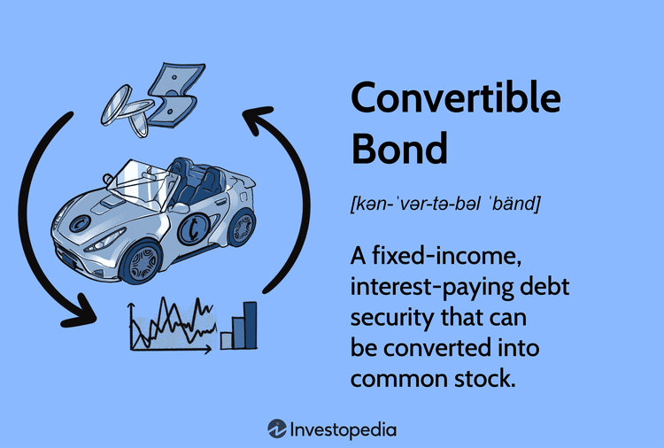

Convertible bonds are distinctive financial instruments that merge the characteristics of debt and equity, offering investors a hybrid security with multiple strategic advantages. These bonds, issued by corporations, grant investors the option to convert their bonds into a predetermined number of the issuer's common stock, allowing them to benefit from the fixed-income aspect of bonds while also participating in the potential capital gains of equities.

In modern financial markets, the role of convertible bonds has grown prominent due to their versatility and adaptability in investment strategies. Investors seek to understand the complex dynamics of convertible bonds, emphasizing not only their benefits and risks but also how they can be leveraged for varied financial objectives. These bonds are especially valuable during periods of stock market volatility, providing a buffer against downside risks because of their dual nature.



One of the significant transformations in the convertible bond market is the rise of algorithmic trading. This technology-driven approach has revolutionized trading by improving market liquidity and pricing efficiency, offering new opportunities but also bringing its own set of challenges. Algorithmic trading uses complex algorithms and immense computational power to execute trades with minimal human intervention, allowing traders and investors to navigate market dynamics swiftly.

Given these advancements, understanding convertible bonds extends beyond traditional finance to encompass the intricacies introduced by algorithmic trading. This evolving landscape presents both challenges and opportunities for companies and individual investors. Companies benefit from using convertible bonds to secure capital at lower interest rates without immediate equity dilution, while investors appreciate the stability and growth potential these bonds provide.

In conclusion, the integration of convertible bonds in algorithmic trading highlights the necessity for a comprehensive understanding of these instruments and their implications within the broader financial ecosystem. Adapting to these changes requires strategic foresight and an in-depth knowledge of financial instruments and emerging technologies.

## Table of Contents

## What are Convertible Bonds?

Convertible bonds are a type of corporate debt security characterized by the option for the bondholder to convert the bonds into a specified number of the issuer's common stock. This dual-purpose feature blends the characteristics of fixed-income security with the potential for equity participation, offering unique investment opportunities and strategic advantages.

Initially, convertible bonds function much like traditional bonds, providing investors with periodic coupon payments and a return of principal upon maturity. This aspect imparts a level of financial security common to fixed-income investments, appealing to risk-averse investors. The conversion feature, however, introduces an equity component that can potentially generate significant capital gains if the issuer's stock performs well. This conversion option becomes particularly attractive during periods of stock market [volatility](/wiki/volatility-trading-strategies), as it provides a built-in hedge against downside risk.

The valuation of a convertible bond typically comprises two main components: the bond value and the conversion option. The bond value is determined by the present value of future cash flows, including coupon payments and the principal, discounted at an appropriate [interest rate](/wiki/interest-rate-trading-strategies). The conversion option, effectively an embedded call option, represents additional value derived from the potential to convert the bond into equity. This dual valuation allows for multiple strategic uses, from conservative fixed-income allocations to dynamic equity-linked investment strategies.

Mathematically, the value of a convertible bond $V_{\text{CB}}$ can be expressed as:

$$
V_{\text{CB}} = V_{\text{Bond}} + V_{\text{Option}}
$$

where $V_{\text{Bond}}$ is the value of the straight bond, and $V_{\text{Option}}$ is the value of the conversion option.

This complex valuation framework affords investors various strategic options, allowing them to capitalize on market movements and corporate developments. Overall, convertible bonds serve as a versatile tool, blending the safety of bonds with the growth potential of equities.

## Benefits for Corporate Finance

Convertible bonds have become an attractive option for corporate finance due to their strategic benefits in raising capital efficiently. These hybrid financial instruments enable companies to secure funding at lower interest rates compared to traditional debt instruments. This cost advantage arises from the conversion feature embedded in convertible bonds, which provides investors with the potential upside of equity participation. Consequently, issuers can attract investors willing to accept lower yields in exchange for the possibility of conversion to stock.

The issuance of convertible bonds also offers a tax-efficient financing mechanism. Interest payments on bonds are tax-deductible, reducing the overall cost of capital for a company. This feature enhances the appeal of convertibles as a financing tool when compared to direct equity issuance, which does not provide this tax benefit.

Moreover, convertible bonds serve as a strategic tool to delay equity dilution. By including a conversion feature, companies can postpone the immediate issuance of new equity shares, thus preserving the value of existing shareholders' stakes. This approach is particularly advantageous for companies anticipating an increase in their stock price. If the stock appreciates, the bondholders may convert their bonds into equity at a higher valuation, minimizing dilution for current shareholders.

Convertible bonds facilitate the optimization of a company's capital structure. They represent a blend of debt and equity, allowing firms to maintain a balanced financial footing. This flexibility is critical during periods of market uncertainty, as convertibles provide companies with an adaptable financial instrument that can be adjusted based on prevailing market conditions and corporate financial strategies.

During turbulent financial periods, companies can effectively manage their financial strategies using convertible bonds. They offer a cushion against volatile market conditions by ensuring a secure supply of capital and minimizing the immediate impact on the company's ownership structure. This adaptability proves invaluable when navigating financial challenges, ensuring that companies maintain operational and strategic flexibility without compromising on growth opportunities or financial stability.

## Investor Advantages

Convertible bonds offer several advantages to investors by combining fixed-income reliability with the potential for capital appreciation. One of the primary benefits these instruments provide is the stable interest payments characteristic of debt securities. As a result, investors can secure regular income, which can be particularly attractive in volatile markets. However, unlike traditional bonds, convertible bonds also offer the opportunity to convert their holdings into a specified number of the issuer's common stock. This feature enables investors to benefit from any appreciation in the company's stock, potentially leading to significant capital gains.

The dual nature of convertible bonds enhances portfolio diversification. Investors gain exposure to both the fixed-income and equity markets without the need to purchase separate instruments. This versatility serves as a hedge against market uncertainties, as the bond component provides protection against downside risk, while the equity component offers upside potential if the company's stock performs well.

Moreover, the convertible feature acts as a safety net, primarily through fixed interest payments. In scenarios where the stock's performance is lackluster, investors retain the bond's interest yield, thereby minimizing potential losses. Conversely, if the stock's value appreciates significantly, investors can convert their bonds into equity, potentially achieving higher returns than those available through direct investment in traditional bonds.

Mathematically, evaluating the potential returns from convertible bonds involves understanding both the bond value and the conversion option. The bond's present value can be calculated using standard bond valuation formulas, considering the bond's coupon rate, maturity, and current interest rates. The conversion option's value can be analyzed using option pricing models, such as the Black-Scholes model, which considers factors like the stock's price volatility and the time remaining until conversion. Python's `numpy` and `scipy` libraries can be useful for performing these calculations:

```python
import numpy as np
from scipy.stats import norm

def black_scholes(S, K, T, r, sigma, option_type="call"):
    d1 = (np.log(S / K) + (r + 0.5 * sigma**2) * T) / (sigma * np.sqrt(T))
    d2 = d1 - sigma * np.sqrt(T)

    if option_type == "call":
        option_price = S * norm.cdf(d1) - K * np.exp(-r * T) * norm.cdf(d2)
    elif option_type == "put":
        option_price = K * np.exp(-r * T) * norm.cdf(-d2) - S * norm.cdf(-d1)

    return option_price

# Example usage
S = 100  # Current stock price
K = 110  # Strike price, equivalent to conversion price
T = 1    # Time to expiration in years
r = 0.05 # Risk-free interest rate
sigma = 0.2 # Volatility of the stock

call_option_price = black_scholes(S, K, T, r, sigma, option_type="call")
print(f"The value of the conversion option using Black-Scholes is: {call_option_price:.2f}")
```

In conclusion, the investor advantages of convertible bonds stem from their ability to merge the stability of fixed-income investments with equity participation opportunities. This combination not only provides a hedge against market fluctuations but also sets the stage for potentially higher returns if the underlying stock's value increases, making them an appealing choice for investors seeking a balanced financial strategy.

## Risks and Downsides

Convertible bonds, while presenting a strategic financial tool, [carry](/wiki/carry-trading) inherent risks and potential downsides for both issuers and investors. One primary concern is equity dilution. When convertible bonds are converted into stock, the increase in shares outstanding can dilute existing shareholders' equity, often leading to a reduction in the stock's market value. This dilution is a significant consideration for companies and shareholders, as it can alter ownership proportions and impact investor perceptions of the company’s value.

Market perception of frequent convertible bond issuances can also signal potential financial instability. If a company repeatedly issues convertible bonds, it might be viewed as struggling to obtain financing through conventional means. This perception could negatively influence the company's stock price and reputation, as investors might question the company's financial health and long-term viability.

For investors, convertible bonds present a set of financial risks. Interest rate fluctuations can impact the bond's fixed income component. Rising interest rates could devalue the bond's price, as newer issues might offer higher yields. Credit risk is also a [factor](/wiki/factor-investing); if the issuer faces financial difficulties or defaults, bondholders might suffer losses. This risk is reflected in the bond's credit rating and should be a consideration for investors assessing the bond's risk-reward balance.

Market [liquidity](/wiki/liquidity-risk-premium) issues constitute another risk for investors holding convertible bonds. In periods of financial volatility or crises, the market for convertible bonds might become illiquid, making it challenging to buy or sell positions without affecting the bond’s price. This can lead to significant price fluctuations and impact investors' ability to execute timely trades or reposition their portfolios. 

Overall, the risks associated with convertible bonds necessitate a thorough analysis by both issuers and investors. Understanding these risks and their implications can aid in making informed decisions, balancing the potential for conversion benefits against possible financial setbacks.

## Impact of Algorithmic Trading

Algorithmic trading has significantly transformed the convertible bond market by enhancing market liquidity and improving pricing efficiency. This development has led to tighter spreads and more accurate pricing, benefiting both issuers and investors. The use of complex algorithms allows for the continuous assessment of multiple market variables at a speed unattainable by human traders, making real-time adjustments in trading strategies possible.

The effectiveness of [algorithmic trading](/wiki/algorithmic-trading) in this arena hinges on sophisticated strategies and computational power. These algorithms are designed to analyze historical data, identify price patterns, and execute trades that capitalize on predicted movements. For instance, a popular approach is statistical [arbitrage](/wiki/arbitrage), which relies on mathematical models to find pricing inefficiencies between convertible bonds and their underlying equities.

Successful trading in this environment requires a robust understanding of not just the convertible bonds themselves but also of the computational tools that drive algorithmic trading. Python, known for its simplicity and versatility, is often the language of choice. Below is an illustrative example of a simple Python script that could be used in an algorithmic trading strategy to calculate the theoretical conversion price of a convertible bond:

```python
def calculate_conversion_price(bond_par_value, conversion_ratio):
    return bond_par_value / conversion_ratio

bond_par_value = 1000  # Example par value of the bond
conversion_ratio = 20  # Example conversion ratio

conversion_price = calculate_conversion_price(bond_par_value, conversion_ratio)
print(f"Theoretical Conversion Price: ${conversion_price}")
```

This script calculates the conversion price by dividing the bond's par value by the conversion ratio, providing a simple foundation for more advanced trading models.

However, the reliance on algorithmic tools comes with its own set of challenges. Systems must be resilient against market shocks and capable of functioning under high-frequency trading conditions. The pace at which these trades occur also necessitates rigorous risk management practices to prevent potential losses from market volatility or algorithmic errors. Traders and investors should continuously refine their models and algorithms, adapting to ever-evolving market dynamics to maintain a competitive edge.

Moreover, regulatory compliance and ethical considerations are crucial in algorithmic trading. Regulators often scrutinize activities in this space due to the potential impact on market stability. Participants must ensure that their strategies do not inadvertently create unfair market conditions or result in manipulative trading practices.

In summary, while algorithmic trading brings substantial benefits to the convertible bond market through improved liquidity and pricing accuracy, it requires a balanced approach between sophisticated technological implementation and vigilant risk management. As the market evolves, the ability to adapt and optimize these algorithmic frameworks will remain a valuable skill for market participants.

## Conclusion

Convertible bonds stand out as a distinctive financial instrument that merges the safety features of debt securities with the growth potential associated with equities. This dual nature makes them appealing to a broad spectrum of market participants. Corporations benefit from the ability to raise funds at more favorable interest rates while mitigating immediate equity dilution. For investors, the combination of steady income from interest payments and the opportunity for capital appreciation through conversion to stock offers a compelling avenue for portfolio diversification and risk management.

The landscape of convertible bonds is undergoing significant transformation with the integration of algorithmic trading practices. This technological advancement has heightened market liquidity and pricing precision, enabling more efficient transactions. However, it also necessitates that both investors and companies recalibrate their strategies to optimize these tools effectively. Engaging with algorithmic trading involves grappling with complex market dynamics and sophisticated computational techniques, underscoring the need for adaptability and strategic foresight.

To achieve profitable investment outcomes with convertible bonds, a comprehensive understanding of their intrinsic characteristics and the evolving trading environment is crucial. Market participants must stay informed about the latest technological trends and maintain a strategic approach to harness the potential benefits while mitigating inherent risks.

## References & Further Reading

[1]: ["Convertible Bond Markets and the Analysis of Equity and Debt Characteristics"](https://www.sciencedirect.com/science/article/pii/S0929119913001089) by Robert O. Edmister.

[2]: ["Handbook of Hybrid Instruments: Convertible Bonds, Preferred Shares, and Related Structures"](https://www.wiley.com/en-us/Handbook+of+Hybrid+Instruments%3A+Convertible+Bonds%2C+Preferred+Shares%2C+Lyons%2C+ELKS%2C+DECS+and+other+Mandatory+Convertible+Notes-p-9780471891147) by Andrew M. Chisholm.

[3]: ["Advances in Financial Machine Learning"](https://www.amazon.com/Advances-Financial-Machine-Learning-Marcos/dp/1119482089) by Marcos Lopez de Prado.

[4]: ["Evidence-Based Technical Analysis: Applying the Scientific Method and Statistical Inference to Trading Signals"](https://www.amazon.com/Evidence-Based-Technical-Analysis-Scientific-Statistical/dp/0470008741) by David Aronson.

[5]: ["Quantitative Trading: How to Build Your Own Algorithmic Trading Business"](https://www.amazon.com/Quantitative-Trading-Build-Algorithmic-Business/dp/1119800064) by Ernest P. Chan.

[6]: ["Machine Learning for Algorithmic Trading"](https://github.com/stefan-jansen/machine-learning-for-trading) by Stefan Jansen.