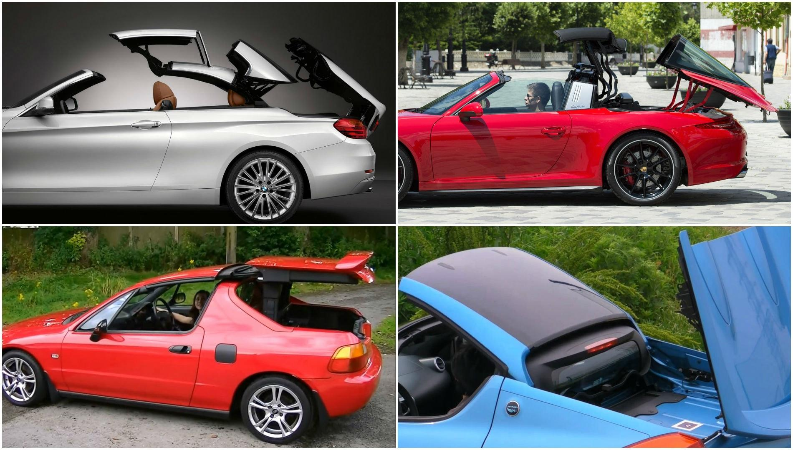

Convertible cars, with their open-top designs, offer drivers a unique blend of freedom and style, allowing them to enjoy the open road with an unobstructed view of the sky. These vehicles have seen a resurgence in popularity in recent years, fueled by technological advancements and a renewed interest in driving experiences that emphasize connection with the environment. As the automotive market expands, convertible cars are increasingly appealing to a diverse demographic, captivated by both their aesthetic appeal and the unrivaled driving pleasure they provide.

This article aims to illuminate the world of convertible cars, providing readers with a detailed understanding of their different types, the mechanics that set them apart, and why they continue to captivate car enthusiasts. Intriguingly, the article also ventures into uncharted territory by exploring the potential connections between convertible cars and the high-tech realm of algorithmic trading. Although these two domains might seem unrelated at first glance, they share a common thread: the utilization of advanced technology to enhance performance and user experience.

SEO plays a crucial role in structuring this narrative. By strategically employing keywords, the article ensures that information is accessible and engaging to readers seeking insights on convertible cars and their unexpected link to algorithmic trading. Each keyword is thoughtfully integrated, guiding the reader through a comprehensive exploration of automotive trends and technological intersections.

As we delve deeper into the material, the discussion will encompass the diverse types of convertible cars available today, provide a technical viewpoint on convertible mechanisms, and examine the intriguing role of algorithmic trading in shaping automotive trends. This multifaceted approach seeks to provide readers with a thorough understanding of how these elements converge, painting a picture of an automotive industry that is as dynamic as it is innovative.

## Table of Contents

## What Are Convertible Cars?

Convertible cars, characterized by their ability to transform from an enclosed vehicle to an open-air driving experience, are a distinctive segment within the automotive industry. These vehicles are equipped with retractable roofs, which can be either automated or manual, and come in various forms such as soft-tops or hard-tops. The allure of convertible cars lies in their unique blend of style and functionality, providing an exhilarating driving experience and a connection with the surrounding environment that is unparalleled by standard vehicles.

### History and Evolution

The history of convertible cars dates back to the early days of the automobile. Initially, all cars were open due to the simplicity of early vehicle design. However, as technology advanced, closed vehicles became standard for practicality and comfort. The transition to convertibles as we know them began in the early 20th century, primarily as luxury vehicles for those who could afford the novelty of an open-air drive. Over the decades, convertibles have evolved significantly, incorporating advanced materials and technologies to enhance their usability and appeal. Notable milestones in their evolution include the introduction of fully automatic tops and the development of more robust and weather-resistant materials.

### Popular Models

Today, the market offers a diverse array of convertible models catering to varying tastes and preferences. Some of the most acclaimed models include the Mazda MX-5 Miata, known for its sporty performance and affordability, the Porsche 911 Cabriolet, celebrated for its luxury and engineering excellence, and the Ford Mustang Convertible, which combines classic style with modern amenities. Each of these models exemplifies the appeal of convertibles, blending performance with the joy of open-air motoring.

### Demographics and Lifestyle

The demographic for convertible car buyers is diverse, often including individuals who prioritize lifestyle and driving pleasure over practicality. Convertibles tend to attract buyers with a penchant for travel, exploration, and those who live in climates conducive to open-air driving. While traditionally favored by the baby boomer generation, there is a growing interest among younger demographics, driven by an appreciation for the aesthetic and experiential benefits convertibles offer.

### Ongoing Appeal

Convertibles continue to captivate car enthusiasts for several reasons. The unparalleled driving experience, characterized by exposure to natural elements, offers an emotive connection to driving. Additionally, convertibles often serve as a status symbol, a testament to personal style and sophistication. The advancements in technology that have improved the usability and safety of convertibles also contribute to their enduring popularity. Despite shifts in market trends and the rise of practical vehicle types, the convertible remains a beloved choice for those seeking an extraordinary driving experience.

## Different Types of Convertible Cars

Convertible cars have a diverse range of types, each with its unique design and functionality, catering to different preferences and needs. Understanding these types is essential for potential buyers and car enthusiasts alike.

### Roadsters

Roadsters are two-seat convertibles known for their sporty appeal and aerodynamic design. Typically, roadsters have a low, sleek profile, which enhances their performance and aesthetic allure. Iconic models include the Mazda MX-5 Miata and the Porsche Boxster. 

**Pros and Cons:**
- **Pros:** Roadsters are designed for optimal performance, offering excellent handling and a thrilling driving experience. Their compact size contributes to agility, making them ideal for urban contexts and winding roads.
- **Cons:** Their two-seat configuration limits passenger capacity and storage space, making them less practical for long journeys or family use.

### Cabriolets

Cabriolets, or convertibles, are full-sized vehicles with retractable roofs. Unlike roadsters, cabriolets often accommodate four or more passengers, providing a blend of luxury and practicality. Models like the Audi A5 Cabriolet and BMW 4 Series are popular in this category.

**Pros and Cons:**
- **Pros:** Cabriolets offer a balance between performance and comfort, with spacious interiors and luxury features. They provide an open-air driving experience without sacrificing passenger comfort.
- **Cons:** The added weight of the retractable roof mechanism can affect fuel efficiency and handling compared to non-convertible models.

### Targa Tops

Targa tops offer a compromise between a full convertible and a fixed-roof coupe. They feature a removable roof panel, leaving the rear window structure intact, offering structural rigidity and safety compared to fully open tops. The Porsche 911 Targa is a classic example.

**Pros and Cons:**
- **Pros:** The targa design maintains structural integrity and safety while still offering an open-air experience. It provides the versatility of a coupe and a convertible.
- **Cons:** The process of removing and storing the roof panel can be cumbersome, and the open space is more limited than full convertibles.

### Variations in Design and Function

Convertible designs vary significantly in terms of roof mechanisms. Hardtop convertibles use rigid panels, providing better insulation and security but adding weight. Soft tops are lighter and easier to operate but may offer less protection from the elements.

### Use Cases and Preferences

- **Geographic and Climatic Considerations:** In regions with warm, sunny climates, convertibles are popular for their ability to enhance the outdoor driving experience. Conversely, in areas with frequent rain or cold weather, the utility of convertibles may be limited.
- **Urban vs. Rural Use:** Roadsters, with their compact size, are favored in urban settings, while cabriolets might be preferred for long drives across rural landscapes.

### Trend Towards Hybrid and Electric Convertibles

The automotive industry is witnessing a shift towards hybrid and electric models to meet sustainability goals. Manufacturers are increasingly introducing hybrid and electric convertibles to combine eco-friendly technologies with the allure of open-air driving. Models like the BMW i8 Roadster and the upcoming electric variants from brands like Tesla and Audi showcase this emerging trend. This evolution reflects a growing consumer demand for vehicles that are both environmentally conscious and enjoyable to drive.

In conclusion, the variety of convertible car types ensures that there is likely a model to suit nearly every lifestyle and preference, offering both aesthetic and practical benefits.

## Understanding Convertible Mechanisms

Convertible mechanisms have undergone significant technological advancements, enhancing both functionality and user experience. At the core, these systems are designed to enable a vehicle to transform between open-top and closed-top configurations. Historically, early convertible tops were manually operated, requiring physical effort and time to either retract or secure the top. 

Manual convertible tops typically consist of a series of levers and pulls that must be synchronized manually. Users engage in a sequence of movements to unlock, fold, and secure the top, resulting in a more tactile and engaging experience but also one that demands physical effort and time.

In contrast, automatic convertible tops offer the convenience of motorized operation. This type of system integrates electric motors, hydraulic pumps, and sophisticated control units to manage the positioning of the top seamlessly. By merely pressing a button, users can deploy or retract the roof in a matter of seconds, a convenience that has significantly contributed to the popularity of convertibles in modern markets.

The materials used in convertible tops have also seen developments, with an emphasis on durability, noise reduction, and energy efficiency. Contemporary convertible tops often utilize a blend of textiles and synthetic materials coated with polymers. These materials are not only lightweight but also provide excellent insulation against weather elements and reduce road noise. Enhanced with noise-damping technologies, these materials aid in lowering the vehicle's drag coefficient, impacting its energy efficiency positively.

Innovations have further refined convertible mechanisms. The integration of automatic weather sensors allows vehicles to autonomously sense changes in weather conditions and automatically deploy the roof if rain is detected, a feature highly valued in regions with unpredictable climates. Furthermore, wind deflectors, often built into the top mechanism or able to be deployed, minimize wind turbulence and noise when the car is in an open-top configuration, enhancing passenger comfort.

Maintenance for convertible mechanisms is essential to ensure their longevity and reliable operation. Regular inspections and lubrication of moving parts are necessary. Common issues include mechanical wear, motor failures, or hydraulic leaks in automatic systems. Fabric deterioration due to ultraviolet light exposure and weather conditions also constitutes a frequent maintenance concern, necessitating the use of protectants and conditioners designed specifically for convertible tops.

Overall, understanding convertible mechanisms is essential to appreciate the complexities and advancements that have made them an attractive choice in the automotive industry. As technology progresses, we can expect further innovations that enhance convenience, sustainability, and user engagement in the convertible segment.

## Algorithmic Trading in the Context of Convertible Cars

Algorithmic trading, which involves the use of computer algorithms to execute trades at high speed and frequency, has become an integral part of many industries, including the automotive sector. This trade execution approach has the potential to revolutionize how automotive manufacturers, including those producing convertible cars, analyze market data and predict trends. By leveraging large data sets and advanced statistical models, [algorithmic trading](/wiki/algorithmic-trading) can facilitate more informed decisions regarding production, marketing, and sales strategies, specifically tailored to dynamic consumer preferences and market conditions.

The convergence of convertible car trends and algorithmic trading strategies is evident in several areas. First, as consumer preferences fluctuate based on economic factors and lifestyle changes, algorithmic trading algorithms can analyze patterns and predict future demand for specific models or features. For instance, if data suggest a rising interest in environmentally friendly vehicles, manufacturers could adjust their convertible car offerings to include more hybrids or electric variants.

Another intersection lies in the realm of big data and predictive analytics. Automotive companies collect vast amounts of data on consumer behavior, market trends, and vehicle usage through various sources, including social media, feedback surveys, and in-car telemetry systems. This data is invaluable for algorithmic trading, as it helps develop predictive models that can forecast future market conditions. Consequently, manufacturers can align their production schedules and inventory management with anticipated demand, optimizing operational efficiency and reducing economic waste.

Several automakers have begun to utilize algorithmic trading approaches within their operations. For example, some companies deploy algorithms to analyze sales data and predict which models will perform well in specific geographic regions. This allows them to allocate resources more effectively and tailor their marketing campaigns accordingly. Moreover, by understanding the sociodemographic profiles associated with convertible car buyers, manufacturers can develop targeted strategies to maximize market penetration and enhance brand loyalty.

Looking ahead, the potential connections between advanced trading systems and automotive design and sales strategies are promising. As trading algorithms become more sophisticated, they could integrate emerging technologies like [artificial intelligence](/wiki/ai-artificial-intelligence) and [machine learning](/wiki/machine-learning) to process unstructured data efficiently. This technological advancement could lead to the development of highly customized vehicles that adapt to consumer preferences in real time, revolutionizing the way cars—including convertibles—are designed, manufactured, and marketed.

In summary, the synergy between algorithmic trading and convertible car production offers exciting possibilities for automakers. By harnessing the power of big data, predictive analytics, and algorithmic strategies, manufacturers can create innovative solutions to meet changing consumer demands and drive the future of the automotive industry. As these technologies continue to evolve, the potential impact on convertible car design and market dynamics will likely be substantial, paving the way for a technologically-driven automotive sector.

## Conclusion

Convertible cars encapsulate a unique segment of the automotive market, showcasing diverse types and mechanisms that appeal to enthusiasts worldwide. These vehicles, with their ability to transform, offer an unparalleled driving experience, combining aesthetic appeal with functionality. From classic roadsters to modern electric convertibles, the evolution of these cars reflects ingenuity and adaptation to changing consumer preferences.

Throughout this discussion, a surprising intersection emerged between convertible cars and algorithmic trading. Both fields, while seemingly distinct, are linked by their reliance on data and technology. Algorithmic trading strategies, which utilize big data and predictive analytics, can inform and predict consumer behavior and production trends in the automotive industry. This convergence is indicative of a broader trend where technological innovation reshapes traditional industries, influencing both the design and marketing strategies within the automotive sector.

Technological advances promise to significantly impact the future of convertible cars and the automotive industry as a whole. Innovations such as automatic weather sensors, hybrid and electric models, and enhanced materials for noise reduction and energy efficiency point towards a future where technology and sustainability go hand in hand. As we look forward, it's crucial for consumers and industry players to maintain awareness of these advancements to stay competitive.

This exploration not only enhances our understanding of convertible cars but also underscores the broader implications of integrating financial technology with automotive design. Readers are encouraged to pursue an in-depth understanding of these innovations and their potential, as the synergy between automotive and financial technologies could drive significant changes and opportunities in both fields. Stay informed and consider the impact of these evolving technologies in shaping the future of driving and market dynamics.

## References & Further Reading

[1]: Reif, K. (Ed.). (2014). ["Automotive Handbook."](https://archive.org/details/automotivehandbo0000reif) Robert Bosch GmbH.

[2]: "How Convertibles Work" by Craig Freudenrich, Ph.D., HowStuffWorks. Available at: https://auto.howstuffworks.com/convertible.htm

[3]: "The Car Design Yearbook" series by Stephen Newbury, which provides insights into automotive design and trends.

[4]: Yaser, S. A., & Ng, E. (2009). ["Classic Convertibles: Design, Performance, Engineering, and Racing."](https://www.tandfonline.com/doi/pdf/10.1080/14697688.2016.1147843)

[5]: Caroll, J. (2016). ["Algorithmic Trading: Winning Strategies and Their Rationale."](https://www.wiley.com/en-us/Algorithmic+Trading%3A+Winning+Strategies+and+Their+Rationale-p-9781118460146) Wiley Trading.

[6]: "Algorithmic and High-Frequency Trading" by Álvaro Cartea, Sebastian Jaimungal, and José Penalva, published by Cambridge University Press.

[7]: "Convertible Car Buying Guide" by Consumer Reports, available at: https://www.consumerreports.org/cro/cars/convertible-buying-guide/index.htm