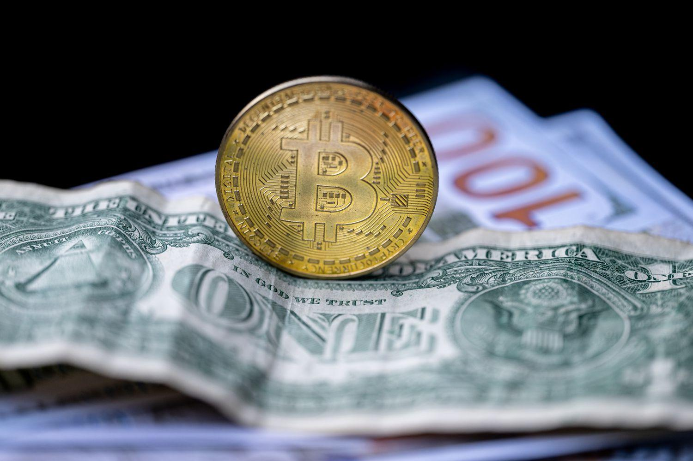

## Table of Contents

## What is a convertible currency?

A convertible currency is a type of money that can be easily exchanged for another country's currency. This means you can take your money and trade it for money from another country without many restrictions. For example, if you have US dollars, you can exchange them for euros or yen at a bank or currency exchange office.

Convertible currencies are important for international trade and travel. They make it easier for people and businesses to buy things from other countries or go on trips abroad. Countries with strong economies and stable governments usually have convertible currencies. Examples include the US dollar, the euro, and the Japanese yen.

## How does a currency become convertible?

A currency becomes convertible when a country's government decides to let its money be easily changed into other countries' money. This usually happens when a country has a strong economy and a stable government. The government might also need to have enough foreign money saved up to make sure they can handle the exchanges. They do this by setting rules that allow people and businesses to trade their money freely.

Once a country decides to make its currency convertible, it often works with banks and other financial groups to set up systems for exchanging money. These systems need to be easy to use and fair, so people trust them. If a country can keep its economy strong and its government stable, more people will want to use its currency, making it even more convertible. This can help the country's economy grow because it makes it easier for people to buy and sell things with other countries.

## What are the benefits of having a convertible currency for a country?

Having a convertible currency helps a country a lot. It makes it easier for people and businesses to buy and sell things with other countries. When a country's money can be easily changed into other countries' money, it helps the country's economy grow. More businesses from other countries might want to invest in the country because they know they can take their money out easily if they need to. This can bring more jobs and money into the country.

Another benefit is that it makes traveling easier for the country's people. They can go to other countries and use their money without many problems. This can help the tourism industry grow because more people from the country might want to travel abroad. It also makes the country more attractive to tourists from other countries, who know they can exchange their money easily. Overall, a convertible currency can make a country's economy stronger and help its people live better lives.

## Can you list some examples of convertible currencies?

Some examples of convertible currencies are the US dollar, the euro, and the Japanese yen. The US dollar is used a lot all over the world. Many countries keep US dollars in their banks because it's easy to change into other money. The euro is used by many countries in Europe, like Germany and France. It's easy to exchange euros for other currencies too. The Japanese yen is Japan's money, and it's also easy to change into other currencies.

These currencies are used a lot in international trade and travel. People and businesses like them because they can be easily changed into other money. This makes it simpler to buy and sell things with other countries. It also makes traveling easier because you can use these currencies in many places around the world.

## What is the difference between a fully convertible and a partially convertible currency?

A fully convertible currency is one that can be changed into any other country's money without any restrictions. This means people and businesses can freely exchange it for other currencies whenever they want. Countries with strong economies and stable governments often have fully convertible currencies, like the US dollar, the euro, and the Japanese yen. This makes it easy for people to buy things from other countries or travel abroad.

A partially convertible currency, on the other hand, has some restrictions on how it can be changed into other currencies. These restrictions might come from the government or the central bank. For example, a country might limit how much of its currency can be exchanged or only allow exchanges for certain purposes, like trade but not for moving money out of the country. This can make it harder for people and businesses to do international trade or travel. Countries might choose to have a partially convertible currency if their economy is not as strong or if they want to control the flow of money in and out of the country.

## How does currency convertibility affect international trade?

Currency convertibility makes international trade easier. When a country's money can be changed into another country's money without many problems, businesses can buy and sell things more easily across borders. This helps companies grow because they can find customers in other countries. It also encourages more foreign businesses to invest in the country, bringing in new jobs and money. For example, if a business in the United States wants to buy goods from Japan, it's easier if both countries have convertible currencies like the US dollar and the Japanese yen.

On the other hand, if a country's currency is not easily convertible, it can make international trade harder. Restrictions on changing money can slow down deals and make it more complicated for businesses to work with other countries. This can limit how much a country's economy can grow because fewer foreign businesses might want to invest there. For instance, if a country has a partially convertible currency, businesses might think twice about investing because they might not be able to take their money out easily. This can affect the country's ability to participate fully in the global market.

## What are the risks associated with currency convertibility?

Having a convertible currency can be risky for a country. One big risk is that money might leave the country too quickly. If people and businesses think the country's economy is not doing well, they might want to change their money into a different country's money. This can make the country's currency weaker and cause problems for the economy. It can also make it harder for the government to control how much money is in the country.

Another risk is that a convertible currency can make a country more affected by what happens in other countries. If there's a big problem in another country's economy, it might affect the country with the convertible currency too. For example, if a lot of businesses in the country are trading with a country that suddenly has an economic crisis, it could hurt the country's own businesses. This means the country's economy can be less stable because it is more connected to what happens in other parts of the world.

## How do governments control or restrict currency convertibility?

Governments can control or restrict currency convertibility by setting rules on how much money can be changed into other countries' money. They might say that people can only change a certain amount of money each year. Or they might say that money can only be changed for certain reasons, like for buying things from other countries but not for moving money out of the country. This helps the government keep more control over the country's money and makes sure that too much money doesn't leave the country too quickly.

Another way governments control currency convertibility is by working with banks and other financial groups. They might tell these groups to follow certain rules when they help people change money. For example, the government might say that banks need to check why someone wants to change money and only allow it if it's for a good reason. This helps the government keep track of how much money is being changed and makes sure it's being done in a way that helps the country's economy stay strong.

## What role do international financial institutions play in currency convertibility?

International financial institutions, like the International Monetary Fund (IMF) and the World Bank, help countries make their currencies more convertible. They do this by giving advice and sometimes money to countries that want to make their economies stronger. These institutions work with countries to set up rules and systems that make it easier for people and businesses to change their money into other countries' money. They also help countries keep their economies stable so that more people will want to use their currency.

Sometimes, these institutions give loans to countries that need help. The loans come with rules that the countries have to follow, like making their currency more convertible. This can help the country's economy grow because it makes it easier for businesses to trade with other countries. But it can also be hard for the country if it's not ready for these changes. The international financial institutions try to balance helping the country grow with making sure it doesn't take on too much risk.

## How does the convertibility of a currency impact foreign direct investment?

When a country's currency is easy to change into other countries' money, it makes it more attractive for foreign businesses to invest there. This is called foreign direct investment (FDI). If businesses know they can take their money out of the country easily, they are more likely to want to invest. This can help the country's economy grow because more money comes in, and more jobs are created. For example, if a company from the United States wants to build a factory in another country, it's easier if that country's currency is convertible.

On the other hand, if a country's currency is hard to change into other money, it can scare away foreign investors. They might worry that they won't be able to get their money back if they need to. This can slow down the country's economy because fewer businesses want to invest there. So, having a convertible currency can make a big difference in how much foreign direct investment a country gets.

## What are the economic theories supporting or opposing currency convertibility?

Some economic theories support currency convertibility because it can help a country's economy grow. When a country's money can be easily changed into other countries' money, it makes international trade and investment easier. This can bring more businesses and jobs to the country. People like the idea of a convertible currency because it helps them buy things from other countries and travel more easily. Economists who support convertibility believe it makes a country's economy more connected to the rest of the world, which can lead to more growth and development.

Other economic theories oppose currency convertibility because it can be risky. If a country's currency is too easy to change, money might leave the country too quickly if people think the economy is not doing well. This can make the currency weaker and cause economic problems. Some economists think that countries should control how much money can be changed to protect their economy. They believe that too much convertibility can make a country's economy less stable, especially if it's not ready for the changes that come with being more connected to the global market.

## How have historical events influenced the convertibility of currencies?

Historical events have played a big role in how easy it is to change one country's money into another's. After World War II, many countries worked together to set up a system to help their economies grow. This system, called the Bretton Woods system, made it easier for countries to change their money into US dollars, which helped international trade. But when this system ended in the early 1970s, countries had to find new ways to make their money convertible. This led to more countries opening up their economies and making their currencies easier to change.

Another big event that affected currency convertibility was the fall of the Soviet Union in the early 1990s. Before this, many countries in Eastern Europe and Central Asia had strict rules about changing their money. After the Soviet Union fell apart, these countries started to open up their economies. They made their currencies more convertible to attract businesses from other countries and to help their economies grow. But this also brought new challenges, like making sure their economies were stable enough to handle the changes.

## What is the Intersection of Convertible Currencies and Algo Trading?

Combining [algorithmic trading](/wiki/algorithmic-trading) with convertible currencies offers a myriad of possibilities for optimized trading strategies. Algorithmic trading, utilizing sophisticated algorithms and computing power, allows for increased trading speed and efficiency. This leads to enhanced market responsiveness and reduced risk, as trades can be executed swiftly in response to market fluctuations.

In the foreign exchange ([forex](/wiki/forex-system)) market, where convertible currencies are heavily traded, algorithmic trading can exploit advanced predictive analytics. By leveraging historical data and real-time market information, these algorithms can predict currency price movements, facilitating strategic trading decisions with minimal human intervention. 

$$
\text{{Effective Trading Strategy}} = \text{{Algorithm}}( \text{{Historical Data}}, \text{{Real-Time Market Data}} )
$$

By continuously analyzing market data, algorithmic trading systems can adapt to the [volatility](/wiki/volatility-trading-strategies) and dynamics of currency markets. This adaptability ensures that trading strategies remain calibrated to current market conditions, increasing the likelihood of successful trades. 

For instance, in Python, a basic implementation of predictive analytics for currency trading could involve using [machine learning](/wiki/machine-learning) models. These models could be trained on historical exchange rate data to predict future movements, as shown in the following pseudocode:

```python
from sklearn.model_selection import train_test_split
from sklearn.ensemble import RandomForestRegressor
import numpy as np

# Sample historical exchange rate data
exchange_rate_data = np.array([[1.1, 1.2, 1.3], [1.15, 1.25, 1.35], [1.2, 1.3, 1.4]])
target = np.array([1.25, 1.3, 1.35])  # Future exchange rates to predict

# Splitting the data
X_train, X_test, y_train, y_test = train_test_split(exchange_rate_data, target, test_size=0.2)

# Model training
model = RandomForestRegressor()
model.fit(X_train, y_train)

# Prediction
prediction = model.predict(X_test)
print("Predicted Future Exchange Rate:", prediction)
```

The seamless integration of convertible currencies and algorithmic trading contributes significantly to efficient global financial markets, optimizing trading strategies and maximizing opportunities for traders. This intersection is a cornerstone for future innovations and strategies in the currency trading landscape.

## References & Further Reading

[1]: ["Advances in Financial Machine Learning"](https://www.amazon.com/Advances-Financial-Machine-Learning-Marcos/dp/1119482089) by Marcos Lopez de Prado

[2]: ["Machine Learning for Algorithmic Trading"](https://github.com/stefan-jansen/machine-learning-for-trading) by Stefan Jansen

[3]: ["Quantitative Trading: How to Build Your Own Algorithmic Trading Business"](https://www.amazon.com/Quantitative-Trading-Build-Algorithmic-Business/dp/1119800064) by Ernest P. Chan

[4]: ["Evidence-Based Technical Analysis: Applying the Scientific Method and Statistical Inference to Trading Signals"](https://www.amazon.com/Evidence-Based-Technical-Analysis-Scientific-Statistical/dp/0470008741) by David Aronson

[5]: Bergstra, J., Bardenet, R., Bengio, Y., & Kégl, B. (2011). ["Algorithms for Hyper-Parameter Optimization."](https://dl.acm.org/doi/10.5555/2986459.2986743) Advances in Neural Information Processing Systems 24.