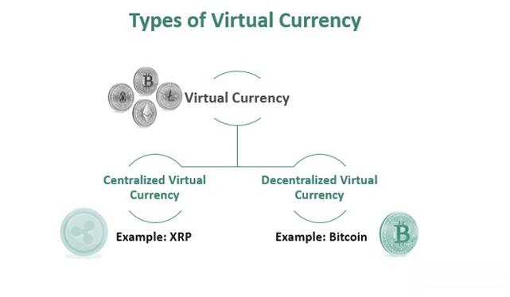

This article aims to provide a comprehensive overview of various currency types, with a particular focus on convertible currencies and their implications in international finance. Convertible currencies are of great significance in financial markets due to their ability to be traded freely on the global foreign exchange market with minimal restrictions. These currencies play a crucial role in facilitating smooth international trade transactions and providing a reliable store of value, which is essential for maintaining liquidity and stability in the global economy.

The development and rise of algorithmic trading present an intriguing aspect to currency convertibility. Algorithmic trading, often referred to as "algo trading," employs automated systems to execute trades based on predefined criteria. This approach offers substantial advantages in currency trading by enabling swift, data-driven decisions, which enhance the efficiency and liquidity of trading activities. Through the use of sophisticated algorithms, traders can leverage advanced predictive analytics to optimize trading strategies, thereby enabling seamless global transactions.



Understanding the interplay between currency convertibility and algorithmic trading is crucial for navigating today's complex financial ecosystems. With the constantly evolving landscape of financial technologies, insights into these elements are invaluable for investors and policymakers aiming to optimize and navigate global financial systems effectively. As algorithmic trading continues to evolve alongside traditional currency markets, it is essential to maintain a delicate balance between embracing technological advancements and ensuring ethical practices and regulatory measures that safeguard market integrity and investor trust.

## Table of Contents

## Understanding Currency Types

Currencies can be categorized based on their convertibility within international markets, a feature that influences their utility in global trade and financial exchanges. Convertibility refers to the ease with which a currency can be exchanged for another currency or gold. Based on this characteristic, currencies are typically divided into fully convertible, partially convertible, and non-convertible categories, with each classification affecting international financial dynamics in different ways.

**Fully Convertible Currencies** are those which can be exchanged without significant restrictions imposed by government policies. These currencies provide high liquidity and stability, making them an integral part of international trade. Examples include the US Dollar (USD), Euro (EUR), Japanese Yen (JPY), and British Pound (GBP). The ability to trade these currencies freely in global markets means they are widely used in international transactions and held as reserve currencies by central banks across the world. This unrestricted convertibility minimizes costs and risks associated with currency conversion, fostering an efficient exchange system that benefits global trade and investment.

Conversely, **Partially Convertible Currencies** are subject to limitations that governments impose on currency movements across borders. These controls are typically intended to manage the national economy, prevent capital flight, or control exchange rates. For instance, the Chinese Yuan (CNY) is partially convertible, as the Chinese government restricts its convertibility for capital account transactions while allowing it for current account transactions. The regulated nature of these currencies can lead to increased transaction costs and risks, as conversions are subject to government policies and may require special permissions or adherence to specific guidelines.

**Non-Convertible Currencies**, or blocked currencies, cannot be freely exchanged on the foreign exchange market for other currencies. Such restrictions usually reflect economic instability, political decisions, or efforts to control capital flows. Countries with non-convertible currencies often rely on currency pegs or other exchange rate mechanisms to maintain monetary stability. The implications for international commerce are significant as businesses and investors face substantial barriers to conducting transactions in these currencies, often necessitating alternative arrangements, such as barter or the use of convertible currencies, for international trade and investment.

In recent years, **Convertible Virtual Currencies** have emerged as a novel category, represented by cryptocurrencies such as Bitcoin and Ethereum. Though not legal tender in most jurisdictions, these digital currencies function as alternatives to traditional money by facilitating exchanges based on blockchain technology. Cryptocurrencies offer the advantage of decentralized control and borderless transactions, presenting new paradigms in financial convertibility. However, their inherent [volatility](/wiki/volatility-trading-strategies), regulatory uncertainty, and limited acceptance pose challenges to their widespread adoption as reliable mediums of exchange.

The convertibility of a currency reflects the foundational economic policies and stability of a country, impacting its role and effectiveness in the global market. Understanding the distinctions among these currency types helps elucidate the complexity of international financial systems and the varied approaches countries adopt to manage their economies in the context of global trade.

## Mechanics of Convertible Currency

Convertible currencies are integral to the smooth functioning of foreign exchange markets, allowing for the effortless buying and selling of goods and securities across borders. These currencies are recognized for their reliability as a store of value, due to their ability to be exchanged with minimal restriction. Among the various global currencies, the US Dollar, Euro, Japanese Yen, and British Pound are the most commonly traded fully convertible currencies. This widespread adoption results from their stability and the trust they command in international markets.

The transparency offered by convertible currencies is a significant enabler of international trade. This transparency arises from the ability to convert these currencies at will, which facilitates predictable and consistent pricing in global markets. For businesses engaged in international transactions, this translates into reduced regulatory burdens, as they can engage with partners in multiple countries without facing impediments that are typically associated with currency restrictions.

One of the defining features of fully convertible currencies is their [liquidity](/wiki/liquidity-risk-premium). Liquidity refers to the ease with which an asset can be converted into cash without significantly affecting its price. Fully convertible currencies benefit from high liquidity since they are traded extensively across global financial centers. This liquidity is not only advantageous for currency holders, who can quickly exchange them into other assets or currencies, but also for governments and institutions, which rely on these currencies to manage economic stability and support monetary policy effectively.

Stability is another hallmark of fully convertible currencies. This attribute is closely tied to the economic conditions and governance frameworks of the countries that issue them. A stable currency maintains its purchasing power over time, which in turn instills confidence among international traders and investors. Consequently, countries with fully convertible currencies often enjoy lower costs of borrowing and are perceived as safe havens during periods of global financial uncertainty.

In summary, the mechanics of convertible currencies are characterized by their seamless convertibility, widespread acceptance, and intrinsic role in fostering liquidity and stability in the international financial landscape. These aspects collectively contribute to a more integrated and efficient global economy, where trade and investment can flourish without undue constraints imposed by currency inconvertibility.

## Types of Convertible Currencies

Convertible currencies can be categorized into various types based on their exchangeability in international financial markets. Understanding these distinctions is crucial for comprehending their roles in global trade and finance.

**Fully Convertible Currencies:** These currencies can be readily exchanged with foreign currencies with minimal or no restrictions. They are characterized by high liquidity and stability, making them the preferred choice for international trade and investment. Countries with robust and stable economic environments typically have fully convertible currencies. Examples include the US Dollar (USD), Euro (EUR), Japanese Yen (JPY), and British Pound (GBP). The unrestricted nature of these currencies facilitates global financial transactions by promoting transparency and reducing regulatory hurdles.

**Partially Convertible Currencies:** These currencies are subject to certain governmental controls that limit the volume of exchange. Such restrictions are often implemented to manage capital flow and protect the national economy from potential external shocks. The Chinese Yuan (CNY) is a prime example, as it is only partially convertible due to China's regulatory practices and economic policies. These limitations can influence the currency's market dynamics and affect its international use.

**Non-Convertible Currencies:** These are currencies that face significant restrictions in exchange. Typically seen in economies with high inflation or political instability, non-convertible currencies cannot be freely traded on the foreign exchange market. Governments may impose these restrictions to maintain control over the domestic economy and prevent capital flight. As a result, these currencies are primarily utilized for internal transactions within their respective countries and have limited international applicability.

**Convertible Virtual Currencies:** With the advent of digital technology, virtual currencies have emerged as a new class of convertible currencies. Although they are not recognized as legal tender, digital currencies like Bitcoin and Ethereum provide an alternative to traditional currencies. They offer unique advantages such as decentralization and reduced intermediaries in international transactions. However, their volatility and the regulatory landscape continue to pose challenges for widespread acceptance and integration into mainstream financial systems.

Each type of convertible currency has distinct characteristics that influence its use and impact in the global financial ecosystem. Understanding these differences is essential for making informed decisions in international trade and investment.

## Algorithmic Trading and Convertible Currencies

Algorithmic trading, commonly referred to as 'algo trading,' employs advanced automated systems to execute trades based on predefined criteria and algorithms. This method of trading is paramount in the foreign exchange markets where convertible currencies are predominantly traded. The systems integrate a multitude of data points, enabling them to make rapid and informed decisions that would be challenging for human traders to achieve manually.

One of the primary advantages of [algorithmic trading](/wiki/algorithmic-trading) in the context of convertible currencies is its enhancement of market efficiency. Through swift execution of trades, algorithms facilitate increased market liquidity, ensuring that there are ample buyers and sellers available. This liquidity is crucial for maintaining stable currency prices and minimizing the impact of large transactions on the market.

Another benefit of algo trading is the improvement in pricing. Algorithms analyze vast amounts of market data in real-time, allowing for competitive pricing strategies. This capability ensures that trade executions occur at the most favorable prices available, reducing the opportunity for price manipulations and slippage.

Moreover, algorithmic trading significantly reduces transaction costs. Traditional trading methods require manual analysis and decision-making, which can be time-consuming and error-prone. Automated systems, on the other hand, operate at a fraction of the cost by minimizing the need for human intervention and ensuring optimal execution speeds.

Understanding the dynamics of algorithmic trading is fundamental for investors participating in currency markets. The strategic advantage provided by these systems can be a decisive [factor](/wiki/factor-investing) in investment success. Notably, market participants who leverage algo trading are often able to exploit [arbitrage](/wiki/arbitrage) opportunities and react swiftly to market news, further underscoring the importance of these systems in the fast-paced world of currency trading.

In conclusion, algorithmic trading is a transformative force in the currency markets, enhancing the tradability and efficiency of convertible currencies. By enabling rapid, data-driven decisions, it not only improves market liquidity and pricing but also reduces costs, all of which are critical for maintaining competitive advantage in international finance.

## The Intersection of Convertible Currencies and Algo Trading

Combining algorithmic trading with convertible currencies offers a myriad of possibilities for optimized trading strategies. Algorithmic trading, utilizing sophisticated algorithms and computing power, allows for increased trading speed and efficiency. This leads to enhanced market responsiveness and reduced risk, as trades can be executed swiftly in response to market fluctuations.

In the foreign exchange ([forex](/wiki/forex-system)) market, where convertible currencies are heavily traded, algorithmic trading can exploit advanced predictive analytics. By leveraging historical data and real-time market information, these algorithms can predict currency price movements, facilitating strategic trading decisions with minimal human intervention. 

$$
\text{{Effective Trading Strategy}} = \text{{Algorithm}}( \text{{Historical Data}}, \text{{Real-Time Market Data}} )
$$

By continuously analyzing market data, algorithmic trading systems can adapt to the volatility and dynamics of currency markets. This adaptability ensures that trading strategies remain calibrated to current market conditions, increasing the likelihood of successful trades. 

For instance, in Python, a basic implementation of predictive analytics for currency trading could involve using [machine learning](/wiki/machine-learning) models. These models could be trained on historical exchange rate data to predict future movements, as shown in the following pseudocode:

```python
from sklearn.model_selection import train_test_split
from sklearn.ensemble import RandomForestRegressor
import numpy as np

# Sample historical exchange rate data
exchange_rate_data = np.array([[1.1, 1.2, 1.3], [1.15, 1.25, 1.35], [1.2, 1.3, 1.4]])
target = np.array([1.25, 1.3, 1.35])  # Future exchange rates to predict

# Splitting the data
X_train, X_test, y_train, y_test = train_test_split(exchange_rate_data, target, test_size=0.2)

# Model training
model = RandomForestRegressor()
model.fit(X_train, y_train)

# Prediction
prediction = model.predict(X_test)
print("Predicted Future Exchange Rate:", prediction)
```

The seamless integration of convertible currencies and algorithmic trading contributes significantly to efficient global financial markets, optimizing trading strategies and maximizing opportunities for traders. This intersection is a cornerstone for future innovations and strategies in the currency trading landscape.

## Challenges and Ethical Considerations

Issues such as market manipulation and ethical transparency in algorithmic trading require careful analysis. Algorithmic trading, while enhancing efficiency and liquidity in currency markets, can also pose significant challenges that affect market integrity.

One critical concern is market manipulation. Algorithmic trading systems, operating at high speeds and processing vast amounts of data, can inadvertently or intentionally distort market prices. Instances of "quote stuffing," where traders place and quickly cancel large amounts of orders, can create false market signals. These activities can erode trust, leading to an uneven playing field. Regulatory frameworks need to be robust enough to detect and deter such manipulative tactics.

Convertible currencies, though generally stable, are not immune to speculative attacks exacerbated by algorithmic systems. Speculative attacks can occur when traders exploit vulnerabilities in a currency's valuation through rapid, coordinated buying or selling. The presence of algorithmic trading amplifies this risk by enabling high-frequency trades that can lead to severe market swings. It is crucial to monitor these systems to mitigate potential destabilization risks.

To ensure ethical practices in currency trading and algorithmic applications, it is imperative to implement stringent regulatory frameworks. These frameworks should encompass stringent surveillance of trading activities, enforce transparent reporting standards, and mandate rigorous compliance measures. Cross-border cooperation among regulatory bodies can further enhance these efforts, considering the international nature of currency markets.

Stakeholders, including regulatory agencies, financial institutions, and technology providers, need to balance the benefits of algorithmic trading with its potential risks. By fostering a collaborative environment and promoting adherence to ethical standards, they can safeguard market integrity and protect investor trust. Educational initiatives and continuous monitoring are vital to maintaining a fair and resilient financial ecosystem. 

As financial technologies evolve, the focus should remain on aligning technological advancements with the overarching goal of fostering transparent and equitable markets. This necessitates a dynamic regulatory approach, adapting to new challenges and ensuring that the promise of efficiency does not override the principles of fairness and ethical trading practices.

## Conclusion

Currency convertibility is pivotal in ensuring the fluidity and efficiency of global trade and financial exchanges. Its role is to provide a reliable and stable framework where different national currencies can be exchanged with ease, contributing to the economic stability and growth of participating countries. This seamless convertibility enhances international trading activities by minimizing the friction involved in cross-border transactions, thus facilitating a more integrated global market.

In parallel, the advent of algorithmic trading has significantly transformed the landscape of convertible currencies. By leveraging complex algorithms and high-speed computational power, algorithmic trading systems can manage and execute trades much faster and with greater precision than manual trading methods. This mechanized efficiency leads to optimal pricing, increased market liquidity, and reduced transaction costs, thereby enhancing the attractiveness of engaging with convertible currencies.

The synergy between currency convertibility and algorithmic trading is a powerful tool for both investors and policymakers. Investors benefit from improved market conditions, including rapid response to market changes and minimized risks associated with currency volatility. Meanwhile, policymakers can use insights gleaned from this interaction to make informed decisions regarding financial regulations and economic policies, ensuring that the markets remain robust and well-regulated.

However, as financial technologies continue to advance, there is a pressing need for continuous monitoring and regulatory oversight. This ensures that the integrity of financial markets is preserved, and potential risks such as market manipulation or excessive speculation are mitigated. Adopting a proactive approach to regulation and analysis will help maintain an equitable and stable economic environment that benefits all stakeholders involved. Understanding the dynamic interplay between currency convertibility and algorithmic trading is essential for navigating and optimizing the future landscape of global finance.

## References & Further Reading

[1]: ["Advances in Financial Machine Learning"](https://www.amazon.com/Advances-Financial-Machine-Learning-Marcos/dp/1119482089) by Marcos Lopez de Prado

[2]: ["Machine Learning for Algorithmic Trading"](https://github.com/stefan-jansen/machine-learning-for-trading) by Stefan Jansen

[3]: ["Quantitative Trading: How to Build Your Own Algorithmic Trading Business"](https://www.amazon.com/Quantitative-Trading-Build-Algorithmic-Business/dp/1119800064) by Ernest P. Chan

[4]: ["Evidence-Based Technical Analysis: Applying the Scientific Method and Statistical Inference to Trading Signals"](https://www.amazon.com/Evidence-Based-Technical-Analysis-Scientific-Statistical/dp/0470008741) by David Aronson

[5]: Bergstra, J., Bardenet, R., Bengio, Y., & Kégl, B. (2011). ["Algorithms for Hyper-Parameter Optimization."](https://dl.acm.org/doi/10.5555/2986459.2986743) Advances in Neural Information Processing Systems 24.