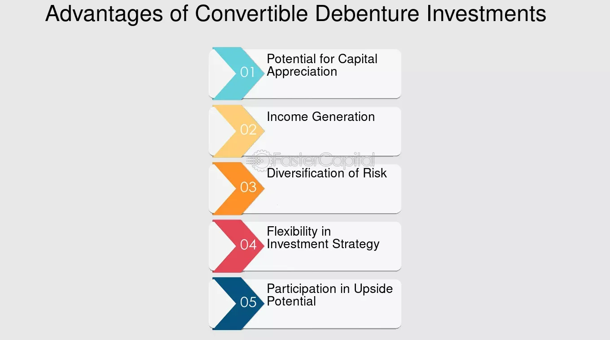

## Table of Contents

## What is a convertible debenture?

A convertible debenture is a type of loan that a company can take from investors. It's special because it can be changed, or "converted," into shares of the company's stock instead of being paid back with money. This gives the investor a choice: they can either get their money back with interest, like a regular loan, or they can turn their loan into ownership in the company.

This kind of debenture is popular with startups and growing companies. It helps them get the money they need without having to pay it back right away. For investors, it's a good deal because they might make more money if the company does well and the stock price goes up. But, there's also a risk because if the company doesn't do well, the investor might lose money.

## How does a convertible debenture differ from a regular debenture?

A convertible debenture and a regular debenture are both ways for a company to borrow money, but they have a key difference. A regular debenture is a straightforward loan where the company promises to pay back the borrowed money with interest over time. It's like a simple IOU that comes with a fixed interest rate, and the investor expects to get their money back with the agreed-upon interest.

On the other hand, a convertible debenture gives the investor an extra option. Besides getting their money back with interest, they can choose to convert the loan into shares of the company's stock. This means the investor can become a part-owner of the company if they believe it will grow and the stock value will increase. This added choice makes convertible debentures more flexible and potentially more rewarding for investors, but it also comes with the risk that the stock might not perform well.

## What are the key features of a convertible debenture?

A convertible debenture is a special type of loan that companies can get from investors. It has a big feature: the investor can choose to turn the loan into shares of the company's stock instead of getting their money back with interest. This choice makes it different from a regular loan. The investor might decide to convert if they think the company will do well and the stock price will go up. This can be a good deal for them because they might make more money than just getting interest.

There are also some other important things about convertible debentures. They usually have a set time when the investor can convert the loan into stock, called the conversion period. There's also a conversion rate, which tells how many shares the investor gets for each dollar of the loan. Sometimes, the debenture might have a lower [interest rate](/wiki/interest-rate-trading-strategies) than a regular loan because of the chance to convert it into stock. This can help the company save money on interest payments. But, if the company doesn't do well, the investor could lose money, so there's always a risk.

## Can you provide an example of a company that has issued convertible debentures?

Tesla, the electric car company, is a good example of a company that has issued convertible debentures. Back in 2014, Tesla needed money to grow and build more cars. So, they borrowed money from investors by issuing convertible debentures. This meant investors could lend Tesla money and get it back with interest, or they could choose to turn their loan into Tesla stock if they thought the company would do well.

This was a smart move for Tesla because it helped them get the money they needed without having to pay it back right away. For the investors, it was a good opportunity because they could become part-owners of Tesla if the stock price went up. And it did! Tesla's stock value grew a lot over time, which made the investors who converted their debentures into stock very happy.

## What are the advantages of investing in convertible debentures for investors?

Investing in convertible debentures can be a good choice for investors because it gives them two ways to make money. First, they can get their money back with interest, just like a regular loan. This means they have a steady income from the interest payments. Second, they can choose to convert their loan into shares of the company's stock if they think the company will do well. If the stock price goes up, they can make more money than they would from just the interest.

Another advantage is that convertible debentures can be less risky than investing in stocks right away. If the company doesn't do well, the investor can still get their money back with interest instead of losing it all if the stock price falls. This flexibility can make investors feel more secure because they have a safety net. Plus, if the company does really well, they can still benefit from the stock's growth, making it a win-win situation.

## How do convertible debentures benefit the issuing company?

Convertible debentures help companies get the money they need without having to pay it back right away. This is good because it gives the company time to grow and use the money to make more products or expand their business. Instead of making big interest payments like with a regular loan, the company can offer investors the chance to convert their loan into stock. This can save the company money on interest and help them keep more cash on hand.

Another way convertible debentures help is by making investors happy. If the company does well, investors can turn their loan into stock and make more money if the stock price goes up. This can make more people want to invest in the company, which means more money coming in. It's like a win-win situation because the company gets the money it needs, and investors get a chance to make more money if things go well.

## What are the potential risks associated with convertible debentures for investors?

Investing in convertible debentures comes with some risks for investors. One big risk is that the company might not do well. If the company struggles, the stock price could go down. If investors convert their loan into stock at the wrong time, they might lose money instead of making it. Also, if the company goes bankrupt, investors might not get their money back at all, even if they choose not to convert.

Another risk is that the interest rate on convertible debentures is often lower than on regular loans. This means if investors decide not to convert and just take the interest, they might make less money than they would with a regular loan. Plus, if the stock price doesn't go up enough, converting the debenture might not be worth it. Investors need to think carefully about when to convert because timing can make a big difference in how much they earn or lose.

## What factors should an investor consider before investing in convertible debentures?

Before investing in convertible debentures, an investor should think about the company's health and future. They need to check if the company is doing well and if it's likely to grow. If the company is strong and expected to do better in the future, converting the debenture into stock could be a good move. But if the company is struggling, it might be safer to stick with the interest payments instead of risking a loss by converting to stock.

Another thing to consider is the interest rate and the conversion terms. Convertible debentures often have lower interest rates than regular loans, so if the investor decides not to convert, they might earn less money. They also need to understand the conversion rate and the timing for conversion. Knowing when to convert can make a big difference in how much they earn or lose. It's important to weigh these factors carefully to make a smart investment choice.

## How is the conversion price of a convertible debenture determined?

The conversion price of a convertible debenture is the price at which the loan can be turned into shares of the company's stock. This price is set when the debenture is first issued and is usually higher than the current stock price. The company decides this price to make sure that if investors choose to convert, they are doing so because they believe the stock will be worth more in the future. It's a way to balance the interests of the company and the investors.

The conversion price can also be influenced by how the stock market is doing and what investors think about the company's future. If the company is doing well and its stock price is expected to go up, the conversion price might be set higher. On the other hand, if the company is not doing so well, the conversion price might be lower to make the debenture more attractive to investors. This price is important because it affects whether converting the debenture into stock will be a good deal for the investor.

## What happens to a convertible debenture at maturity if it is not converted?

If a convertible debenture reaches its maturity date and the investor hasn't converted it into stock, the company has to pay back the loan with interest. This is like a regular loan where the investor gets their money back plus the interest they were promised. The company needs to have enough money saved up to make this payment, so it's important for them to plan ahead.

Sometimes, the company might not have the money to pay back the loan at maturity. If this happens, it can be a problem for both the company and the investor. The investor might have to wait longer to get their money back, or in the worst case, they might not get it back at all if the company goes bankrupt. This is why investors need to think carefully about the company's financial health before investing in convertible debentures.

## How do market conditions affect the value and attractiveness of convertible debentures?

Market conditions can really change how good or bad a convertible debenture looks to investors. If the stock market is doing well and people think the company's stock price will go up, convertible debentures become more attractive. Investors might want to convert their loan into stock to make more money from the rising stock price. Also, if interest rates in the market are low, the lower interest rate on convertible debentures might not seem so bad, making them more appealing compared to other investments.

On the other hand, if the market is not doing well and people are worried about the economy, convertible debentures might not look as good. If the stock price is going down, investors might not want to convert their loan into stock because they could lose money. They might prefer to stick with the interest payments, but if the interest rate is low, they might look for other investments that give them more money. So, the value and attractiveness of convertible debentures go up and down with what's happening in the market.

## What are some advanced strategies for trading convertible debentures?

One advanced strategy for trading convertible debentures is called "convertible [arbitrage](/wiki/arbitrage)." This means buying the convertible debenture and at the same time, selling short the company's stock. The idea is to make money from the difference between the debenture's value and the stock's price. If the stock price goes up, the value of the debenture goes up too because it can be converted into more valuable stock. But since the investor sold the stock short, they can buy it back at a lower price later and make money from that difference. If the stock price goes down, the debenture still pays interest, so the investor can make money from that. It's a way to try to make money no matter which way the stock price moves.

Another strategy is to focus on "hedging" with convertible debentures. This means using them to protect other investments. For example, if an investor owns a lot of a company's stock and is worried about the stock price going down, they can buy the company's convertible debenture. If the stock price falls, the investor still gets interest from the debenture. If the stock price goes up, they can convert the debenture into more stock and make more money. This way, they can protect their investment while still having a chance to make more money if things go well. It's like having a safety net and a chance to win big at the same time.

## References & Further Reading

[1]: Bergstra, J., Bardenet, R., Bengio, Y., & Kégl, B. (2011). ["Algorithms for Hyper-Parameter Optimization."](https://dl.acm.org/doi/10.5555/2986459.2986743) Advances in Neural Information Processing Systems 24.

[2]: ["Advances in Financial Machine Learning"](https://www.amazon.com/Advances-Financial-Machine-Learning-Marcos/dp/1119482089) by Marcos Lopez de Prado

[3]: ["Evidence-Based Technical Analysis: Applying the Scientific Method and Statistical Inference to Trading Signals"](https://www.amazon.com/Evidence-Based-Technical-Analysis-Scientific-Statistical/dp/0470008741) by David Aronson

[4]: ["Machine Learning for Algorithmic Trading"](https://github.com/stefan-jansen/machine-learning-for-trading) by Stefan Jansen

[5]: ["Quantitative Trading: How to Build Your Own Algorithmic Trading Business"](https://www.amazon.com/Quantitative-Trading-Build-Algorithmic-Business/dp/1119800064) by Ernest P. Chan