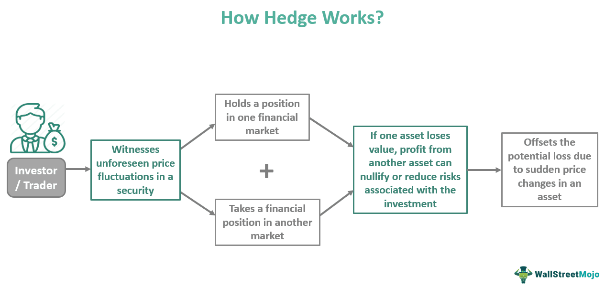

In investing, strategies are continuously evolving to optimize financial outcomes. With the rapid advancement of technology and financial instruments, investors are exploring innovative approaches to enhance their portfolios. At the forefront of these innovations is the intersection of convertible hedge, algorithmic trading, and financial strategy, which offers unique opportunities for market participants.

A convertible hedge is a sophisticated trading strategy that combines different financial instruments to create market-neutral positions, offering a degree of insulation against market volatility. By balancing long positions in convertible bonds with corresponding short positions in the common shares of the same issuer, investors can manage risks effectively while seeking returns. This strategy is crucial for mitigating market fluctuations and capitalizing on convertible bonds, which themselves are a hybrid of debt and equity instruments.



Algorithmic trading, or algo trading, further complements convertible hedge strategies by automating and optimizing trade executions. Leveraging complex algorithms, decision-making processes that traditionally involved human intervention are now expedited, allowing for faster and more efficient trading. This technological advancement facilitates better balance between convertible bonds and their underlying equities, delivering real-time market insights and enhanced trading opportunities.

The synergy between convertible hedge and algo trading lays the foundation for comprehensive financial strategies that address both risk management and return optimization. By integrating these elements, investors can develop a cohesive approach to navigate the complexities of modern markets. However, these strategies also face challenges such as market inefficiencies and regulatory changes, which require continuous adaptation and innovation.

This article explores the synergy between these concepts, focusing on their individual and combined potential in today's markets. We will examine key strategies, discuss the benefits, and identify potential challenges associated with convertible hedge and algo trading. This exploration will provide a clearer understanding of how these financial instruments can be effectively utilized in achieving investment success.

## Table of Contents

## Understanding Convertible Hedge

A convertible hedge is a sophisticated trading strategy designed to achieve market-neutral positions by leveraging the characteristics of convertible bonds and corresponding short positions in common shares. This approach allows investors to mitigate risk while taking advantage of the potential upside of equity markets.

Convertible bonds are hybrid securities that possess both bond and equity features. They offer fixed income through interest payments, with the added option to convert into a predetermined number of common shares. The conversion ratio, a key component of this strategy, determines the number of shares an investor receives upon conversion. It is vital to understand this ratio, as it directly influences the hedging strategy and potential outcomes.

To effectively implement a convertible hedge, investors initiate long positions in convertible bonds, taking advantage of their fixed income and conversion potential. Simultaneously, investors hold short positions in the underlying common shares. This balancing act aims to achieve market neutrality, where changes in the stock price have minimal impact on the overall position's value. The difference between the bond's market value and the value of the underlying shares is essential in determining hedge effectiveness.

Market neutrality is achieved by offsetting the stock's delta—the sensitivity of the stock's price to changes in the underlying asset price. By adjusting the short positions accordingly, investors can maintain a delta-neutral position, minimizing exposure to market [volatility](/wiki/volatility-trading-strategies). The aim is to profit from the bond's interest payments and any increase in conversion value, regardless of stock price fluctuations.

This strategy requires a deep understanding of market conditions, bond pricing, and stock movements. Advanced analytics and real-time market data are often employed to optimize the hedge and ensure it remains effective amidst changing market dynamics. By maintaining a constant reevaluation and adjustment of positions, investors can effectively manage risk and pursue profit in varying market conditions.

The convertible hedge strategy exemplifies a balanced approach in the investment landscape, allowing for potential returns without significant exposure to market swings. It is a nuanced strategy that, when executed skillfully, can be a vital component of a diversified investment portfolio.

## Mechanics of Algo Trading in Convertible Strategies

Algorithmic trading is instrumental in the effective execution of convertible hedge strategies by automating and optimizing the management of convertible bonds and their underlying equities. The core advantage of [algorithmic trading](/wiki/algorithmic-trading) lies in its ability to process vast datasets, execute trades swiftly, and minimize human error, thereby enhancing transactional efficiency. In the context of convertible strategies, algorithmic trading facilitates the continuous monitoring and balancing of positions between convertible bonds and corresponding equities.

Convertible bonds, by their nature, are hybrid securities with both debt and equity characteristics. These bonds can be converted into a predetermined number of the issuer's shares. The convertible hedge strategy typically involves taking a long position in convertible bonds while simultaneously shorting a proportionate amount of the issuer's underlying stock. The dynamic process of maintaining this proportional balance is where algorithmic trading significantly contributes.

To optimize the convertible hedge strategy, algorithms are developed to monitor market conditions in real-time, calculating the appropriate conversion ratios and adjusting short equity positions accordingly. This process requires sophisticated models to evaluate market variables such as volatility, interest rates, and stock price movements, ensuring that the hedged position remains delta-neutral. Delta-neutrality means that small movements in the underlying asset's price do not significantly impact the value of the total portfolio.

To illustrate, consider a scenario where a trader is long on a convertible bond with a conversion ratio of 10. If the delta (Δ) of the convertible bond relative to the underlying stock is 0.5, the trader might short five shares of the stock to achieve a delta-neutral position. The following Python code snippet can simulate a basic delta-neutral adjustment based on real-time market data:

```python
def adjust_position(conversion_ratio, delta, bonds_held, current_stock_price):
    # Calculate the equivalent stock position needed for delta neutrality
    equivalent_stock_position = conversion_ratio * bonds_held * delta
    return equivalent_stock_position

# Example: 100 convertible bonds with a conversion ratio of 10, delta of 0.5, at a stock price of $100
conversion_ratio = 10
delta = 0.5
bonds_held = 100

required_short_stock = adjust_position(conversion_ratio, delta, bonds_held, current_stock_price)
print(f"Short {required_short_stock} stocks to maintain delta-neutrality.")
```

Algorithmic tools also provide traders with crucial market insights, leveraging technologies such as [machine learning](/wiki/machine-learning) and statistical analysis to predict market trends and optimize trading strategies. By integrating real-time market data feeds, these algorithms can quickly adapt to changing market conditions, capturing [arbitrage](/wiki/arbitrage) opportunities that may arise due to price discrepancies between the convertible bonds and the underlying equities.

Furthermore, the use of algo trading reduces latency in executing large orders which is particularly important in volatile markets where prices can shift rapidly. Advanced algorithms are designed to break down large trades into smaller, manageable orders executed over time, minimizing market impact and obtaining better average prices for the trades.

In conclusion, algorithmic trading enhances the efficacy of convertible hedge strategies by ensuring efficient and accurate management of positions. Its ability to harness real-time data, maintaining a balance between convertible bonds and corresponding equities, and providing actionable market insights are critical to the success of convertible hedge strategies. As such, the integration of algorithmic trading is indispensable for investors looking to capitalize on the complex dynamics of convertible markets.

## The Role of Delta-Neutral and Market-Neutral Strategies

Delta-neutrality and market-neutral strategies are pivotal in the structure of convertible hedge strategies, offering a means to cushion financial portfolios against the inherent unpredictabilities of the market. These strategies aim to establish positions that are insulated from market directional movements, thereby ensuring steadier returns under varied market conditions.

Delta-neutrality specifically refers to a situation where the total delta of a portfolio—the sensitivity of its price to movements in the underlying asset—is zero. For convertible bond strategies, this involves a delicate balancing act. Convertibles are hybrid instruments with embedded options, meaning their value depends not only on the fixed-income characteristics but also on the equity value of the underlying shares. To achieve delta-neutrality, investors often take short positions in the underlying stock proportional to the convertible's delta. This requires dynamic adjustments as the delta changes with fluctuations in the stock price and other factors influencing the convertible bond's price, such as interest rates and volatility.

The process of achieving and maintaining delta-neutrality can be mathematically described. If $\Delta_c$ represents the delta of the convertible bond and $\Delta_s$ the delta of the stock, then a delta-neutral position can be expressed as:

$$
\Delta_c + \Delta_s \times Q_s = 0
$$

Where $Q_s$ is the number of shares shorted. The goal is to adjust $Q_s$ such that the equation holds, ensuring the overall position remains insensitive to small movements in the stock price.

Complementing delta-neutrality, market-neutral strategies seek to create a portfolio that maintains a net-zero exposure to the overall market moves. This involves balancing the beta of the portfolio—a measure of its volatility relative to the market index—so that market movements do not significantly affect the portfolio's value. Such balance requires constant portfolio rebalancing, taking into account beta, upcoming economic data releases, [earning](/wiki/earning-announcement) reports, and changes in monetary policy which could impact market conditions.

Implementing these strategies can mitigate risks by preventing the portfolio from being adversely affected by market volatility. On a practical level, market-neutral ratios such as the Sharpe ratio or the Sortino ratio can serve as metrics for assessing the effectiveness of these hedging approaches. These ratios evaluate the return of the strategy relative to the risk taken, effectively illustrating the risk-adjusted returns.

Ultimately, the robustness of delta-neutral and market-neutral strategies lies in their ability to preserve portfolio value regardless of market swings. While continual adjustments and sophisticated risk management techniques are required to maintain these positions, the potential to minimize losses during market downturns and maximize gains in varied conditions makes them an attractive choice for sophisticated investors.

## Integrating Financial Strategy for Investment Success

Effective financial strategy is crucial when leveraging convertible hedge and algorithmic trading (algo trading) to achieve optimal investment success. These tools can be intricately woven together to create an investment strategy that maximizes gains while mitigating risks. Here, we explore the key components of this strategic integration.

### Developing a Cohesive Investment Strategy

A cohesive investment strategy with convertible hedge and algo trading involves a systematic approach to combine the two methodologies for maximum financial benefit. The first step is understanding the fundamental properties of each tool. Convertible hedges work by balancing long positions in convertible bonds with short positions in the underlying stocks, aiming for market neutrality. Algo trading introduces automation and efficiency by executing trades at high speed and frequency, optimizing entries and exits based on predefined conditions and real-time data analysis.

#### Define Investment Objectives

Successful integration starts with clear investment objectives. Are you aiming for steady income, capital gains, or risk mitigation? This decision guides the choice of convertible bonds and the design of algorithmic strategies. For instance, focusing on volatile markets might necessitate a higher frequency of trades to capture short-term mispricing effectively.

#### Risk Management Techniques

Managing risk is pivotal in any successful investment strategy. Techniques like diversification, regular rebalancing, and setting stop-loss limits are instrumental. In the context of convertible hedging:

1. **Portfolio Diversification**: Involves spreading investments across various convertible bonds with different maturities and issuers to reduce idiosyncratic risk.

2. **Rebalancing**: Regularly adjusting the balance between long and short positions to maintain delta-neutrality and respond to changing market conditions. This is achieved by calculating the portfolio's overall delta (Δ) and adjusting positions to ensure it remains as close to zero as possible:
$$
   \text{Δ}_{\text{portfolio}} = \sum (\text{Δ}_{\text{bond,i}} \times \text{V}_{\text{bond,i}}) - \sum (\text{Δ}_{\text{stock,i}} \times \text{V}_{\text{stock,i}})

$$

   where $\text{V}$ represents the market value of the respective position.

3. **Stop-Loss Orders**: Protects the investment from significant losses by automatically triggering sell/buy orders once the asset price reaches a predefined threshold.

#### Leveraging Algorithmic Tools

Algorithmic models offer real-time trading advantages by analyzing vast datasets, predicting price movements, and executing trades at optimal conditions. The use of machine learning algorithms, particularly in Python, allows for developing custom trading bots that learn and adapt to changing market dynamics.

```python
# Example of a simple moving average crossover strategy using Python
def calculate_moving_average(prices, window_size):
    return prices.rolling(window=window_size).mean()

price_data = get_price_data(ticker='XYZ', start_date='2023-01-01', end_date='2023-10-01')
sma_short = calculate_moving_average(price_data['Close'], window_size=5)
sma_long = calculate_moving_average(price_data['Close'], window_size=20)

trading_signals = (sma_short > sma_long).shift(1) # Buy when short-term MA crosses above long-term MA
```

### Real-World Case Studies

Examining real-world applications provides insight into the practical integration of these strategies. Notable examples include hedge funds and investment banks that routinely apply convertible hedges powered by sophisticated algorithms to maintain competitive edges. 

For instance, a [hedge fund](/wiki/hedge-fund-trading-strategies) might apply these strategies to profitably navigate volatile sectors like technology or pharmaceuticals, where convertible issuance is prevalent. They achieve consistent returns by crafting highly automated trading environments that react to every market tick, keeping their positions optimal and risks minimized.

### Conclusion

By judiciously combining convertible hedge techniques with algo trading, investors can craft a financial strategy that is adaptive, resilient, and profitable. A well-rounded approach includes defining objectives clearly, applying rigorous risk management, and utilizing cutting-edge algorithmic tools. With ongoing analysis and adaptation, these strategies can yield sustained investment success.

## Risks and Challenges in Convertible Hedge and Algo Trading

Convertible hedge and algorithmic trading strategies, while offering potential for significant returns, are not without their risks. One of the primary challenges associated with these strategies is market inefficiency. Markets do not always respond predictably, and inefficiencies can arise from insufficient [liquidity](/wiki/liquidity-risk-premium) or mispricing of instruments. This can particularly affect convertible securities, which are relatively more complex than standard equities or bonds. Such inefficiencies can lead to unexpected losses if the convertible bonds do not perform as anticipated when the underlying stock price moves. 

Volatility is another crucial [factor](/wiki/factor-investing) that introduces risk. High volatility can disrupt the balance of convertible hedge strategies, particularly those relying on delta-neutral positions. Delta-neutrality involves maintaining a portfolio where the value does not change due to small movements in the price of the underlying asset. However, when volatility spikes, it can trigger frequent rebalancing, increasing transaction costs and potentially eroding profits. 

Regulatory changes also pose a significant risk. Financial markets are heavily regulated, and changes in legislation can impact the viability of certain trading strategies. For instance, adjustments in short selling regulations or restrictions on algorithmic trading can necessitate strategy adjustments, potentially incurring additional costs or limiting opportunities.

To navigate these challenges, innovative solutions and adaptive practices are vital. One effective approach is employing advanced risk management tools that leverage real-time data and analytics to anticipate and respond to market movements swiftly. Algorithmic systems can be designed to dynamically adjust positions in response to changing market conditions, minimizing potential losses. 

Moreover, scenario analysis and stress testing can be utilized to project the potential impacts of market shifts and regulatory changes, helping traders preemptively adjust their strategies. These methods involve simulating various market conditions to evaluate how strategies perform under different scenarios.

The use of machine learning in strategy development can also aid in risk reduction. Machine learning models can detect patterns and predict market behavior more accurately than traditional models, allowing traders to optimize their strategies continually. By analyzing large volumes of historical data, these algorithms can identify subtle market signals that are not apparent to human analysts.

In conclusion, while convertible hedge and algo trading strategies offer lucrative possibilities, they require diligent risk management and adaptability to mitigate inherent risks. By leveraging technological advancements and adopting proactive risk management practices, investors can enhance their resilience against the challenges posed by market inefficiencies, volatility, and regulatory changes.

## Conclusion

Convertible hedge and algorithmic trading present significant opportunities for investors by merging two advanced strategies in the financial markets. This synergy provides robust methods for managing market risk while potentially enhancing returns. Convertible hedging, through its market-neutral approach, minimizes exposure to market volatility by balancing long positions in convertible bonds with short positions in their underlying stocks. Algorithmic trading further optimizes this balance, automating transactions to react swiftly to market changes and capitalize on arbitrage opportunities.

The efficacy of merging these strategies is amplified when integrated into a comprehensive financial strategy. This involves not only understanding the conversion ratios and maintaining market neutrality but also employing algorithmic tools capable of providing real-time market insights. Such integration aids investors in achieving better portfolio rebalancing, ensuring that convertible hedge positions remain delta-neutral amidst fluctuating market conditions.

However, sustained success in employing these strategies requires continuous adaptation. The rapid pace of technological advancements and shifting market trends necessitate investors to remain vigilant and adaptable. By leveraging advanced algorithms and incorporating innovative solutions, investors can mitigate risks associated with market inefficiencies, volatility, and regulatory changes.

In conclusion, while convertible hedge and algorithmic trading present lucrative prospects, their true potential is realized when integrated thoughtfully into a broader investment strategy. This fusion not only enhances financial outcomes but also fortifies an investor's capacity to navigate and thrive amidst the ever-changing landscape of financial markets.

## References & Further Reading

[1]: ["Advances in Financial Machine Learning"](https://www.amazon.com/Advances-Financial-Machine-Learning-Marcos/dp/1119482089) by Marcos Lopez de Prado

[2]: ["Quantitative Trading: How to Build Your Own Algorithmic Trading Business"](https://github.com/LucindaYa/quant-resources/blob/master/Quantitative%20Trading%20How%20to%20Build%20Your%20Own%20Algorithmic%20Trading%20Business.pdf) by Ernest P. Chan

[3]: ["Machine Learning for Algorithmic Trading"](https://github.com/stefan-jansen/machine-learning-for-trading) by Stefan Jansen

[4]: ["Evidence-Based Technical Analysis: Applying the Scientific Method and Statistical Inference to Trading Signals"](https://www.amazon.com/Evidence-Based-Technical-Analysis-Scientific-Statistical/dp/0470008741) by David Aronson

[5]: ["Convertible Securities: A Complete Guide to Investment and Corporate Financing Strategies"](https://www.amazon.com/Convertible-Securities-Investment-Corporate-Strategies/dp/1260462900) by Tracy V. Maitland and Michael T. Curley