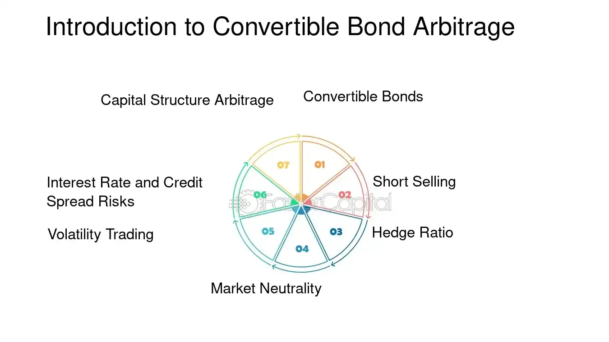

## Table of Contents

## What is a convertible hedge?

A convertible hedge is a way to manage risk in the stock market. It involves buying a stock and then using options to protect against big drops in the stock's price. The idea is to limit potential losses while still being able to gain if the stock price goes up.

For example, you might buy a stock and then buy a put option on the same stock. The put option gives you the right to sell the stock at a certain price, which can help you avoid losing too much money if the stock price falls. This strategy can be useful for investors who want to hold onto a stock they believe in, but are worried about short-term price swings.

## How does a convertible hedge work?

A convertible hedge works by combining a stock purchase with an options strategy to protect against price drops. Imagine you buy shares of a company you like, but you're worried the stock price might go down. To protect yourself, you buy a put option on those same shares. A put option gives you the right to sell your shares at a set price, called the strike price, no matter how low the stock might fall. This way, if the stock price drops a lot, you can use the put option to sell your shares at the higher strike price, limiting your losses.

The key to a convertible hedge is balancing the cost of the put option with the potential gains from the stock. The put option isn't free; you have to pay a premium for it. This cost can eat into your profits if the stock price stays the same or goes up a little. But if the stock price drops significantly, the put option can save you from big losses. It's like an insurance policy for your stock investment. By using this strategy, you can feel more secure holding onto a stock you believe in, even if the market gets rocky.

## What are the main components of a convertible hedge?

A convertible hedge has two main parts: buying a stock and buying a put option. When you buy a stock, you are investing in a company you think will do well. But stock prices can go up and down a lot, and that can be scary. That's where the put option comes in. A put option is like a safety net. It gives you the right to sell your stock at a certain price, even if the stock's price drops below that.

The put option costs money, called a premium. This is the price you pay for protection. If the stock price stays the same or goes up, you might feel like you wasted money on the put option. But if the stock price falls a lot, the put option can save you from losing too much money. It's a way to balance the risk and reward of owning a stock. By using a convertible hedge, you can feel more comfortable holding onto a stock you believe in, even if the market gets shaky.

## What is the purpose of using a convertible hedge?

The main purpose of using a convertible hedge is to protect your investment in a stock from big price drops. When you buy a stock, you hope its price will go up, but you never know for sure. The stock market can be unpredictable, and prices can fall suddenly. By using a convertible hedge, you can buy a put option, which acts like an insurance policy for your stock. If the stock price drops a lot, the put option lets you sell your stock at a higher price than the market, limiting your losses.

Another reason to use a convertible hedge is to stay invested in a company you believe in, even when the market is uncertain. Sometimes, you might think a company will do well in the long run, but you're worried about short-term price swings. A convertible hedge allows you to hold onto your stock while protecting yourself from big losses. This way, you can keep your investment without having to sell it just because the market is going through a rough patch.

## Who typically uses convertible hedges?

Convertible hedges are often used by investors who want to protect their stock investments from big price drops. These investors might be worried about short-term market swings but still believe in the long-term value of the company they've invested in. By using a convertible hedge, they can buy a put option to act as a safety net, allowing them to hold onto their stocks without the fear of losing too much money if the market goes down.

These strategies are popular among individual investors who want to manage their risk, as well as professional investors like hedge fund managers. Hedge fund managers use convertible hedges to protect their clients' investments while still trying to make money from stock price increases. Both groups use this approach to balance the potential for gains with the need to limit losses, making it a useful tool in uncertain market conditions.

## What are the benefits of a convertible hedge for investors?

A convertible hedge helps investors feel safer about their stock investments. When you buy a stock, you hope its price will go up, but the market can be unpredictable. A convertible hedge lets you buy a put option, which is like insurance for your stock. If the stock price drops a lot, the put option lets you sell your stock at a higher price than the market, so you don't lose as much money. This can give you peace of mind, knowing you're protected from big losses.

Another benefit of using a convertible hedge is that it allows you to keep your investment in a company you believe in, even when the market is shaky. Sometimes, you might think a company will do well in the long run, but you're worried about short-term price swings. With a convertible hedge, you can hold onto your stock without having to sell it just because the market is going through a rough patch. This way, you can stay invested and potentially benefit from the stock's long-term growth while managing your risk.

## What are the risks associated with convertible hedges?

Using a convertible hedge can help you protect your stock investments, but it also comes with some risks. One risk is that you have to pay for the put option, which is like an insurance premium. If the stock price stays the same or goes up a little, you might feel like you wasted money on the put option because you didn't need the protection. This can eat into your profits, making your overall return on the investment lower than if you hadn't used the hedge.

Another risk is that the put option might not fully protect you if the stock price drops a lot. The strike price of the put option, which is the price at which you can sell the stock, might not be low enough to cover all your losses. Also, if the stock price drops very quickly, you might not be able to sell the stock at the strike price before the put option expires. This means you could still lose money even with the hedge in place. It's important to understand these risks and consider them when deciding whether to use a convertible hedge.

## How does a convertible hedge compare to other hedging strategies?

A convertible hedge is one way to protect your stock investments, but there are other hedging strategies you can use too. One common alternative is buying a protective put, which is similar to a convertible hedge but doesn't involve buying the stock if you already own it. With a protective put, you simply buy a put option on a stock you already own. Another strategy is using a collar, where you buy a put option and sell a call option on the same stock. This can help you limit your losses while also capping your potential gains.

Each strategy has its own pros and cons. A convertible hedge gives you the flexibility to buy a stock and protect it, which can be good if you're just starting your investment. But it can be more expensive because you're paying for both the stock and the put option. A protective put is simpler and cheaper if you already own the stock, but it doesn't give you the same flexibility to start a new investment. A collar can be a good middle ground because it helps you manage both risk and cost, but it limits your upside potential. Choosing the right strategy depends on your goals, how much risk you're willing to take, and how much you want to spend on protection.

## Can you provide a real-world example of a convertible hedge?

Imagine you buy 100 shares of a company called ABC Tech because you think it will do well in the future. But you're worried that the stock price might drop in the short term because of some market uncertainty. To protect your investment, you decide to use a convertible hedge. You buy a put option on those 100 shares of ABC Tech. The put option has a strike price of $50, which means you can sell your shares at $50 each, no matter how low the stock price goes. You pay a premium of $2 per share for the put option, so it costs you $200 in total.

A few weeks later, the stock price of ABC Tech drops to $40 per share. Without the put option, you would have lost $10 per share, or $1,000 total on your 100 shares. But because you have the put option, you can sell your shares at the strike price of $50. This limits your loss to just the premium you paid for the put option, which was $200. So, instead of losing $1,000, you only lose $200. This shows how a convertible hedge can help you protect your investment from big price drops, giving you peace of mind while you hold onto a stock you believe in.

## What are the key considerations when setting up a convertible hedge?

When setting up a convertible hedge, you need to think about the cost of the put option. The put option acts like insurance for your stock, and you have to pay a premium for it. This cost can eat into your profits if the stock price stays the same or goes up a little. So, you need to decide if the protection is worth the price. You also need to choose the right strike price for the put option. The strike price is the price at which you can sell your stock if it drops. If you pick a strike price that's too high, the put option might be too expensive. If it's too low, it might not protect you enough.

Another key thing to consider is how long you want the put option to last. Put options have an expiration date, and if the stock price drops after that date, the put option won't help you. You need to think about how long you want to be protected and choose an expiration date that matches your investment plan. Also, think about how much you believe in the company you're investing in. If you think the company will do well in the long run but are worried about short-term drops, a convertible hedge can help you hold onto the stock without too much risk. Balancing these factors will help you set up a convertible hedge that works for you.

## How do market conditions affect the performance of a convertible hedge?

Market conditions can have a big impact on how well a convertible hedge works. If the market is stable and the stock price stays the same or goes up, you might feel like you wasted money on the put option because you didn't need the protection. The cost of the put option can eat into your profits, making your overall return lower than if you hadn't used the hedge. On the other hand, if the market is very volatile and the stock price drops a lot, the put option can be a lifesaver. It lets you sell your stock at a higher price than the market, so you don't lose as much money.

In a bear market, where stock prices are falling, a convertible hedge can really shine. It can help you limit your losses and stay invested in a company you believe in, even when the market is going down. But in a bull market, where stock prices are rising, the cost of the put option might seem like a waste because you're not using the protection. So, it's important to think about the current market conditions and your expectations for the future when deciding whether to use a convertible hedge.

## What advanced strategies can be employed to optimize a convertible hedge?

One way to make a convertible hedge work better is by adjusting the strike price of the put option. If you think the stock price might drop a little but not a lot, you can choose a strike price that's closer to the current stock price. This makes the put option cheaper, so you don't have to pay as much for protection. But if you're really worried about big drops, you might want a lower strike price. This will cost more, but it will protect you better if the stock price falls a lot. Another way to optimize is by choosing the right expiration date for the put option. If you think the market will be unstable for a while, you might want a longer expiration date to keep your protection in place. But if you only need short-term protection, a shorter expiration date can save you money.

Another advanced strategy is using a dynamic hedge, where you adjust your put option as the stock price changes. If the stock price goes up, you might sell the put option and buy a new one with a higher strike price. This can help you save money on the put option while still keeping some protection. If the stock price goes down, you might buy more put options or ones with a lower strike price to increase your protection. This way, you can adapt your hedge to what's happening in the market. It's like driving a car and adjusting your speed based on the road conditions. By being flexible and making changes as needed, you can make your convertible hedge more effective and better suited to the current market situation.

## What is the Role of Delta-Neutral and Market-Neutral Strategies?

Delta-neutrality and market-neutral strategies are pivotal in the structure of convertible hedge strategies, offering a means to cushion financial portfolios against the inherent unpredictabilities of the market. These strategies aim to establish positions that are insulated from market directional movements, thereby ensuring steadier returns under varied market conditions.

Delta-neutrality specifically refers to a situation where the total delta of a portfolio—the sensitivity of its price to movements in the underlying asset—is zero. For convertible bond strategies, this involves a delicate balancing act. Convertibles are hybrid instruments with embedded options, meaning their value depends not only on the fixed-income characteristics but also on the equity value of the underlying shares. To achieve delta-neutrality, investors often take short positions in the underlying stock proportional to the convertible's delta. This requires dynamic adjustments as the delta changes with fluctuations in the stock price and other factors influencing the convertible bond's price, such as interest rates and [volatility](/wiki/volatility-trading-strategies).

The process of achieving and maintaining delta-neutrality can be mathematically described. If $\Delta_c$ represents the delta of the convertible bond and $\Delta_s$ the delta of the stock, then a delta-neutral position can be expressed as:

$$
\Delta_c + \Delta_s \times Q_s = 0
$$

Where $Q_s$ is the number of shares shorted. The goal is to adjust $Q_s$ such that the equation holds, ensuring the overall position remains insensitive to small movements in the stock price.

Complementing delta-neutrality, market-neutral strategies seek to create a portfolio that maintains a net-zero exposure to the overall market moves. This involves balancing the beta of the portfolio—a measure of its volatility relative to the market index—so that market movements do not significantly affect the portfolio's value. Such balance requires constant portfolio rebalancing, taking into account beta, upcoming economic data releases, [earning](/wiki/earning-announcement) reports, and changes in monetary policy which could impact market conditions.

Implementing these strategies can mitigate risks by preventing the portfolio from being adversely affected by market volatility. On a practical level, market-neutral ratios such as the Sharpe ratio or the Sortino ratio can serve as metrics for assessing the effectiveness of these hedging approaches. These ratios evaluate the return of the strategy relative to the risk taken, effectively illustrating the risk-adjusted returns.

Ultimately, the robustness of delta-neutral and market-neutral strategies lies in their ability to preserve portfolio value regardless of market swings. While continual adjustments and sophisticated risk management techniques are required to maintain these positions, the potential to minimize losses during market downturns and maximize gains in varied conditions makes them an attractive choice for sophisticated investors.

## How can integrating financial strategy lead to investment success?

Effective financial strategy is crucial when leveraging convertible hedge and [algorithmic trading](/wiki/algorithmic-trading) (algo trading) to achieve optimal investment success. These tools can be intricately woven together to create an investment strategy that maximizes gains while mitigating risks. Here, we explore the key components of this strategic integration.

### Developing a Cohesive Investment Strategy

A cohesive investment strategy with convertible hedge and algo trading involves a systematic approach to combine the two methodologies for maximum financial benefit. The first step is understanding the fundamental properties of each tool. Convertible hedges work by balancing long positions in convertible bonds with short positions in the underlying stocks, aiming for market neutrality. Algo trading introduces automation and efficiency by executing trades at high speed and frequency, optimizing entries and exits based on predefined conditions and real-time data analysis.

#### Define Investment Objectives

Successful integration starts with clear investment objectives. Are you aiming for steady income, capital gains, or risk mitigation? This decision guides the choice of convertible bonds and the design of algorithmic strategies. For instance, focusing on volatile markets might necessitate a higher frequency of trades to capture short-term mispricing effectively.

#### Risk Management Techniques

Managing risk is pivotal in any successful investment strategy. Techniques like diversification, regular rebalancing, and setting stop-loss limits are instrumental. In the context of convertible hedging:

1. **Portfolio Diversification**: Involves spreading investments across various convertible bonds with different maturities and issuers to reduce idiosyncratic risk.

2. **Rebalancing**: Regularly adjusting the balance between long and short positions to maintain delta-neutrality and respond to changing market conditions. This is achieved by calculating the portfolio's overall delta (Δ) and adjusting positions to ensure it remains as close to zero as possible:
$$
   \text{Δ}_{\text{portfolio}} = \sum (\text{Δ}_{\text{bond,i}} \times \text{V}_{\text{bond,i}}) - \sum (\text{Δ}_{\text{stock,i}} \times \text{V}_{\text{stock,i}})

$$

   where $\text{V}$ represents the market value of the respective position.

3. **Stop-Loss Orders**: Protects the investment from significant losses by automatically triggering sell/buy orders once the asset price reaches a predefined threshold.

#### Leveraging Algorithmic Tools

Algorithmic models offer real-time trading advantages by analyzing vast datasets, predicting price movements, and executing trades at optimal conditions. The use of [machine learning](/wiki/machine-learning) algorithms, particularly in Python, allows for developing custom trading bots that learn and adapt to changing market dynamics.

```python
# Example of a simple moving average crossover strategy using Python
def calculate_moving_average(prices, window_size):
    return prices.rolling(window=window_size).mean()

price_data = get_price_data(ticker='XYZ', start_date='2023-01-01', end_date='2023-10-01')
sma_short = calculate_moving_average(price_data['Close'], window_size=5)
sma_long = calculate_moving_average(price_data['Close'], window_size=20)

trading_signals = (sma_short > sma_long).shift(1) # Buy when short-term MA crosses above long-term MA
```

### Real-World Case Studies

Examining real-world applications provides insight into the practical integration of these strategies. Notable examples include hedge funds and investment banks that routinely apply convertible hedges powered by sophisticated algorithms to maintain competitive edges. 

For instance, a [hedge fund](/wiki/hedge-fund-trading-strategies) might apply these strategies to profitably navigate volatile sectors like technology or pharmaceuticals, where convertible issuance is prevalent. They achieve consistent returns by crafting highly automated trading environments that react to every market tick, keeping their positions optimal and risks minimized.

### Conclusion

By judiciously combining convertible hedge techniques with algo trading, investors can craft a financial strategy that is adaptive, resilient, and profitable. A well-rounded approach includes defining objectives clearly, applying rigorous risk management, and utilizing cutting-edge algorithmic tools. With ongoing analysis and adaptation, these strategies can yield sustained investment success.

## References & Further Reading

[1]: ["Advances in Financial Machine Learning"](https://www.amazon.com/Advances-Financial-Machine-Learning-Marcos/dp/1119482089) by Marcos Lopez de Prado

[2]: ["Quantitative Trading: How to Build Your Own Algorithmic Trading Business"](https://github.com/LucindaYa/quant-resources/blob/master/Quantitative%20Trading%20How%20to%20Build%20Your%20Own%20Algorithmic%20Trading%20Business.pdf) by Ernest P. Chan

[3]: ["Machine Learning for Algorithmic Trading"](https://github.com/stefan-jansen/machine-learning-for-trading) by Stefan Jansen

[4]: ["Evidence-Based Technical Analysis: Applying the Scientific Method and Statistical Inference to Trading Signals"](https://www.amazon.com/Evidence-Based-Technical-Analysis-Scientific-Statistical/dp/0470008741) by David Aronson

[5]: ["Convertible Securities: A Complete Guide to Investment and Corporate Financing Strategies"](https://www.amazon.com/Convertible-Securities-Investment-Corporate-Strategies/dp/1260462900) by Tracy V. Maitland and Michael T. Curley