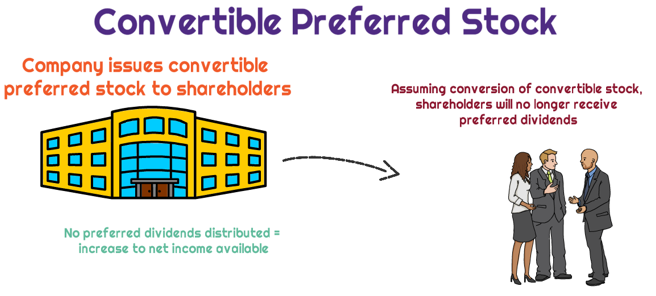

In the ever-evolving world of finance, understanding various financial instruments is crucial for investors and corporations alike. Convertible preferred shares and preferred stock are two noteworthy financial instruments that serve distinct roles in investment strategy and corporate finance. These instruments provide unique mechanisms for capital allocation, offering both stability and potential for growth, which are essential for portfolio diversification and risk management.

This article examines the key features of convertible preferred shares and preferred stock, highlighting their respective advantages and operational dynamics within financial markets. Convertible preferred shares are particularly appealing due to their hybrid nature, blending fixed income with conversion potential into common equity. On the other hand, preferred stock provides a reliable income through fixed dividends, coupled with prioritized claims on assets over common stockholders, thereby offering a balance between safety and potential returns.

Moreover, the integration of algorithmic trading has significantly impacted the management and optimization of these financial products. Algorithmic trading, employing complex algorithms for trade execution, has become integral to modern financial strategies. It allows for swift responses to market changes, improved consistency in pricing, and the ability to manage complex trading strategies.

Readers will gain insights into how these instruments function, their benefits, and their implications for contemporary trading strategies. By exploring these elements, this article aims to provide a comprehensive understanding of how convertible preferred shares and preferred stock fit into the broader financial landscape, equipping investors with the knowledge to make informed decisions in their investment pursuits.

## Table of Contents

## Understanding Financial Instruments

Financial instruments play a crucial role in the financial markets, serving as essential tools for facilitating capital flow and creating investment opportunities. These instruments can be broadly categorized into three types: equity, debt, and hybrid instruments.

**Equity Instruments:** Equity instruments provide ownership rights in a company. The most common type of equity instrument is common stock. These instruments represent a claim on a company's earnings and assets, proportional to the amount of stock owned. Investors in equity instruments benefit from the company's profits through dividends and potential appreciation in stock value. However, they also bear the risk of losing their investment if the company performs poorly.

**Debt Instruments:** Debt instruments are financial contracts where funds are borrowed by the issuer from investors with the promise of repayment at a future date. These instruments include loans, bonds, and debentures. Debt instruments typically have a fixed interest rate and a defined maturity date. Unlike equity holders, debt holders do not have ownership rights in the company but have a higher claim on assets in case of liquidation.

**Hybrid Instruments:** Hybrid instruments combine elements of both equity and debt, offering unique features that can include fixed income along with potential equity participation. Convertible preferred shares exemplify hybrid instruments. These shares pay fixed dividends like traditional preferred stock but also provide the option to convert into common shares, potentially participating in the equity growth of the company. This combination provides a safeguard of income while allowing for capital appreciation, aligning with varied investor strategies.

Understanding these categories is paramount for identifying strategic financial options available to investors and corporations. Each type of instrument offers distinct advantages and risks, allowing for tailored investment strategies that align with specific financial goals and market conditions.

## What are Convertible Preferred Shares?

Convertible preferred shares are a financial instrument that merges the advantages of preferred stock with the flexibility of conversion to common stock. These shares provide fixed dividends, similar to traditional preferred stocks, which are particularly appealing for investors seeking stable income. However, they also have the added feature of convertibility into common shares, typically at the shareholder's discretion. This provides a potential growth opportunity if the company's common stock appreciates over time.

The appeal of convertible preferred shares lies in their hybrid nature, offering both income stability and potential for capital gains. This dual benefit can serve as a safety net, granting the holder a predictable income through dividends while simultaneously offering the potential for equity appreciation if converted at an opportune time.

Understanding the conversion ratio and conditions is crucial when evaluating convertible preferred shares. The conversion ratio dictates how many common shares a preferred share can be converted into. For example, if the conversion ratio is 5, each convertible preferred share can be exchanged for five common shares. This conversion ratio, along with predetermined conditions under which conversion is permitted, allows investors to make strategic decisions based on market conditions and their investment goals.

Investors often opt for convertible preferred shares over traditional preferred stock due to their greater flexibility. This flexibility not only enhances the investment's appeal but also aligns with varying investor risk tolerances and market dynamics. The decision to convert into common stock is influenced by factors such as current stock price, market trends, and overall investment strategy.

The issuer often benefits from issuing convertible preferred shares, as it retains capital through equity conversion, potentially mitigating the need for additional debt financing. Convertible preferred shares thus represent an adaptable and strategic option within the broader spectrum of financial instruments.

## Exploring Preferred Stock

Preferred stock represents a distinctive category of equity that holds priority over common stock regarding dividend payments and claims on assets during liquidation scenarios. Shareholders of preferred stock receive dividends before common shareholders, which provides a more consistent and predictable return, making it an attractive choice for risk-averse investors. This preferential treatment extends to asset distribution if a company undergoes liquidation, granting preferred shareholders a higher claim before common shareholders, though still subordinate to any bondholders.

The main appeal of preferred stock lies in its stability, as it typically offers fixed dividend payments that resemble the coupon payments on bonds, albeit often with less upside potential for capital appreciation compared to common stock. This stability ensures investors have a reliable income stream, which is particularly valued during periods of market [volatility](/wiki/volatility-trading-strategies). On the downside, preferred stock generally lacks voting rights, limiting shareholders' influence over company decisions.

Corporations often issue preferred stock to raise capital without diluting existing ownership. By choosing preferred stock over common stock issuance, companies can maintain control within existing shareholding structures. Additionally, preferred stock can be structured with unique terms, such as convertibility into common stock, further enhancing its flexibility as a financial instrument.

Investors integrate preferred stock into their portfolios as a hybrid between the secure returns of bonds and the growth prospects associated with equities. This "middle ground" positioning makes preferred stock desirable for those seeking a balance between risk and return. Furthermore, the tax treatment on dividends from preferred stocks can be advantageous, as they may be taxed at a lower rate compared to interest income, enhancing their appeal under favorable regulatory environments.

Conclusively, while preferred stock may offer fewer opportunities for significant capital gains compared to common stock, its predictable dividends and seniority in claim hierarchy make it an essential component of diversified investment strategies, particularly for those prioritizing income stability and moderate risk exposure.

## The Role of Algorithmic Trading

Algorithmic trading is a technique that employs computer algorithms to manage buying and selling of financial instruments such as convertible preferred shares and preferred stock, significantly minimizing human intervention. This trading strategy is acclaimed for its efficiency and speed, crucial attributes in today's fast-paced financial markets.

The algorithms are designed to execute trades based on predetermined criteria, enabling them to adapt swiftly to market fluctuations. This capability ensures that trades are conducted precisely and promptly, offering substantial advantages over traditional trading practices. As markets move rapidly, the speed at which [algorithmic trading](/wiki/algorithmic-trading) can operate is invaluable, allowing traders to capitalize on opportunities that may be fleeting.

The efficiency of algorithmic trading is not solely about speed. It also reduces human errors, which can be prevalent during manual trading. By removing emotional and psychological biases inherent in human traders, algorithms ensure that trading decisions are made based on data and predefined logic. This objectivity can lead to more consistent performance across various market conditions.

For those managing portfolios containing complex instruments, understanding algorithmic trading basics is beneficial. Strategies can be built to optimize the performance of these portfolios by swiftly reacting to market dynamics and executing trades in a manner that aligns with broader investment goals.

In summary, implementing algorithmic trading offers clear advantages: time savings, error reduction, and the ability to swiftly respond to market opportunities, all of which are essential for optimizing the management of financial portfolios. As such, grasping the fundamentals of algorithmic trading is critical to navigating and thriving in contemporary financial spaces.

## Benefits of Incorporating Algorithmic Trading

Incorporating algorithmic trading strategies offers numerous advantages when dealing with convertible preferred shares and preferred stock. Algorithmic trading enhances [liquidity](/wiki/liquidity-risk-premium) by enabling investors to enter and [exit](/wiki/exit-strategy) positions more efficiently. Automated systems can process large volumes of trades at a pace much faster than human traders, ensuring that buy and sell orders are executed swiftly. This rapid execution minimizes the time dynamics involved in capital movements, allowing for better liquidity management.

Algorithmic trading also plays a crucial role in improving pricing consistency. By reducing the emotional biases that human traders might exhibit, algorithms can adhere strictly to predefined trading criteria, thereby delivering more uniform pricing outcomes. This consistency is vital for maintaining an unbiased trading environment, which can be especially beneficial for managing the volatility associated with convertible securities.

Furthermore, algorithmic trading facilitates complex strategies like [arbitrage](/wiki/arbitrage). In markets involving convertible securities, arbitrage opportunities can arise due to mispricing between convertible instruments and their underlying assets. Algorithms are capable of identifying and acting on arbitrage opportunities quickly and efficiently, capitalizing on price discrepancies that exist momentarily.

Ultimately, algorithmic trading equips investors with advanced tools that optimize investment strategies in dynamic financial markets. This approach can use historical data, [machine learning](/wiki/machine-learning) models, or statistical analysis to predict market trends and identify profitable trading opportunities. By harnessing these technologies, investors can adapt their strategies to evolving market conditions, gaining a competitive edge in optimizing their portfolios. 

Overall, algorithmic trading significantly enhances the operations surrounding convertible preferred shares and preferred stock, providing a strategic advantage in liquidity management, pricing consistency, strategy execution, and portfolio optimization.

## Practical Implications for Investors

Investors approaching convertible preferred shares and preferred stock must carefully evaluate their risk tolerance and investment objectives. These instruments offer distinct benefits and risks: convertible preferred shares provide a blend of fixed income through dividends while allowing for the potential conversion into common shares, granting equity appreciation. Preferred stock, on the other hand, assures a more stable income with priority over common stock in dividend payments and assets during liquidation.

Algorithmic trading can significantly enhance investment decision-making by analyzing market trends. Algorithms can be programmed to monitor and react to specific market conditions, executing trades with high precision and speed. This allows investors to adjust their positions based on real-time market data, reducing the emotional bias and human error often associated with traditional trading.

Investors should also consider the tax implications and market conditions when dealing with these instruments. For instance, dividends from preferred shares may be taxed differently based on jurisdiction, impacting net returns. Furthermore, market conditions such as [interest rate](/wiki/interest-rate-trading-strategies) fluctuations can affect the attractiveness and value of preferred stocks and convertible preferred shares. Monitoring these conditions can inform strategic buy or sell decisions.

Diversifying an investment portfolio is a fundamental strategy for risk mitigation. Including a mix of equity, debt, and hybrid instruments like convertible preferred shares can balance growth potential and income stability across various market scenarios. This diversification can protect against market volatility and sector-specific risks, enhancing overall portfolio resilience.

Staying informed about technological advancements in trading is crucial. Developments in algorithmic trading, [artificial intelligence](/wiki/ai-artificial-intelligence), and machine learning offer sophisticated tools for managing investments efficiently. By leveraging these technologies, investors can remain competitive, adapting swiftly to changes and opportunities in modern financial markets. Keeping abreast of these advancements enables more informed and strategic investment decisions, contributing to better portfolio performance in an increasingly dynamic environment.

## Conclusion

Convertible preferred shares and preferred stock hold considerable importance in financial markets due to their ability to balance the benefits between fixed income and potential equity appreciation. Both instruments provide investors with options for stable income and strategic flexibility, making them attractive in diverse economic conditions.

The adoption of algorithmic trading strategies offers innovative methods for managing these financial instruments. By automating trading processes, algorithms can swiftly react to market changes, enhancing execution speed and reducing the potential for human error. This enables more efficient handling of convertible securities and preferred stocks, particularly in volatile market environments.

For investors, understanding the mechanics of these financial instruments and effectively utilizing algorithmic trading can significantly enhance portfolio performance. Incorporating these elements within investment strategies can lead to optimized asset allocations and improved risk management, adapting portfolios dynamically to market trends.

Remaining informed about technological progress and honing financial literacy are critical components for thriving in the rapidly changing financial sector. By leveraging these tools and knowledge, investors can construct more resilient and strategically diversified portfolios, positioning themselves for success in an uncertain economic landscape.

## References & Further Reading

[1]: ["Convertible Securities: A Guide to Investment and Risk Management"](https://www.mhebooklibrary.com/doi/book/10.1036/9781260462913) by Tracy V. Maitland and William C. Tyson

[2]: ["Advances in Financial Machine Learning"](https://www.amazon.com/Advances-Financial-Machine-Learning-Marcos/dp/1119482089) by Marcos Lopez de Prado

[3]: ["Algorithmic Trading: Winning Strategies and Their Rationale"](https://play.google.com/store/books/details/Algorithmic_Trading_Winning_Strategies_and_Their_R?id=CIwCTVqEj4oC&hl=en-US) by Ernest P. Chan

[4]: ["Preferred Stocks: A Comparative Analysis"](https://stockanalysis.com/term/preferred-stock/) by Charles W. Mulford, Financial Analysts Journal

[5]: ["Quantitative Trading: How to Build Your Own Algorithmic Trading Business"](https://www.amazon.com/Quantitative-Trading-Build-Algorithmic-Business/dp/1119800064) by Ernest P. Chan