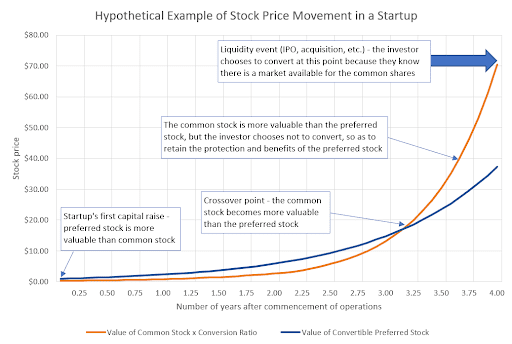

Convertible preferred stock (CPS) is a unique hybrid financial instrument that combines elements of both equity and debt, providing investors with a structured approach to capitalize on the benefits of each. By design, CPS offers the investor a stable income stream through dividends, akin to traditional debt instruments, while also granting the potential for capital appreciation similar to common equity through conversion features. This duality makes CPS particularly appealing in various market conditions, as it can provide a balance of risk and reward tailored to an investor's financial objectives.

In exploring CPS as an investment strategy, understanding the financial terms that define these instruments is critical. Concepts such as conversion price, conversion ratio, and conversion premium determine the intrinsic value and potential returns of CPS. These terms influence the decision-making process regarding when and how to convert preferred shares into common stock, offering opportunities for strategic portfolio diversification.



This article aims to provide an in-depth analysis of CPS by discussing its structural components, illustrating how it can integrate into various investment portfolios with real-world examples, and uncovering the potential strategic advantages it offers. Additionally, the efficiency and precision offered by algorithmic trading (algo trading) present a contemporary approach to managing CPS investments. Algorithmic trading can help investors set automatic triggers for conversions, optimizing their portfolios in response to specific market conditions. Through systematic analysis and strategic application, CPS can emerge as a vital component for investors seeking both income stability and the chance for equity growth in fluctuating economic landscapes.

## Table of Contents

## Understanding Convertible Preferred Stock

Convertible preferred stock (CPS) represents a class of preferred shares that endows its holders with the option to convert their holdings into a predetermined number of a company’s common shares. This hybrid security is principally structured to combine the earnings reliability associated with preferred dividends while offering the potential for equity appreciation, a feature appealing to investors seeking both stability and growth.

### Characteristics of Convertible Preferred Stock

1. **Conversion Option**: The defining feature of CPS is the conversion option, which allows investors to exchange their preferred shares for common shares according to specified terms. This conversion becomes particularly attractive when the market price of the common stock exceeds the conversion price, potentially leading to capital gains.

2. **Dividend Payments**: Like conventional preferred stocks, CPS usually pays a fixed dividend, offering regular income to investors. This feature makes CPS appealing to risk-averse investors seeking steady cash flows, while the conversion option provides a growth aspect not available in non-convertible preferred shares.

3. **Equity Upside Potential**: Upon conversion, CPS holders participate in the common stock’s equity upside. This implies that if the issuing company performs well and its common stock price rises, CPS holders can convert their shares to realize gains, combining income-with-growth potential traditionally seen in equities.

### Key Terms

- **Conversion Price**: This is the predetermined price at which CPS can be converted into common shares. It serves as a benchmark, wherein if the market price of the common shares surpasses this conversion price, it signals a potential upside for conversion. The conversion price is typically set upon issuance.

- **Conversion Ratio**: It represents the number of common shares that an investor receives for each preferred share upon conversion. Mathematically, it can be expressed as:
$$
  \text{Conversion Ratio} = \frac{\text{Par Value of CPS}}{\text{Conversion Price}}

$$

  This ratio is crucial as it directly influences the potential value gain for the investor converting their shares.

- **Conversion Premium**: The conversion premium is the percentage by which the conversion price exceeds the current market price of the common stock at the time of issuance. It acts as a buffer for the issuing company to keep the cost of capital lower while providing potential upside for investors. The conversion premium can be calculated using the formula:
$$
  \text{Conversion Premium} = \left( \frac{\text{Conversion Price} - \text{Current Market Price of Common Stock}}{\text{Current Market Price of Common Stock}} \right) \times 100

$$

Understanding these terms helps investors evaluate the attractiveness of CPS, balancing the pursuit of regular income through dividends against potential gains from converting their holdings into common stock.

## Common Financial Terms in CPS

Convertible Preferred Stock (CPS) is characterized by several essential financial terms and metrics that investors must understand to evaluate their investment effectively. These metrics define the economic attributes of CPS and play a significant role in determining when conversion into common equity might be advantageous.

### Par Value

The par value, or face value, of convertible preferred stock represents the nominal value established by the issuing company. This amount is crucial as it often serves as the basis for calculating dividends and the conversion metrics. For instance, if a CPS has a par value of $1,000 and pays a 5% dividend, the annual dividend would be $50. It also impacts the conversion process since the conversion terms are usually based on the par value.

### Conversion Ratio

The conversion ratio is a critical metric that dictates the number of common shares an investor can receive by converting one unit of CPS. It is typically expressed as:

$$
\text{Conversion Ratio} = \frac{\text{Par Value of CPS}}{\text{Conversion Price}}
$$

Where the conversion price is the predetermined price at which the preferred stock can be converted into common stock. For instance, if the par value is $1,000 and the conversion price is $50, the conversion ratio would be 20. This means that each share of CPS can be converted into 20 common shares.

### Conversion Price and Conversion Premium

The conversion price is a pivotal term within CPS agreements, marking the price per share at which convertible preferred shares can be exchanged for common stock. It serves as a benchmark for investors to determine the intrinsic value of conversion opportunities.

The conversion premium reflects the percentage by which the conversion price exceeds the current market price of the common stock at issuance. It is calculated as:

$$
\text{Conversion Premium} = \left( \frac{\text{Conversion Price} - \text{Current Market Price of Common Stock}}{\text{Current Market Price of Common Stock}} \right) \times 100\%
$$

A higher conversion premium suggests that the common stock must appreciate significantly before conversion becomes attractive, influencing the timing and decision-making process for investors. For example, if the conversion price is $60 and the current common stock price is $50, the conversion premium is 20%. Investors weigh these metrics to assess the potential for capital appreciation against the current market conditions and their investment strategies.

Understanding these terms allows investors to make informed decisions regarding the conversion of CPS, balancing the benefits of steady dividend income against potential gains from converting to common equity, considering prevailing market conditions and future stock price projections.

## Example of CPS Investment

Convertible preferred stock (CPS) offers a compelling case study in investment decision-making. Consider a hypothetical scenario where a company issues CPS with a par value of $1,000, featuring a conversion ratio of 10. This means for each preferred share, the holder has the option to convert it into 10 common shares. The conversion process becomes financially attractive when the market price of the common stock surpasses the conversion price. 

For instance, let us assume the conversion price per common share is $120. The investor evaluates the conversion option when the market price of the common stock exceeds this price. If each common share is trading at $130, the conversion value can be calculated as:

$$
\text{Conversion Value} = \text{Conversion Ratio} \times \text{Market Price of Common Stock}
$$

Substituting the numbers, we obtain:

$$
\text{Conversion Value} = 10 \times 130 = \$1,300
$$

By converting, the investor effectively gains a value of $1,300 from a stock initially valued at $1,000, reflecting a potential profit of $300 per CPS, excluding any transaction fees or tax implications. 

This scenario highlights the decision-making process investors undertake, assessing not only current and potential market conditions but also the time value of money and forecasted performance. Investors must decide whether to convert the CPS to capitalize on the immediate gain or to hold the preferred stock, benefiting from its dividend yield while awaiting further appreciation of the common shares. 

Ultimately, this example underscores the importance of strategic financial analysis in CPS investments—evaluating when conversion maximizes returns, while aligning with long-term investment goals.

## Strategies for CPS in Algo Trading

Algorithmic trading, or algo trading, encompasses the use of computer algorithms to automate and optimize trading strategies. This approach is particularly relevant for managing investments in convertible preferred stock (CPS), where decisions around conversion may require sophisticated analysis due to multiple variables influencing stock prices and market conditions.

### Automatic Conversion Triggers

One of the main strategies in using [algorithmic trading](/wiki/algorithmic-trading) for CPS is setting up automatic conversion triggers based on specific market conditions. By programming algorithms to monitor fluctuations in stock prices and adjust accordingly, investors can take advantage of favorable market environments for CPS conversions. For instance, an algorithm could be configured to initiate a conversion when the common stock price surpasses a certain threshold relative to the conversion price, maximizing potential returns.

Here's a simple example of how an algorithm for setting conversion triggers might look in Python:

```python
def check_conversion_trigger(current_stock_price, conversion_price, trigger_threshold):
    if current_stock_price > conversion_price * (1 + trigger_threshold):
        return "Convert now"
    else:
        return "Hold"

# Example inputs
current_stock_price = 120
conversion_price = 100
trigger_threshold = 0.10

decision = check_conversion_trigger(current_stock_price, conversion_price, trigger_threshold)
print(decision)
```

In this example, the algorithm checks if the current stock price is 10% above the conversion price. If true, the recommendation is to convert the CPS.

### Efficient Handling of Large Volumes

Algorithmic trading offers significant benefits when dealing with large volumes of CPS conversions. Manual oversight can be both slow and prone to human error, especially when the [volume](/wiki/volume-trading-strategy) of stocks is high. Algorithms, on the other hand, execute trades swiftly and accurately, ensuring that portfolio adjustments are made without delay.

Automation also allows for the integration of complex decision-making criteria, such as [volatility](/wiki/volatility-trading-strategies) indicators or macroeconomic factors, into the trading strategy. These criteria can be dynamically weighted to assess the appropriate timing for conversions.

Moreover, algorithms can handle simultaneous monitoring of multiple CPS positions across diverse criteria and conditions, leveraging computational power to analyze data far beyond human capacity. This facilitates a more comprehensive risk assessment and efficiency in executing trades, which is crucial in volatile or fast-moving markets.

In conclusion, algorithmic trading plays a vital role in optimizing CPS investments by providing automation, efficiency, and sophisticated analysis capabilities. By effectively automating market analysis and conversion decisions, investors can enhance their ability to achieve favorable outcomes while minimizing the risks associated with manual trading.

## Benefits and Risks of CPS Investment

Convertible preferred stock (CPS) presents a distinctive investment opportunity by blending the characteristics of both equity and debt instruments. This dual nature offers a range of benefits that can make CPS an attractive addition to a well-diversified portfolio.

One of the primary benefits of CPS is the potential for steady income. CPS typically provides fixed dividends similar to traditional preferred shares, offering investors a reliable income stream. This feature is particularly appealing in environments with low-interest rates where traditional bond yields may be less attractive. Furthermore, CPS offers potential capital appreciation. If the underlying common stock performs well, investors have the option to convert their CPS into common equity, potentially realizing significant gains if the market value of the common shares exceeds the conversion price.

However, CPS also introduces a set of inherent risks. Market volatility represents a significant concern. Stock price fluctuations can impact the attractiveness of conversion. Should the price of the underlying common stock decline, the potential for a successful conversion diminishes. Investors may be exposed to losses if the CPS is only redeemable for less favorable equity or cash alternatives.

Another risk centers around the terms set by the issuing companies. These terms can significantly affect the desirability and feasibility of conversion. For example, if the conversion ratio is set unfavorably due to an inflated conversion premium, the opportunity for capital appreciation may be limited. Issuers may also have call provisions allowing them to redeem the securities prematurely, potentially stifling investor returns.

In summary, while CPS provides a compelling mix of income and potential capital gains, it requires careful analysis of market conditions and issuer terms to mitigate risks effectively. Investors must thoroughly consider these factors to align CPS investments with their risk profiles and financial objectives.

## Market Trends and Future Outlook

Convertible preferred stock (CPS) has seen significant evolution over the past decades, influenced by changing market dynamics and macroeconomic factors. Understanding this evolution provides insight into the factors that currently affect CPS attractiveness and prognostications for its future in investment portfolios.

Historically, CPS gained popularity as an investment vehicle that balances the risk-return spectrum, offering both the fixed-income features of traditional preferred shares and the potential for capital appreciation akin to common stocks. This dual characteristic becomes particularly appealing in volatile market environments, where investors seek stability without forgoing the opportunity for upside potential.

**Interest Rates and Industry Performance**

Interest rates heavily influence the market for CPS. Lower interest rates often push investors toward CPS as a means to secure higher yields than typically available in fixed-income markets. Conversely, rising rates can make traditional debt instruments more attractive, potentially diminishing the appeal of CPS. The relationship between interest rates and CPS can be conceptualized with the formula for calculating the present value of future dividends:

$$
PV = \frac{D}{r}
$$

Where:
- $PV$ is the present value of future dividends
- $D$ is the expected dividend payment
- $r$ is the discount rate, closely related to prevailing interest rates

As $r$ increases, $PV$ decreases, often making CPS investments less appealing.

Industry performance also affects CPS attractiveness. CPS issuers are often in sectors such as financial services, utilities, or technology. Economic trends and sector-specific developments can make CPS more or less favorable. For instance, a burgeoning tech sector may drive conversions of CPS into common stocks if substantial growth is anticipated, enhancing capital gains potential.

**Predictive Future Role of CPS**

The future role of CPS within investment portfolios will likely be shaped by ongoing economic conditions and investor sentiment toward hybrid securities. Factors such as geopolitical stability, global economic health, and technological advancements will also play crucial roles.

In uncertain economic climates, the demand for CPS could increase as investors seek a middle ground between high-risk equities and low-yield fixed-income instruments. However, as economic conditions improve, investors might pivot towards more aggressive growth opportunities unless CPS terms become increasingly favorable.

Algorithmic trading is poised to become more integral in managing CPS investments, offering tools for automatic conversion triggers and efficient management of large transactions given market conditions. Algorithms can analyze multiple data points to determine optimal conversion times, enhancing overall return on investment. Here's a simplified Python code example to conceptualize setting an automatic conversion trigger based on market conditions:

```python
def should_convert(cps_price, common_stock_price, conversion_price):
    if common_stock_price > conversion_price:
        return True  # Conversion is lucrative
    return False

# Example usage
cps_price = 1000
common_stock_price = 1200
conversion_price = 1100

if should_convert(cps_price, common_stock_price, conversion_price):
    print("Convert CPS to common stock.")
else:
    print("Hold CPS.")
```

In conclusion, CPS remains a versatile instrument with a significant role in investment strategies, particularly in balancing risk and return. The prospects for CPS will continue to rely on [interest rate](/wiki/interest-rate-trading-strategies) movements, macroeconomic conditions, and technological advancements in trading strategies. As such, investors and financial analysts must stay abreast of these factors to optimize their engagement with convertible preferred stocks.

## Conclusion

Convertible preferred stock (CPS) serves as a versatile instrument within investment portfolios, combining characteristics of both equity and debt to offer potential steady income and capital appreciation. The functionality of CPS is defined by its dual nature, where investors can benefit from fixed dividends and also gain the opportunity to convert these stocks into common shares, capitalizing on potential growth in the issuing company's value.

Algorithmic trading proves particularly beneficial in managing CPS investments efficiently. By utilizing sophisticated algorithms, investors can optimize their CPS strategies by setting automated triggers for conversion based on real-time market data. For instance, an algorithm could be programmed to convert CPS into common stock once it surpasses a predefined conversion price, enhancing decision-making efficiency without the need for constant manual monitoring. Such automated systems can handle large volumes, reducing human errors and enabling rapid responses to market fluctuations.

Aligning CPS investments with an investor's risk profile and financial goals is essential for maximizing returns. While CPS offers less volatility compared to common equity due to its fixed dividend, it still presents risks if the issuing company's stock does not perform as expected. Investors must consider factors such as the conversion price and ratio, as well as external economic conditions that could influence CPS desirability. Ultimately, a well-structured CPS strategy, potentially boosted by algorithmic trading, can complement a diversified portfolio by balancing growth and income objectives, adapting to varying market conditions, and aligning with personal investment goals.

## References & Further Reading

[1]: ["Convertible Securities: A Complete Guide to Investment and Corporate Financing Strategies"](https://www.mhebooklibrary.com/doi/book/10.1036/9781260462913) by Jared W. Peifer

[2]: Fullenkamp, C., & Cranston, S. (2000). ["The Pricing of Convertible Debt Security."](https://dukespace.lib.duke.edu/items/33357c36-c75b-401a-ad18-f3b2277dd96e) Social Science Research Network.

[3]: ["Principles of Corporate Finance"](https://en.wikipedia.org/wiki/Principles_of_Corporate_Finance) by Richard A. Brealey, Stewart C. Myers, and Franklin Allen

[4]: ["Convertible Bonds: Pricing and Risk Management"](https://waptac.org/download/virtual-library/books/the_handbook_of_convertible_bonds_pricing_strategies_and_risk_management.pdf) by Kevin B. Connolly

[5]: ["Algorithmic Trading & DMA: An Introduction to Direct Access Trading Strategies"](https://archive.org/details/algorithmictradi0000john) by Barry Johnson